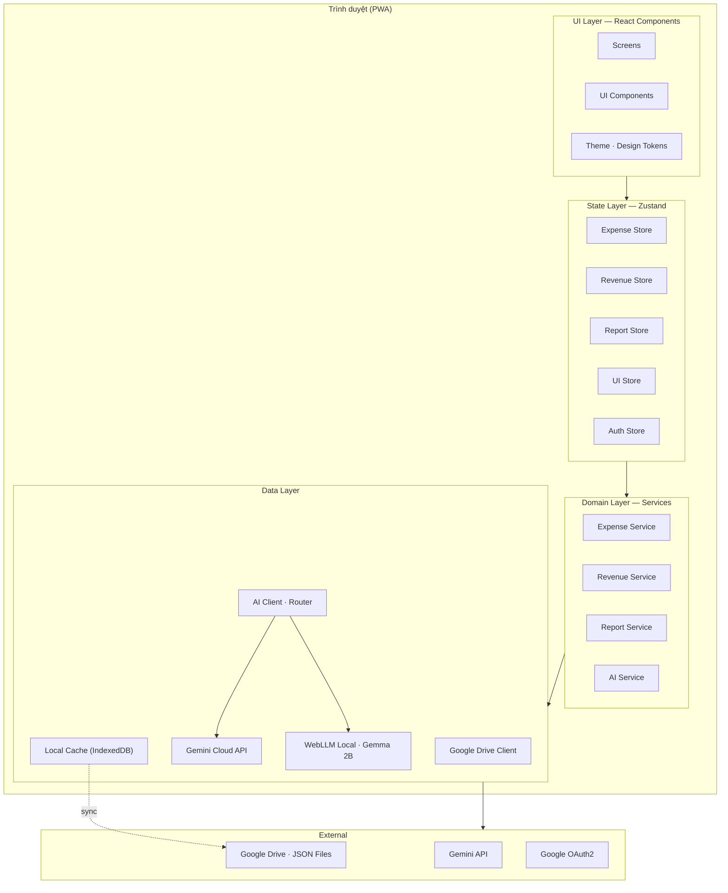
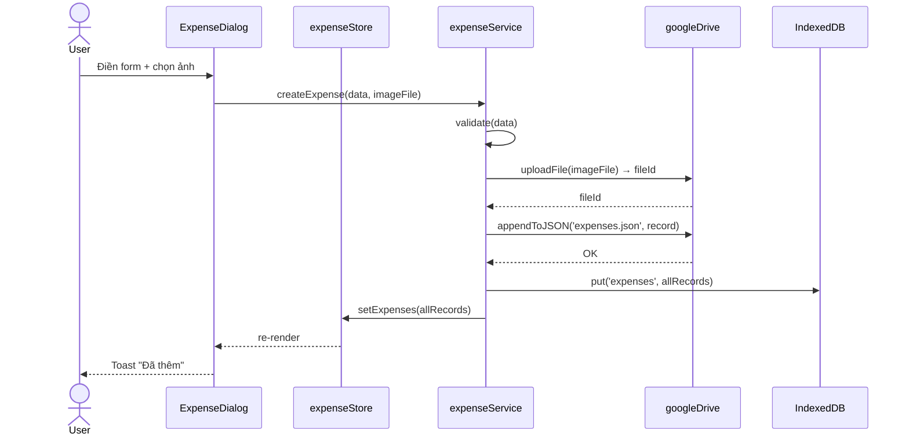
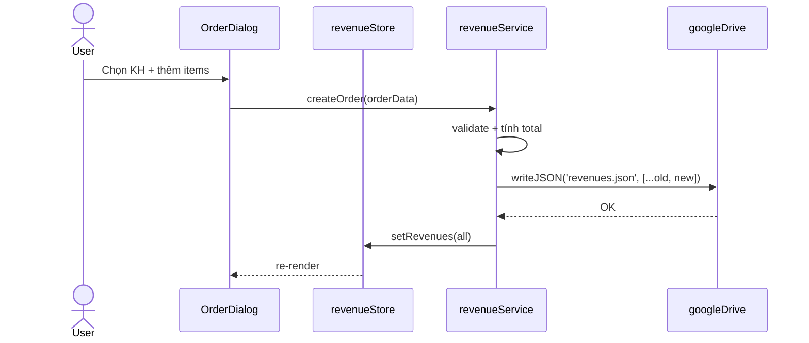
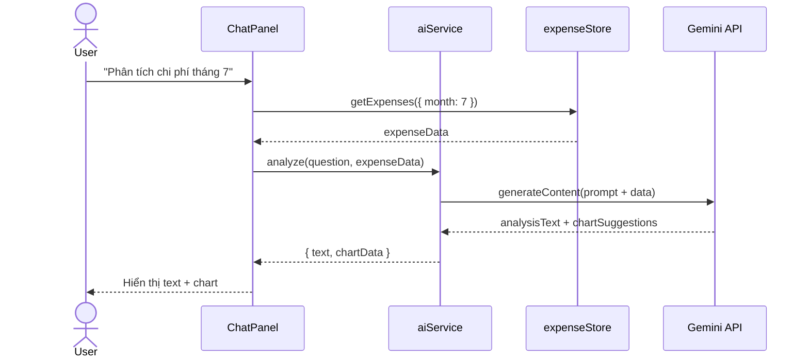
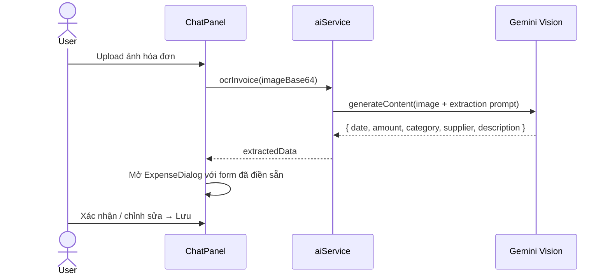

# Kiến trúc hệ thống — Quản Lý Tài Chính

> **Phiên bản**: 1.0 · **Ngày**: 2026-08-01 · **Trạng thái**: DRAFT (chờ review)

## 1. Tổng quan

**Quản Lý Tài Chính** là ứng dụng portable, mở ra là dùng ngay — không cần đăng nhập. Dữ liệu lưu trên Google Drive, đồng bộ ngầm. Tích hợp trợ lý AI **Kimi** (offline + cloud) để nhập liệu, phân tích và điều hướng.

### Mục tiêu
- Quản lý chi phí: CRUD, trạng thái, ảnh hóa đơn
- Quản lý doanh thu: đơn hàng, khách hàng, trạng thái
- Báo cáo: chi phí, doanh thu, lợi nhuận
- AI: phân tích, chat, OCR nhập liệu từ ảnh/văn bản
- Dữ liệu lưu trên Google Drive (JSON files) — người dùng toàn quyền sở hữu dữ liệu

### Nguyên tắc thiết kế (kế thừa từ fe-simulator)
| Nguyên tắc | Mô tả |
|:---|:---|
| **Phân tầng rõ ràng** | UI → State → Service → External (không module nào vượt tầng) |
| **Design tokens tập trung** | Màu sắc, spacing, typography được định nghĩa 1 nơi |
| **Component nguyên tử** | Panel, Toolbar, ActionBar, GridCell, Dialog — mỗi component 1 trách nhiệm |
| **State uni-directional** | View → Action → Store → View (giống StateFlow pattern) |
| **Persistence qua JSON files** | Mỗi entity 1 file JSON trên Drive, sync 2 chiều |

---

## 2. Kiến trúc phân tầng



### Trách nhiệm từng tầng

| Tầng | Trách nhiệm | Không được làm |
|:---|:---|:---|
| **UI** | Render giao diện, bắt sự kiện người dùng, animation | Không gọi API trực tiếp, không business logic |
| **State** | Quản lý state tập trung, derived selectors | Không side effects (network, storage) |
| **Domain** | Business logic, validation, orchestration | Không DOM, không UI state |
| **Data** | Network calls, caching, retry, token refresh | Không business logic |

---

## 3. Technology Stack

| Layer | Technology | Lý do |
|:---|:---|:---|
| **Framework** | React 19 + TypeScript | Hệ sinh thái lớn, type safety |
| **Build** | Vite 6 | Dev server nhanh, HMR, build tối ưu |
| **Styling** | Tailwind CSS 4 + CSS Variables | Utility-first, dễ port FeColors tokens |
| **State** | Zustand 5 | Đơn giản, không boilerplate, giống StateFlow pattern |
| **Router** | React Router 7 | Layout routes, lazy loading |
| **Charts** | Recharts 2 | Có sẵn trong hệ thống AI Studio, API quen thuộc |
| **Icons** | Lucide React | Icon set đầy đủ, tree-shakeable |
| **Google APIs** | `@googleapis/drive` + Google Identity Services | OAuth2 + Drive API v3 |
| **AI** | `@google/genai` (Gemini) | Vision OCR + text generation trong 1 SDK |
| **Cache** | IndexedDB (via `idb`) | Lưu local cache, offline-first |
| **Test** | Vitest + React Testing Library | Nhanh, tương thích Vite |
| **Lint** | ESLint 9 + Prettier | Code quality nhất quán |

---

## 4. Cấu trúc thư mục

```
quan-ly-thu-chi/
├── docs/                              # Tài liệu dự án
│   ├── 01-architecture.md             # File này
│   ├── 02-data-models.md              # Mô hình dữ liệu
│   ├── 03-ui-design.md                # Thiết kế giao diện
│   ├── 04-implementation-plan.md      # Kế hoạch triển khai
│   └── 05-technical-decisions.md      # Quyết định kỹ thuật
├── public/                            # Static assets
│   ├── favicon.svg
│   └── manifest.json                  # PWA manifest
├── src/
│   ├── main.tsx                       # Entry point
│   ├── App.tsx                        # Root component + router
│   │
│   ├── ui/                            # UI Layer
│   │   ├── theme/
│   │   │   ├── colors.ts              # FeColors palette
│   │   │   ├── spacing.ts             # Spacing scale (xs→xl)
│   │   │   ├── typography.ts          # Font styles
│   │   │   └── index.css              # CSS variables + Tailwind
│   │   ├── components/
│   │   │   ├── Panel.tsx              # Card container (FePanel)
│   │   │   ├── Toolbar.tsx            # Top action bar (FeToolbar)
│   │   │   ├── ActionBar.tsx          # Bottom action bar (FeActionBar)
│   │   │   ├── Dialog.tsx             # Modal + Confirm + Alert
│   │   │   ├── GridCell.tsx           # Editable table cell
│   │   │   ├── Button.tsx             # Variant button
│   │   │   ├── Badge.tsx              # Status badge
│   │   │   ├── Toast.tsx              # Notification
│   │   │   ├── StatusBar.tsx          # Bottom status strip
│   │   │   ├── SegmentedControl.tsx   # Tab switcher
│   │   │   ├── Dropdown.tsx           # Select/combobox
│   │   │   ├── DatePicker.tsx         # Date input
│   │   │   └── ImagePreview.tsx       # Invoice image viewer
│   │   ├── screens/
│   │   │   ├── expense/
│   │   │   │   ├── ExpenseScreen.tsx   # Container
│   │   │   │   ├── ExpenseGrid.tsx    # Virtualized table
│   │   │   │   ├── ExpenseRowCard.tsx # Expandable row
│   │   │   │   └── ExpenseDialog.tsx  # Add/edit form
│   │   │   ├── revenue/
│   │   │   │   ├── RevenueScreen.tsx
│   │   │   │   ├── RevenueGrid.tsx
│   │   │   │   ├── OrderRowCard.tsx
│   │   │   │   └── OrderDialog.tsx
│   │   │   ├── report/
│   │   │   │   ├── ReportScreen.tsx       # 7 tabs orchestrator
│   │   │   │   ├── ExpenseReport.tsx      # Chi phí
│   │   │   │   ├── RevenueReport.tsx      # Doanh thu
│   │   │   │   ├── ProfitReport.tsx       # Lợi nhuận
│   │   │   │   ├── UnpaidReport.tsx       # Công nợ
│   │   │   │   ├── CustomerReport.tsx     # Khách hàng 🆕
│   │   │   │   ├── ProductReport.tsx      # Sản phẩm 🆕
│   │   │   │   └── PlatformReport.tsx     # Kênh bán 🆕
│   │   │   ├── ai/
│   │   │   │   ├── AIChatScreen.tsx
│   │   │   │   ├── ChatPanel.tsx
│   │   │   │   └── DataEntryHelper.tsx
│   │   │   └── settings/
│   │   │       ├── SettingsScreen.tsx
│   │   │       └── DriveConnection.tsx
│   │   └── Layout.tsx                 # App shell
│   │
│   ├── store/                         # Zustand stores
│   │   ├── expenseStore.ts
│   │   ├── revenueStore.ts
│   │   ├── customerStore.ts
│   │   ├── reportStore.ts
│   │   ├── uiStore.ts
│   │   └── authStore.ts
│   │
│   ├── services/                      # Business logic
│   │   ├── googleDrive.ts             # Drive API client
│   │   ├── expenseService.ts
│   │   ├── revenueService.ts
│   │   ├── reportService.ts
│   │   └── aiService.ts
│   │
│   ├── models/                        # TypeScript types
│   │   ├── expense.ts
│   │   ├── revenue.ts
│   │   ├── customer.ts
│   │   └── report.ts
│   │
│   └── utils/
│       ├── currency.ts                # VND formatting
│       ├── date.ts                    # Date helpers
│       ├── image.ts                   # Image compression
│       └── id.ts                      # UUID generation
│
├── index.html
├── package.json
├── tsconfig.json
├── vite.config.ts
├── tailwind.config.ts
└── eslint.config.js
```

---

## 5. Luồng dữ liệu

### 5.1. Chi phí — Thêm mới (có ảnh hóa đơn)



### 5.2. Doanh thu — Tạo đơn hàng



### 5.3. AI — Chat phân tích



### 5.4. AI — OCR nhập liệu từ ảnh



---

## 6. Google Drive Storage Model

### Database: SQLite (qua sql.js WASM)

File `database.db` được lưu trên Google Drive trong thư mục `QuanLyThuChi/`.

```
📁 QuanLyThuChi/                    # Thư mục gốc
├── 📄 database.db                  # SQLite database (~1.5MB cho 10K records)
│   ├── expenses                    # Bảng chi phí (có index: date, category, status)
│   ├── revenues                    # Bảng doanh thu (có index: date, status)
│   ├── order_items                 # Bảng sản phẩm trong đơn (FK → revenues)
│   ├── customers                   # Bảng khách hàng
│   └── schema_version              # Phiên bản schema để migration
└── 📁 invoices/                    # Ảnh hóa đơn
    ├── 🖼️ inv_20260715_001.jpg
    └── ...
```

**Tại sao SQLite thay vì JSON?** Xem chi tiết: [`05-technical-decisions.md §5`](./05-technical-decisions.md)

### Sync Strategy
- **Lần đầu**: Tải `database.db` từ Drive → mở bằng sql.js → cache IndexedDB
- **Các lần sau**: Mở từ cache IndexedDB (tức thì) → HEAD request check etag trên Drive → nếu mới hơn thì tải về
- **Khi ghi**: Ghi vào SQLite local → export binary → upload lên Drive
- **Conflict**: Last-write-wins. HEAD check etag trước khi upload để phát hiện conflict.

---

## 7. Security Model

| Vấn đề | Giải pháp |
|:---|:---|
| **Xác thực** | Google OAuth2 — token lưu trong IndexedDB, refresh tự động |
| **Ủy quyền** | Google Drive permissions — chỉ app được tạo mới có quyền truy cập thư mục `QuanLyThuChi/` |
| **Data at rest** | Mã hóa phía Google Drive. JSON plaintext (không chứa thông tin nhạy cảm ngoài SĐT khách) |
| **Data in transit** | HTTPS toàn bộ, Google APIs dùng TLS 1.3 |
| **API Keys** | Gemini API key lưu trong IndexedDB (người dùng tự cấp), không hardcode |

---

## 8. Non-functional Requirements

| Tiêu chí | Mục tiêu |
|:---|:---|
| **Thời gian tải trang đầu** | < 3s (3G) |
| **Thời gian mở grid 1000 dòng** | < 1s (virtualized) |
| **Sync với Drive** | < 5s cho file < 1MB |
| **AI response time** | < 10s (streaming) |
| **Offline support** | Đọc/ghi cache khi mất mạng, sync khi có mạng lại |
| **PWA install** | Cài được trên desktop + mobile |
| **Browser support** | Chrome, Edge, Firefox, Safari (2 versions gần nhất) |
