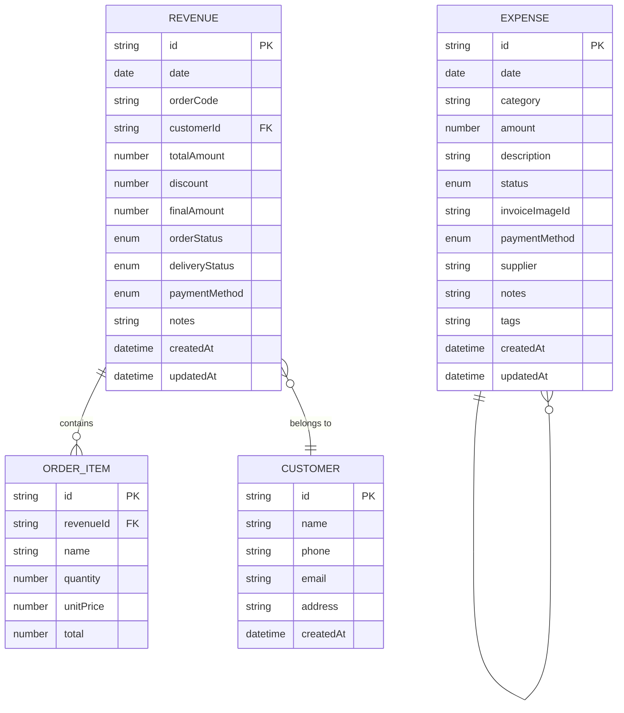
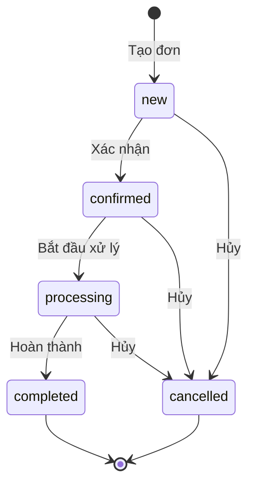

# Mô hình dữ liệu — Quản Lý Tài Chính

> **Phiên bản**: 1.0 · **Ngày**: 2026-08-01 · **Trạng thái**: DRAFT

## 1. Entity Relationship



---

## 2. Expense (Chi phí)

### TypeScript Definition

```typescript
// src/models/expense.ts

export type ExpenseCategory =
  | 'office'          // Văn phòng phẩm
  | 'rent'            // Thuê mặt bằng
  | 'utilities'       // Điện, nước, internet
  | 'salary'          // Lương nhân viên
  | 'marketing'       // Marketing, quảng cáo
  | 'supplies'        // Nguyên vật liệu
  | 'transportation'  // Vận chuyển, xăng xe
  | 'maintenance'     // Bảo trì, sửa chữa
  | 'tax'             // Thuế, phí
  | 'other';          // Khác

export type ExpenseStatus =
  | 'pending'         // Chờ thanh toán
  | 'paid'            // Đã thanh toán
  | 'cancelled';      // Đã hủy

export type PaymentMethod =
  | 'cash'            // Tiền mặt
  | 'bank_transfer'   // Chuyển khoản
  | 'credit_card'    // Thẻ tín dụng
  | 'e_wallet';      // Ví điện tử

export interface Expense {
  /** UUID v4 */
  id: string;

  /** Ngày phát sinh chi phí (ISO 8601 date-only: "2026-07-15") */
  date: string;

  /** Danh mục chi phí */
  category: ExpenseCategory;

  /** Số tiền (VND, không âm) */
  amount: number;

  /** Mô tả ngắn gọn */
  description: string;

  /** Trạng thái thanh toán */
  status: ExpenseStatus;

  /** Google Drive file ID của ảnh hóa đơn (nếu có) */
  invoiceImageId?: string;

  /** Phương thức thanh toán */
  paymentMethod: PaymentMethod;

  /** Nhà cung cấp / người nhận (tùy chọn) */
  supplier?: string;

  /** Ghi chú thêm */
  notes?: string;

  /** Tags để phân loại thêm */
  tags: string[];

  /** Thời điểm tạo bản ghi (ISO 8601) */
  createdAt: string;

  /** Thời điểm cập nhật gần nhất (ISO 8601) */
  updatedAt: string;
}
```

### Ví dụ JSON

```json
{
  "id": "550e8400-e29b-41d4-a716-446655440000",
  "date": "2026-07-15",
  "category": "office",
  "amount": 250000,
  "description": "Giấy in A4 Double A 5 ram",
  "status": "paid",
  "invoiceImageId": "1aB2cD3eF4gH5iJ6kL7",
  "paymentMethod": "bank_transfer",
  "supplier": "Văn phòng phẩm Minh Khai",
  "notes": "Giao hàng chiều thứ 3",
  "tags": ["văn phòng", "hàng tháng"],
  "createdAt": "2026-07-15T08:30:00+07:00",
  "updatedAt": "2026-07-15T08:30:00+07:00"
}
```

### Validation Rules

| Field | Rule |
|:---|:---|
| `id` | UUID v4, tự sinh |
| `date` | Không được để trống, không quá ngày hiện tại + 30 ngày |
| `category` | Phải thuộc enum `ExpenseCategory` |
| `amount` | > 0, ≤ 999.999.999.999 (1 nghìn tỷ) |
| `description` | Bắt buộc, 5–500 ký tự |
| `status` | Phải thuộc enum `ExpenseStatus` |
| `paymentMethod` | Phải thuộc enum `PaymentMethod` |
| `tags` | Mỗi tag 2–30 ký tự, tối đa 10 tags |

---

## 3. Revenue / Order (Doanh thu / Đơn hàng)

### TypeScript Definition

```typescript
// src/models/revenue.ts

export type OrderStatus =
  | 'new'             // Mới tạo
  | 'confirmed'       // Đã xác nhận
  | 'processing'      // Đang xử lý
  | 'completed'       // Hoàn thành
  | 'cancelled';      // Đã hủy

export type DeliveryStatus =
  | 'pending'         // Chờ giao
  | 'shipping'        // Đang giao
  | 'delivered'       // Đã giao
  | 'returned';       // Hoàn trả

export interface Revenue {
  /** UUID v4 */
  id: string;

  /** Ngày tạo đơn (ISO 8601 date-only) */
  date: string;

  /** Mã đơn hàng hiển thị (tự sinh: DH-20260715-001) */
  orderCode: string;

  /** ID khách hàng (FK → Customer) */
  customerId: string;

  /** Danh sách sản phẩm */
  items: OrderItem[];

  /** Tổng tiền trước giảm giá (tự tính = sum(items.total)) */
  totalAmount: number;

  /** Giảm giá (VND, mặc định 0) */
  discount: number;

  /** Tổng sau giảm giá (tự tính = totalAmount - discount) */
  finalAmount: number;

  /** Trạng thái đơn hàng */
  orderStatus: OrderStatus;

  /** Trạng thái giao hàng */
  deliveryStatus: DeliveryStatus;

  /** Phương thức thanh toán */
  paymentMethod: PaymentMethod;

  /** Ghi chú */
  notes?: string;

  /** Thời điểm tạo */
  createdAt: string;

  /** Thời điểm cập nhật */
  updatedAt: string;
}

export interface OrderItem {
  /** UUID v4 */
  id: string;

  /** Tên sản phẩm/dịch vụ */
  name: string;

  /** Số lượng */
  quantity: number;

  /** Đơn giá (VND) */
  unitPrice: number;

  /** Thành tiền = quantity × unitPrice (tự tính) */
  total: number;
}
```

### Ví dụ JSON

```json
{
  "id": "660e8400-e29b-41d4-a716-446655440001",
  "date": "2026-07-15",
  "orderCode": "DH-20260715-001",
  "customerId": "770e8400-e29b-41d4-a716-446655440002",
  "items": [
    {
      "id": "880e8400-e29b-41d4-a716-446655440003",
      "name": "Bàn phím cơ Keychron K3",
      "quantity": 2,
      "unitPrice": 2500000,
      "total": 5000000
    },
    {
      "id": "880e8400-e29b-41d4-a716-446655440004",
      "name": "Chuột Logitech MX Master 3S",
      "quantity": 1,
      "unitPrice": 2800000,
      "total": 2800000
    }
  ],
  "totalAmount": 7800000,
  "discount": 300000,
  "finalAmount": 7500000,
  "orderStatus": "completed",
  "deliveryStatus": "delivered",
  "paymentMethod": "bank_transfer",
  "notes": "Giao trước 17h",
  "createdAt": "2026-07-15T09:00:00+07:00",
  "updatedAt": "2026-07-15T17:30:00+07:00"
}
```

### Validation Rules

| Field | Rule |
|:---|:---|
| `orderCode` | Tự sinh: `DH-YYYYMMDD-NNN` (NNN = số thứ tự trong ngày) |
| `items` | Ít nhất 1 item |
| `quantity` | ≥ 1 |
| `unitPrice` | > 0 |
| `discount` | ≥ 0, ≤ totalAmount |
| `orderStatus` | Phải thuộc enum `OrderStatus` |
| `deliveryStatus` | Phải thuộc enum `DeliveryStatus` |

### State Machine — Trạng thái đơn hàng



---

## 4. Customer (Khách hàng)

### TypeScript Definition

```typescript
// src/models/customer.ts

export interface Customer {
  /** UUID v4 */
  id: string;

  /** Họ tên khách hàng */
  name: string;

  /** Số điện thoại (bắt buộc) */
  phone: string;

  /** Email (tùy chọn) */
  email?: string;

  /** Địa chỉ (tùy chọn) */
  address?: string;

  /** Thời điểm tạo */
  createdAt: string;
}
```

### Validation Rules

| Field | Rule |
|:---|:---|
| `name` | Bắt buộc, 2–100 ký tự |
| `phone` | Bắt buộc, regex: `^(0|\+84)[0-9]{9,10}$` |
| `email` | Nếu có: regex email chuẩn |
| `address` | Nếu có: 5–200 ký tự |

---

## 5. Report Models (Báo cáo)

```typescript
// src/models/report.ts

export interface DateRange {
  from: string;   // ISO date
  to: string;     // ISO date
}

// ── Core report types ──

export interface ExpenseReport { /* ... */ }
export interface RevenueReport { /* ... */ }
export interface ProfitReport { /* ... */ }

// ── Dashboard/summary ──

export interface ExpenseByCategory {
  category: string; total: number; count: number; percentage: number;
}

export interface ExpenseByMonth {
  month: string; total: number; count: number;
}

export interface RevenueByMonth {
  month: string; total: number; count: number;
}

export interface ProfitSummary {
  totalRevenue: number; totalExpense: number;
  profit: number; margin: number; period: string;
}

export interface DashboardSummary {
  totalExpense: number; totalRevenue: number; profit: number;
  pendingOrders: number;
  recentTransactions: Array<{
    id: string; date: string; description: string;
    amount: number; type: 'expense' | 'revenue';
  }>;
}

// ── Customer report (🆕 2026-08-02) ──

export interface CustomerReportRow {
  customerId: string;
  customerName: string;
  orderCount: number;
  totalRevenue: number;
}

// ── Product report (🆕 2026-08-02) ──

export interface ProductReportRow {
  productId: string;
  productName: string;
  totalQuantity: number;
  totalRevenue: number;
  orderCount: number;
}

// ── Platform report (🆕 2026-08-02) ──

export interface PlatformReportRow {
  platformId: string;
  platformName: string;
  orderCount: number;
  totalRevenue: number;
  percentage: number;
}
```

---

## 6. SQLite Schema

```sql
-- Bảng chi phí
CREATE TABLE expenses (
  id TEXT PRIMARY KEY,
  date TEXT NOT NULL,                -- ISO 8601 date
  category TEXT NOT NULL,            -- office, utilities, ...
  amount INTEGER NOT NULL,           -- VND, stored as integer
  description TEXT NOT NULL,
  status TEXT NOT NULL DEFAULT 'pending',
  payment_method TEXT,
  supplier TEXT,
  notes TEXT,
  invoice_file_id TEXT,              -- Google Drive file ID
  tags TEXT DEFAULT '[]',            -- JSON array
  created_at TEXT NOT NULL,
  updated_at TEXT NOT NULL
);
CREATE INDEX idx_expenses_date ON expenses(date);
CREATE INDEX idx_expenses_category ON expenses(category);
CREATE INDEX idx_expenses_status ON expenses(status);

-- Bảng doanh thu
CREATE TABLE revenues (
  id TEXT PRIMARY KEY,
  date TEXT NOT NULL,
  order_code TEXT NOT NULL UNIQUE,
  customer_name TEXT NOT NULL,
  customer_phone TEXT,
  total_amount INTEGER NOT NULL,
  discount INTEGER DEFAULT 0,
  final_amount INTEGER NOT NULL,
  order_status TEXT NOT NULL DEFAULT 'new',
  delivery_status TEXT DEFAULT 'pending',
  payment_method TEXT,
  notes TEXT,
  created_at TEXT NOT NULL,
  updated_at TEXT NOT NULL
);

-- Bảng sản phẩm trong đơn
CREATE TABLE order_items (
  id TEXT PRIMARY KEY,
  revenue_id TEXT NOT NULL REFERENCES revenues(id),
  name TEXT NOT NULL,
  quantity INTEGER NOT NULL,
  unit_price INTEGER NOT NULL,
  total INTEGER NOT NULL
);

-- Bảng khách hàng
CREATE TABLE customers (
  id TEXT PRIMARY KEY,
  name TEXT NOT NULL,
  phone TEXT NOT NULL,
  email TEXT,
  address TEXT,
  created_at TEXT NOT NULL
);

-- Migration tracking
CREATE TABLE schema_version (
  version INTEGER PRIMARY KEY,
  applied_at TEXT NOT NULL
);
```

> **Lưu ý**: Số tiền lưu dưới dạng INTEGER (VND). VD: 250.000 ₫ → `250000`. Tránh float rounding errors.

### expenses.json

```json
{
  "version": 1,
  "lastModified": "2026-07-15T18:00:00+07:00",
  "records": [
    { /* Expense object */ }
  ]
}
```

### revenues.json

```json
{
  "version": 1,
  "lastModified": "2026-07-15T18:00:00+07:00",
  "records": [
    { /* Revenue object */ }
  ]
}
```

### customers.json

```json
{
  "version": 1,
  "lastModified": "2026-07-15T18:00:00+07:00",
  "records": [
    { /* Customer object */ }
  ]
}
```

### settings.json

```json
{
  "version": 1,
  "theme": "light",
  "language": "vi",
  "currencyDisplay": "VND",
  "dateFormat": "DD/MM/YYYY",
  "aiProvider": "gemini",
  "geminiApiKey": "••••••••",
  "driveFolderId": "1AbCdEfGhIjKlMnOpQrStUv",
  "defaultPaymentMethod": "bank_transfer",
  "expenseCategories": [
    { "value": "office", "label": "Văn phòng phẩm", "color": "#3B82F6" }
  ]
}
```
