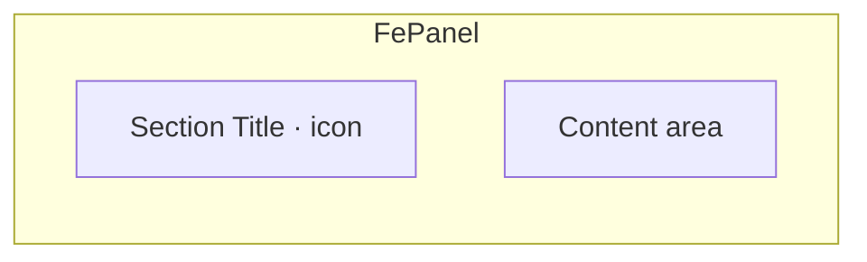
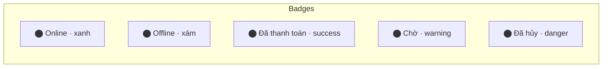

# Thiết kế giao diện — Quản Lý Tài Chính

> **Phiên bản**: 1.0 · **Ngày**: 2026-08-01 · **Trạng thái**: DRAFT
>
> Kế thừa pattern UI từ **fe-simulator** (Compose Desktop → React)
>
> ⚡ **Theme tokens & CSS framework**: xem chi tiết tại [`13-theme-tokens.md`](./13-theme-tokens.md)
> — Tailwind CSS 4 với CSS Variables làm token layer, port toàn bộ `FeColors`, `FeSpacing`, `FeDimens`

---

## 1. Design Tokens

### Color Palette

```typescript
// src/ui/theme/colors.ts
// Port từ FeColors + FeSemanticColors của fe-simulator

export const colors = {
  // Surface
  background:   '#EFF2F7',  // Trang nền chính
  surface:      '#FAFBFC',  // Nền panel/card
  border:       '#CBD5E1',  // Viền panel/input
  borderSubtle: '#E0E3E8',  // Viền nhạt

  // Text
  textPrimary:   '#333333',  // Text chính
  textSecondary: '#475569',  // Text phụ
  textMuted:     '#334155',  // Text mờ

  // Semantic
  accentBg:  '#E3F2FD',
  accentFg:  '#1565C0',  // Màu nhấn chính (xanh dương)
  secondary: '#0F766E',  // Màu phụ (xanh lá đậm)

  // Neutral
  neutralBg:     '#ECEFF1',
  neutralFg:     '#37474F',
  neutralHover:  '#CFD8DC',

  // Danger
  dangerBg: '#FFEBEE',
  dangerFg: '#C62828',

  // Button variants
  runBg:    '#1565C0',
  runFg:    '#FFFFFF',
  cancelBg: '#F57C00',
  cancelFg: '#FFFFFF',
  disconnectBg: '#C62828',
  disconnectFg: '#FFFFFF',
} as const;

export const semanticColors = {
  success: { bg: '#ECFDF5', fg: '#065F46', badge: '#D1FAE5' },
  warning: { bg: '#FEF3C7', fg: '#92400E' },
  error:   { bg: '#FEE2E2', fg: '#B91C1C' },
  info:    { bg: '#E0F2FE', fg: '#1E3A8A', banner: '#EFF6FF' },
  neutral: { bg: '#F1F5F9', fg: '#475569', badge: '#E2E8F0' },
  tooltip: { bg: '#1E293B', fg: '#F8FAFC', border: '#334155' },
} as const;

export const gridColors = {
  headerBg:   '#F1F5F9',
  headerFg:   '#334155',
  rowEven:    '#FFFFFF',
  rowOdd:     '#FAFBFC',
  statusOk:   '#15803D',
  statusFail: '#B91C1C',
  statusNeutral: '#64748B',
} as const;
```

### CSS Variables (Tailwind config)

```css
/* src/ui/theme/index.css */
:root {
  --color-bg:         #EFF2F7;
  --color-surface:    #FAFBFC;
  --color-border:     #CBD5E1;
  --color-text:       #333333;
  --color-text-sub:   #475569;
  --color-accent:     #1565C0;
  --color-accent-bg:  #E3F2FD;
  --color-danger:     #C62828;
  --color-danger-bg:  #FFEBEE;
  --color-success:    #065F46;
  --color-success-bg: #ECFDF5;
  --color-warning:    #92400E;
  --color-warning-bg: #FEF3C7;

  --spacing-xs: 4px;
  --spacing-sm: 6px;
  --spacing-md: 8px;
  --spacing-lg: 12px;
  --spacing-xl: 16px;

  --radius-field: 4px;
  --radius-panel: 6px;
  --radius-dialog: 8px;
  --radius-badge: 12px;

  --font-body:   13px;
  --font-small:  12px;
  --font-xs:     11px;
  --font-title:  14px;
}
```

### Spacing Scale

| Token | Value | Usage |
|:---|:---|:---|
| `xs` | 4px | Gap giữa icon và text |
| `sm` | 6px | Gap giữa các button trong toolbar |
| `md` | 8px | Padding panel, gap form fields |
| `lg` | 12px | Section spacing |
| `xl` | 16px | Page padding |

---

## 2. Component Library (kế thừa fe-simulator)

### 2.1 Panel



- **Style**: Solid (nền `surface`) hoặc Translucent
- **Border**: 1px `border`, radius 6px
- **Padding**: 8px (md)
- **Title**: Font 14px SemiBold, có icon tùy chọn
- **TitleTrailing**: Slot bên phải title (ví dụ: search box)

### 2.2 Toolbar & ActionBar

```
┌─────────────────────────────────────────────────────┐
│ 🔽 Sắp xếp  [Button] [Button]    ✅ Status  ⬤ Online │  ← Toolbar
└─────────────────────────────────────────────────────┘

┌─────────────────────────────────────────────────────┐
│ ☑ Chọn tất cả  [Add] [Delete]    [Copy] [▶ Run]    │  ← ActionBar
└─────────────────────────────────────────────────────┘
```

- **Toolbar**: Fluid start + pinned end cluster
- **ActionBar**: Bulk actions trái (`FlowRow`), primary CTA phải

### 2.3 Button Variants

| Variant | Background | Text | Usage |
|:---|:---|:---|:---|
| **Run** | `accentFg` (#1565C0) | White | Primary CTA (Lưu, Chạy) |
| **Danger** | `dangerFg` (#C62828) | White | Xóa, Hủy |
| **Neutral** | `neutralBg` | `neutralFg` | Secondary actions |
| **Accent** | `accentBg` | `accentFg` | Highlight actions |

### 2.4 GridCell

- **Read mode**: Text hiển thị, ellipsis nếu dài
- **Edit mode**: `BasicTextField` inline, Enter hoặc blur để commit
- **Border**: 1px `border`, radius 4px, padding 4px

### 2.5 Dialog

- **Shape**: radius 8px, elevation 12dp (shadow)
- **Width**: 500px mặc định, có thể mở rộng
- **Footer**: Right-aligned button row
- **Types**: `ConfirmDialog` (xác nhận hành động), `AlertDialog` (thông báo), custom form dialog

### 2.6 Status Badge



---

## 3. Layout Tổng thể

```
┌──────────────────────────────────────────────────────┐
│  🏠 Quản Lý Tài Chính          🔔 ⚙️ 👤 [User Avatar] │  ← Header
├──────────┬───────────────────────────────────────────┤
│          │                                           │
│  📊 Bảng │  [ Nội dung màn hình hiện tại ]          │
│  💰 Chi  │                                           │
│  📦 Doanh│  ┌───────────────────────────────────┐   │
│  📈 Báo  │  │ Panel / Grid / Form              │   │
│  🤖 AI   │  │                                   │   │
│  ⚙️ Cài  │  └───────────────────────────────────┘   │
│          │                                           │
│          │  ┌───────────────────────────────────┐   │
│          │  │ AI Chat Panel (toggle)            │   │
│          │  └───────────────────────────────────┘   │
├──────────┴───────────────────────────────────────────┤
│  🟢 Đã đồng bộ · 15/07/2026 14:30        ⏰ 14:35   │  ← StatusBar
└──────────────────────────────────────────────────────┘
```

### Navigation
- **Sidebar**: Icon + Label, highlight active
- **Responsive**: Collapse to icon-only trên màn nhỏ (< 768px)

---

## 4. Thiết kế Layout — App tài chính hiện đại

### 4.0 Nguyên tắc thiết kế

- **Mở ra là dùng**: Không có màn hình login. App khởi động → Dashboard.
- **Top navigation**: 5 tab ngang: Tổng quan | Chi phí | Doanh thu | Báo cáo | Cài đặt
- **FAB AI Chat**: Nút tròn 🤖 góc phải dưới, bấm vào mở panel chat trượt từ phải
- **Dashboard là trang chủ**: Chart thu chi 7 ngày, đơn chờ, giao dịch gần đây

### 4.1 Layout tổng thể

### 4.1 Quản lý Chi phí (Expense Screen)

```
┌──────────────────────────────────────────────────────┐
│  🔍 Tìm kiếm...   📅 Từ ngày  📅 Đến ngày  🏷️ DMục ▼│  ← Toolbar
│  [＋ Thêm chi phí] [🗑️ Xóa đã chọn] [📥 Xuất Excel]  │
├──────────────────────────────────────────────────────┤
│  ☑ │Ngày       │Danh mục   │Mô tả       │💰 Tiền    ││  ← Grid Header
│ ──┼───────────┼───────────┼────────────┼─────────── ││
│  ☐ │15/07/2026│Văn phòng  │Giấy in A4  │250.000 ₫  ││  ← Row
│    │           │           │5 ram       │✅ Đã TT   ││     (expandable)
│    │           │           │            │🖼️         ││
│ ──┼───────────┼───────────┼────────────┼─────────── ││
│  ☐ │14/07/2026│Điện nước  │Tiền điện T7│1.200.000 ₫││
│    │           │           │            │⏳ Chờ TT  ││
├──────────────────────────────────────────────────────┤
│  ✅ Đã chọn 1 dòng     [1] / 156 dòng               │  ← ActionBar
│  Tổng: 1.450.000 ₫     [▶ Trang 1/10]              │
└──────────────────────────────────────────────────────┘
```

#### Expanded Row
```
│  ☐ │15/07/2026│Văn phòng  │Giấy in A4  │250.000 ₫  │
│    │           │phẩm       │Double A    │✅ Đã TT   │
│    │           │           │─────────── │───────────│
│    │           │           │Nhà CC: Minh│CK ngân    │
│    │           │           │Khai        │hàng       │
│    │           │           │Ghi chú: Giao│          │
│    │           │           │chiều T3    │[🖼️ Xem]  │
│    │           │           │Tags: VP,HT │          │
│    │           │[✏️ Sửa] [🗑️ Xóa] [📋 Copy]        │
```

#### Add/Edit Dialog
```
┌────────────────────────────────────┐
│  ✏️ Thêm chi phí mới           ✕   │
├────────────────────────────────────┤
│  Ngày         [📅 15/07/2026    ]  │
│  Danh mục     [🏷️ Văn phòng  ▼ ]  │
│  Số tiền      [250.000          ]  │
│  Mô tả        [Giấy in A4 5 ram ]  │
│  Thanh toán   [💳 Chuyển khoản ▼]  │
│  Nhà cung cấp [Minh Khai        ]  │
│  Ghi chú      [Giao chiều thứ 3 ]  │
│  Tags         [VP] [HT] [+ Thêm]   │
│  Ảnh hóa đơn  [📎 Chọn file     ]  │
│               🖼️ preview (nếu có)  │
├────────────────────────────────────┤
│              [Hủy]  [💾 Lưu]       │
└────────────────────────────────────┘
```

### 4.2 Quản lý Doanh thu (Revenue Screen)

```
┌──────────────────────────────────────────────────────┐
│  🔍 Tìm...  📅 Từ  📅 Đến  👤 KH▼  📦 Trạng thái▼   │  ← Toolbar
│  [＋ Tạo đơn] [🗑️ Xóa] [📥 Xuất]                     │
├──────────────────────────────────────────────────────┤
│  ☑ │Mã ĐH       │Ngày       │Khách      │💰 Tiền    ││
│ ──┼────────────┼───────────┼───────────┼─────────── ││
│  ☐ │DH-0715-001│15/07/2026│Nguyễn V.A │7.500.000 ₫││
│    │           │           │0903xxxxxx │✅ Hoàn tất││
│ ──┼────────────┼───────────┼───────────┼─────────── ││
│  ☐ │DH-0714-003│14/07/2026│Trần Thị B │2.100.000 ₫││
│    │           │           │           │🚚 Đang giao││
├──────────────────────────────────────────────────────┤
│  Tổng doanh thu tháng: 45.600.000 ₫                  │
└──────────────────────────────────────────────────────┘
```

#### Order Dialog
```
┌──────────────────────────────────────────┐
│  📦 Tạo đơn hàng mới                 ✕   │
├──────────────────────────────────────────┤
│  Ngày          [📅 15/07/2026        ]   │
│  Khách hàng    [🔍 Tìm/Search...   ▼ ]   │
│                (hoặc [+ Thêm KH mới])    │
│  ──────────────────────────────────────  │
│  Sản phẩm:                               │
│  ┌────────────────────────────────────┐  │
│  │ # │Tên SP       │SL │Đơn giá │TT  │  │
│  │ 1 │Bàn phím K3 │ 2 │2.500K  │5M  │  │
│  │ 2 │Chuột MX 3S │ 1 │2.800K  │2.8M│  │
│  │   │[＋ Thêm SP]│   │        │    │  │
│  └────────────────────────────────────┘  │
│  Tổng: 7.800.000 ₫                       │
│  Giảm giá: [300.000             ] ₫      │
│  Thành tiền: 7.500.000 ₫                 │
│  Thanh toán  [💳 CK ngân hàng ▼]         │
│  Trạng thái  [📦 Mới tạo      ▼]         │
│  Ghi chú     [Giao trước 17h       ]     │
├──────────────────────────────────────────┤
│               [Hủy]  [💾 Tạo đơn]        │
└──────────────────────────────────────────┘
```

### 4.3 Báo cáo (Report Screen)

```
┌──────────────────────────────────────────────────────┐
│  [Chi phí] [Doanh thu] [Lợi nhuận]   📅 T7/2026 ▼   │  ← SegmentedControl
├──────────────────────────────────────────────────────┤
│                                                      │
│  ┌─────────────────────┐ ┌─────────────────────────┐ │
│  │ 📊 Chi phí theo DM  │ │ 📈 Chi phí theo tháng   │ │
│  │   (Pie Chart)       │ │   (Bar Chart)           │ │
│  │                     │ │                         │ │
│  └─────────────────────┘ └─────────────────────────┘ │
│                                                      │
│  ┌──────────────────────────────────────────────────┐│
│  │ 📋 Chi tiết                                      ││
│  │ Danh mục     │Số lượng│Tổng tiền │Tỉ trọng      ││
│  │ Văn phòng    │  12    │3.200.000 │ 28%  ████    ││
│  │ Điện nước    │   3    │4.800.000 │ 42%  ██████  ││
│  │ Vận chuyển   │   8    │2.100.000 │ 18%  ███     ││
│  │ Khác         │   5    │1.300.000 │ 12%  ██      ││
│  └──────────────────────────────────────────────────┘│
│                                                      │
│  [📥 Xuất PDF] [📥 Xuất Excel]                       │
└──────────────────────────────────────────────────────┘
```

#### Profit Report

```
┌──────────────────────────────────────────────────────┐
│  📈 Báo cáo Lợi nhuận — Tháng 7/2026                 │
├──────────────────────────────────────────────────────┤
│  ┌────────────┐ ┌────────────┐ ┌────────────┐        │
│  │ 💰 Doanh   │ │ 💸 Chi phí │ │ 📊 Lợi     │        │
│  │   thu      │ │            │ │   nhuận    │        │
│  │ 45.6 Tr   │ │ 12.3 Tr   │ │ 33.3 Tr   │        │
│  └────────────┘ └────────────┘ └────────────┘        │
│                                                      │
│  ┌──────────────────────────────────────────────────┐│
│  │ 📈 Lợi nhuận theo tháng (Bar + Line)             ││
│  │  10M ┤     ██                                    ││
│  │   8M ┤   ████  ██                                ││
│  │   6M ┤ ██████ ████  ██                           ││
│  │      └──────────────────────                     ││
│  │        T4    T5    T6    T7                      ││
│  └──────────────────────────────────────────────────┘│
└──────────────────────────────────────────────────────┘
```

### 4.4 AI Chat Panel

```
┌────────────────────────────────────────┐
│  🤖 Trợ lý AI                      ✕   │
├────────────────────────────────────────┤
│                                        │
│  💬 Chào bạn! Tôi có thể giúp bạn:     │
│     • Phân tích chi phí                │
│     • Nhập liệu từ ảnh hóa đơn         │
│     • Dự báo doanh thu                 │
│     • Tạo báo cáo tự động              │
│                                        │
│  ─────────────────────────────────────  │
│  👤 Bạn: Phân tích chi phí tháng 7     │
│                                        │
│  🤖 AI: Chi phí tháng 7 của bạn là     │
│     12.300.000đ, tăng 15% so với T6.   │
│     Phân bổ:                           │
│     • Điện nước: 4.8M (42%) ⚠️ cao    │
│     • Văn phòng: 3.2M (28%)           │
│     • Vận chuyển: 2.1M (18%)          │
│     • Khác: 1.3M (12%)                │
│                                        │
│     📊 [Xem biểu đồ]                   │
│                                        │
│  ─────────────────────────────────────  │
│  👤 Bạn: 📎 [ảnh hóa đơn chụp]         │
│                                        │
│  🤖 AI: Tôi đã đọc được từ ảnh:        │
│     • Ngày: 15/07/2026                 │
│     • Số tiền: 250.000đ                │
│     • Danh mục: Văn phòng phẩm         │
│     • Mô tả: Giấy in A4               │
│     [➕ Thêm vào chi phí]              │
│                                        │
├────────────────────────────────────────┤
│  📎 [Chọn file]  [📷 Chụp ảnh]        │
│  ┌────────────────────────────────────┐│
│  │ Nhập tin nhắn...              [➤] ││
│  └────────────────────────────────────┘│
└────────────────────────────────────────┘
```

---

## 5. Responsive Breakpoints

| Breakpoint | Width | Layout thay đổi |
|:---|:---|:---|
| **Desktop** | ≥ 1024px | Layout đầy đủ: top nav 5 tab, grid 6 cột, dashboard 4 cards |
| **Tablet** | 768–1023px | Grid 4 cột, dashboard 2 cards, font nhỏ hơn |
| **Mobile** | 480–767px | Grid 3 cột, 1 card/row, modal full-width, bottom nav |
| **Small Mobile** | < 480px | Grid 2 cột, font tối thiểu, FAB nhỏ hơn |

### Mobile Bottom Nav

Trên mobile (< 768px), top nav chuyển thành bottom nav:

```
┌─────────────────────────┐
│  Nội dung chính         │
│                         │
├────┬────┬────┬────┬─────┤
│ 📊 │ 💰 │ 📦 │ 📈 │ ⚙️  │
│ TQ │ Chi│ Thu│ BC │ CĐ  │
└────┴────┴────┴────┴─────┘
```

### Safe Area

- `padding-bottom: env(safe-area-inset-bottom)` cho bottom nav
- Tránh notch/island trên iPhone X+

## 6. Loading States

### Quy tắc

| Loại | Component | Khi nào |
|:---|:---|:---|
| **Skeleton** | Grid rows, cards, charts | Load lần đầu, chưa có data |
| **Spinner** | Button, dialog submit | Đang xử lý (save, delete) |
| **Progress bar** | Upload file, sync Drive, tải AI model | Tiến trình có % |
| **Sync overlay** | Top banner | Đang đồng bộ từ Drive |
| **Empty state** | Icon + text + CTA button | Không có dữ liệu |

### Skeleton Variants

```tsx
// Shared component — dùng chung toàn app
<Skeleton variant="text" width="60%" />       // Dòng text
<Skeleton variant="card" height={100} />       // Card placeholder
<Skeleton variant="row" />                     // Grid row
<Skeleton variant="chart" height={160} />      // Biểu đồ
<Skeleton variant="avatar" size={32} />        // Avatar tròn
```

### Empty State

```tsx
<EmptyState
  icon="📭"
  title="Chưa có khoản chi phí nào"
  description="Bắt đầu bằng cách thêm khoản chi phí đầu tiên của bạn."
  action={{ label: "Thêm chi phí", onClick: openDialog }}
/>
```

### First Load Flow

```
Mở app lần đầu:
  ┌──────────────────────────────────────┐
  │ ⏳ Đang đồng bộ dữ liệu từ Drive... │ ← Sync overlay
  └──────────────────────────────────────┘
  ████████████░░░░  Skeleton cards
  ████████████████  Skeleton chart  
  ████████████░░░░  Skeleton rows

  → Sync xong → Fade out overlay → Hiển thị data thật
  → Hoặc: Không có data → Empty state có CTA
```

## 7. Animations

### Quy tắc

| Nguyên tắc | Mô tả |
|:---|:---|
| **Tinh tế, không màu mè** | Animation ≤ 300ms, ease-out |
| **Có mục đích** | Hướng sự chú ý, phản hồi hành động, continuity |
| **Tắt khi CPU cao** | Adaptive quality: giảm/tắt animation khi CPU > 50% |
| **Respect prefers-reduced-motion** | `@media (prefers-reduced-motion: reduce)` |

### Animation Catalog

| Animation | Duration | Easing | Áp dụng |
|:---|:---|:---|:---|
| `fadeIn` | 300ms | ease-out | Page transition, content appear |
| `slideUp` | 400ms | ease-out | Cards enter (staggered) |
| `scaleIn` | 200ms | ease-out | Dialog/Modal open |
| `bounceIn` | 400ms | ease-out | FAB button appear |
| `slideIn` | 300ms | cubic-bezier(.4,0,.2,1) | Toast enter, chat panel slide |
| `shimmer` | 1.5s | linear (infinite) | Skeleton loading |
| `pulse` | 2s | ease (infinite) | Sync indicator, notification dot |
| `spin` | 0.6s | linear (infinite) | Spinner |
| `hover-lift` | 200ms | ease | Card hover: translateY(-2px) |
| `hover-scale` | 200ms | ease | Button hover: scale(1.03) |

### Animation trong Components

```tsx
// Card list — stagger animation
<div className="summary-row">
  {cards.map((card, i) => (
    <div key={i} className="card-enter" style={{ animationDelay: `${i * 0.05}s` }}>
      <SummaryCard {...card} />
    </div>
  ))}
</div>

// Button loading
<Button variant="run" busy={isSaving}>
  {isSaving ? 'Đang lưu...' : '💾 Lưu'}
</Button>

// Page transition
<div className="page-transition" key={currentRoute}>
  <Outlet />
</div>
```
