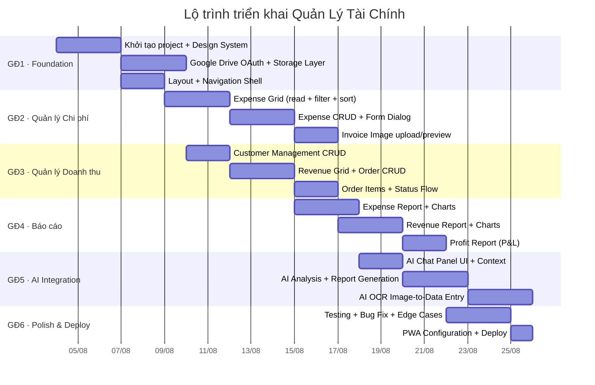
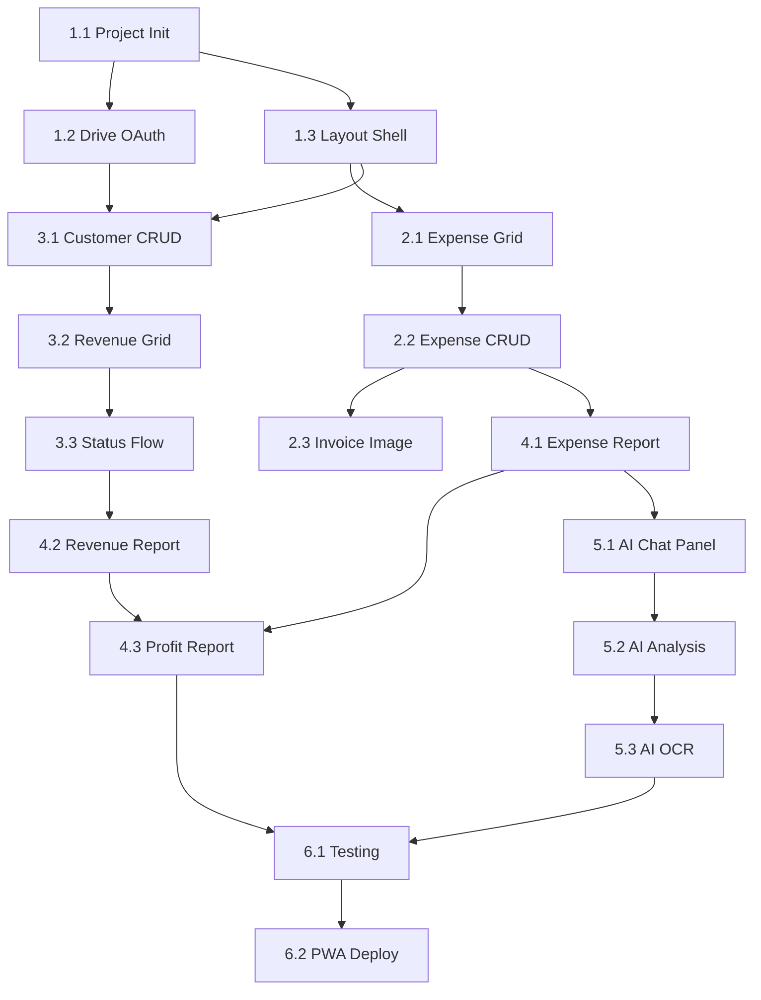

# Kế hoạch triển khai — Quản Lý Tài Chính

> **Phiên bản**: 1.0 · **Ngày**: 2026-08-01 · **Trạng thái**: DRAFT (chờ review & approve)

## 1. Tổng quan lộ trình

**Tổng thời gian ước tính**: ~30 ngày làm việc (6 tuần)

---

## 2. Chi tiết từng giai đoạn

### Giai đoạn 1: Foundation (8 ngày)

#### 1.1 Khởi tạo dự án + Design System (3 ngày)

| # | Task | Output | Priority |
|:--|:---|:---|:---|
| 1.1.1 | `npm create vite@latest` — React + TS | `package.json`, `vite.config.ts`, `tsconfig.json` | P0 |
| 1.1.2 | Cài đặt dependencies: Tailwind, Zustand, React Router, Recharts, Lucide, `idb` | `package.json` updated | P0 |
| 1.1.3 | ESLint 9 + Prettier config | `eslint.config.js`, `.prettierrc` | P0 |
| 1.1.4 | CSS variables từ `FeColors` palette | `src/ui/theme/index.css` | P0 |
| 1.1.5 | Tailwind config extend với colors, spacing, fonts | `tailwind.config.ts` | P0 |
| 1.1.6 | Implement core components: `Panel`, `Button`, `Badge`, `Dialog`, `Toast`, `GridCell` | `src/ui/components/*.tsx` | P0 |

#### 1.2 Google Drive OAuth + Storage (3 ngày)

| # | Task | Output | Priority |
|:--|:---|:---|:---|
| 1.2.1 | Google Cloud Console setup: OAuth2 client, Drive API scope | Console config | P0 |
| 1.2.2 | `googleDrive.ts` — OAuth2 flow, token storage (IndexedDB), refresh | `src/services/googleDrive.ts` | P0 |
| 1.2.3 | Drive API wrapper: `readJSON`, `writeJSON`, `uploadFile`, `listFolder` | `src/services/googleDrive.ts` | P0 |
| 1.2.4 | Init flow: tạo folder `QuanLyThuChi/` + 4 file JSON nếu chưa có | App startup | P0 |
| 1.2.5 | IndexedDB cache layer: `cacheFirst` strategy với background sync | `src/services/googleDrive.ts` | P1 |

#### 1.3 Layout + Navigation (2 ngày)

| # | Task | Output | Priority |
|:--|:---|:---|:---|
| 1.3.1 | `Layout.tsx` — sidebar + header + content area | `src/ui/Layout.tsx` | P0 |
| 1.3.2 | React Router config: 5 routes (expense, revenue, report, ai, settings) | `src/App.tsx` | P0 |
| 1.3.3 | `StatusBar` component — sync status, clock | `src/ui/components/StatusBar.tsx` | P1 |
| 1.3.4 | Responsive: mobile hamburger menu, icon-only sidebar on tablet | `Layout.tsx` | P1 |

---

### Giai đoạn 2: Quản lý Chi phí (8 ngày)

#### 2.1 Expense Grid (3 ngày)

| # | Task | Output | Priority |
|:--|:---|:---|:---|
| 2.1.1 | `expenseStore.ts` — Zustand store: list, filters, selection | `src/store/expenseStore.ts` | P0 |
| 2.1.2 | `expenseService.ts` — load/save qua Drive, cache | `src/services/expenseService.ts` | P0 |
| 2.1.3 | `ExpenseGrid.tsx` — virtualized table (TanStack Virtual hoặc custom) | `src/ui/screens/expense/ExpenseGrid.tsx` | P0 |
| 2.1.4 | Toolbar: tìm kiếm, filter ngày, filter danh mục | `ExpenseScreen.tsx` | P0 |
| 2.1.5 | `ExpenseRowCard.tsx` — expandable row với chi tiết | `src/ui/screens/expense/ExpenseRowCard.tsx` | P0 |

#### 2.2 Expense CRUD + Dialog (3 ngày)

| # | Task | Output | Priority |
|:--|:---|:---|:---|
| 2.2.1 | `ExpenseDialog.tsx` — form thêm/sửa với validation | `src/ui/screens/expense/ExpenseDialog.tsx` | P0 |
| 2.2.2 | Date picker component (dùng native hoặc lightweight lib) | `src/ui/components/DatePicker.tsx` | P0 |
| 2.2.3 | Category dropdown với icon + màu | `ExpenseDialog.tsx` | P0 |
| 2.2.4 | VND currency input (format khi gõ: 250000 → "250.000") | `src/utils/currency.ts` | P0 |
| 2.2.5 | Validation rules + error messages | `expenseService.ts` | P0 |
| 2.2.6 | Status flow: badge màu + dropdown đổi trạng thái | `ExpenseRowCard.tsx` | P0 |

#### 2.3 Invoice Image (2 ngày)

| # | Task | Output | Priority |
|:--|:---|:---|:---|
| 2.3.1 | Image upload to Google Drive | `googleDrive.ts` | P0 |
| 2.3.2 | Thumbnail preview trong row | `ExpenseRowCard.tsx` | P0 |
| 2.3.3 | `ImagePreview.tsx` — lightbox zoom ảnh | `src/ui/components/ImagePreview.tsx` | P1 |
| 2.3.4 | Image compression trước upload (max 2MB) | `src/utils/image.ts` | P1 |

---

### Giai đoạn 3: Quản lý Doanh thu (7 ngày)

#### 3.1 Customer Management (2 ngày)

| # | Task | Output | Priority |
|:--|:---|:---|:---|
| 3.1.1 | `customerStore.ts` — Zustand store | `src/store/customerStore.ts` | P0 |
| 3.1.2 | Customer searchable dropdown (combobox pattern) | `src/ui/components/Dropdown.tsx` | P0 |
| 3.1.3 | Thêm KH nhanh từ dialog (inline form) | `OrderDialog.tsx` | P0 |

#### 3.2 Revenue Grid + Order CRUD (3 ngày)

| # | Task | Output | Priority |
|:--|:---|:---|:---|
| 3.2.1 | `revenueStore.ts` — Zustand store | `src/store/revenueStore.ts` | P0 |
| 3.2.2 | `revenueService.ts` — CRUD, auto-generate orderCode | `src/services/revenueService.ts` | P0 |
| 3.2.3 | `RevenueGrid.tsx` — virtualized table | `src/ui/screens/revenue/RevenueGrid.tsx` | P0 |
| 3.2.4 | `OrderDialog.tsx` — form tạo đơn: chọn KH + items table | `src/ui/screens/revenue/OrderDialog.tsx` | P0 |
| 3.2.5 | Items sub-table: inline add/edit/delete, auto calculate totals | `OrderDialog.tsx` | P0 |

#### 3.3 Status Flow (2 ngày)

| # | Task | Output | Priority |
|:--|:---|:---|:---|
| 3.3.1 | Order status state machine (5 trạng thái) | `revenueService.ts` | P0 |
| 3.3.2 | Delivery status badge + update | `OrderRowCard.tsx` | P0 |
| 3.3.3 | Status transition validation (không thể confirm → new) | `revenueService.ts` | P1 |

---

### Giai đoạn 4: Báo cáo (8 ngày) ✅ Đã triển khai (2026-08-02)

> **7/7 tab báo cáo đã hoàn thành**: Chi phí, Doanh thu, Lợi nhuận, Công nợ, Khách hàng, Sản phẩm, Kênh bán.

| # | Task | Output | Priority | Status |
|:--|:---|:---|:---|:---|
| 4.1.1 | `reportService.ts` — aggregate functions | `src/services/reportService.ts` | P0 | ✅ Done |
| 4.1.2 | Pie chart: phân bổ chi phí theo danh mục (Recharts) | `ExpenseReport.tsx` | P0 | ✅ Done |
| 4.1.3 | Bar chart: chi phí theo tháng | `ExpenseReport.tsx` | P0 | ✅ Done |
| 4.1.4 | Summary cards: tổng chi, số giao dịch, trung bình/ngày | `ExpenseReport.tsx` | P0 | ✅ Done |
| 4.2.1 | Revenue summary cards | `RevenueReport.tsx` | P0 | ✅ Done |
| 4.2.2 | Bar chart: doanh thu theo tháng | `RevenueReport.tsx` | P0 | ✅ Done |
| 4.2.3 | Order status breakdown (pie chart) | `RevenueReport.tsx` | P1 | ✅ Done |
| 4.3.1 | P&L computation: revenue - expense | `reportService.ts` | P0 | ✅ Done |
| 4.3.2 | Profit trend: bar (revenue) + line (profit) | `ProfitReport.tsx` | P0 | ✅ Done |
| **🆕** | **Customer Report** — top KH theo đơn & doanh thu | `CustomerReport.tsx` | P1 | ✅ Done |
| **🆕** | **Product Report** — top SP theo SL & doanh thu | `ProductReport.tsx` | P1 | ✅ Done |
| **🆕** | **Platform Report** — doanh thu theo kênh bán | `PlatformReport.tsx` | P1 | ✅ Done |

---

### Giai đoạn 5: AI Integration (8 ngày)

#### 5.1 AI Chat Panel (2 ngày)

| # | Task | Output | Priority |
|:--|:---|:---|:---|
| 5.1.1 | `aiService.ts` — Gemini client, prompt templates | `src/services/aiService.ts` | P0 |
| 5.1.2 | Settings screen: nhập API key, test connection | `src/ui/screens/settings/AIConfig.tsx` | P0 |
| 5.1.3 | `ChatPanel.tsx` — streaming text UI, context injection | `src/ui/screens/ai/ChatPanel.tsx` | P0 |
| 5.1.4 | Toggle panel: dock right hoặc floating | `Layout.tsx` | P1 |

#### 5.2 AI Analysis (3 ngày)

| # | Task | Output | Priority |
|:--|:---|:---|:---|
| 5.2.1 | Analysis prompt: "Phân tích chi phí tháng X" → structured output | `aiService.ts` | P0 |
| 5.2.2 | Report generation: "Tạo báo cáo lợi nhuận tháng X" | `aiService.ts` | P0 |
| 5.2.3 | Anomaly detection: "Tìm giao dịch bất thường" | `aiService.ts` | P1 |
| 5.2.4 | Context injection: gửi kèm dữ liệu hiện tại vào prompt | `ChatPanel.tsx` | P0 |

#### 5.3 AI OCR Data Entry (3 ngày)

| # | Task | Output | Priority |
|:--|:---|:---|:---|
| 5.3.1 | Image upload → Gemini Vision → extract structured data | `aiService.ts` | P0 |
| 5.3.2 | Auto-fill expense form with OCR result | `DataEntryHelper.tsx` | P0 |
| 5.3.3 | Text parsing: "Bàn phím K3 x2 giá 2.5tr, chuột MX 1 cái 2.8tr" → items | `aiService.ts` | P1 |
| 5.3.4 | User confirmation step trước khi lưu | `DataEntryHelper.tsx` | P0 |

---

### Giai đoạn 6: Polish & Deploy (4 ngày)

#### 6.1 Testing (3 ngày)

| # | Task | Output | Priority |
|:--|:---|:---|:---|
| 6.1.1 | Unit tests: stores (Zustand), services validation | `*.test.ts` | P0 |
| 6.1.2 | Component tests: Dialog, GridCell, Button variants | `*.test.tsx` | P1 |
| 6.1.3 | Integration test: Drive sync flow, AI OCR pipeline | `*.test.ts` | P1 |
| 6.1.4 | Edge cases: Drive quota exceeded, offline recovery, empty states | Manual + automated | P1 |

#### 6.2 PWA & Deploy (1 ngày) ✅ Đã triển khai (2026-08-02)

| # | Task | Output | Priority | Status |
|:--|:---|:---|:---|:---|
| 6.2.1 | PWA manifest + service worker | `manifest.json`, `public/sw.js`, `src/main.tsx` | P0 | ✅ Done |
| 6.2.2 | Offline fallback UI | `sw.js` cache strategy | P1 | ✅ Done |
| 6.2.3 | Deploy to GitHub Pages + CI/CD | `.github/workflows/deploy.yml`, `npm run deploy` | P0 | ✅ Done |

---

## 3. Dependency Graph

---

## 4. Rủi ro & Giảm thiểu

| Rủi ro | Mức độ | Giảm thiểu |
|:---|:---|:---|
| **Google Drive API quota** | Medium | Cache local, batch writes, exponential backoff |
| **Gemini API cost** | Medium | Client-side caching responses, prompt optimization |
| **Offline sync conflict** | Low | Last-write-wins, timestamp-based |
| **PWA install UX** | Low | Hướng dẫn người dùng, auto-prompt |
| **Browser compatibility** | Low | Polyfill cho IndexedDB, test đa trình duyệt |

---

## 5. Tiêu chí Done

| Giai đoạn | Definition of Done |
|:---|:---|
| GĐ1 | App chạy được, login Google, đọc/ghi Drive thành công, navigate 5 màn hình |
| GĐ2 | CRUD chi phí, upload/xem ảnh hóa đơn, filter/search hoạt động |
| GĐ3 | CRUD đơn hàng, quản lý KH, status flow đúng |
| GĐ4 | 3 loại báo cáo hiển thị đúng số liệu, chart tương tác được |
| GĐ5 | AI chat trả lời đúng ngữ cảnh, OCR nhập liệu chính xác > 80% |
| GĐ6 | Test coverage > 60%, PWA cài được, deploy production |
