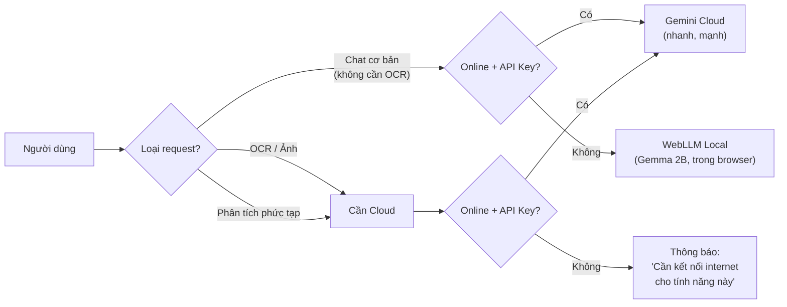
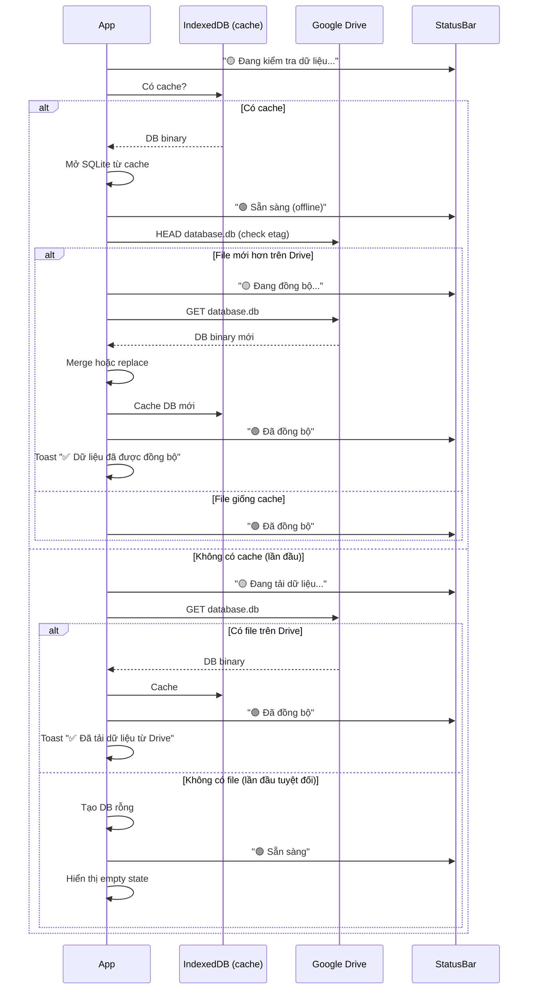

# Quyết định kỹ thuật — Quản Lý Tài Chính

> **Phiên bản**: 1.0 · **Ngày**: 2026-08-01 · **Trạng thái**: DRAFT

## 1. Tại sao Web App thay vì Desktop App?

### Bối cảnh
Dự án tham khảo **fe-simulator** dùng Kotlin/Compose Desktop. Tuy nhiên, bài toán này có yêu cầu khác biệt cơ bản:

| Yêu cầu | Desktop (Kotlin) | Web (React) |
|:---|:---|:---|
| **Google Drive OAuth2** | Phải mở browser hoặc dùng device flow phức tạp | Popup window tự nhiên |
| **AI SDK** | Không có SDK chính thức từ Google/OpenAI cho Kotlin | `@google/genai`, `openai` — first-class |
| **OCR / Vision** | Phải tự implement HTTP client | JS SDK có sẵn |
| **PWA / Mobile** | Cần build riêng từng nền tảng | 1 codebase, chạy mọi nơi |
| **Deploy** | Cần packager (JPackage, MSI) | Push Git → live ngay |
| **Cập nhật** | Người dùng phải tải bản mới | Tự động cập nhật |

**Quyết định**: Web App (React + TypeScript + Vite), deploy dưới dạng PWA để có trải nghiệm "desktop-like".

---

## 2. Tại sao React + Zustand?

| Tiêu chí | React + Zustand | Vue + Pinia | Svelte | SolidJS |
|:---|:---|:---|:---|:---|
| **Hệ sinh thái** | Lớn nhất | Trung bình | Nhỏ | Rất nhỏ |
| **Google SDK** | Có SDK chính thức | Phải tự wrap | Phải tự wrap | Phải tự wrap |
| **Tài liệu tiếng Việt** | Nhiều nhất | Nhiều | Ít | Rất ít |
| **Zustand vs StateFlow** | Gần giống nhất (unidirectional, immutable) | Pinia (mutations) khác pattern | Store contract khác | Signals khác hoàn toàn |
| **Hiring** | Dễ tìm dev | Dễ tìm | Khó | Rất khó |

**Quyết định**: React 19 + Zustand 5.

Lý do chính: hệ sinh thái Google SDK tốt nhất, pattern Zustand gần giống StateFlow của fe-simulator (unidirectional data flow, immutable state update).

---

## 3. Tại sao Google Drive làm Database?

### So sánh các lựa chọn

| Tiêu chí | Google Drive JSON | Firebase Firestore | Supabase | LocalStorage | Google Sheets |
|:---|:---|:---|:---|:---|:---|
| **Chi phí** | Miễn phí (15GB) | Free tier thấp | Free tier thấp | Miễn phí | Miễn phí |
| **Người dùng sở hữu DL** | ✅ Có | ❌ Trên cloud của app | ❌ Trên cloud của app | ✅ Nhưng local only | ✅ Có |
| **Backup** | ✅ Drive sync về máy | Phải export thủ công | Phải export | ❌ Mất nếu xóa cache | ✅ Tự có |
| **Multi-device sync** | ✅ Qua Drive | ✅ | ✅ | ❌ | ✅ |
| **Truy vấn** | ❌ Load toàn bộ về client | ✅ Query server-side | ✅ SQL | ✅ Lọc local | ❌ Hạn chế |
| **Setup** | OAuth2 đơn giản | Cần Firebase project | Cần DB schema | Không cần | OAuth2 + Sheets API |
| **File attachment** | ✅ Cùng hệ thống | Firebase Storage | Storage riêng | ❌ | ❌ |

**Quyết định**: Google Drive JSON files.

Lý do chính:
1. Người dùng **toàn quyền sở hữu dữ liệu** — đây là yếu tố quan trọng với app tài chính
2. Backup tự động qua Google Drive sync về máy
3. Ảnh hóa đơn lưu cùng chỗ với dữ liệu
4. Chi phí = 0 (nằm trong 15GB miễn phí)
5. Với quy mô cá nhân/doanh nghiệp nhỏ (< 10,000 records), load toàn bộ về client là chấp nhận được

**Trade-off accepted**: Không query được server-side, nhưng với dữ liệu < 10K records, filter trên client (có IndexedDB cache) là đủ nhanh.

---

## 4. Tại sao Hybrid AI (Local + Cloud)?

> **Đã cập nhật**: 2026-08-01 — sau khi chọn phương án Hybrid

### Kiến trúc Hybrid



### So sánh các phương án AI

| Tiêu chí | Cloud-only (PA cũ) | Hybrid (PA chọn) | Local-only |
|:---|:---|:---|:---|
| **Offline chat cơ bản** | ❌ Không dùng được | ✅ WebLLM (Gemma 2B) | ✅ |
| **OCR hóa đơn** | ✅ Gemini Vision | ✅ Gemini Vision (cần mạng) | ❌ Rất kém |
| **Phân tích nâng cao** | ✅ | ✅ Cloud | ⚠️ Hạn chế |
| **Cần API key** | Bắt buộc | Tùy chọn (chat cơ bản không cần) | Không |
| **Kích thước app** | ~80MB | ~700MB (+600MB model) | 4-8GB |
| **Cần GPU** | Không | Không (WebGPU đủ cho 2B) | Khuyến nghị |
| **Riêng tư dữ liệu** | Dữ liệu qua Google | Chat cơ bản: local · OCR: cloud | Tuyệt đối |

### Local Model: WebLLM + Qwen 2.5 0.5B

| Thuộc tính | Giá trị |
|:---|:---|
| **Công nghệ** | WebLLM (MLC-AI) — chạy model trong browser qua WebGPU |
| **Model chính** | **Qwen 2.5 0.5B Instruct** — tối ưu cho cấu hình thấp (i3, không GPU rời) |
| **Model dự phòng** | TinyLlama 1.1B — chất lượng cao hơn, cần cấu hình khá hơn |
| **Kích thước** | ~280MB (Qwen) / ~350MB (TinyLlama) — tải 1 lần, cache IndexedDB |
| **Yêu cầu tối thiểu** | Chrome 113+, RAM ≥ 4GB, WebGPU (cả GPU tích hợp) |
| **Tốc độ (UHD 630)** | 15-25 tokens/giây (Qwen) / 8-15 tokens/giây (TinyLlama) |
| **Tốc độ (CPU only)** | 8-12 tokens/giây (Qwen) / 5-8 tokens/giây (TinyLlama) |
| **Ngôn ngữ** | Tiếng Việt cơ bản (model nhỏ nên không hoàn hảo) |
| **Giới hạn** | Context 4K tokens, không hỗ trợ vision/OCR |

### Lý do chọn Qwen 2.5 0.5B thay vì Gemma 2B

| Tiêu chí | Gemma 2B (cũ) | Qwen 2.5 0.5B (mới) |
|:---|:---|:---|
| **Kích thước** | 620MB | 280MB |
| **Tốc độ trên i3 + UHD 630** | 3-6 t/s ⚠️ quá chậm | 15-25 t/s ✅ mượt |
| **RAM sử dụng** | 2-3GB | 1-1.5GB |
| **Tiếng Việt** | Khá | Cơ bản (chấp nhận được cho chat đơn giản) |
| **Tải lần đầu** | 620MB | 280MB |

> **Tóm lại**: Gemma 2B quá nặng cho i3 không GPU rời (chạy 3-6 token/giây là không dùng được). Qwen 0.5B chạy mượt 15-25 token/giây, đủ cho chat cơ bản. Khi cần chất lượng cao → bật Gemini Cloud.

### Cloud Model: Gemini 2.0 Flash

| Thuộc tính | Giá trị |
|:---|:---|
| **Công nghệ** | `@google/genai` SDK |
| **Model** | Gemini 2.0 Flash (nhanh + Vision) |
| **Vision/OCR** | ✅ Tích hợp sẵn |
| **Tiếng Việt** | Rất tốt |
| **Giá** | Miễn phí 1,500 req/ngày |

### Fallback Strategy

```
Quy tắc 3 tầng, tiết kiệm quota cloud tối đa:

1. SIMPLE (chat cơ bản, tính tổng, hỏi đáp)
   → LUÔN WebLLM Local (không tốn quota)

2. MEDIUM (phân tích, so sánh, tìm bất thường)
   → Gemini nếu còn quota → hết quota thì WebLLM

3. COMPLEX (OCR, dự báo, tạo báo cáo)
   → Gemini nếu còn quota → hết quota thì báo lỗi (local không làm được)

Quota Gemini free: 1,500 req/ngày — app tự đếm, reset 00:00
```

### Quyết định: Hybrid với WebLLM + Gemini

**Không chọn Cloud-only** vì: mất hoàn toàn AI khi offline, bắt buộc API key.

**Không chọn Local-only** vì: OCR tiếng Việt không khả thi với model local, phân tích kém hơn hẳn.

**Chọn Hybrid** vì:
1. **Chat cơ bản luôn có** — dù offline hay chưa cấu hình API key
2. **OCR + phân tích chuyên sâu** — vẫn dùng cloud mạnh nhất
3. **Portable vẫn khả thi** — 600MB model chấp nhận được (so với 4-8GB local-only)
4. **Tải 1 lần** — model cache trong IndexedDB, không cần tải lại

---

## 5. Storage Strategy: SQLite trên Google Drive

### Tại sao SQLite thay vì JSON?

| | JSON files | SQLite (sql.js) |
|:---|:---|:---|
| **10K records** | ~5MB, parse 200ms | ~1.5MB, query 5ms |
| **50K records** | ~25MB, parse 1-2s ⚠️ | ~6MB, query 10ms |
| **100K records** | ~50MB, parse 4-5s ❌ | ~12MB, query 15ms |
| **Tìm kiếm** | O(n) filter toàn bộ | O(log n) có index |
| **Thêm 1 record** | Load file → parse → push → stringify → upload | Load DB → INSERT → upload |
| **Sync** | Upload toàn bộ file | Upload toàn bộ file |
| **Đọc trên Drive** | ✅ Text | ❌ Binary |
| **Migration** | Thủ công | SQL migration scripts |
| **Bundle size** | 0KB | +500KB (sql.js WASM) |

**Quyết định: SQLite qua sql.js**

Lý do:
1. **Hiệu năng**: Với 100K+ records, JSON parse mất 4-5 giây. SQLite query < 20ms
2. **Kích thước**: Binary nhỏ hơn 3-4x → upload/download nhanh hơn bấy nhiêu
3. **Query mạnh**: SQL JOIN, GROUP BY, aggregate ngay trong DB thay vì code JS
4. **Index**: Tìm kiếm theo ngày, danh mục, trạng thái — O(log n) thay vì O(n)
5. **Migration**: SQL migration script có version, dễ dàng nâng cấp schema

**Trade-off**: Không đọc được trực tiếp trên Drive (file binary). Chấp nhận được vì app là công cụ chính để xem dữ liệu.

### Cách hoạt động

```typescript
// src/services/database.ts
import initSqlJs, { type Database } from 'sql.js';

class LocalDatabase {
  private db: Database | null = null;

  async initialize(): Promise<void> {
    const SQL = await initSqlJs({
      locateFile: file => `https://sql.js.org/dist/${file}`,
    });

    // Thử load từ cache IndexedDB trước
    const cached = await idb.get('database');
    if (cached) {
      this.db = new SQL.Database(new Uint8Array(cached));
    } else {
      this.db = new SQL.Database();
      this.createTables();
    }
  }

  private createTables(): void {
    this.db!.run(`
      CREATE TABLE IF NOT EXISTS expenses (
        id TEXT PRIMARY KEY,
        date TEXT NOT NULL,
        category TEXT NOT NULL,
        amount INTEGER NOT NULL,
        description TEXT NOT NULL,
        status TEXT NOT NULL DEFAULT 'pending',
        payment_method TEXT,
        supplier TEXT,
        notes TEXT,
        invoice_file_id TEXT,
        tags TEXT DEFAULT '[]',
        created_at TEXT NOT NULL,
        updated_at TEXT NOT NULL
      );
      CREATE INDEX IF NOT EXISTS idx_expenses_date ON expenses(date);
      CREATE INDEX IF NOT EXISTS idx_expenses_category ON expenses(category);
      CREATE INDEX IF NOT EXISTS idx_expenses_status ON expenses(status);

      CREATE TABLE IF NOT EXISTS revenues (
        id TEXT PRIMARY KEY,
        date TEXT NOT NULL,
        order_code TEXT NOT NULL UNIQUE,
        customer_id TEXT,
        customer_name TEXT,
        customer_phone TEXT,
        total_amount INTEGER NOT NULL,
        discount INTEGER DEFAULT 0,
        final_amount INTEGER NOT NULL,
        order_status TEXT NOT NULL DEFAULT 'new',
        delivery_status TEXT DEFAULT 'pending',
        payment_method TEXT,
        notes TEXT,
        created_at TEXT NOT NULL,
        updated_at TEXT NOT NULL
      );
      CREATE INDEX IF NOT EXISTS idx_revenues_date ON revenues(date);
      CREATE INDEX IF NOT EXISTS idx_revenues_status ON revenues(order_status);

      CREATE TABLE IF NOT EXISTS order_items (
        id TEXT PRIMARY KEY,
        revenue_id TEXT NOT NULL,
        name TEXT NOT NULL,
        quantity INTEGER NOT NULL,
        unit_price INTEGER NOT NULL,
        total INTEGER NOT NULL,
        FOREIGN KEY (revenue_id) REFERENCES revenues(id)
      );
      CREATE INDEX IF NOT EXISTS idx_order_items_revenue ON order_items(revenue_id);

      CREATE TABLE IF NOT EXISTS customers (
        id TEXT PRIMARY KEY,
        name TEXT NOT NULL,
        phone TEXT NOT NULL,
        email TEXT,
        address TEXT,
        created_at TEXT NOT NULL
      );

      CREATE TABLE IF NOT EXISTS schema_version (
        version INTEGER PRIMARY KEY,
        applied_at TEXT NOT NULL
      );
    `);
    this.db!.run('INSERT OR IGNORE INTO schema_version VALUES (1, ?)', [new Date().toISOString()]);
  }

  // ... query methods
}
```

### Sync Flow



### Toast Rules

| Hành động | Toast? | Nội dung | Duration |
|:---|:---:|:---|:---|
| Thêm chi phí | ✅ | "✅ Đã thêm: Giấy in A4 — 250.000 ₫" | 3s |
| Sửa chi phí | ✅ | "✅ Đã cập nhật: Giấy in A4" | 3s |
| Xóa chi phí | ✅ | "🗑 Đã xóa 3 khoản chi phí" | 3s |
| Tạo đơn hàng | ✅ | "✅ Đã tạo: DH-20260801-001 — 7.500.000 ₫" | 3s |
| Sync hoàn tất | ✅ | "✅ Dữ liệu đã được đồng bộ" | 3s |
| Lỗi sync | ✅ | "⚠️ Không thể đồng bộ — kiểm tra kết nối" | 5s |
| Lỗi validation | ✅ | "⚠️ Vui lòng điền mô tả và số tiền" | 5s |
| Lỗi quota AI | ✅ | "⚠️ Hết quota Gemini — đã chuyển sang AI offline" | 5s |
| Tab switch | ❌ | — | — |
| Filter/Search | ❌ | — | — |
| Mở/đóng dialog | ❌ | — | — |
| Scroll grid | ❌ | — | — |
| Sync ngầm thành công | ❌ | (chỉ cập nhật status bar) | — |
| Hover/Click row | ❌ | — | — |


```typescript
// Pseudocode
async function getExpenses(): Promise<Expense[]> {
  // 1. Trả về cache ngay lập tức (nếu có)
  const cached = await idb.get('expenses');
  if (cached) notifyUI(cached);

  // 2. Sync ngầm với Drive
  try {
    const remote = await drive.readJSON('expenses.json');
    if (remote.lastModified > cached?.lastModified) {
      await idb.put('expenses', remote);
      notifyUI(remote.records); // Update UI nếu có thay đổi
    }
  } catch (e) {
    // Offline — dùng cache, không báo lỗi
  }
}

async function addExpense(expense: Expense): Promise<void> {
  // 1. Ghi cache ngay
  const all = [...cachedRecords, expense];
  await idb.put('expenses', all);

  // 2. Queue ghi Drive
  await driveQueue.enqueue(() => drive.writeJSON('expenses.json', all));
}
```

### Tại sao không dùng Service Worker Cache API?
- Service Worker cache phù hợp với static assets, không phải dữ liệu động
- IndexedDB cho phép query/index (dù trong app này chỉ lưu array)
- `idb` library nhẹ (2KB), promise-based API

---

## 6. Grid Virtualization

### Vấn đề
Grid 1000+ dòng → render 1000 DOM nodes → lag khi scroll.

### Giải pháp
Dùng `@tanstack/react-virtual` (trước là react-virtual):

```typescript
// Chỉ render ~20 dòng visible trong viewport
const virtualizer = useVirtualizer({
  count: expenses.length,
  getScrollElement: () => scrollRef.current,
  estimateSize: () => 48, // Chiều cao mỗi dòng ~48px
  overscan: 10,
});
```

Chi phí: ~15KB bundle, đáng giá với grid > 100 dòng.

---

## 7. Form Validation

### Strategy: Schema-based (Zod)

```typescript
import { z } from 'zod';

const expenseSchema = z.object({
  date: z.string().min(1, 'Vui lòng chọn ngày'),
  category: z.enum([...EXPENSE_CATEGORIES]),
  amount: z.number().positive('Số tiền phải > 0').max(999_999_999_999),
  description: z.string().min(5).max(500),
  // ...
});
```

Tại sao Zod:
- TypeScript-first: schema → type (không cần define type 2 lần)
- Nhẹ (12KB gzipped)
- Tích hợp tốt với React Hook Form (nếu cần sau này)

---

## 8. PWA Configuration

```json
// public/manifest.json
{
  "name": "Quản Lý Tài Chính",
  "short_name": "ThuChi",
  "start_url": "/",
  "display": "standalone",
  "background_color": "#EFF2F7",
  "theme_color": "#1565C0",
  "icons": [
    { "src": "/icons/icon-192.png", "sizes": "192x192", "type": "image/png" },
    { "src": "/icons/icon-512.png", "sizes": "512x512", "type": "image/png" }
  ]
}
```

Dùng `vite-plugin-pwa` để tự động generate service worker.

---

## 9. Các quyết định nhỏ hơn

| Vấn đề | Quyết định | Lý do |
|:---|:---|:---|
| **CSS approach** | Tailwind + CSS variables | Quen thuộc, không runtime cost, dễ port design tokens |
| **Icons** | Lucide React | Tree-shakeable, MIT license, đủ bộ icons |
| **Date library** | `date-fns` | Nhẹ (tree-shakeable), functional API, locale VN |
| **UUID** | `crypto.randomUUID()` | Built-in, không cần thư viện |
| **Image compression** | Canvas API (browser) | Không cần dependency, giảm ảnh < 2MB trước upload |
| **Toast** | Custom component (theo pattern fe-simulator) | Đơn giản, không cần thư viện |
| **PDF export** | `window.print()` + CSS `@media print` | Đơn giản nhất, đủ dùng cho báo cáo |
| **Testing** | Vitest | Nhanh, tương thích Vite, cùng hệ sinh thái |

---

## 10. Những gì CỐ TÌNH KHÔNG dùng

| Công nghệ | Lý do không dùng |
|:---|:---|
| **Next.js** | Overkill cho SPA. Vite đủ nhanh, không cần SSR/SSG cho app client-side |
| **Redux** | Quá nhiều boilerplate. Zustand cho pattern StateFlow là đủ |
| **React Query / TanStack Query** | Không có server API để query. Data source là local Drive + IndexedDB |
| **shadcn/ui** | Component tự build theo đúng design system fe-simulator, không cần thư viện UI phức tạp |
| **tRPC** | Không có backend server |
| **Prisma / Drizzle** | Không có SQL database |
| **Docker** | Không có backend, deploy thẳng lên Vercel |
