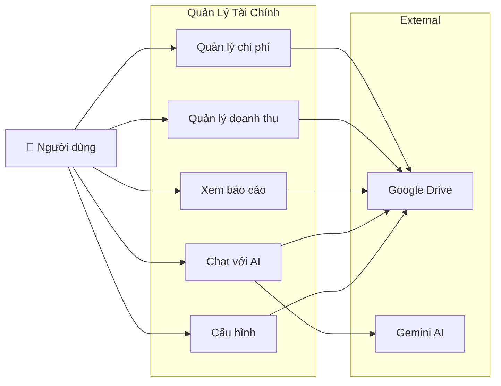
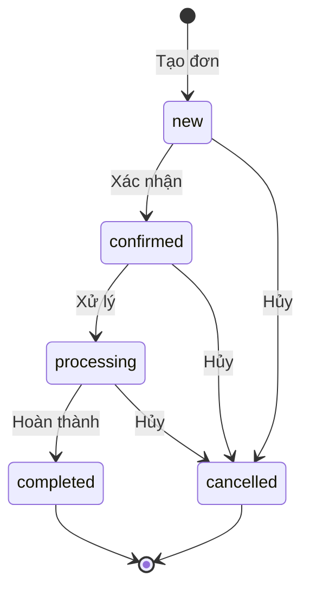

# Software Requirements Specification (SRS)

> **Dự án**: Quản Lý Tài Chính · **Phiên bản**: 1.0
> **Ngày**: 2026-08-01 · **Trạng thái**: DRAFT (chờ review)
> **Tác giả**: AI Studio · **Bên liên quan**: Người dùng cá nhân / doanh nghiệp nhỏ

---

## Mục lục

1. [Giới thiệu](#1-giới-thiệu)
2. [Mô tả tổng quan](#2-mô-tả-tổng-quan)
3. [Yêu cầu chức năng](#3-yêu-cầu-chức-năng)
4. [Yêu cầu phi chức năng](#4-yêu-cầu-phi-chức-năng)
5. [Ràng buộc hệ thống](#5-ràng-buộc-hệ-thống)
6. [Yêu cầu giao diện ngoài](#6-yêu-cầu-giao-diện-ngoài)
7. [Yêu cầu dữ liệu](#7-yêu-cầu-dữ-liệu)
8. [Ma trận truy xuất nguồn gốc](#8-ma-trận-truy-xuất-nguồn-gốc)

---

## 1. Giới thiệu

### 1.1 Mục đích

Tài liệu này đặc tả toàn bộ yêu cầu chức năng và phi chức năng cho phần mềm **Quản Lý Tài Chính** — ứng dụng quản lý tài chính cá nhân/doanh nghiệp nhỏ, tích hợp AI để phân tích và hỗ trợ nhập liệu, lưu trữ dữ liệu trên Google Drive, phân phối dưới dạng portable application.

### 1.2 Phạm vi

| Trong phạm vi | Ngoài phạm vi |
|:---|:---|
| Quản lý chi phí (CRUD, danh mục, ảnh hóa đơn) | Kế toán doanh nghiệp (sổ cái, công nợ phức tạp) |
| Quản lý doanh thu (đơn hàng, khách hàng, trạng thái) | POS / thanh toán trực tuyến |
| Báo cáo tài chính (chi phí, doanh thu, lợi nhuận) | Thuế, bảo hiểm xã hội |
| AI chat phân tích + OCR nhập liệu | AI tự động quyết định tài chính |
| Google Drive làm database | Multi-user / phân quyền |
| Portable app (Electron + PWA) | iOS/Android native app |

### 1.3 Đối tượng người dùng

| Vai trò | Mô tả | Nhu cầu chính |
|:---|:---|:---|
| **Chủ doanh nghiệp nhỏ** | Quản lý thu chi hàng ngày | Nhập nhanh, báo cáo lợi nhuận, AI phân tích |
| **Freelancer** | Theo dõi thu nhập & chi phí dự án | Phân loại theo dự án/khách hàng |
| **Cá nhân** | Quản lý chi tiêu gia đình | Đơn giản, dễ dùng, an toàn dữ liệu |

### 1.4 Thuật ngữ

| Thuật ngữ | Định nghĩa |
|:---|:---|
| **Expense** | Khoản chi phí — tiền chi ra |
| **Revenue** | Khoản doanh thu — tiền thu vào (từ đơn hàng) |
| **Order** | Đơn hàng — một giao dịch bán hàng gồm nhiều sản phẩm |
| **Customer** | Khách hàng — người mua hàng |
| **Dashboard** | Màn hình tổng quan — hiển thị chart 7 ngày, đơn đang chờ, giao dịch gần đây |
| **P&L** | Profit & Loss — báo cáo lợi nhuận = Doanh thu - Chi phí |
| **Portable App** | Ứng dụng chạy không cần cài đặt, giải nén là dùng |
| **FAB** | Floating Action Button — nút tròn góc phải dưới để mở AI Chat |
| **OCR** | Optical Character Recognition — nhận dạng văn bản từ ảnh |

> **Lưu ý**: Ứng dụng **không yêu cầu đăng nhập**. Mở lên là dùng ngay. Google Drive sync chạy ngầm.

---

## 2. Mô tả tổng quan

### 2.1 Bối cảnh

Hiện tại, nhiều chủ doanh nghiệp nhỏ và freelancer quản lý thu chi qua Excel hoặc sổ tay. Điều này gây ra các vấn đề:
- Mất thời gian nhập liệu thủ công
- Khó tổng hợp báo cáo
- Dữ liệu phân tán, dễ mất
- Không có AI hỗ trợ phân tích xu hướng

### 2.2 Giải pháp

**Quản Lý Tài Chính** là ứng dụng portable, chạy trên desktop, lưu dữ liệu trên Google Drive của chính người dùng, tích hợp AI để:

1. Tự động nhập liệu từ ảnh chụp hóa đơn (OCR)
2. Phân tích xu hướng chi tiêu, doanh thu
3. Tạo báo cáo tự động bằng ngôn ngữ tự nhiên
4. Đồng bộ dữ liệu giữa các thiết bị qua Google Drive

### 2.3 Use Case Tổng quan



---

## 3. Yêu cầu chức năng

---

### 3.0 Module Dashboard (DASH)

#### FR-DASH-001: Màn hình Tổng quan

| Thuộc tính | Giá trị |
|:---|:---|
| **Mức ưu tiên** | P0 — Bắt buộc |
| **Mô tả** | Trang chủ khi mở app, hiển thị tổng quan tài chính 7 ngày gần nhất |

**Luồng chính**:
1. Người dùng mở app → hiển thị Dashboard
2. Hệ thống hiển thị 4 khu vực chính
3. Dữ liệu tự động cập nhật khi có thay đổi

**Khu vực**:

| # | Khu vực | Nội dung |
|:--|:---|:---|
| 1 | **Summary Cards** (4 cards) | Tổng chi 7 ngày, Tổng thu 7 ngày, Lợi nhuận, Số đơn đang chờ |
| 2 | **Chart Thu · Chi 7 ngày** | Bar chart stacked: cột xanh (doanh thu) chồng lên cột đỏ (chi phí), mỗi cột = 1 ngày |
| 3 | **Đơn hàng đang chờ** | Danh sách đơn chưa hoàn thành, sắp xếp theo thời gian chờ tăng dần. Hiển thị: mã ĐH, khách, thời gian đã chờ, trạng thái |
| 4 | **Giao dịch gần đây** | 8 giao dịch mới nhất (cả thu và chi), sắp xếp theo thời gian giảm dần |

#### FR-DASH-002: Thời gian chờ đơn hàng

| Thuộc tính | Giá trị |
|:---|:---|
| **Mức ưu tiên** | P0 — Bắt buộc |

- Mỗi đơn hàng chưa hoàn thành hiển thị thời gian đã chờ: "X giờ" hoặc "X ngày"
- Màu sắc cảnh báo:
  - 🟢 < 24 giờ: bình thường
  - 🟡 24-48 giờ: cảnh báo
  - 🔴 > 48 giờ: cần xử lý gấp
- Đơn `completed` hoặc `delivered`: hiển thị "—"

---

### 3.1 Module Chi phí (EXP)

#### FR-EXP-001: Xem danh sách chi phí

| Thuộc tính | Giá trị |
|:---|:---|
| **Mức ưu tiên** | P0 — Bắt buộc |
| **Mô tả** | Hiển thị danh sách tất cả khoản chi phí dưới dạng bảng (grid) |
| **Actor** | Người dùng |
| **Pre-condition** | Đã đăng nhập Google, có ít nhất 1 bản ghi |

**Luồng chính**:
1. Người dùng mở màn hình "Chi phí"
2. Hệ thống hiển thị grid với các cột: Checkbox, Ngày, Danh mục, Mô tả, Số tiền, Trạng thái, Hóa đơn
3. Mặc định sắp xếp theo ngày giảm dần
4. Mỗi dòng có thể click để expand/collapse xem chi tiết

**Luồng thay thế**:
- **Không có dữ liệu**: Hiển thị empty state "Chưa có khoản chi phí nào. Nhấn [+ Thêm] để bắt đầu."

**Yêu cầu kỹ thuật**:
- Grid phải virtualized (chỉ render ~20 dòng visible) để xử lý 10,000+ bản ghi
- Format tiền VND: `1.250.000 ₫`
- Badge trạng thái: `✅ Đã TT` (xanh), `⏳ Chờ TT` (vàng), `❌ Đã hủy` (đỏ)

---

#### FR-EXP-002: Thêm chi phí mới

| Thuộc tính | Giá trị |
|:---|:---|
| **Mức ưu tiên** | P0 — Bắt buộc |
| **Mô tả** | Cho phép người dùng thêm một khoản chi phí mới qua form dialog |
| **Actor** | Người dùng |

**Luồng chính**:
1. Người dùng nhấn nút [+ Thêm chi phí]
2. Hệ thống mở dialog form với các trường mặc định trống
3. Người dùng điền đầy đủ thông tin
4. Hệ thống validate real-time
5. Người dùng nhấn [Lưu]
6. Hệ thống lưu vào Google Drive → cập nhật grid → hiển thị toast "Đã thêm chi phí"

**Form fields**:

| # | Trường | Loại | Bắt buộc | Ghi chú |
|:--|:---|:---|:---|:---|
| 1 | Ngày | Date picker | Có | Mặc định hôm nay |
| 2 | Danh mục | Dropdown | Có | Xem FR-EXP-006 |
| 3 | Số tiền | Currency input | Có | VND, format khi gõ |
| 4 | Mô tả | Text input | Có | 5–500 ký tự |
| 5 | Phương thức TT | Dropdown | Có | Tiền mặt, CK, thẻ, ví điện tử |
| 6 | Nhà cung cấp | Text input | Không | Gợi ý từ lịch sử |
| 7 | Ghi chú | Textarea | Không | |
| 8 | Tags | Tag input | Không | Tối đa 10 tags |
| 9 | Ảnh hóa đơn | File upload | Không | JPG/PNG/PDF, max 5MB |

**Validation**:

| Trường | Rule | Message lỗi |
|:---|:---|:---|
| Ngày | Không rỗng, ≤ hôm nay + 30 ngày | "Vui lòng chọn ngày hợp lệ" |
| Danh mục | Phải chọn | "Vui lòng chọn danh mục" |
| Số tiền | > 0, ≤ 999.999.999.999 | "Số tiền phải > 0" |
| Mô tả | 5–500 ký tự | "Mô tả cần ít nhất 5 ký tự" |
| Ảnh | ≤ 5MB, JPG/PNG/PDF | "File không được quá 5MB" |

**Luồng thay thế**:
- **AI OCR**: Người dùng có thể upload ảnh → AI đọc và tự động điền form (xem FR-AI-003)
- **Hủy**: Người dùng nhấn [Hủy] hoặc Escape → đóng dialog, không lưu

---

#### FR-EXP-003: Sửa chi phí

| Thuộc tính | Giá trị |
|:---|:---|
| **Mức ưu tiên** | P0 — Bắt buộc |
| **Mô tả** | Cho phép chỉnh sửa thông tin một khoản chi phí đã có |

**Luồng chính**:
1. Người dùng click nút [✏️ Sửa] trên dòng chi phí (khi expanded)
2. Hệ thống mở dialog form đã điền sẵn dữ liệu hiện tại
3. Người dùng chỉnh sửa → [Lưu]
4. Hệ thống cập nhật Google Drive → cập nhật grid

---

#### FR-EXP-004: Xóa chi phí

| Thuộc tính | Giá trị |
|:---|:---|
| **Mức ưu tiên** | P0 — Bắt buộc |

**Luồng chính**:
1. Người dùng chọn checkbox 1 hoặc nhiều dòng
2. Nhấn [🗑️ Xóa]
3. Hệ thống hiển thị ConfirmDialog: "Xóa 3 khoản chi phí đã chọn?"
4. Người dùng xác nhận
5. Hệ thống xóa trên Drive → cập nhật grid → toast "Đã xóa 3 khoản"

**Xóa mềm**: Không áp dụng. Xóa là xóa vĩnh viễn khỏi JSON file. Người dùng có thể khôi phục từ Google Drive version history.

---

#### FR-EXP-005: Cập nhật trạng thái

| Thuộc tính | Giá trị |
|:---|:---|
| **Mức ưu tiên** | P0 — Bắt buộc |

- Trạng thái: `pending` → `paid` → (có thể quay lại `pending`) hoặc `cancelled`
- Thay đổi qua dropdown trong expanded row
- Badge màu cập nhật real-time

---

#### FR-EXP-006: Danh mục chi phí

| Mã | Danh mục | Icon | Màu |
|:--|:---|:---|:---|
| `office` | Văn phòng phẩm | 📎 | `#3B82F6` |
| `rent` | Thuê mặt bằng | 🏢 | `#8B5CF6` |
| `utilities` | Điện, nước, internet | 💡 | `#F59E0B` |
| `salary` | Lương nhân viên | 👥 | `#10B981` |
| `marketing` | Marketing, QC | 📢 | `#EC4899` |
| `supplies` | Nguyên vật liệu | 📦 | `#6366F1` |
| `transportation` | Vận chuyển, xăng xe | 🚚 | `#14B8A6` |
| `maintenance` | Bảo trì, sửa chữa | 🔧 | `#F97316` |
| `tax` | Thuế, phí | 📋 | `#EF4444` |
| `other` | Khác | 📌 | `#6B7280` |

---

#### FR-EXP-007: Ảnh hóa đơn

| Thuộc tính | Giá trị |
|:---|:---|
| **Mức ưu tiên** | P1 — Quan trọng |

- Upload ảnh qua dialog thêm/sửa hoặc kéo thả vào row
- Ảnh được nén xuống ≤ 2MB trước khi upload lên Drive
- Hiển thị thumbnail trong grid row (20×20px)
- Click thumbnail → mở ImagePreview lightbox (zoom, xoay)
- Lưu trong thư mục `QuanLyThuChi/invoices/` trên Drive
- Tên file: `inv_YYYYMMDD_HHmmss.ext`

---

#### FR-EXP-008: Tìm kiếm & Lọc

| Thuộc tính | Giá trị |
|:---|:---|
| **Mức ưu tiên** | P1 — Quan trọng |

- **Search box**: Tìm trong mô tả, nhà cung cấp, tags (real-time, debounce 300ms)
- **Date range filter**: Từ ngày → Đến ngày
- **Category filter**: Dropdown multi-select
- **Status filter**: Checkbox: Đã TT / Chờ / Đã hủy
- **Sort**: Click cột header → sort ASC/DESC, indicator ▲/▼
- **Reset filter**: Nút [Xóa bộ lọc]
- **Active filter chips**: Hiển thị filter đang active dạng chip, click để gỡ

#### FR-EXP-009: Phân trang (Pagination)

| Thuộc tính | Giá trị |
|:---|:---|
| **Mức ưu tiên** | P1 — Quan trọng |

- Page size selector: 10 / 20 / 50 / 100 dòng/trang
- Hiển thị: "Hiển thị 1-10 / 156"
- Điều hướng: « ‹ [1] [2] [3] ... [16] › »
- Giữ nguyên filter/sort khi chuyển trang

#### FR-EXP-010: Pin cột (Column Pinning)

| Thuộc tính | Giá trị |
|:---|:---|
| **Mức ưu tiên** | P2 — Nên có |

- Cột trái (checkbox): luôn cố định khi scroll ngang
- Cột phải (số tiền): cố định khi scroll ngang
- Visual indicator: border đậm giữa cột pin và cột scroll
- Dùng CSS `position: sticky` — không cần JS

---

### 3.2 Module Doanh thu (REV)

#### FR-REV-001: Xem danh sách đơn hàng

| Thuộc tính | Giá trị |
|:---|:---|
| **Mức ưu tiên** | P0 — Bắt buộc |

- Grid: Checkbox, Mã ĐH, Ngày, Khách hàng, Tổng tiền, Trạng thái đơn, Trạng thái hàng
- Expand row: danh sách sản phẩm, thông tin KH, ghi chú

---

#### FR-REV-002: Tạo đơn hàng mới

| Thuộc tính | Giá trị |
|:---|:---|
| **Mức ưu tiên** | P0 — Bắt buộc |

**Form fields**:

| # | Trường | Loại | Bắt buộc | Ghi chú |
|:--|:---|:---|:---|:---|
| 1 | Ngày | Date picker | Có | Mặc định hôm nay |
| 2 | Khách hàng | Searchable dropdown | Có | Gõ để tìm hoặc [+ Thêm KH mới] |
| 3 | Sản phẩm | Sub-table | Có (≥1) | Tên SP, SL, Đơn giá → tự tính Thành tiền |
| 4 | Giảm giá | Currency input | Không | Mặc định 0 |
| 5 | Phương thức TT | Dropdown | Có | |
| 6 | Trạng thái đơn | Dropdown | Có | Mặc định "Mới tạo" |
| 7 | Ghi chú | Textarea | Không | |

- **Mã ĐH** tự sinh: `DH-YYYYMMDD-NNN`
- **Tổng tiền** = SUM(items.total)
- **Thành tiền** = Tổng tiền - Giảm giá
- Sub-table cho phép inline add/edit/delete sản phẩm

---

#### FR-REV-003: Quản lý khách hàng

| Thuộc tính | Giá trị |
|:---|:---|
| **Mức ưu tiên** | P0 — Bắt buộc |

- CRUD khách hàng: Họ tên, SĐT (bắt buộc), Email, Địa chỉ (tùy chọn)
- Searchable dropdown khi tạo đơn: gõ tên hoặc SĐT để tìm
- "Thêm KH mới" nhanh từ dialog tạo đơn (inline form nhỏ)
- Không xóa KH đã có đơn hàng (cảnh báo)

---

#### FR-REV-004: Trạng thái đơn hàng & giao hàng

| Thuộc tính | Giá trị |
|:---|:---|
| **Mức ưu tiên** | P0 — Bắt buộc |

**Trạng thái đơn hàng (OrderStatus)**:
- `new` → `confirmed` → `processing` → `completed`
- Có thể `cancelled` từ `new`, `confirmed`, hoặc `processing`
- Không thể thay đổi `completed` hoặc `cancelled`

**Trạng thái giao hàng (DeliveryStatus)**:
- `pending` → `shipping` → `delivered`
- Có thể `returned` từ `delivered`



---

### 3.3 Module Báo cáo (RPT)

#### FR-RPT-001: Báo cáo chi phí

| Thuộc tính | Giá trị |
|:---|:---|
| **Mức ưu tiên** | P0 — Bắt buộc |

- **Bộ lọc**: Khoảng thời gian (tháng/quý/năm), Danh mục
- **Summary cards**: Tổng chi, Số giao dịch, Trung bình/ngày, Chi phí lớn nhất
- **Pie chart**: Phân bổ theo danh mục
- **Bar chart**: Chi phí theo tháng (12 tháng gần nhất)
- **Detail table**: Danh sách chi tiết có thể sort

---

#### FR-RPT-002: Báo cáo doanh thu

| Thuộc tính | Giá trị |
|:---|:---|
| **Mức ưu tiên** | P0 — Bắt buộc |

- **Summary cards**: Tổng doanh thu, Số đơn hàng, Giá trị TB/đơn
- **Bar chart**: Doanh thu theo tháng
- **Top 5 sản phẩm**: Bảng + horizontal bar
- **Top 5 khách hàng**: Bảng
- **Trạng thái đơn**: Pie chart (completed, cancelled, processing...)

---

#### FR-RPT-003: Báo cáo lợi nhuận (P&L)

| Thuộc tính | Giá trị |
|:---|:---|
| **Mức ưu tiên** | P0 — Bắt buộc |

- **P&L Summary**: Doanh thu - Chi phí = Lợi nhuận gộp
- **Tỉ suất lợi nhuận**: (Lợi nhuận / Doanh thu) × 100%
- **Monthly trend**: Bar (doanh thu) + Bar (chi phí) + Line (lợi nhuận) — dual-axis chart
- **Bảng chi tiết theo tháng**: Doanh thu, Chi phí, Lợi nhuận, Tỉ suất

---

#### FR-RPT-004: Xuất báo cáo

| Thuộc tính | Giá trị |
|:---|:---|
| **Mức ưu tiên** | P2 — Nên có |

- Xuất PDF (window.print + CSS @media print)
- Xuất Excel/CSV (tải file .csv)

#### FR-RPT-005: Báo cáo theo ngày

| Thuộc tính | Giá trị |
|:---|:---|
| **Mức ưu tiên** | P1 — Quan trọng |

- Bảng chi tiết từng ngày trong khoảng thời gian chọn (mặc định 7 ngày)
- Cột: Ngày, Thứ, Chi phí, Doanh thu, Lợi nhuận, Số đơn
- Dòng tổng cộng cuối bảng
- Màu sắc: lãi xanh, lỗ đỏ

#### FR-RPT-006: Báo cáo theo tháng

| Thuộc tính | Giá trị |
|:---|:---|
| **Mức ưu tiên** | P1 — Quan trọng |

- Chart cột chồng: Doanh thu + Chi phí 12 tháng
- Bảng chi tiết: Tháng, Chi phí, Doanh thu, Lợi nhuận, Tỉ suất

#### FR-RPT-007: Báo cáo theo danh mục

| Thuộc tính | Giá trị |
|:---|:---|
| **Mức ưu tiên** | P1 — Quan trọng |

- Progress bar cho từng danh mục
- Bảng chi tiết: Danh mục, Số khoản, Tổng tiền, Trung bình/khoản, Tỉ trọng

#### FR-RPT-008: Báo cáo chi tiết

| Thuộc tính | Giá trị |
|:---|:---|
| **Mức ưu tiên** | P2 — Nên có |

- Top khách hàng theo doanh thu
- Phân bổ trạng thái đơn hàng (progress bar + %)
- Danh sách tất cả giao dịch gần đây (thu + chi)

---

### 3.4 Module AI — Trợ lý Kimi (AI)

#### FR-AI-000: Kiến trúc Hybrid AI + Memory

| Thuộc tính | Giá trị |
|:---|:---|
| **Mức ưu tiên** | P0 — Bắt buộc |

Hệ thống AI hoạt động theo kiến trúc lai (Hybrid):

- **WebLLM Local** (Gemma 2B, ~620MB, tải 1 lần): Chat cơ bản khi offline hoặc chưa cấu hình API key
- **Gemini Cloud** (Gemini 2.0 Flash): Chat nâng cao + OCR + phân tích chuyên sâu khi online + có API key
- AI Router tự động chọn provider phù hợp dựa trên: loại request, trạng thái online, API key

| Trạng thái | Provider | Tính năng |
|:---|:---|:---|
| 🟢 Online + API key | Gemini Cloud | Tất cả tính năng |
| 🟡 Offline / Không key | WebLLM Local | Chat cơ bản, không OCR |
| 🔴 Chưa sẵn sàng | — | Hiển thị hướng dẫn cấu hình |

#### FR-AI-001: Chat Panel

| Thuộc tính | Giá trị |
|:---|:---|
| **Mức ưu tiên** | P0 — Bắt buộc |

- Panel chat nằm bên phải màn hình (toggle hiện/ẩn)
- Giao diện dạng chat: tin nhắn người dùng (phải), AI (trái)
- Streaming text: hiển thị từng token khi AI phản hồi
- Context-aware: tự động gửi kèm dữ liệu liên quan theo ngữ cảnh
- Hỗ trợ Markdown trong phản hồi (bold, lists, tables)
- Input: text + file (ảnh cho OCR)
- **Indicator trạng thái AI**: 🟢 Gemini / 🟡 WebLLM / 🔴 Chưa sẵn sàng / ⏳ Đang tải model

---

#### FR-AI-002: Phân tích & Báo cáo bằng AI

| Thuộc tính | Giá trị |
|:---|:---|
| **Mức ưu tiên** | P0 — Bắt buộc |

**Các loại câu hỏi được hỗ trợ**:

| Loại | Ví dụ | Output |
|:---|:---|:---|
| Phân tích chi phí | "Phân tích chi phí tháng này" | Text phân tích + chart data |
| So sánh | "So sánh chi phí T7 với T6" | Bảng so sánh + nhận xét |
| Dự báo | "Dự báo doanh thu tháng sau" | Con số dự báo + reasoning |
| Phát hiện bất thường | "Có giao dịch nào bất thường không?" | Danh sách + giải thích |
| Tư vấn | "Làm sao giảm chi phí vận chuyển?" | Gợi ý cụ thể |
| Báo cáo tự động | "Tạo báo cáo lợi nhuận tháng 7" | Text tóm tắt + số liệu |

**Cơ chế**: AI nhận toàn bộ dữ liệu trong khoảng thời gian liên quan (đã lọc), cộng với prompt hướng dẫn phân tích.

---

#### FR-AI-003: OCR Nhập liệu từ ảnh

| Thuộc tính | Giá trị |
|:---|:---|
| **Mức ưu tiên** | P1 — Quan trọng |

**Luồng**:
1. Người dùng chụp/upload ảnh hóa đơn vào chat
2. AI (Gemini Vision) phân tích ảnh, trích xuất:
   - Ngày hóa đơn
   - Tổng tiền
   - Tên cửa hàng/nhà cung cấp
   - Danh sách mặt hàng (nếu có)
   - Mô tả
3. Hệ thống hiển thị kết quả đã trích xuất + nút [➕ Thêm vào chi phí]
4. Click nút → mở ExpenseDialog với form đã điền sẵn
5. Người dùng kiểm tra, chỉnh sửa → Lưu

**Yêu cầu độ chính xác**: ≥ 80% cho hóa đơn tiếng Việt rõ ràng

---

#### FR-AI-004: Nhập liệu từ văn bản

| Thuộc tính | Giá trị |
|:---|:---|
| **Mức ưu tiên** | P2 — Nên có |

- Người dùng paste mô tả đơn hàng dạng text → Kimi parse thành structured data
- Hiển thị preview → xác nhận → tạo đơn

#### FR-AI-005: Kimi — Nhập liệu bằng hội thoại

| Thuộc tính | Giá trị |
|:---|:---|
| **Mức ưu tiên** | P0 — Bắt buộc |

- "Thêm chi phí 500k tiền điện" → Kimi tạo expense, hiện toast xác nhận
- Nhận diện danh mục từ ngữ cảnh (VD: "tiền điện" → utilities)
- Hỗ trợ đơn vị: k (nghìn), tr/triệu (triệu), số có dấu `.`/`,`
- Hỗ trợ ngoại tệ: USD, EUR, JPY, CNY, KRW, SGD, AUD → tự quy đổi VND
- VD: "Thêm 100 USD mua phần mềm" → 100 × 25.450 = 2.545.000 VND

#### FR-AI-006: Kimi — Điều hướng ứng dụng

| Thuộc tính | Giá trị |
|:---|:---|
| **Mức ưu tiên** | P0 — Bắt buộc |

- "Mở báo cáo" / "Xem doanh thu" → tự động chuyển tab
- "Tìm giấy in" → chuyển tab Chi phí + auto filter
- Mỗi phản hồi kèm nút điều hướng nhanh

#### FR-AI-007: Kimi — Tra cứu số liệu

| Thuộc tính | Giá trị |
|:---|:---|
| **Mức ưu tiên** | P0 — Bắt buộc |

- "Tổng chi bao nhiêu?" "Đơn nào đang chờ?" "Lợi nhuận tháng này?"
- Gọi tên người dùng (từ Google profile)
- Kèm nút "Xem chi tiết" / "Xem báo cáo"

---

### 3.5 Module Cấu hình (CFG)

#### FR-CFG-000: Hồ sơ người dùng

| Thuộc tính | Giá trị |
|:---|:---|
| **Mức ưu tiên** | P0 — Bắt buộc |

- Tên, email, avatar: lấy tự động từ Google OAuth (không thể sửa)
- Tên cửa hàng/doanh nghiệp, SĐT, địa chỉ: người dùng tự điền
- Dùng cho xuất hóa đơn, báo cáo

#### FR-CFG-001: Kết nối Google Drive

| Thuộc tính | Giá trị |
|:---|:---|
| **Mức ưu tiên** | P0 — Bắt buộc |

- Nút [🔗 Kết nối Google Drive] trên màn hình Settings
- OAuth2 popup → cấp quyền `drive.file`
- Hiển thị trạng thái kết nối: ✅ Đã kết nối / ❌ Chưa kết nối
- Nút [Ngắt kết nối] để logout

---

#### FR-CFG-002: Cấu hình AI

| Thuộc tính | Giá trị |
|:---|:---|
| **Mức ưu tiên** | P0 — Bắt buộc |

- Input: Gemini API Key (có link hướng dẫn tạo) — **tùy chọn**, không bắt buộc
- Nếu không có API key: vẫn dùng được chat cơ bản qua WebLLM local
- Nút [Kiểm tra kết nối] → ping Gemini API
- Lưu API key vào IndexedDB (mã hóa)
- **Local Model Management**: xem dung lượng model đã tải, xóa model để giải phóng dung lượng
- Tự động tải model: lần đầu mở app → tải Gemma 2B (620MB, 1 lần)

---

#### FR-CFG-003: Cấu hình hiển thị

| Thuộc tính | Giá trị |
|:---|:---|
| **Mức ưu tiên** | P2 — Nên có |

- Định dạng tiền: VND (mặc định)
- Định dạng ngày: DD/MM/YYYY (mặc định)
- Ngôn ngữ: Tiếng Việt (mặc định)
- Số dòng / trang: 20, 50, 100

---

### 3.6 Yêu cầu Portable App (POR)

#### FR-POR-001: Đóng gói Portable

| Thuộc tính | Giá trị |
|:---|:---|
| **Mức ưu tiên** | P0 — Bắt buộc |

Ứng dụng phải được phân phối dưới dạng **portable application** — giải nén là chạy, không cần cài đặt, theo đúng pattern của fe-simulator:

```
QuanLyThuChi-portable-1.0.0/
├── QuanLyThuChi.exe           ← Launcher (Windows)
├── QuanLyThuChi.app/          ← Ứng dụng macOS
├── QuanLyThuChi               ← Launcher (Linux)
├── app/                       ← Ứng dụng đã build (Electron + React)
├── version.txt                ← Phiên bản
└── README.txt                 ← Hướng dẫn nhanh
```

**Yêu cầu kỹ thuật**:
- Đóng gói bằng Electron, bundle Chromium embedded
- Không yêu cầu cài đặt Node.js, browser, hoặc bất kỳ dependency nào
- Kích thước package ≤ 200MB (đã nén)
- Chạy được trên Windows 10+, macOS 12+, Ubuntu 22.04+
- Auto-update: kiểm tra phiên bản mới từ GitHub Releases

#### FR-POR-002: PWA (Web Version)

| Thuộc tính | Giá trị |
|:---|:---|
| **Mức ưu tiên** | P1 — Quan trọng |

Ngoài portable desktop, ứng dụng phải có thể chạy như PWA trên browser:
- Cài đặt được trên desktop + mobile từ browser
- Offline mode: đọc/ghi cache khi mất mạng
- Tự động sync khi có mạng trở lại

---

## 4. Yêu cầu phi chức năng

### 4.1 Hiệu năng

| ID | Yêu cầu | Chỉ số |
|:---|:---|:---|
| NFR-PERF-001 | Thời gian tải app (first load) | < 3 giây (3G) |
| NFR-PERF-002 | Thời gian mở grid 1,000 dòng | < 1 giây |
| NFR-PERF-003 | Thời gian mở dialog thêm/sửa | < 500ms |
| NFR-PERF-004 | Sync với Google Drive | < 5 giây cho file < 1MB |
| NFR-PERF-005 | AI response (streaming) | Bắt đầu stream < 3 giây |
| NFR-PERF-006 | Bộ nhớ sử dụng (grid 10K dòng) | < 100MB RAM |

### 4.2 Khả dụng

| ID | Yêu cầu | Mô tả |
|:---|:---|:---|
| NFR-AVAIL-001 | Offline mode | Đọc/ghi cache khi mất mạng, sync khi online |
| NFR-AVAIL-002 | Xử lý lỗi Drive | Retry 3 lần với exponential backoff, thông báo rõ ràng |
| NFR-AVAIL-003 | Xử lý lỗi AI | Timeout 30s, fallback message, không crash app |
| NFR-AVAIL-004 | Empty states | Mọi màn hình phải có empty state hướng dẫn |

### 4.3 Bảo mật

| ID | Yêu cầu | Mô tả |
|:---|:---|:---|
| NFR-SEC-001 | OAuth2 only | Không hỗ trợ username/password |
| NFR-SEC-002 | API key encryption | Gemini API key mã hóa khi lưu trong IndexedDB |
| NFR-SEC-003 | Data ownership | Dữ liệu lưu trên Drive của người dùng, app không có server |
| NFR-SEC-004 | HTTPS only | Mọi network request qua HTTPS |
| NFR-SEC-005 | Token refresh | Tự động refresh Google token, không yêu cầu login lại |

### 4.4 Khả năng mở rộng

| ID | Yêu cầu | Mô tả |
|:---|:---|:---|
| NFR-SCALE-001 | Số lượng bản ghi | Hỗ trợ tối thiểu 50,000 expenses + 50,000 revenues |
| NFR-SCALE-002 | Số lượng KH | Hỗ trợ tối thiểu 10,000 customers |
| NFR-SCALE-003 | Kích thước JSON file | < 50MB (khoảng 50K bản ghi), tự động split nếu vượt |

### 4.5 Khả năng bảo trì

| ID | Yêu cầu | Mô tả |
|:---|:---|:---|
| NFR-MAINT-001 | Code coverage | ≥ 60% unit test coverage |
| NFR-MAINT-002 | Linting | ESLint + Prettier, không warning |
| NFR-MAINT-003 | TypeScript strict mode | Bật `strict: true` |
| NFR-MAINT-004 | Documentation | Code docstring cho services, README cho components |

### 4.6 Trải nghiệm người dùng

| ID | Yêu cầu | Mô tả |
|:---|:---|:---|
| NFR-UX-001 | Responsive | Hỗ trợ desktop (≥1024px) và tablet (≥768px) |
| NFR-UX-002 | Keyboard shortcuts | Enter để lưu, Escape để đóng dialog, Ctrl+F tìm kiếm |
| NFR-UX-003 | Loading states | Skeleton loading cho grid, spinner cho sync |
| NFR-UX-004 | Toast notifications | Thành công / lỗi / cảnh báo, auto-dismiss 3-5s |
| NFR-UX-005 | Undo | Không hỗ trợ undo. Cảnh báo trước khi xóa |

---

## 5. Ràng buộc hệ thống

| ID | Ràng buộc | Mô tả |
|:---|:---|:---|
| CON-001 | Google OAuth2 | Bắt buộc có tài khoản Google để dùng app |
| CON-002 | Google Drive API | Yêu cầu Google Cloud Console project đã enable Drive API |
| CON-003 | Gemini API Key | Người dùng tự tạo API key từ Google AI Studio |
| CON-004 | Offline first | Mọi thao tác phải hoạt động offline, sync khi có mạng |
| CON-005 | Browser | Chrome 90+, Edge 90+, Firefox 90+, Safari 15+ |
| CON-006 | Electron | Electron 30+ cho portable app |
| CON-007 | File size | Ảnh hóa đơn ≤ 5MB, nén xuống ≤ 2MB trước upload |
| CON-008 | Bundle size | JS bundle ≤ 500KB gzipped (không tính Electron) |

---

## 6. Yêu cầu giao diện ngoài

### 6.1 Google Drive API

| Endpoint | Method | Purpose |
|:---|:---|:---|
| `drive.files.list` | GET | Tìm file trong thư mục `QuanLyThuChi/` |
| `drive.files.get` | GET | Đọc nội dung JSON file |
| `drive.files.create` | POST | Tạo file mới (JSON hoặc ảnh) |
| `drive.files.update` | PATCH | Cập nhật nội dung file |
| `drive.files.delete` | DELETE | Xóa file |

Scope: `https://www.googleapis.com/auth/drive.file` (chỉ truy cập file do app tạo)

### 6.2 Gemini API

| Endpoint | Purpose |
|:---|:---|
| `generateContent` | Chat completion + phân tích |
| `generateContent` (với image) | Vision OCR |

Model: `gemini-2.0-flash` (nhanh, rẻ, Vision support)

---

## 7. Yêu cầu dữ liệu

### 7.1 Data Storage

| File | Nội dung | Kích thước ước tính (10K records) |
|:---|:---|:---|
| `expenses.json` | Danh sách chi phí | ~5MB |
| `revenues.json` | Danh sách đơn hàng | ~8MB |
| `customers.json` | Danh sách khách hàng | ~1MB |
| `settings.json` | Cấu hình app | ~2KB |
| `invoices/*.jpg` | Ảnh hóa đơn | ~200KB/ảnh sau nén |

### 7.2 Local Cache

- **Công nghệ**: IndexedDB (qua thư viện `idb`)
- **Strategy**: Cache-first, background sync
- **Storage quota**: ~50MB (điển hình), đủ cho toàn bộ dữ liệu

### 7.3 Data Retention

- Dữ liệu tồn tại trên Google Drive của người dùng vĩnh viễn
- Local cache tự động clear nếu quá hạn 30 ngày không dùng
- Google Drive version history giữ 30 ngày (có thể khôi phục)

---

## 8. Ma trận truy xuất nguồn gốc

| Requirement ID | Module | Source | Priority | Test Case |
|:---|:---|:---|:---|:---|
| FR-EXP-001 | Expense | BRD §3.1 | P0 | TC-EXP-001 |
| FR-EXP-002 | Expense | BRD §3.1 | P0 | TC-EXP-002 |
| FR-EXP-003 | Expense | BRD §3.1 | P0 | TC-EXP-003 |
| FR-EXP-004 | Expense | BRD §3.1 | P0 | TC-EXP-004 |
| FR-EXP-005 | Expense | BRD §3.1 | P0 | TC-EXP-005 |
| FR-EXP-006 | Expense | BRD §3.1 | P0 | TC-EXP-006 |
| FR-EXP-007 | Expense | BRD §3.1 | P1 | TC-EXP-007 |
| FR-EXP-008 | Expense | BRD §3.1 | P1 | TC-EXP-008 |
| FR-REV-001 | Revenue | BRD §3.2 | P0 | TC-REV-001 |
| FR-REV-002 | Revenue | BRD §3.2 | P0 | TC-REV-002 |
| FR-REV-003 | Revenue | BRD §3.2 | P0 | TC-REV-003 |
| FR-REV-004 | Revenue | BRD §3.2 | P0 | TC-REV-004 |
| FR-RPT-001 | Report | BRD §3.3 | P0 | TC-RPT-001 |
| FR-RPT-002 | Report | BRD §3.3 | P0 | TC-RPT-002 |
| FR-RPT-003 | Report | BRD §3.3 | P0 | TC-RPT-003 |
| FR-RPT-004 | Report | BRD §3.3 | P2 | TC-RPT-004 |
| FR-AI-001 | AI | BRD §4.1 | P0 | TC-AI-001 |
| FR-AI-002 | AI | BRD §4.1 | P0 | TC-AI-002 |
| FR-AI-003 | AI | BRD §4.2 | P1 | TC-AI-003 |
| FR-AI-004 | AI | BRD §4.2 | P2 | TC-AI-004 |
| FR-CFG-001 | Config | BRD §5.1 | P0 | TC-CFG-001 |
| FR-CFG-002 | Config | BRD §5.2 | P0 | TC-CFG-002 |
| FR-CFG-003 | Config | BRD §5.3 | P2 | TC-CFG-003 |
| FR-POR-001 | Portable | BRD §6.1 | P0 | TC-POR-001 |
| FR-POR-002 | Portable | BRD §6.1 | P1 | TC-POR-002 |
