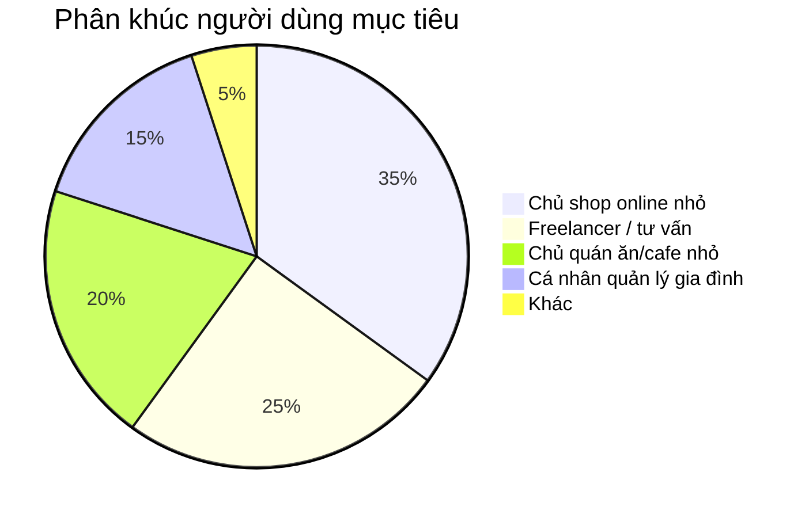
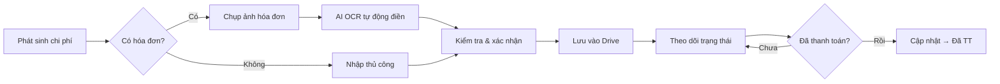
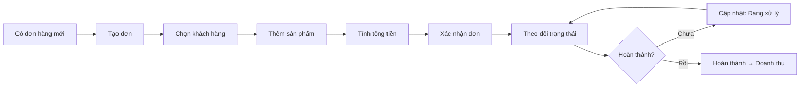
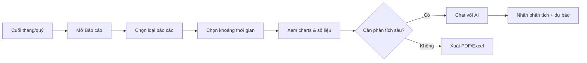
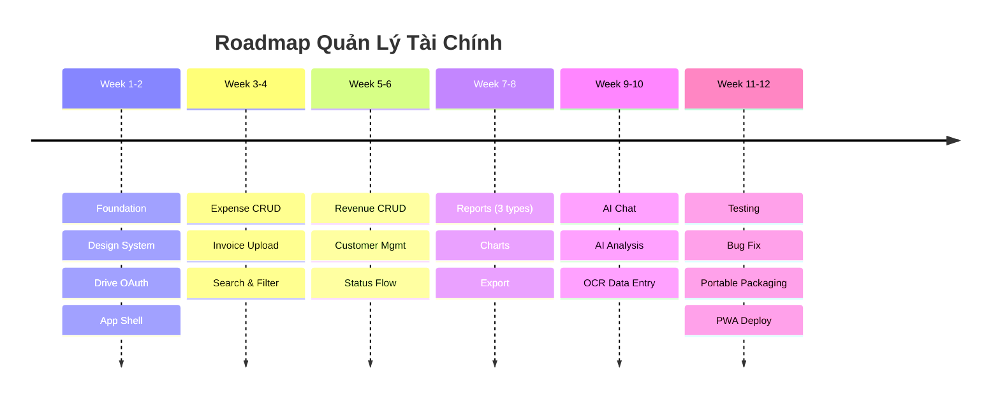

# Business Requirements Document (BRD)

> **Dự án**: Quản Lý Tài Chính · **Phiên bản**: 1.0
> **Ngày**: 2026-08-01 · **Trạng thái**: DRAFT (chờ review)
> **Sponsor**: Người dùng cá nhân · **Stakeholders**: Chủ doanh nghiệp nhỏ, Freelancer

---

## 1. Executive Summary

### 1.1 Vấn đề kinh doanh

Các chủ doanh nghiệp nhỏ, freelancer, và cá nhân tại Việt Nam hiện đang quản lý thu chi qua các công cụ không hiệu quả:

- **Excel/Google Sheets**: Mất thời gian nhập liệu, khó tổng hợp báo cáo, không có AI hỗ trợ
- **Sổ tay/giấy tờ**: Dễ thất lạc, không phân tích được xu hướng
- **App nước ngoài** (Money Lover, Spendee...): Không phù hợp văn hóa Việt Nam, không hỗ trợ hóa đơn tiếng Việt, dữ liệu lưu trên server nước ngoài
- **Phần mềm kế toán** (MISA, Fast...): Quá phức tạp, chi phí cao, overkill cho cá nhân/doanh nghiệp siêu nhỏ

### 1.2 Cơ hội

- **95%** doanh nghiệp Việt Nam là SME, trong đó **70%** là siêu nhỏ (< 10 lao động)
- Xu hướng **AI hóa** công cụ văn phòng đang bùng nổ (ChatGPT, Copilot...)
- Người Việt ngày càng quan tâm đến **quyền sở hữu dữ liệu** cá nhân
- Google Drive phổ biến tại Việt Nam (hầu hết người dùng Android đã có tài khoản Google)

### 1.3 Giải pháp đề xuất

**Quản Lý Tài Chính** — ứng dụng portable, dữ liệu trên Google Drive của người dùng, AI tích hợp:

| Điểm mạnh | Chi tiết |
|:---|:---|
| **Dữ liệu là của bạn** | Lưu trên Google Drive cá nhân, không qua server trung gian |
| **AI thông minh** | OCR hóa đơn tiếng Việt, phân tích xu hướng, tạo báo cáo tự động |
| **Portable** | Giải nén là chạy, không cần cài đặt, mang theo trong USB |
| **Miễn phí** | Toàn bộ tính năng miễn phí (AI dùng Gemini free tier) |
| **Đa nền tảng** | Windows, macOS, Linux + PWA trên mobile |

---

## 2. Mục tiêu kinh doanh

### 2.1 Mục tiêu SMART

| Mục tiêu | Chỉ số | Thời hạn |
|:---|:---|:---|
| **M1** — Ra mắt MVP | Hoàn thiện GĐ1-3 (Foundation + Chi phí + Doanh thu + AI cơ bản) | 6 tuần từ approval |
| **M2** — Phiên bản đầy đủ | Hoàn thiện toàn bộ 6 giai đoạn, có portable package | 8 tuần từ approval |
| **M3** — Người dùng đầu tiên | 50 người dùng active, NPS ≥ 40 | 3 tháng sau launch |
| **M4** — Ổn định | Tỉ lệ crash < 1%, sync error < 5% | 4 tháng sau launch |

### 2.2 KPI

| KPI | Target | Đo lường |
|:---|:---|:---|
| Thời gian nhập 1 chi phí | < 30 giây | Từ lúc mở dialog đến lúc lưu |
| Thời gian tạo 1 đơn hàng | < 60 giây | Từ lúc mở dialog đến lúc lưu |
| Độ chính xác OCR | ≥ 80% | Tỉ lệ field đúng trên tổng field OCR |
| Thời gian sync Drive | < 5 giây | Với < 1000 records |
| Tỉ lệ người dùng quay lại | ≥ 60% | Dùng app ít nhất 1 lần/tuần |

---

## 3. Phân tích thị trường & cạnh tranh

### 3.1 Đối thủ cạnh tranh

| Đối thủ | Điểm mạnh | Điểm yếu | Khác biệt của ta |
|:---|:---|:---|:---|
| **Money Lover** | App mobile đẹp, sync cloud | Dữ liệu trên server họ, không AI, phí premium | Dữ liệu trên Drive của bạn, AI miễn phí |
| **MISA** | Đầy đủ nghiệp vụ kế toán | Phức tạp, chi phí cao, không portable | Đơn giản, portable, miễn phí |
| **Excel/Sheets** | Linh hoạt, quen thuộc | Không AI, dễ sai công thức, không OCR | AI + OCR, giao diện chuyên biệt |
| **Sổ thu chi Mỹ Lan** | App VN, đơn giản | Chỉ mobile, không AI, không Drive | Desktop + AI + Drive |

### 3.2 Phân khúc khách hàng

### 3.3 Value Proposition

> **"Dữ liệu là của bạn, AI là của bạn, miễn phí trọn đời."**

- Bạn không phải tin tưởng một công ty nào với dữ liệu tài chính của mình
- AI giúp bạn tiết kiệm 70% thời gian nhập liệu
- Portable — mang theo trong USB, không cần cài đặt

---

## 4. Yêu cầu nghiệp vụ

### 4.1 Quy trình quản lý chi phí

### 4.2 Quy trình quản lý doanh thu

### 4.3 Quy trình báo cáo định kỳ

---

## 5. Phạm vi dự án

### 5.1 In Scope

| Hạng mục | Mô tả |
|:---|:---|
| **Dashboard** | Tổng quan: chart thu chi 7 ngày, đơn chờ + thời gian chờ, giao dịch gần đây |
| **Quản lý chi phí** | CRUD, 10 danh mục, trạng thái, filter/sort/pin cột/pagination, ảnh hóa đơn |
| **Quản lý doanh thu** | CRUD đơn hàng, quản lý KH, items, trạng thái đơn & giao hàng |
| **Báo cáo** | 5 chế độ: Tổng quan, Theo ngày, Theo tháng, Danh mục, Chi tiết |
| **Kimi — Trợ lý AI** | Nhập liệu hội thoại, quy đổi ngoại tệ, điều hướng, tra cứu, gọi tên |
| **Hồ sơ người dùng** | Tự động từ Google, bổ sung thông tin cửa hàng |
| **Quản lý danh mục & KH** | Xem/sửa danh mục, CRUD khách hàng |
| **Google Drive** | SQLite sync ngầm |
| **Portable + Docker + PWA** | 3 kênh phân phối |

### 5.2 Out of Scope

| Hạng mục | Lý do |
|:---|:---|
| Multi-user / phân quyền | Single-user app |
| Kế toán doanh nghiệp (sổ cái, công nợ, khấu hao) | Phức tạp, cần chuyên gia kế toán |
| POS / thanh toán trực tuyến | Cần tích hợp ngân hàng, VNPay... |
| iOS / Android native app | PWA đủ dùng |
| Import từ Excel / MISA | Có thể làm sau, priority thấp |
| Multi-currency | Chỉ VND |

### 5.3 Giả định

- Người dùng có tài khoản Google
- Người dùng có kết nối internet ít nhất 1 lần/ngày để sync
- Dữ liệu < 50,000 records mỗi loại
- Người dùng tự tạo Gemini API key

---

## 6. Lộ trình sản phẩm (Roadmap)

### Các mốc quan trọng

| Cột mốc | Ngày dự kiến | Deliverable |
|:---|:---|:---|
| **M0 — Kickoff** | Ngày approve | Tài liệu đã review, môi trường dev sẵn sàng |
| **M1 — Alpha** | Tuần 4 | CRUD chi phí hoàn chỉnh + Drive sync |
| **M2 — Beta** | Tuần 8 | Đầy đủ thu chi + báo cáo cơ bản, test nội bộ |
| **M3 — RC** | Tuần 10 | Tích hợp AI hoàn chỉnh |
| **M4 — GA** | Tuần 12 | Portable package + PWA deploy, public release |

---

## 7. Rủi ro & Giảm thiểu

| Rủi ro | Xác suất | Tác động | Giảm thiểu |
|:---|:---|:---|:---|
| Google Drive API quota | Trung bình | Cao | Cache local, batch writes, retry logic |
| Gemini API thay đổi | Thấp | Trung bình | Abstract AI layer, dễ switch provider |
| Electron bundle quá nặng | Trung bình | Trung bình | Tối ưu build, chỉ bundle dependencies cần thiết |
| Người dùng không muốn tạo API key | Cao | Cao | Hướng dẫn step-by-step, video tutorial |
| Dữ liệu JSON quá lớn | Thấp | Trung bình | Auto-split file nếu > 10MB, pagination |
| Mất dữ liệu khi sync conflict | Thấp | Rất cao | Google Drive version history (30 ngày), cảnh báo trước sync |

---

## 8. Chi phí dự kiến

### 8.1 Chi phí phát triển

| Hạng mục | Ước tính |
|:---|:---|
| Phát triển (12 tuần) | 1 developer full-time |
| Thiết kế UI/UX | Tận dụng fe-simulator design system |
| Testing | Developer tự test + Vitest |
| Google Cloud Console | Miễn phí |
| Gemini API | Miễn phí (1,500 req/ngày) |

### 8.2 Chi phí vận hành

| Hạng mục | Chi phí/tháng |
|:---|:---|
| Domain + hosting (Vercel) | Miễn phí (Hobby plan) |
| GitHub Releases (portable hosting) | Miễn phí |
| Google Drive (user's own) | Miễn phí (15GB) |
| Gemini API (user's own key) | Miễn phí |
| **Tổng** | **0 ₫/tháng** |

---

## 9. Tiêu chí thành công

### 9.1 MVP Success Criteria

- [ ] CRUD chi phí hoạt động: thêm/sửa/xóa/đổi trạng thái
- [ ] Upload & xem ảnh hóa đơn
- [ ] CRUD đơn hàng: tạo đơn, thêm KH, thêm SP
- [ ] Google Drive sync hoạt động 2 chiều
- [ ] AI chat trả lời được câu hỏi phân tích cơ bản
- [ ] AI OCR nhập liệu từ ảnh hóa đơn (độ chính xác ≥ 80%)
- [ ] Portable app chạy được trên Windows

### 9.2 Production Success Criteria

- [ ] 3 loại báo cáo đầy đủ + xuất PDF
- [ ] Trạng thái đơn hàng + giao hàng đầy đủ
- [ ] Offline mode hoạt động
- [ ] PWA cài được trên mobile
- [ ] Portable app chạy được trên Windows + macOS + Linux
- [ ] Test coverage ≥ 60%
- [ ] 0 critical bug
