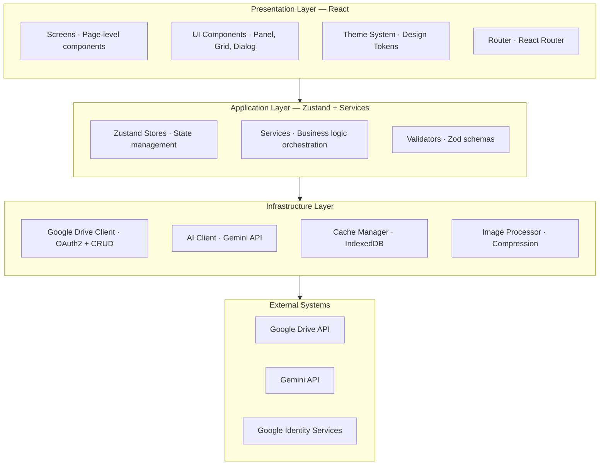
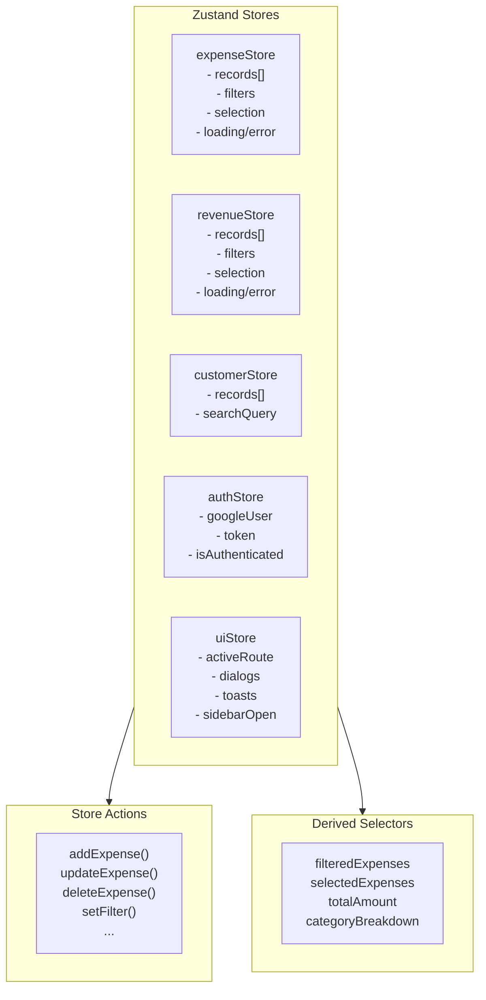
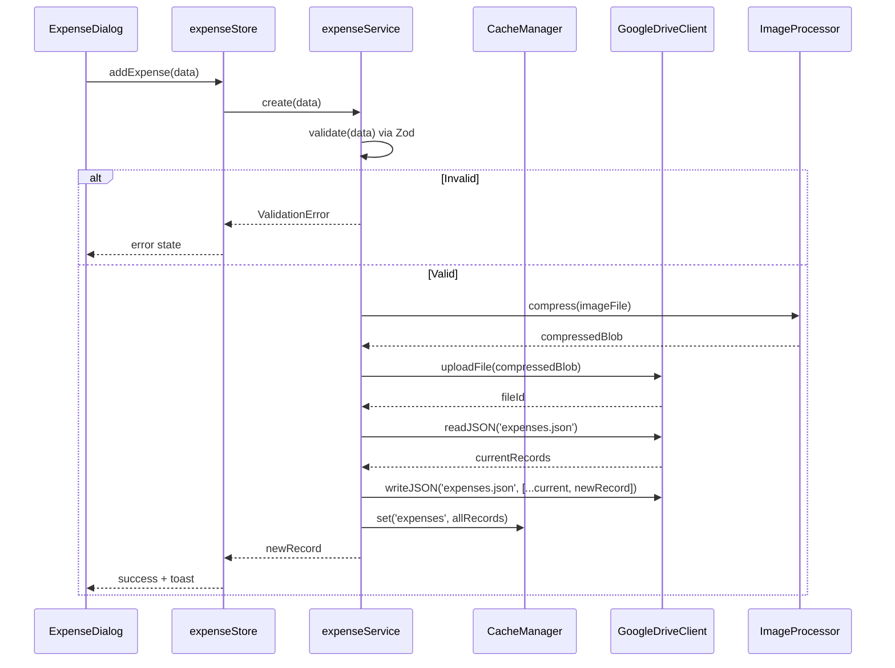
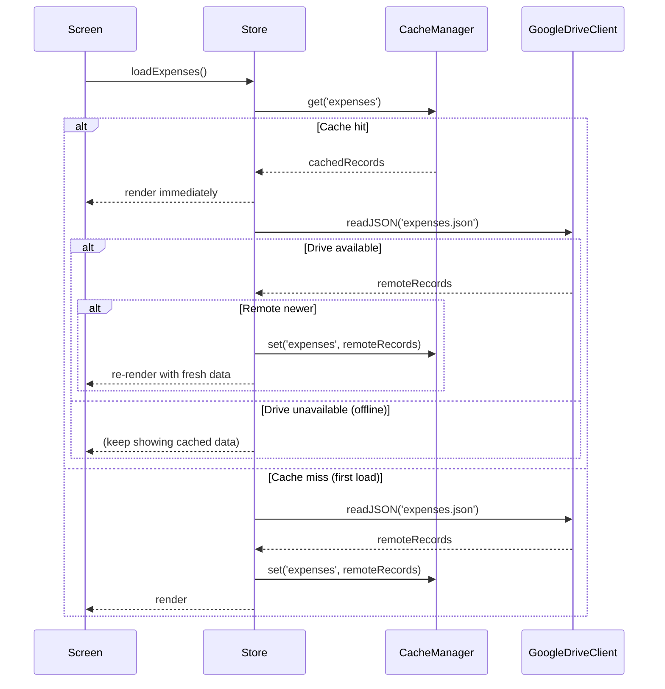
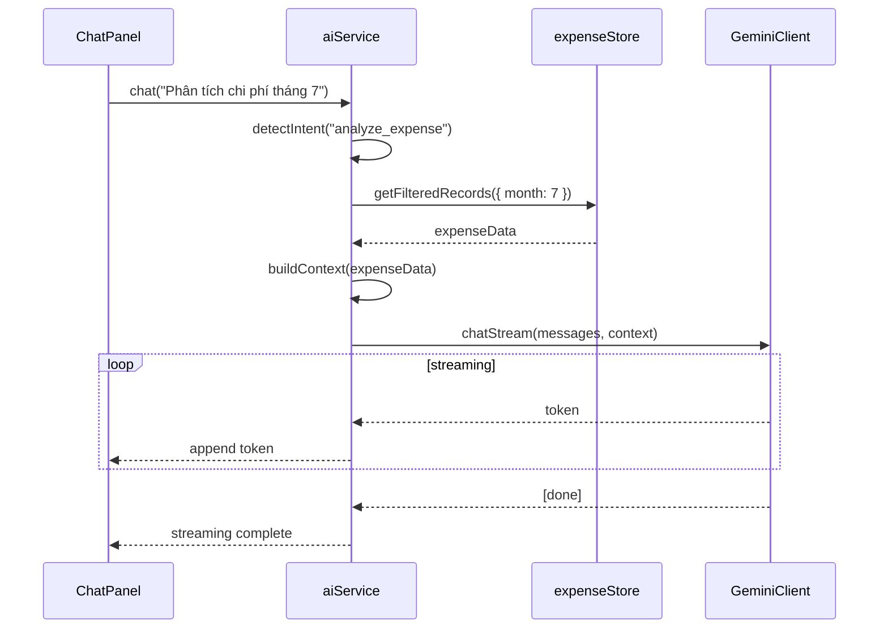
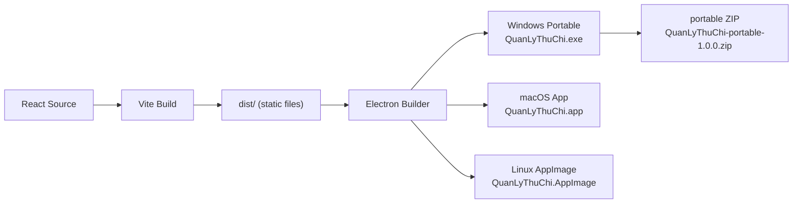
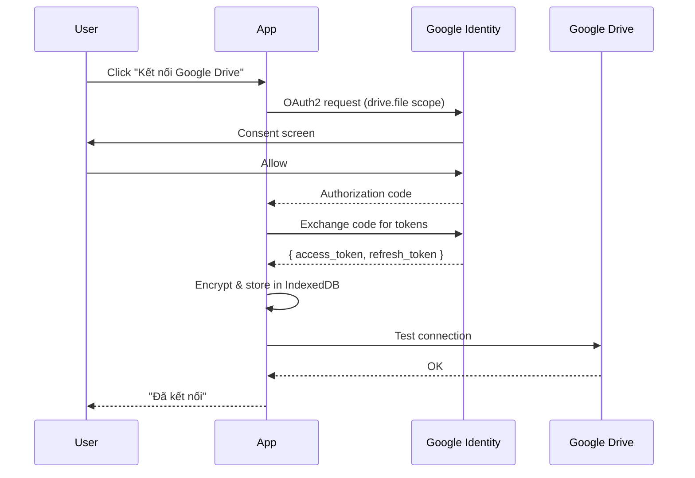
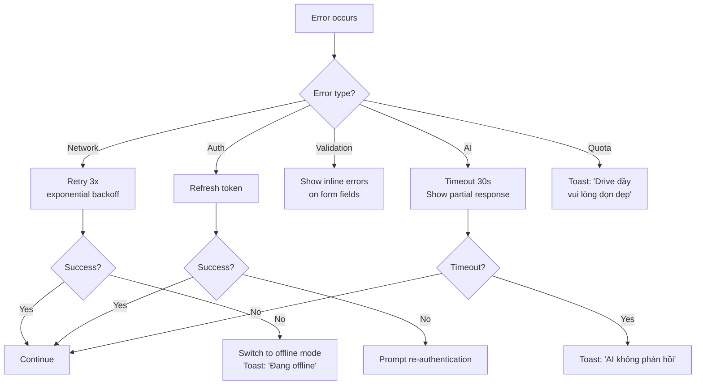

# Architecture Design Document (ADD)

> **Dự án**: Quản Lý Tài Chính · **Phiên bản**: 1.0
> **Ngày**: 2026-08-01 · **Trạng thái**: DRAFT (chờ review)
>
> Tham khảo kiến trúc: **fe-simulator** (Kotlin/Compose Desktop) — áp dụng pattern phân tầng, design tokens

---

## 1. Kiến trúc tổng thể

### 1.1 Kiến trúc phân tầng (Layered Architecture)



### 1.2 Nguyên tắc kiến trúc

| Nguyên tắc | Mô tả | Áp dụng |
|:---|:---|:---|
| **Separation of Concerns** | Mỗi tầng chỉ phụ thuộc vào tầng dưới nó | UI không gọi API trực tiếp |
| **Single Responsibility** | Mỗi component/service 1 trách nhiệm | Panel chỉ layout, GridCell chỉ hiển thị |
| **Dependency Inversion** | Service interface được define bởi consumer | Store gọi Service interface, không gọi implementation |
| **Design Token Centralization** | Mọi giá trị thiết kế tập trung 1 chỗ | `colors.ts`, `spacing.ts`, `typography.ts` |
| **Offline First** | Mọi thao tác dùng cache trước, sync sau | IndexedDB → Google Drive |
| **Type Safety** | TypeScript strict mode toàn bộ | `tsconfig.json: { "strict": true }` |

---

## 2. Presentation Layer — Chi tiết

### 2.1 Component Tree

```
App
├── TopNav
│   ├── Brand ("ThuChi")
│   ├── Tab("📊 Tổng quan")
│   ├── Tab("💰 Chi phí")
│   ├── Tab("📦 Doanh thu")
│   ├── Tab("📈 Báo cáo")
│   ├── Tab("⚙️ Cài đặt")
│   └── SyncBadge + Clock
├── ContentArea (React Router <Outlet />)
│   ├── DashboardScreen (trang chủ — mặc định)
│   │   ├── SummaryCards (4 cards: Chi, Thu, LN, Đơn chờ)
│   │   ├── RevenueExpenseChart (bar chart 7 ngày)
│   │   ├── PendingOrdersList (đơn chờ + thời gian chờ)
│   │   └── RecentTransactions (8 giao dịch gần nhất)
│   ├── ExpenseScreen
│   │   ├── ExpenseGrid (virtualized)
│   │   └── ExpenseDialog (modal form)
│   ├── RevenueScreen
│   │   ├── RevenueGrid (virtualized)
│   │   └── OrderDialog (modal form)
│   ├── ReportScreen
│   │   ├── SummaryCards
│   │   ├── CategoryBreakdown
│   │   └── MonthlyChart
│   └── SettingsScreen
├── FAB (🤖 Floating Action Button — góc phải dưới)
│   └── onClick → mở AIChatOverlay
├── AIChatOverlay (slide từ phải, che phủ một phần)
│   ├── ChatPanel
│   │   ├── ChatHeader (provider indicator)
│   │   ├── MessageList
│   │   ├── QuickChips (câu hỏi gợi ý)
│   │   └── ChatInput
│   └── Backdrop (click để đóng)
├── ToastContainer
└── DialogRoot (portal)
```

### 2.2 Design Token System

```typescript
// src/ui/theme/index.ts — Centralized design token export
export { colors, semanticColors, gridColors } from './colors';
export { spacing, dimens } from './spacing';
export { typography } from './typography';
export { shapes } from './shapes';
```

| Token Group | File | Port từ fe-simulator |
|:---|:---|:---|
| `colors` | `colors.ts` | `FeColors` + `FeSemanticColors` |
| `spacing` | `spacing.ts` | `FeSpacing` (xs/sm/md/lg/xl) |
| `dimens` | `spacing.ts` | `FeDimens` |
| `typography` | `typography.ts` | `FeTypography` |
| `shapes` | `shapes.ts` | `FeControlTokens` (field/panel/dialog/badge shapes) |

### 2.3 Component Contract (ví dụ Panel)

```typescript
// Panel component interface
interface PanelProps {
  /** Tiêu đề panel */
  title?: string;
  /** Icon bên cạnh title */
  icon?: LucideIcon;
  /** Slot bên phải title (ví dụ: search box) */
  titleTrailing?: React.ReactNode;
  /** Kiểu nền */
  style?: 'solid' | 'translucent';
  /** Nội dung */
  children: React.ReactNode;
  /** Class override */
  className?: string;
}
```

---

## 3. Application Layer — Chi tiết

### 3.1 State Management Architecture



### 3.2 Store Design Pattern

```typescript
// Pattern: mỗi store tuân theo cấu trúc thống nhất
interface StoreTemplate<T> {
  // State
  records: T[];
  filters: FilterState;
  selection: Set<string>;
  isLoading: boolean;
  error: string | null;

  // Actions
  fetchRecords: () => Promise<void>;
  addRecord: (record: Omit<T, 'id' | 'createdAt' | 'updatedAt'>) => Promise<void>;
  updateRecord: (id: string, data: Partial<T>) => Promise<void>;
  deleteRecords: (ids: string[]) => Promise<void>;
  setFilter: (filter: Partial<FilterState>) => void;
  setSelection: (id: string, selected: boolean) => void;
  selectAll: () => void;
  clearSelection: () => void;

  // Computed (qua selectors)
  getFilteredRecords: () => T[];
  getSelectedRecords: () => T[];
}
```

### 3.3 Service Layer

```typescript
// Service interface — mỗi service có 1 trách nhiệm
interface ExpenseService {
  getAll(): Promise<Expense[]>;
  create(data: CreateExpenseDTO): Promise<Expense>;
  update(id: string, data: UpdateExpenseDTO): Promise<Expense>;
  delete(ids: string[]): Promise<void>;
  uploadInvoice(file: File): Promise<string>; // returns Drive fileId
}

interface RevenueService {
  getAll(): Promise<Revenue[]>;
  create(data: CreateRevenueDTO): Promise<Revenue>;
  update(id: string, data: UpdateRevenueDTO): Promise<Revenue>;
  delete(ids: string[]): Promise<void>;
  generateOrderCode(date: string): Promise<string>;
}

interface ReportService {
  getExpenseReport(range: DateRange): ExpenseReport;
  getRevenueReport(range: DateRange): RevenueReport;
  getProfitReport(range: DateRange): ProfitReport;
}

interface AIService {
  chat(message: string, context: AIContext): AsyncGenerator<string>; // streaming
  ocrInvoice(imageBase64: string): Promise<OCRExtraction>;
  analyzeData(question: string, data: unknown): AsyncGenerator<string>;
}
```

---

## 4. Infrastructure Layer — Chi tiết

### 4.1 Google Drive Client

```typescript
class GoogleDriveClient {
  // Authentication
  async authorize(): Promise<void>;
  async refreshToken(): Promise<void>;
  async signOut(): Promise<void>;
  isAuthorized(): boolean;

  // File operations
  async readJSON<T>(fileName: string): Promise<T>;
  async writeJSON<T>(fileName: string, data: T): Promise<void>;
  async uploadFile(folderName: string, file: File): Promise<string>; // returns fileId
  async getFileUrl(fileId: string): Promise<string>; // direct download URL
  async listFolder(folderName: string): Promise<DriveFile[]>;
  async ensureFolder(folderName: string): Promise<string>; // returns folderId
}
```

**Drive folder structure**:

```
📁 QuanLyThuChi/           (root folder — created on first run)
├── 📄 expenses.json
├── 📄 revenues.json
├── 📄 customers.json
├── 📄 settings.json
└── 📁 invoices/
    ├── 🖼️ inv_20260715_083000.jpg
    └── ...
```

### 4.2 Cache Manager (IndexedDB)

```typescript
class CacheManager {
  async get<T>(key: string): Promise<CachedData<T> | null>;
  async set<T>(key: string, data: T): Promise<void>;
  async delete(key: string): Promise<void>;
  async clear(): Promise<void>;

  // Cache-first strategy
  async getOrFetch<T>(
    key: string,
    fetcher: () => Promise<T>,
    maxAge?: number // default 5 minutes
  ): Promise<T>;
}
```

**Database schema (IndexedDB)**:

```
Database: QuanLyThuChi
├── ObjectStore: expenses (key: id, index: date)
├── ObjectStore: revenues (key: id, index: date)
├── ObjectStore: customers (key: id, index: name)
├── ObjectStore: settings (key: key)
├── ObjectStore: cache_meta (key: name) — { lastSync, etag, size }
└── ObjectStore: auth (key: key) — { token, refreshToken, expiry }
```

### 4.3 AI Client (Hybrid)

```typescript
// AI Router — điều phối giữa local và cloud
class AIRouter {
  constructor(config: {
    geminiApiKey: string | null;
    isOnline: boolean;
    webllmReady: boolean;
  });

  selectProvider(request: AIRequest): 'gemini' | 'webllm' | 'none';

  async chat(
    messages: ChatMessage[],
    context?: AIContext,
    onStream?: (token: string) => void,
    onProvider?: (provider: string) => void,
  ): Promise<string>;

  async ocrInvoice(imageBase64: string): Promise<OCRExtraction>;
}

// Gemini Cloud Client
class GeminiService {
  initialize(apiKey: string): void;
  async chat(messages: ChatMessage[]): AsyncGenerator<string>;
  async visionOCR(imageBase64: string): Promise<OCRExtraction>;
  async validateApiKey(): Promise<boolean>;
  isConfigured(): boolean;
}

// WebLLM Local Client
class WebLLMService {
  async initialize(onProgress?: (pct: number) => void): Promise<void>;
  async chat(messages: ChatMessage[]): AsyncGenerator<string>;
  isInitialized(): boolean;
  async destroy(): Promise<void>;
}
```

**Prompt Templates** (lưu trong `src/services/prompts.ts`):

```typescript
export const PROMPTS = {
  SYSTEM: `Bạn là trợ lý tài chính thông minh cho ứng dụng Quản Lý Tài Chính...`,

  OCR_INVOICE: `Đọc hóa đơn tiếng Việt này và trả về JSON. Chỉ trả về các trường tìm thấy:
{
  "date": "YYYY-MM-DD",
  "amount": number,
  "supplier": "tên cửa hàng",
  "description": "mô tả mặt hàng",
  "category": "office|utilities|supplies|..."
}`,

  ANALYZE_EXPENSE: `Dựa trên dữ liệu chi phí sau, hãy phân tích...`,
  ANALYZE_REVENUE: `Dựa trên dữ liệu doanh thu sau, hãy phân tích...`,
  FORECAST: `Dựa trên xu hướng sau, hãy dự báo...`,
  ANOMALY: `Tìm các giao dịch bất thường trong dữ liệu sau...`,
};
```

### 4.4 Image Processor

```typescript
class ImageProcessor {
  static async compress(
    file: File,
    maxSizeMB: number = 2,
    maxWidth: number = 1920
  ): Promise<Blob>;

  static async toBase64(file: File | Blob): Promise<string>;

  static async createThumbnail(
    file: File,
    size: number = 40
  ): Promise<string>; // base64 thumbnail
}
```

---

## 5. Data Flow Patterns

### 5.1 Expense CRUD Flow



### 5.2 Offline-First Read Flow



### 5.3 AI Chat Flow



---

## 6. Portable Packaging Architecture (Electron)

### 6.1 Electron Wrapper

```
quan-ly-thu-chi/
├── electron/                    # Electron main process
│   ├── main.ts                  # Entry point, window management
│   ├── preload.ts               # Bridge APIs (safe IPC)
│   └── icon.ico / icon.icns     # App icons
├── src/                         # React app (renderer process)
├── package.json
├── electron-builder.yml          # Packaging config
└── vite.config.ts               # Vite + Electron plugin
```

### 6.2 Build & Packaging Pipeline



### 6.3 Electron Builder Config

```yaml
# electron-builder.yml
appId: com.etc.quanlythuchi
productName: Quản Lý Tài Chính
directories:
  output: release

win:
  target:
    - target: portable
      arch: [x64]
  icon: electron/icon.ico

mac:
  target:
    - target: dmg
      arch: [x64, arm64]
  icon: electron/icon.icns

linux:
  target:
    - target: AppImage
      arch: [x64]

portable:
  artifactName: ${name}-portable-${version}.${ext}

files:
  - dist/**/*
  - electron/**/*
  - package.json
```

### 6.4 Portable Package Output

```
QuanLyThuChi-portable-1.0.0.zip
└── QuanLyThuChi-portable-1.0.0/
    ├── QuanLyThuChi.exe          # Windows portable launcher
    ├── QuanLyThuChi.app/         # macOS app bundle
    ├── QuanLyThuChi              # Linux AppImage
    ├── resources/                # App resources
    ├── version.txt
    └── README.txt
```

---

## 7. Security Architecture

### 7.1 Authentication Flow



### 7.2 Token Storage

```typescript
// Tokens are encrypted before storing in IndexedDB
const TOKEN_KEY = await deriveKey('quan-ly-thu-chi-token-key');

async function storeTokens(tokens: TokenResponse) {
  const encrypted = await encrypt(JSON.stringify(tokens), TOKEN_KEY);
  await idb.put('auth', { key: 'google_tokens', value: encrypted });
}

async function getTokens(): Promise<TokenResponse | null> {
  const record = await idb.get('auth', 'google_tokens');
  if (!record) return null;
  const decrypted = await decrypt(record.value, TOKEN_KEY);
  return JSON.parse(decrypted);
}
```

### 7.3 API Key Storage

- Gemini API key lưu trong IndexedDB
- Mã hóa bằng Web Crypto API (AES-GCM)
- Key derivation từ app-specific salt

---

## 8. Error Handling Strategy



---

## 9. Performance Optimization

| Technique | Applied To | Expected Impact |
|:---|:---|:---|
| **Virtual scrolling** (`@tanstack/react-virtual`) | ExpenseGrid, RevenueGrid | Render ~20 dòng thay vì 10,000 |
| **Code splitting** (`React.lazy`) | ReportScreen, AIChatScreen | Giảm initial bundle ~200KB |
| **Memoization** (`useMemo`, `React.memo`) | RowCard, ChartPanel | Tránh re-render không cần thiết |
| **Debounced search** (300ms) | Search input | Giảm filter calls |
| **Image compression** (Canvas API) | Invoice upload | Giảm upload time 3-5x |
| **IndexedDB cache** | All Drive data | Instant load, sync ngầm |
| **Streaming AI response** | ChatPanel | Hiển thị ngay token đầu tiên |

---

## 10. Technology Stack Summary

| Layer | Technology | Version | Purpose |
|:---|:---|:---|:---|
| **UI Framework** | React | 19.2.x | Component-based UI |
| **Language** | TypeScript | 5.x | Type safety |
| **Build** | Vite | 8.1.x | Dev server + build |
| **Styling** | Tailwind CSS 4 · CSS-first `@theme` · CSS Variables | Utility-first CSS, 3-layer token system |
| **State** | Zustand | 5.x | Lightweight state |
| **Router** | React Router | 7.x | Client-side routing |
| **Charts** | Recharts | 2.x | Data visualization |
| **Icons** | Lucide React | latest | Icon library |
| **Validation** | Zod | 3.x | Schema validation |
| **Dates** | date-fns | 4.x | Date manipulation |
| **Cache** | IndexedDB + SQLite (sql.js WASM) | Local-first database |
| **Virtualization** | @tanstack/react-virtual | 3.x | Grid performance |
| **Desktop** | Electron | 43.x · Chromium 150 · Node 24.18 | Portable app packaging |
| **PWA** | vite-plugin-pwa | latest | Web installable app |
| **Test** | Vitest | 3.x | Unit + integration tests |
| **Lint** | ESLint | 9.x | Code quality |
