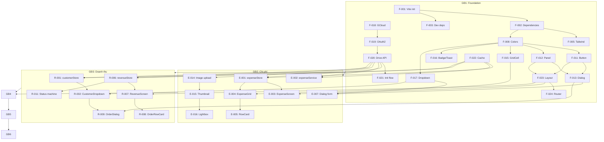

# Kế hoạch triển khai chi tiết — Quản Lý Tài Chính

> **Phiên bản**: 2.0 · **Ngày**: 2026-08-01 · **Trạng thái**: DRAFT (chờ review)
>
> Tài liệu này mở rộng từ `04-implementation-plan.md`, bổ sung breakdown chi tiết đến từng task, ước lượng giờ, output cụ thể.

---

## 1. Tổng quan

| Giai đoạn | Số task | Ngày | Giờ ước tính |
|:---|:---|:---|:---|
| GĐ1 — Foundation | 14 | 8 | 64h |
| GĐ2 — Quản lý Chi phí | 13 | 8 | 64h |
| GĐ3 — Quản lý Doanh thu | 11 | 7 | 56h |
| GĐ4 — Báo cáo | 10 | 8 | 64h |
| GĐ5 — AI Integration | 11 | 8 | 64h |
| GĐ6 — Testing & Deploy | 10 | 4 | 32h |
| **Tổng** | **69 tasks** | **43 ngày** | **344h** |

---

## 2. Giai đoạn 1: Foundation (8 ngày — 64h)

### 2.1 Khởi tạo dự án (3 ngày — 24h)

| ID | Task | Mô tả chi tiết | Output | Giờ | Depends |
|:---|:---|:---|:---|:---|:---|
| F-001 | Tạo Vite project | `npm create vite@latest quan-ly-thu-chi -- --template react-ts` | `package.json`, `vite.config.ts` | 1h | — |
| F-002 | Cài dependencies | React, Zustand, React Router, Tailwind, Recharts, Lucide, date-fns, zod, idb, @tanstack/react-virtual | `package.json` updated | 2h | F-001 |
| F-003 | Cài dev dependencies | ESLint, Prettier, Vitest, @testing-library/react, vite-plugin-pwa | `package.json` updated | 1h | F-001 |
| F-004 | ESLint + Prettier config | Flat config ESLint 9, Prettier rules `.prettierrc` | `eslint.config.js`, `.prettierrc` | 2h | F-003 |
| F-005 | Tailwind config | Extend colors, spacing, fonts từ Design Tokens | `tailwind.config.ts` | 1h | F-002 |
| F-006 | TypeScript strict mode | `tsconfig.json`: `strict: true`, path aliases | `tsconfig.json` | 1h | F-001 |
| F-007 | Folder structure | Tạo toàn bộ cây thư mục `src/ui/`, `src/store/`, `src/services/`, `src/models/`, `src/utils/` | Thư mục rỗng | 1h | F-001 |

### 2.2 Design System (3 ngày — 24h)

| ID | Task | Mô tả chi tiết | Output | Giờ | Depends |
|:---|:---|:---|:---|:---|:---|
| F-008 | Color tokens | Port `FeColors` + `FeSemanticColors` → CSS variables + TS constants | `src/ui/theme/colors.ts` + `index.css` | 2h | F-005 |
| F-009 | Spacing & Dimens tokens | Port `FeSpacing` + `FeDimens` | `src/ui/theme/spacing.ts` | 1h | F-005 |
| F-010 | Typography tokens | Port `FeTypography` | `src/ui/theme/typography.ts` | 1h | F-005 |
| F-011 | Button component | Variants: Run, Danger, Neutral, Accent. Icons, busy state | `src/ui/components/Button.tsx` | 3h | F-008 |
| F-012 | Panel component | Solid + Translucent styles, title, icon, titleTrailing | `src/ui/components/Panel.tsx` | 2h | F-008 |
| F-013 | Dialog component | Modal, ConfirmDialog, AlertDialog, FormDialog shell | `src/ui/components/Dialog.tsx` | 4h | F-011, F-012 |
| F-014 | Toolbar + ActionBar | Fluid start, pinned end. Bulk actions + primary CTA | `src/ui/components/Toolbar.tsx`, `ActionBar.tsx` | 3h | F-011 |
| F-015 | GridCell component | Read + edit modes, keyboard handling | `src/ui/components/GridCell.tsx` | 3h | F-008 |
| F-016 | Badge + Toast + StatusBar | Badge (4 variants), Toast (auto-dismiss), StatusBar | `src/ui/components/Badge.tsx`, `Toast.tsx`, `StatusBar.tsx` | 3h | F-008 |
| F-017 | Dropdown + DatePicker | Searchable dropdown, native date picker wrapper | `src/ui/components/Dropdown.tsx`, `DatePicker.tsx` | 2h | F-008 |

### 2.3 Google Drive OAuth + Storage (2 ngày — 16h)

| ID | Task | Mô tả chi tiết | Output | Giờ | Depends |
|:---|:---|:---|:---|:---|:---|
| F-018 | Google Cloud Console setup | Tạo project, enable Drive API, OAuth2 consent screen, credentials | Console config + `.env` | 2h | — |
| F-019 | OAuth2 flow | Google Identity Services: popup auth, token storage, refresh | `src/services/googleDrive.ts` (phần auth) | 4h | F-018 |
| F-020 | Drive API wrapper | `readJSON`, `writeJSON`, `uploadFile`, `ensureFolder` | `src/services/googleDrive.ts` (phần API) | 4h | F-019 |
| F-021 | Init flow | Startup: check auth → ensure folder → ensure files → load data | `src/services/googleDrive.ts` (phần init) | 2h | F-020 |
| F-022 | IndexedDB cache | `CacheManager` class: `get`, `set`, `getOrFetch` with cache-first | `src/services/cacheManager.ts` | 4h | — |

### 2.4 Layout + Navigation (1 ngày — 8h, song song với 2.3)

| ID | Task | Mô tả chi tiết | Output | Giờ | Depends |
|:---|:---|:---|:---|:---|:---|
| F-023 | Layout shell | Header + Sidebar + Content + StatusBar | `src/ui/Layout.tsx` | 4h | F-011, F-012 |
| F-024 | Router config | 5 routes: `/expense`, `/revenue`, `/report`, `/ai`, `/settings` | `src/App.tsx` | 2h | F-023 |
| F-025 | authStore + uiStore | Zustand stores for auth state, UI state (sidebar, dialogs, toasts) | `src/store/authStore.ts`, `uiStore.ts` | 2h | F-024 |

---

## 3. Giai đoạn 2: Quản lý Chi phí (8 ngày — 64h)

### 3.1 Expense Grid (3 ngày — 24h)

| ID | Task | Mô tả chi tiết | Output | Giờ | Depends |
|:---|:---|:---|:---|:---|:---|
| E-001 | expenseStore | Zustand store: records, filters, selection, computed selectors | `src/store/expenseStore.ts` | 4h | F-021, F-022 |
| E-002 | expenseService | CRUD via Drive + Cache: `getAll`, `create`, `update`, `delete` | `src/services/expenseService.ts` | 4h | F-020, F-022 |
| E-003 | ExpenseScreen shell | Layout: Toolbar + Grid + ActionBar | `src/ui/screens/expense/ExpenseScreen.tsx` | 2h | F-023, E-001 |
| E-004 | ExpenseGrid (virtualized) | Virtualized table with TanStack Virtual, columns config | `src/ui/screens/expense/ExpenseGrid.tsx` | 6h | E-001, F-015 |
| E-005 | ExpenseRowCard | Expandable row: summary line + detail panel | `src/ui/screens/expense/ExpenseRowCard.tsx` | 4h | E-004 |
| E-006 | Filter toolbar | Search (debounced), date range, category dropdown, status filter | `ExpenseScreen.tsx` (toolbar) | 4h | E-003 |

### 3.2 Expense CRUD (3 ngày — 24h)

| ID | Task | Mô tả chi tiết | Output | Giờ | Depends |
|:---|:---|:---|:---|:---|:---|
| E-007 | ExpenseDialog form | Full form: date, category, amount (currency input), description, payment, supplier, notes, tags | `src/ui/screens/expense/ExpenseDialog.tsx` | 6h | F-013, F-017 |
| E-008 | Currency input | Format VND khi gõ: "250000" → "250.000", parse ngược | `src/utils/currency.ts` + Input component | 3h | E-007 |
| E-009 | Zod validation | `expenseSchema`: validate all fields, error messages tiếng Việt | `src/services/expenseService.ts` (schema) | 2h | E-007 |
| E-010 | Tags input | Inline tag add/remove, autocomplete từ tags đã dùng | `ExpenseDialog.tsx` (tags section) | 3h | E-007 |
| E-011 | Status flow | Badge color update, dropdown change, validation | `ExpenseRowCard.tsx` | 2h | E-005 |
| E-012 | Delete flow | ConfirmDialog → batch delete → Drive sync → grid update | `ExpenseScreen.tsx` | 2h | E-002, E-004 |
| E-013 | Empty state + Error state | Minh họa khi 0 records, error banner khi sync fail | `ExpenseScreen.tsx` | 2h | E-003 |

### 3.3 Invoice Image (2 ngày — 16h)

| ID | Task | Mô tả chi tiết | Output | Giờ | Depends |
|:---|:---|:---|:---|:---|:---|
| E-014 | Image upload | File input → compress → upload Drive → get fileId | `src/utils/image.ts` + upload flow | 4h | F-020 |
| E-015 | Thumbnail preview | Hiển thị thumbnail 40x40px trong row, lazy load | `ExpenseRowCard.tsx` | 3h | E-014 |
| E-016 | ImagePreview lightbox | Zoom, xoay, tải xuống ảnh gốc | `src/ui/components/ImagePreview.tsx` | 5h | E-015 |
| E-017 | Drag & drop upload | Kéo thả file vào expense row để thêm hóa đơn | `ExpenseScreen.tsx` | 4h | E-014 |

---

## 4. Giai đoạn 3: Quản lý Doanh thu (7 ngày — 56h)

### 4.1 Customer Management (2 ngày — 16h)

| ID | Task | Mô tả chi tiết | Output | Giờ | Depends |
|:---|:---|:---|:---|:---|:---|
| R-001 | customerStore + Service | Zustand store + CRUD service via Drive | `src/store/customerStore.ts`, `services/customerService.ts` | 3h | F-020, F-022 |
| R-002 | CustomerDropdown | Searchable dropdown: gõ tên/SĐT → filter gợi ý | `src/ui/components/Dropdown.tsx` (nâng cấp) | 4h | F-017, R-001 |
| R-003 | Quick add customer | Inline form trong dropdown: tên + SĐT → tạo ngay | `Dropdown.tsx` (quick add) | 3h | R-002 |
| R-004 | Customer detail view | Popover/bottom sheet: thông tin KH + lịch sử đơn hàng | `CustomerDropdown.tsx` | 3h | R-001 |
| R-005 | Customer CRUD dialog | Form sửa KH (từ Settings hoặc từ dropdown) | Dialog component | 3h | R-001 |

### 4.2 Revenue Grid + Order CRUD (3 ngày — 24h)

| ID | Task | Mô tả chi tiết | Output | Giờ | Depends |
|:---|:---|:---|:---|:---|:---|
| R-006 | revenueStore + Service | Zustand store + CRUD service, auto-generate orderCode | `src/store/revenueStore.ts`, `services/revenueService.ts` | 4h | F-020, F-022 |
| R-007 | RevenueScreen + Grid | Layout + virtualized grid: Mã ĐH, Ngày, KH, Tiền, Trạng thái | `src/ui/screens/revenue/RevenueScreen.tsx`, `RevenueGrid.tsx` | 4h | F-023, R-006 |
| R-008 | OrderRowCard | Expandable row: items list, customer info, status badges | `src/ui/screens/revenue/OrderRowCard.tsx` | 4h | R-007 |
| R-009 | OrderDialog | Form: date, customer search, items sub-table, totals | `src/ui/screens/revenue/OrderDialog.tsx` | 8h | F-013, R-002 |
| R-010 | Items sub-table | Inline add/edit/delete items, auto-calculate totals | `OrderDialog.tsx` (items section) | 4h | R-009 |

### 4.3 Status Flow (2 ngày — 16h)

| ID | Task | Mô tả chi tiết | Output | Giờ | Depends |
|:---|:---|:---|:---|:---|:---|
| R-011 | Order status machine | State transitions, validation, badge colors | `src/services/revenueService.ts` (status logic) | 4h | R-006 |
| R-012 | Delivery status | Separate from order status, badge + update dropdown | `OrderRowCard.tsx` | 3h | R-008, R-011 |
| R-013 | Status quick actions | Buttons: "Xác nhận" → "Đang xử lý" → "Hoàn thành" (1 click) | `OrderRowCard.tsx` | 3h | R-011 |
| R-014 | Revenue filters | Filter by status, date range, customer, search | `RevenueScreen.tsx` | 3h | R-007 |
| R-015 | Revenue empty/error states | Hướng dẫn tạo đơn đầu tiên, error handling | `RevenueScreen.tsx` | 3h | R-007 |

---

## 5. Giai đoạn 4: Báo cáo (8 ngày — 64h)

### 5.1 Expense Report (3 ngày — 24h)

| ID | Task | Mô tả chi tiết | Output | Giờ | Depends |
|:---|:---|:---|:---|:---|:---|
| B-001 | reportStore + Service | Aggregate functions: byCategory, byMonth, summary | `src/store/reportStore.ts`, `services/reportService.ts` | 4h | E-002 |
| B-002 | ReportScreen shell | SegmentedControl (Expense/Revenue/Profit) + DateRangeFilter | `src/ui/screens/report/ReportScreen.tsx` | 3h | F-023, B-001 |
| B-003 | Expense summary cards | 4 cards: Tổng chi, Số GD, TB/ngày, Lớn nhất | `ExpenseReport.tsx` | 2h | B-001, B-002 |
| B-004 | Pie chart — by category | Recharts PieChart, legend, tooltip | `ExpenseReport.tsx` | 4h | B-001 |
| B-005 | Bar chart — by month | Recharts BarChart, 12 tháng, VND format | `ExpenseReport.tsx` | 4h | B-001 |
| B-006 | Detail table | Sortable table: Danh mục, Số lượng, Tổng tiền, Tỉ trọng | `ExpenseReport.tsx` | 3h | B-001 |
| B-007 | Chart interactivity | Click pie slice → filter detail table, hover tooltip | All charts | 4h | B-004, B-005 |

### 5.2 Revenue Report (3 ngày — 24h)

| ID | Task | Mô tả chi tiết | Output | Giờ | Depends |
|:---|:---|:---|:---|:---|:---|
| B-008 | Revenue summary cards | Tổng DT, Số đơn, TB/đơn | `RevenueReport.tsx` | 2h | R-006, B-002 |
| B-009 | Bar chart — by month | Doanh thu theo tháng, format VND | `RevenueReport.tsx` | 4h | R-006 |
| B-010 | Top 5 products | Horizontal bar chart + bảng | `RevenueReport.tsx` | 4h | R-006 |
| B-011 | Top 5 customers | Bảng: Tên KH, Số đơn, Tổng tiền | `RevenueReport.tsx` | 3h | R-006 |
| B-012 | Order status pie | Pie chart: completed, cancelled, processing... | `RevenueReport.tsx` | 4h | R-006 |
| B-013 | Date range filter | Từ ngày → Đến ngày, presets: Tháng này, Quý này, Năm nay | `ReportScreen.tsx` | 3h | B-002 |
| B-014 | Revenue detail table | Sortable full list | `RevenueReport.tsx` | 4h | R-006 |

### 5.3 Profit Report (2 ngày — 16h)

| ID | Task | Mô tả chi tiết | Output | Giờ | Depends |
|:---|:---|:---|:---|:---|:---|
| B-015 | P&L computation | revenue - expense = profit, margin % | `reportService.ts` (profit) | 3h | B-001 |
| B-016 | P&L summary cards | 3 cards: Doanh thu, Chi phí, Lợi nhuận | `ProfitReport.tsx` | 2h | B-015, B-002 |
| B-017 | Dual-axis chart | Bar (revenue + expense) + Line (profit), 12 months | `ProfitReport.tsx` | 5h | B-015 |
| B-018 | P&L detail table | Monthly breakdown: DT, CP, LN, Margin % | `ProfitReport.tsx` | 3h | B-015 |
| B-019 | Export PDF/CSV | `window.print()` + CSS print, CSV download | Report screens | 3h | B-018 |

---

## 6. Giai đoạn 5: AI Integration (8 ngày — 64h)

### 6.1 AI Chat Panel (2 ngày — 16h)

| ID | Task | Mô tả chi tiết | Output | Giờ | Depends |
|:---|:---|:---|:---|:---|:---|
| A-001 | aiService — Gemini client | Khởi tạo Gemini, `chat` stream, `vision`, API key config | `src/services/aiService.ts` | 4h | — |
| A-002 | Prompt templates | System prompt, OCR, analysis, forecast prompts | `src/services/prompts.ts` | 2h | A-001 |
| A-003 | Settings — AI Config | Nhập API key, test connection, status indicator | `src/ui/screens/settings/SettingsScreen.tsx` (AI tab) | 3h | A-001 |
| A-004 | ChatPanel UI | Message list (Markdown render), input, file upload, streaming | `src/ui/screens/ai/ChatPanel.tsx` | 5h | A-001 |
| A-005 | Dockable panel | Toggle right sidebar, responsive (full screen on mobile) | `Layout.tsx` + ChatPanel | 2h | F-023, A-004 |

### 6.2 AI Analysis (3 ngày — 24h)

| ID | Task | Mô tả chi tiết | Output | Giờ | Depends |
|:---|:---|:---|:---|:---|:---|
| A-006 | Context injection | Tự động detect intent → lấy data liên quan → build context | `aiService.ts` (context builder) | 5h | A-001, E-001, R-006 |
| A-007 | Intent detection | Regex + keyword: "chi phí", "doanh thu", "lợi nhuận", "dự báo"... | `aiService.ts` (intent) | 3h | A-006 |
| A-008 | Analysis formatting | Parse AI response → extract chart data, format bảng | `ChatPanel.tsx` (renderer) | 5h | A-004 |
| A-009 | Quick actions | Buttons gợi ý: "Phân tích chi phí tháng này", "Dự báo doanh thu"... | `ChatPanel.tsx` | 3h | A-004 |
| A-010 | Follow-up context | Giữ context hội thoại, cho phép hỏi follow-up | `aiService.ts` (chat history) | 4h | A-001 |
| A-011 | Error handling | Timeout, rate limit, API key invalid, offline | `ChatPanel.tsx` | 4h | A-004 |

### 6.3 AI OCR Data Entry (3 ngày — 24h)

| ID | Task | Mô tả chi tiết | Output | Giờ | Depends |
|:---|:---|:---|:---|:---|:---|
| A-012 | OCR pipeline | Image → compress → base64 → Gemini Vision → parse JSON | `aiService.ts` (OCR) | 5h | A-001, A-002 |
| A-013 | DataEntryHelper UI | Hiển thị kết quả OCR: field đã trích xuất, confidence, nút sửa | `src/ui/screens/ai/DataEntryHelper.tsx` | 5h | A-012 |
| A-014 | Auto-fill expense form | "➕ Thêm vào chi phí" → mở ExpenseDialog đã điền sẵn | `DataEntryHelper.tsx` | 3h | A-013, E-007 |
| A-015 | OCR quality indicator | Đánh dấu field confidence cao/thấp, highlight field cần kiểm tra | `DataEntryHelper.tsx` | 4h | A-013 |
| A-016 | Text-to-order parsing | "Bàn phím K3 x2 giá 2.5tr, chuột MX 1 cái 2.8tr" → items | `aiService.ts` (text parse) | 4h | A-001 |
| A-017 | Multi-image OCR | Upload nhiều ảnh 1 lúc, OCR từng ảnh | `ChatPanel.tsx` | 3h | A-012 |

---

## 7. Giai đoạn 6: Testing, Polish & Deploy (4 ngày — 32h)

### 7.1 Testing (2 ngày — 16h)

| ID | Task | Mô tả chi tiết | Output | Giờ | Depends |
|:---|:---|:---|:---|:---|:---|
| T-001 | Unit tests — stores | Test Zustand actions, selectors, state transitions | `*.test.ts` | 4h | All stores |
| T-002 | Unit tests — services | Test validation, data transformation, Drive mock | `*.test.ts` | 4h | All services |
| T-003 | Component tests | Dialog open/close, form validation, GridCell edit | `*.test.tsx` | 4h | All components |
| T-004 | Integration test — Drive sync | Full flow: tạo expense → verify in Drive → load lại | `*.test.ts` | 2h | E-002 |
| T-005 | Integration test — AI | Mock Gemini → test OCR + analysis flow | `*.test.ts` | 2h | A-001 |

### 7.2 Polish (1 ngày — 8h)

| ID | Task | Mô tả chi tiết | Output | Giờ | Depends |
|:---|:---|:---|:---|:---|:---|
| T-006 | Edge cases | Empty states, error states, network offline, quota exceeded | All screens | 3h | All |
| T-007 | Loading states | Skeleton loaders, spinner, progress bar | All screens | 2h | All |
| T-008 | Keyboard shortcuts | Enter=save, Escape=close, Ctrl+F=search, Ctrl+N=new | Global hooks | 2h | All |
| T-009 | Responsive polish | Tablet optimization, mobile sidebar, touch targets | Layout + screens | 2h | All |

### 7.3 Deploy & Portable Packaging (1 ngày — 8h)

| ID | Task | Mô tả chi tiết | Output | Giờ | Depends |
|:---|:---|:---|:---|:---|:---|
| T-010 | PWA config | `vite-plugin-pwa`: manifest, service worker, offline fallback | `manifest.json`, SW | 2h | All |
| T-011 | Electron wrapper | `main.ts`, `preload.ts`, window config, icon | `electron/` folder | 2h | All |
| T-012 | Electron builder config | `electron-builder.yml`: portable targets (Win/Mac/Linux) | Config file | 1h | T-011 |
| T-013 | Build + Package | `npm run build:portable` → ZIP artifacts | `release/` folder | 2h | T-010, T-012 |
| T-014 | Vercel deploy | Git push → auto deploy PWA version | Production URL | 1h | T-010 |

---

## 8. Dependency Map (Chi tiết)

---

## 9. Danh sách Deliverables

| File | Mô tả |
|:---|:---|
| `package.json` | Dependencies & scripts |
| `src/ui/theme/*` | Design tokens (colors, spacing, typography) |
| `src/ui/components/*` | 12 shared components |
| `src/ui/screens/expense/*` | Expense module (4 files) |
| `src/ui/screens/revenue/*` | Revenue module (4 files) |
| `src/ui/screens/report/*` | Report module (4 files) |
| `src/ui/screens/ai/*` | AI Chat module (3 files) |
| `src/ui/screens/settings/*` | Settings module (2 files) |
| `src/ui/Layout.tsx` | App shell |
| `src/store/*` | 6 Zustand stores |
| `src/services/*` | 6 services |
| `src/models/*` | 4 type definition files |
| `src/utils/*` | 4 utility files |
| `electron/*` | Electron wrapper (3 files) |
| `src/*.test.*` | Test files |
| `release/*` | Portable packages |
