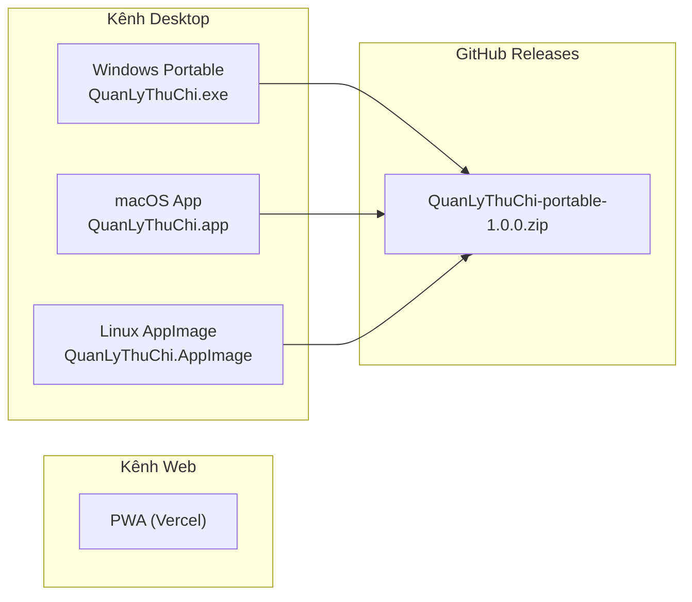
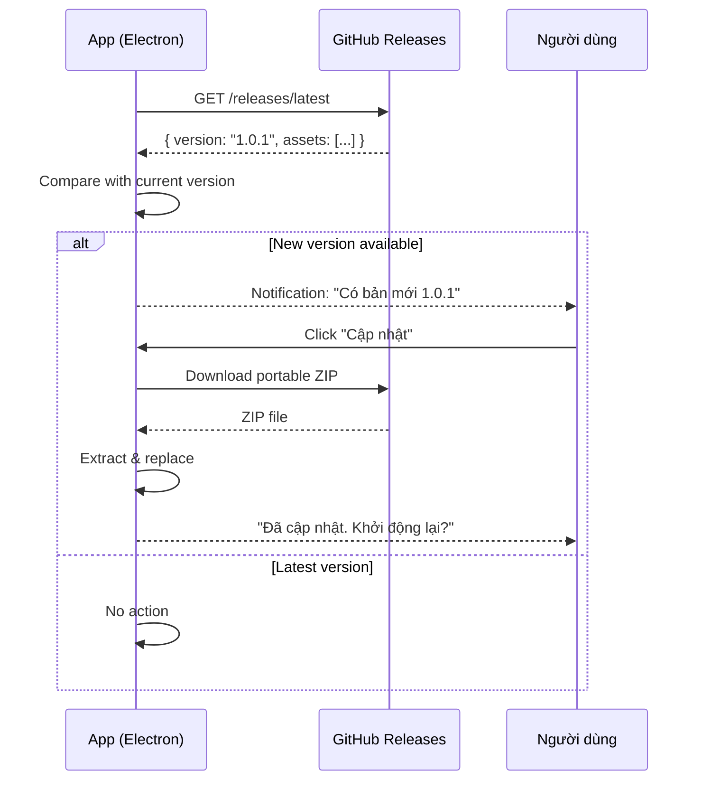
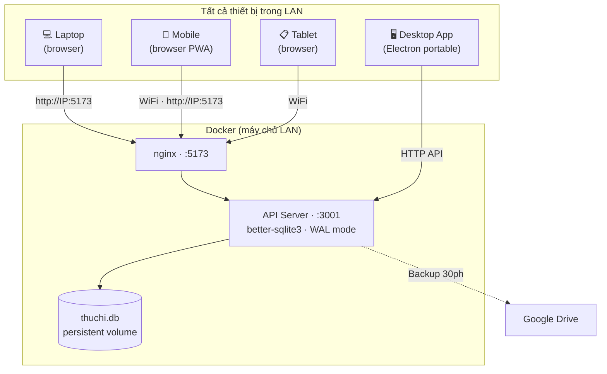
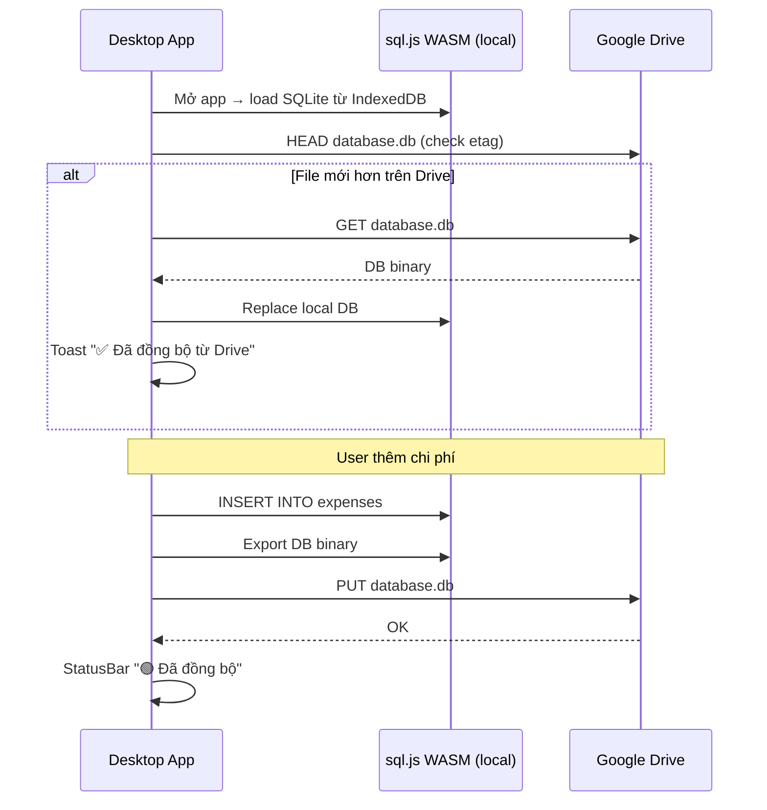
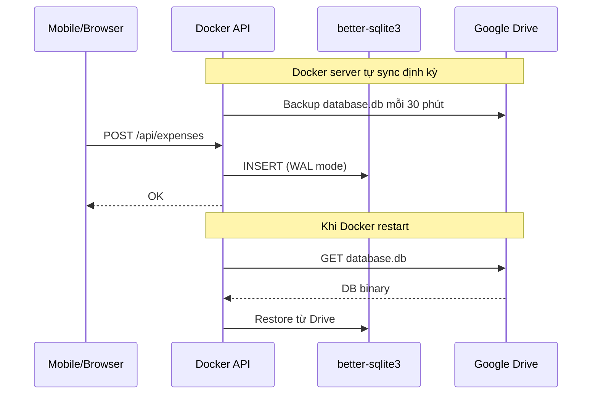

# Hướng dẫn Portable Packaging — Quản Lý Tài Chính

> **Phiên bản**: 1.0 · **Ngày**: 2026-08-01 · **Trạng thái**: DRAFT (chờ review)
>
> Tham khảo pattern portable packaging của **fe-simulator**: giải nén là chạy, không cần cài đặt, bundle JRE/Chromium embedded

---

## 1. Chiến lược Portable Packaging

### 1.1 So sánh với fe-simulator

| Khía cạnh | fe-simulator (Kotlin) | Quản Lý Tài Chính (Web) |
|:---|:---|:---|
| **Runtime** | JRE 21+ embedded | Chromium embedded (Electron) |
| **Build tool** | Gradle + JPackage | Electron Builder |
| **Package format** | Portable ZIP (.exe + JRE) | Portable ZIP (.exe + Chromium) |
| **Kích thước** | ~80MB (JRE nén) | ~120MB (Chromium nén) |
| **Auto-update** | Manual download | `electron-updater` từ GitHub Releases |
| **Windows** | ✅ | ✅ |
| **macOS** | ❌ (chỉ dev) | ✅ (.app bundle) |
| **Linux** | ❌ | ✅ (AppImage) |

### 1.2 Hai kênh phân phối



---

## 2. Cấu trúc Electron App

### 2.1 Thư mục Electron

```
quan-ly-thu-chi/
├── electron/
│   ├── main.ts                # Electron main process
│   ├── preload.ts             # Context bridge (safe IPC)
│   └── icon.ico / icon.icns   # App icons (các kích thước)
├── src/                       # React app (renderer process)
│   └── ... (toàn bộ React code)
├── package.json
├── electron-builder.yml        # Build config
├── vite.config.ts              # Vite + electron-vite plugin
└── tsconfig.json
```

### 2.2 Main Process (`electron/main.ts`)

```typescript
import { app, BrowserWindow, shell } from 'electron';
import path from 'path';

let mainWindow: BrowserWindow | null = null;

function createWindow() {
  mainWindow = new BrowserWindow({
    width: 1280,
    height: 800,
    minWidth: 900,
    minHeight: 600,
    title: 'Quản Lý Tài Chính',
    icon: path.join(__dirname, '../electron/icon.ico'),
    webPreferences: {
      preload: path.join(__dirname, 'preload.js'),
      contextIsolation: true,
      nodeIntegration: false,
    },
    // Không có frame riêng (dùng HTML/CSS title bar)
    // frame: false,
  });

  // Production: load built files
  if (process.env.NODE_ENV === 'production') {
    mainWindow.loadFile(path.join(__dirname, '../dist/index.html'));
  } else {
    // Development: load Vite dev server
    mainWindow.loadURL('http://localhost:5173');
    mainWindow.webContents.openDevTools();
  }

  // Mở external links trong browser (Google OAuth2)
  mainWindow.webContents.setWindowOpenHandler(({ url }) => {
    shell.openExternal(url);
    return { action: 'deny' };
  });

  mainWindow.on('closed', () => {
    mainWindow = null;
  });
}

app.whenReady().then(createWindow);

app.on('window-all-closed', () => {
  if (process.platform !== 'darwin') {
    app.quit();
  }
});

app.on('activate', () => {
  if (BrowserWindow.getAllWindows().length === 0) {
    createWindow();
  }
});
```

### 2.3 Preload Script (`electron/preload.ts`)

```typescript
import { contextBridge, ipcRenderer } from 'electron';

contextBridge.exposeInMainWorld('electronAPI', {
  // App info
  getVersion: () => ipcRenderer.invoke('get-version'),

  // File system (limited)
  showSaveDialog: (options: any) => ipcRenderer.invoke('show-save-dialog', options),
  writeFile: (path: string, data: string) => ipcRenderer.invoke('write-file', path, data),

  // Window control
  minimizeWindow: () => ipcRenderer.send('minimize-window'),
  maximizeWindow: () => ipcRenderer.send('maximize-window'),
  closeWindow: () => ipcRenderer.send('close-window'),

  // Auto updater
  checkForUpdates: () => ipcRenderer.invoke('check-for-updates'),
  onUpdateAvailable: (callback: (info: any) => void) => {
    ipcRenderer.on('update-available', (_event, info) => callback(info));
  },
});
```

---

## 3. Build Configuration

### 3.1 `package.json` Scripts

```json
{
  "name": "quan-ly-thu-chi",
  "version": "1.0.0",
  "description": "Ứng dụng quản lý thu chi cá nhân - Portable",
  "author": "ETC",
  "license": "MIT",
  "main": "electron/main.js",
  "scripts": {
    "dev": "vite",
    "dev:electron": "concurrently \"vite\" \"wait-on http://localhost:5173 && electron .\"",
    "build": "tsc && vite build",
    "build:electron": "npm run build && electron-builder",
    "build:portable": "npm run build && electron-builder --win portable --mac --linux",
    "test": "vitest run",
    "lint": "eslint src/ --ext .ts,.tsx",
    "preview": "vite preview"
  }
}
```

### 3.2 `electron-builder.yml`

```yaml
appId: com.etc.quanlythuchi
productName: "Quản Lý Tài Chính"
copyright: "Copyright © 2026 ETC"

directories:
  output: release
  buildResources: electron

files:
  - dist/**/*
  - electron/**/*
  - package.json

# ===== WINDOWS =====
win:
  target:
    - target: portable
      arch:
        - x64
  icon: electron/icon.ico
  artifactName: "${name}-${version}-win-x64.${ext}"

# ===== macOS =====
mac:
  target:
    - target: dmg
      arch:
        - x64
        - arm64
  icon: electron/icon.icns
  category: public.app-category.finance
  artifactName: "${name}-${version}-mac-${arch}.${ext}"

# ===== LINUX =====
linux:
  target:
    - target: AppImage
      arch:
        - x64
  icon: electron/icon.png
  category: Finance
  artifactName: "${name}-${version}-linux-x64.${ext}"

# ===== PORTABLE SPECIFIC =====
portable:
  artifactName: "${name}-portable-${version}.${ext}"
  # Portable app: không tạo shortcut, không registry
  requestExecutionLevel: user

# ===== AUTO UPDATE =====
publish:
  provider: github
  owner: manhquoc2013
  repo: quan-ly-thu-chi
  releaseType: release

# ===== NSIS (installer - optional, không dùng cho portable) =====
nsis:
  oneClick: false
  allowToChangeInstallationDirectory: true
  createDesktopShortcut: true
  createStartMenuShortcut: true
  shortcutName: "Quản Lý Tài Chính"
```

### 3.3 `vite.config.ts`

```typescript
import { defineConfig } from 'vite';
import react from '@vitejs/plugin-react';
import { VitePWA } from 'vite-plugin-pwa';
import path from 'path';

export default defineConfig(({ mode }) => ({
  plugins: [
    react(),
    VitePWA({
      registerType: 'autoUpdate',
      includeAssets: ['favicon.svg', 'icons/icon-192.png', 'icons/icon-512.png'],
      manifest: {
        name: 'Quản Lý Tài Chính',
        short_name: 'ThuChi',
        description: 'Ứng dụng quản lý thu chi cá nhân',
        theme_color: '#1565C0',
        background_color: '#EFF2F7',
        display: 'standalone',
        orientation: 'any',
        start_url: '/',
        icons: [
          { src: 'icons/icon-192.png', sizes: '192x192', type: 'image/png' },
          { src: 'icons/icon-512.png', sizes: '512x512', type: 'image/png' },
        ],
      },
      workbox: {
        globPatterns: ['**/*.{js,css,html,ico,png,svg,woff2}'],
        runtimeCaching: [
          {
            urlPattern: /^https:\/\/www\.googleapis\.com\/.*/i,
            handler: 'NetworkFirst',
            options: { cacheName: 'google-apis' },
          },
        ],
      },
    }),
  ],
  resolve: {
    alias: {
      '@': path.resolve(__dirname, 'src'),
    },
  },
  base: mode === 'electron' ? './' : '/',
  build: {
    outDir: 'dist',
    sourcemap: false,
    rollupOptions: {
      output: {
        manualChunks: {
          vendor: ['react', 'react-dom'],
          charts: ['recharts'],
          router: ['react-router-dom'],
        },
      },
    },
  },
}));
```

---

## 4. Portable Package Structure

### 4.1 Build Output

Sau khi chạy `npm run build:portable`, cấu trúc thư mục `release/`:

```
release/
├── QuanLyThuChi-1.0.0-win-x64.exe        # Windows portable (single .exe)
├── QuanLyThuChi-1.0.0-mac-arm64.dmg      # macOS Apple Silicon
├── QuanLyThuChi-1.0.0-mac-x64.dmg        # macOS Intel
├── QuanLyThuChi-1.0.0-linux-x64.AppImage  # Linux AppImage
└── latest.yml                              # Auto-update manifest
```

### 4.2 Portable ZIP (phân phối cho người dùng)

```
QuanLyThuChi-portable-1.0.0.zip
└── QuanLyThuChi-portable-1.0.0/
    ├── QuanLyThuChi.exe        # Windows: double-click để chạy
    ├── version.txt             # "1.0.0"
    ├── README.txt              # Hướng dẫn nhanh
    └── data/                   # (tạo tự động khi chạy lần đầu)
        └── (local cache)
```

### 4.3 README.txt (đi kèm portable ZIP)

```
══════════════════════════════════════════
  QUẢN LÝ THU CHI v1.0.0 — Portable
══════════════════════════════════════════

🎯 GIỚI THIỆU
  Ứng dụng quản lý thu chi cá nhân, tích hợp AI.
  Dữ liệu lưu trên Google Drive của bạn.
  Miễn phí trọn đời.

🚀 CÁCH CHẠY
  1. Giải nén file ZIP vào thư mục cố định
     Ví dụ: C:\QuanLyThuChi\
  2. Chạy QuanLyThuChi.exe
  3. Lần đầu: đăng nhập Google để kết nối Drive
  4. Cấu hình AI: vào Cài đặt → nhập Gemini API Key

⚠️ LƯU Ý
  - KHÔNG cần cài đặt Java, Node.js, hay bất kỳ gì khác
  - Dữ liệu lưu trên Google Drive của chính bạn
  - Nếu Windows SmartScreen chặn: More info → Run anyway
  - Ứng dụng tự động kiểm tra cập nhật từ GitHub

📋 YÊU CẦU HỆ THỐNG
  - Windows 10/11 (64-bit)
  - Tài khoản Google
  - Kết nối Internet (cho sync + AI)

🔗 LIÊN KẾT
  - GitHub: https://github.com/manhquoc2013/quan-ly-thu-chi
  - Hướng dẫn: https://github.com/manhquoc2013/quan-ly-thu-chi/wiki
  - Tạo Gemini API Key: https://aistudio.google.com/apikey

📞 HỖ TRỢ
  Tạo issue trên GitHub nếu gặp vấn đề.

══════════════════════════════════════════
```

---

## 5. Auto-Update Mechanism



### Cấu hình `electron-updater`:

```typescript
// electron/main.ts — thêm auto-updater
import { autoUpdater } from 'electron-updater';

autoUpdater.autoDownload = false; // Hỏi người dùng trước khi download
autoUpdater.autoInstallOnAppQuit = true;

app.whenReady().then(() => {
  createWindow();
  autoUpdater.checkForUpdatesAndNotify();
});

autoUpdater.on('update-available', (info) => {
  mainWindow?.webContents.send('update-available', info);
});

autoUpdater.on('download-progress', (progress) => {
  mainWindow?.webContents.send('download-progress', progress.percent);
});

autoUpdater.on('update-downloaded', () => {
  mainWindow?.webContents.send('update-downloaded');
});

// IPC handlers
ipcMain.handle('check-for-updates', () => autoUpdater.checkForUpdates());
ipcMain.handle('download-update', () => autoUpdater.downloadUpdate());
ipcMain.handle('quit-and-install', () => autoUpdater.quitAndInstall());
```

---

## 6. So sánh kích thước

| Thành phần | Kích thước (nén) | Kích thước (giải nén) |
|:---|:---|:---|
| Chromium (Electron) | ~60MB | ~150MB |
| React App (dist/) | ~500KB | ~2MB |
| WebLLM library (`@mlc-ai/web-llm`) | ~12MB | ~35MB |
| Node.js runtime (embedded) | ~15MB | ~40MB |
| Assets (icons, fonts) | ~1MB | ~2MB |
| **Tổng portable ZIP** | **~95MB** | **~230MB** |

> **Lưu ý quan trọng**: Model AI (Qwen 2.5 0.5B, 280MB) **KHÔNG bundle trong ZIP**. Model được tải riêng về IndexedDB khi người dùng mở app lần đầu. Điều này giữ portable ZIP gọn nhẹ (~95MB), gần với fe-simulator (80MB). Người dùng có thể chọn model khác (TinyLlama 1.1B, 350MB) trong Settings.

---

## 7. CI/CD Pipeline

```yaml
# .github/workflows/release.yml
name: Build & Release Portable

on:
  push:
    tags:
      - 'v*'

jobs:
  build:
    strategy:
      matrix:
        os: [windows-latest, macos-latest, ubuntu-latest]
    runs-on: ${{ matrix.os }}

    steps:
      - uses: actions/checkout@v4

      - uses: actions/setup-node@v4
        with:
          node-version: 22

      - run: npm ci
      - run: npm run build
      - run: npm run build:portable

      - name: Upload artifacts
        uses: actions/upload-artifact@v4
        with:
          name: release-${{ matrix.os }}
          path: release/*

  release:
    needs: build
    runs-on: ubuntu-latest
    steps:
      - uses: actions/download-artifact@v4

      - name: Create ZIP bundle
        run: |
          mkdir portable
          cp release-windows-latest/*.exe portable/
          echo "${{ github.ref_name }}" > portable/version.txt
          cp README-portable.txt portable/README.txt

      - name: GitHub Release
        uses: softprops/action-gh-release@v2
        with:
          files: |
            release-windows-latest/*
            release-macos-latest/*
            release-ubuntu-latest/*
            portable.zip
          generate_release_notes: true
```

---

## 9. LAN Access — Multi-device trong mạng nội bộ

### Phương án A: Serve static build (nhanh nhất)

```bash
# Build app ra static files
npm run build

# Serve bằng serve (hoặc npx serve, python http.server, nginx...)
npx serve dist/ --listen 5173

# Truy cập từ mọi thiết bị trong LAN
http://192.168.1.10:5173
```

| Ưu | Nhược |
|:---|:---|
| Đơn giản, 1 dòng lệnh | Mỗi máy sync Drive riêng → data không chung |
| Không cần backend | Cần mở firewall port 5173 |
| Mọi thiết bị có browser đều dùng được | Máy host phải luôn bật |

## 9. Multi-Device LAN — Docker + Desktop App + Mobile

### Kiến trúc: 1 Database, mọi thiết bị đọc/ghi



### Docker Compose

```yaml
# docker-compose.yml
services:
  app:
    build:
      context: .
      dockerfile: Dockerfile
    ports:
      - "5173:80"         # Web UI — mobile + browser truy cập
    depends_on:
      - api

  api:
    build:
      context: .
      dockerfile: Dockerfile.api
    ports:
      - "3001:3001"       # REST API — desktop app gọi trực tiếp
    volumes:
      - thuchi_data:/app/data
    environment:
      - DB_PATH=/app/data/thuchi.db

volumes:
  thuchi_data:
```

### Desktop App (Electron) kết nối Docker API

```typescript
// electron/main.ts — Desktop app trỏ về Docker API
const API_BASE = 'http://192.168.1.10:3001'; // IP máy chủ Docker

// Không cần SQLite local — gọi API server
async function getExpenses() {
  const res = await fetch(`${API_BASE}/api/expenses`);
  return res.json();
}

async function addExpense(data: ExpenseDTO) {
  const res = await fetch(`${API_BASE}/api/expenses`, {
    method: 'POST',
    headers: { 'Content-Type': 'application/json' },
    body: JSON.stringify(data),
  });
  return res.json();
}
```

### Cách dùng

```bash
# 1. Deploy Docker trên máy chủ LAN
docker compose up -d

# 2. Mọi thiết bị truy cập
http://192.168.1.10:5173    # Web UI (mobile, laptop, tablet)

# 3. Desktop app (Electron portable)
#     Tải về → giải nén → chạy → tự động kết nối API server
```

### Tổng kết

| Thiết bị | Cách truy cập | Ghi dữ liệu? | 
|:---|:---|:---:|
| **Mobile / Tablet** | Browser → `http://IP:5173` (PWA) | ✅ |
| **Laptop (bất kỳ)** | Browser → `http://IP:5173` | ✅ |
| **Desktop App** | Electron portable → gọi API `:3001` | ✅ |
| **Tất cả** | **Chung 1 SQLite DB — thấy data ngay lập tức** | ✅ |

| Đặc điểm | Chi tiết |
|:---|:---|
| **Docker image** | 2 containers: nginx (~15MB) + Node API (~50MB) |
| **Database** | SQLite WAL mode — multi-reader + queued writer |
| **Mobile** | PWA, cài được ra màn hình chính |
| **Desktop** | Electron portable ~95MB, giải nén là chạy |
| **Offline LAN** | ✅ Không cần internet |
| **Backup** | SQLite sync lên Google Drive mỗi 30 phút |

---

## 10. Google Drive Sync — 2 chế độ

Google Drive là **storage chính**, không chỉ là backup. App hoạt động ở 2 chế độ:

### Chế độ 1: Standalone (1 máy, không Docker)



### Chế độ 2: Docker LAN (nhiều máy)



### Code sync service (dùng chung)

```typescript
// server/sync-service.ts — Chạy trong Docker HOẶC Electron
import { drive_v3, google } from 'googleapis';
import Database from 'better-sqlite3'; // Docker
// import initSqlJs from 'sql.js';      // Electron standalone

class DriveSyncService {
  private drive: drive_v3.Drive;
  private db: any; // better-sqlite3 hoặc sql.js
  private syncInterval: NodeJS.Timeout | null = null;

  constructor(private mode: 'docker' | 'standalone') {}

  async initialize(): Promise<void> {
    // OAuth2 — mỗi chế độ có cách auth riêng
    if (this.mode === 'docker') {
      // Docker: service account hoặc OAuth2 refresh token từ biến môi trường
      const auth = new google.auth.OAuth2(
        process.env.GOOGLE_CLIENT_ID,
        process.env.GOOGLE_CLIENT_SECRET
      );
      auth.setCredentials({ refresh_token: process.env.GOOGLE_REFRESH_TOKEN });
      this.drive = google.drive({ version: 'v3', auth });
    } else {
      // Standalone: OAuth2 popup trong Electron
      this.drive = await this.authenticateElectron();
    }
  }

  /** Upload database.db lên Drive */
  async upload(): Promise<void> {
    const dbBinary = this.exportDatabase(); // sql.js: db.export() / better-sqlite3: fs.readFileSync()

    const folderId = await this.ensureFolder('QuanLyThuChi');
    const fileId = await this.findFile(folderId, 'database.db');

    await this.drive.files.update({
      fileId,
      media: { body: dbBinary, mimeType: 'application/octet-stream' },
    });
  }

  /** Download database.db từ Drive */
  async download(): Promise<Uint8Array | null> {
    const folderId = await this.ensureFolder('QuanLyThuChi');
    const fileId = await this.findFile(folderId, 'database.db');
    if (!fileId) return null;

    const res = await this.drive.files.get(
      { fileId, alt: 'media' },
      { responseType: 'arraybuffer' }
    );
    return new Uint8Array(res.data as ArrayBuffer);
  }

  /** Tự động sync mỗi 30 phút */
  startAutoSync(): void {
    // Sync ngay khi start
    this.syncFromDrive();

    this.syncInterval = setInterval(() => {
      this.syncFromDrive();
      this.upload(); // Backup lên Drive
    }, 30 * 60 * 1000);
  }

  private async syncFromDrive(): Promise<void> {
    try {
      const remoteDB = await this.download();
      if (!remoteDB) return; // Chưa có file trên Drive

      // Trong Docker: replace DB file
      // Trong Standalone: merge hoặc replace tùy timestamp
      if (this.mode === 'docker') {
        // Docker là source of truth → chỉ upload, không download
        return;
      } else {
        this.importDatabase(remoteDB);
      }
    } catch (e) {
      console.error('Sync failed:', e);
    }
  }
}
```

### Khi nào sync?

| Sự kiện | Standalone | Docker LAN |
|:---|:---|:---|
| **Mở app** | Download từ Drive (nếu mới hơn cache) | — |
| **Sau CRUD** | Upload lên Drive ngay | Ghi SQLite local ngay |
| **Định kỳ** | Upload mỗi 5 phút | Upload backup lên Drive mỗi 30 phút |
| **Docker restart** | — | Download từ Drive để khôi phục |
| **Mất mạng** | Queue, sync khi có mạng lại | LAN vẫn hoạt động |

### Google Drive OAuth — 2 cách

| | Standalone (Electron) | Docker |
|:---|:---|:---|
| **Auth method** | OAuth2 popup browser | Service account hoặc refresh token |
| **Scope** | `drive.file` (chỉ file app tạo) | `drive.file` |
| **Token storage** | IndexedDB (encrypted) | Biến môi trường |
| **User interaction** | 1 lần khi setup | 0 (tự động) |

- [ ] Build thành công trên Windows, macOS, Linux
- [ ] Portable ZIP giải nén chạy được (không cần cài đặt)
- [ ] Google OAuth2 hoạt động trong Electron window
- [ ] Drive sync hoạt động
- [ ] AI chat hoạt động
- [ ] PWA deploy lên Vercel thành công
- [ ] PWA cài được trên desktop + mobile
- [ ] Auto-update kiểm tra đúng URL GitHub Releases
- [ ] `version.txt` khớp với `package.json`
- [ ] README.txt có trong ZIP
- [ ] Windows SmartScreen: đã test "Run anyway"
- [ ] Kích thước ZIP ≤ 200MB
- [ ] Changelog đã cập nhật
