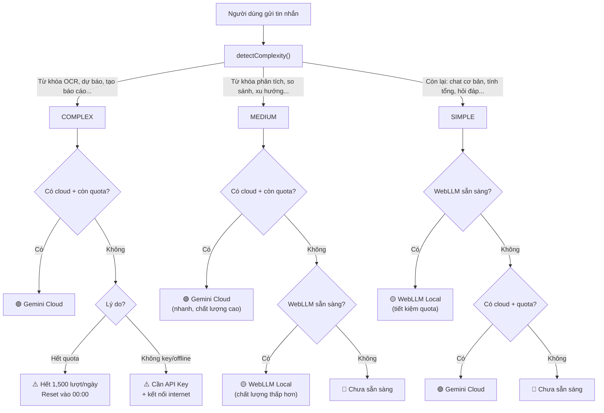
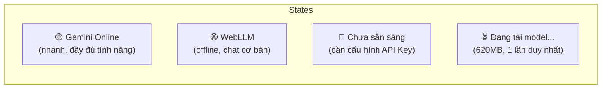
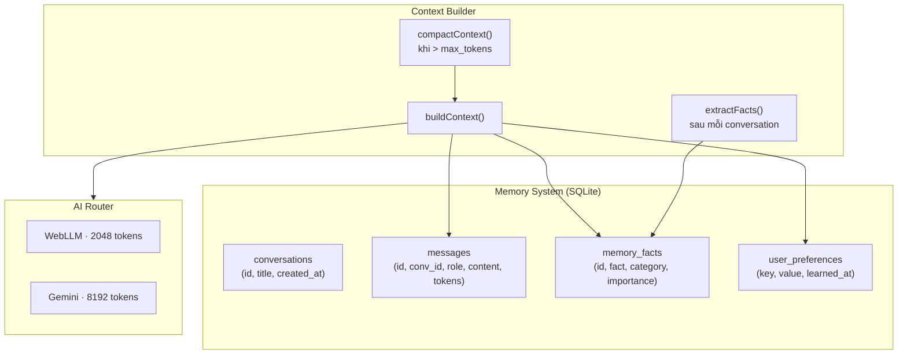
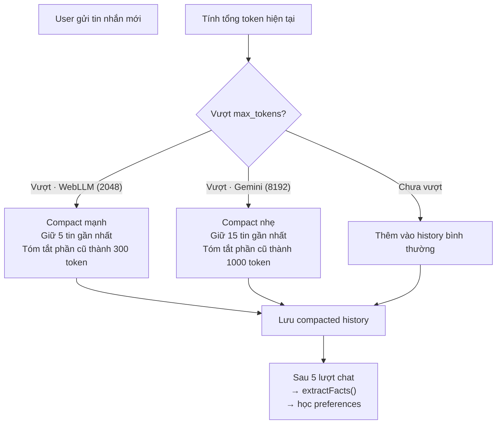
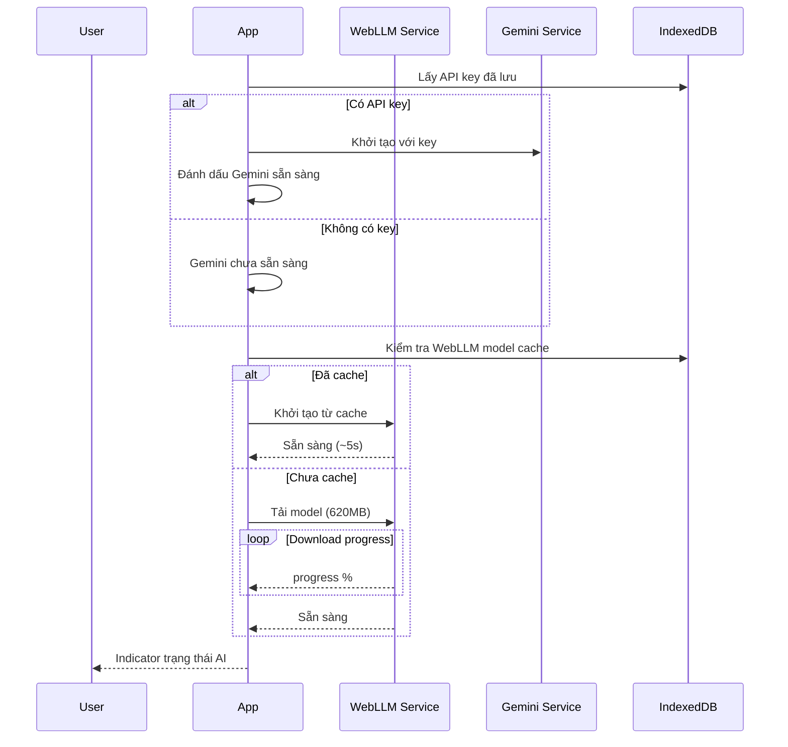

# Thiết kế Hybrid AI — Quản Lý Tài Chính

> **Phiên bản**: 1.0 · **Ngày**: 2026-08-01 · **Trạng thái**: DRAFT
>
> Kiến trúc lai: **WebLLM (local, offline)** + **Gemini (cloud, online)**

---

## 1. Tổng quan

### 1.1 Nguyên lý hoạt động

```
┌──────────────────────────────────────────────────────────┐
│                     AI Router                             │
│                                                           │
│  Người dùng gửi request                                   │
│         │                                                 │
│         ▼                                                 │
│  ┌─────────────────┐                                     │
│  │ Phân loại task   │                                     │
│  └────────┬────────┘                                     │
│           │                                               │
│     ┌─────┼─────────────┬──────────────┐                 │
│     ▼     ▼             ▼              ▼                 │
│  Đơn    Phân tích     OCR/Ảnh       Tạo báo              │
│  giản   nâng cao      hóa đơn       cáo                  │
│     │     │             │              │                 │
│     │     │             │              │                 │
│     ▼     ▼             ▼              ▼                 │
│  ╔══════════╗    ╔══════════════╗                       │
│  ║ LUÔN DÙNG║    ║ CLOUD TRƯỚC  ║                      │
│  ║ LOCAL AI ║    ║ (nếu còn quota║                      │
│  ║          ║    ║  → fallback   ║                      │
│  ║ Tiết kiệm║    ║  local)       ║                      │
│  ║ quota    ║    ╚══════┬═══════╝                      │
│  ║ cloud    ║           │                               │
│  ╚══════════╝    ┌──────┴──────┐                        │
│                  │             │                         │
│                  ▼             ▼                         │
│           ┌──────────┐  ┌────────────┐                  │
│           │ Gemini   │  │ WebLLM     │                  │
│           │ Cloud    │  │ Local      │                  │
│           │ (còn qta)│  │ (hết quota │                  │
│           └──────────┘  │  hoặc lỗi) │                  │
│                         └────────────┘                  │
│                                                           │
│  Quota Gemini free: 1,500 req/ngày — app tự đếm          │
└──────────────────────────────────────────────────────────┘
```

### 1.2 Quy tắc chọn provider

| Loại task | Provider | Lý do |
|:---|:---|:---|
| **Đơn giản** (chat cơ bản, tính tổng, giải thích thuật ngữ, gợi ý danh mục...) | **Luôn WebLLM** | Không đáng tốn quota cloud |
| **Trung bình** (phân tích xu hướng, so sánh tháng, tìm bất thường...) | **Gemini → WebLLM fallback** | Cloud tốt hơn, nhưng local vẫn làm được |
| **Phức tạp** (OCR hóa đơn, tạo báo cáo, dự báo...) | **Gemini, nếu hết → báo lỗi** | Local không làm được |
| **Hết quota Gemini** | **WebLLM cho mọi thứ (trừ OCR)** | Tự động fallback + thông báo |

---

## 2. WebLLM Local Model

### 2.1 Công nghệ

**WebLLM** là thư viện của MLC-AI, cho phép chạy Large Language Model trực tiếp trong browser, sử dụng WebGPU để tăng tốc inference. Model mặc định là **Qwen 2.5 0.5B** (280MB), tối ưu cho cấu hình thấp như i3 không GPU rời.

```typescript
// src/services/webLLM.ts
import { CreateMLCEngine, MLCEngine } from '@mlc-ai/web-llm';

// Các model được hỗ trợ (người dùng có thể chọn trong Settings)
const AVAILABLE_MODELS = {
  'qwen-0.5b': {
    id: 'Qwen2.5-0.5B-Instruct-q4f16_1-MLC',
    name: 'Qwen 2.5 0.5B',
    size: '280MB',
    minRAM: '4GB',
    recommended: true,  // ← Mặc định cho cấu hình thấp
    description: 'Nhanh nhất, dùng được trên mọi máy',
  },
  'tinyllama-1.1b': {
    id: 'TinyLlama-1.1B-Chat-v1.0-q4f16_1-MLC',
    name: 'TinyLlama 1.1B',
    size: '350MB',
    minRAM: '6GB',
    recommended: false,
    description: 'Cân bằng tốc độ và chất lượng',
  },
};

class WebLLMService {
  private engine: MLCEngine | null = null;
  private modelId: string;

  constructor(modelKey: string = 'qwen-0.5b') {
    this.modelId = AVAILABLE_MODELS[modelKey].id;
  }

  async initialize(onProgress?: (pct: number) => void): Promise<void> {
    this.engine = await CreateMLCEngine(this.modelId, {
      initProgressCallback: (report) => {
        onProgress?.(report.progress * 100);
      },
    });
  }

  async chat(messages: ChatMessage[]): AsyncGenerator<string> {
    if (!this.engine) throw new Error('WebLLM not initialized');

    const stream = await this.engine.chat.completions.create({
      messages,
      stream: true,
      max_tokens: 1024,
      temperature: 0.7,
    });

    for await (const chunk of stream) {
      const content = chunk.choices[0]?.delta?.content;
      if (content) yield content;
    }
  }

  isInitialized(): boolean {
    return this.engine !== null;
  }

  async destroy(): Promise<void> {
    if (this.engine) {
      await this.engine.unload();
      this.engine = null;
    }
  }
}
```

### 2.2 Thông số kỹ thuật

| Tham số | Qwen 2.5 0.5B (mặc định) | TinyLlama 1.1B (dự phòng) |
|:---|:---|:---|
| **Quantization** | q4f16_1 (4-bit weights) | q4f16_1 |
| **Kích thước tải** | ~280MB | ~350MB |
| **RAM sử dụng** | ~1-1.5GB | ~1.5-2GB |
| **Context window** | 4096 tokens | 4096 tokens |
| **Tốc độ (UHD 630)** | 15-25 tokens/giây ✅ | 8-15 tokens/giây |
| **Tốc độ (CPU only)** | 8-12 tokens/giây | 5-8 tokens/giây |
| **WebGPU yêu cầu** | Chrome 113+, Edge 113+ | Chrome 113+, Edge 113+ |
| **Tiếng Việt** | Cơ bản, đủ chat đơn giản | Khá hơn Qwen |
| **Phù hợp cấu hình** | i3, 4GB RAM, không GPU ✅ | i5+, 6GB RAM |

### 2.3 Prompt Template cho Local Model

```typescript
const LOCAL_SYSTEM_PROMPT = `Bạn là trợ lý tài chính tiếng Việt, chạy trên thiết bị của người dùng.
Bạn có khả năng hạn chế, chỉ trả lời câu hỏi cơ bản về tài chính cá nhân.

Dữ liệu hiện tại của người dùng:
{{CONTEXT_DATA}}

Quy tắc:
1. Trả lời ngắn gọn, dưới 200 từ
2. Nếu câu hỏi quá phức tạp, đề xuất người dùng kết nối internet và cấu hình Gemini API Key
3. Chỉ dùng dữ liệu được cung cấp trong CONTEXT_DATA
4. Không bịa số liệu`;
```

---

## 3. Gemini Cloud Model

### 3.1 Cấu hình

```typescript
// src/services/geminiService.ts
import { GoogleGenAI } from '@google/genai';

class GeminiService {
  private client: GoogleGenAI | null = null;

  initialize(apiKey: string): void {
    this.client = new GoogleGenAI({ apiKey });
  }

  async chat(messages: ChatMessage[]): AsyncGenerator<string> {
    if (!this.client) throw new Error('Gemini not configured');

    const model = this.client.getGenerativeModel({
      model: 'gemini-2.0-flash',
      systemInstruction: CLOUD_SYSTEM_PROMPT,
      generationConfig: {
        temperature: 0.7,
        maxOutputTokens: 2048,
      },
    });

    const chat = model.startChat({ history: formatHistory(messages) });
    const result = await chat.sendMessageStream(messages[messages.length - 1].content);

    for await (const chunk of result.stream) {
      yield chunk.text();
    }
  }

  async visionOCR(imageBase64: string): Promise<OCRExtraction> {
    if (!this.client) throw new Error('Gemini not configured');

    const model = this.client.getGenerativeModel({ model: 'gemini-2.0-flash' });
    const result = await model.generateContent([
      { text: OCR_PROMPT },
      { inlineData: { mimeType: 'image/jpeg', data: imageBase64 } },
    ]);

    return JSON.parse(result.response.text());
  }

  async isConfigured(): boolean {
    return this.client !== null;
  }
}
```

### 3.2 Prompt Templates cho Cloud

```typescript
const CLOUD_SYSTEM_PROMPT = `Bạn là trợ lý tài chính thông minh cho ứng dụng Quản Lý Tài Chính.
Bạn có thể phân tích dữ liệu, tạo báo cáo, dự báo xu hướng, và tư vấn tài chính.

Dữ liệu người dùng được cung cấp kèm mỗi câu hỏi.

Quy tắc:
1. Trả lời bằng tiếng Việt, chuyên nghiệp
2. Luôn trích dẫn số liệu cụ thể từ dữ liệu
3. Khi phân tích, nêu cả điểm tích cực và cần cải thiện
4. Đề xuất cụ thể, khả thi
5. Format bảng biểu bằng Markdown table khi cần`;

const OCR_PROMPT = `Đây là ảnh hóa đơn tiếng Việt. Hãy trích xuất thông tin và trả về JSON.

CHỈ trả về các trường TÌM THẤY trong ảnh. Không bịa thêm.

{
  "date": "YYYY-MM-DD",
  "amount": number (VND, không dấu phẩy),
  "supplier": "tên cửa hàng/nhà cung cấp",
  "description": "mô tả mặt hàng/dịch vụ",
  "category": "office|utilities|supplies|transportation|maintenance|marketing|rent|salary|tax|other",
  "paymentMethod": "cash|bank_transfer|credit_card|e_wallet"
}

Nếu không tìm thấy trường nào, bỏ qua trường đó.
Nếu không chắc chắn, thêm confidence: "low" vào field đó.`;
```

---

## 4. AI Router — Điều phối thông minh (có quản lý quota)

### 4.1 Router Logic

```typescript
// src/services/aiRouter.ts

type AIProvider = 'webllm' | 'gemini' | 'none';
type TaskComplexity = 'simple' | 'medium' | 'complex';

interface AIRouterConfig {
  geminiApiKey: string | null;
  isOnline: boolean;
  webllmReady: boolean;
}

interface QuotaTracker {
  usedToday: number;
  limitPerDay: number;    // 1,500 cho Gemini free
  resetAt: string;         // ISO timestamp đầu ngày mai
}

class AIRouter {
  private config: AIRouterConfig;
  private webllm: WebLLMService;
  private gemini: GeminiService;
  private quota: QuotaTracker;

  constructor(config: AIRouterConfig) {
    this.config = config;
    this.webllm = new WebLLMService();
    this.gemini = new GeminiService();
    if (config.geminiApiKey) this.gemini.initialize(config.geminiApiKey);

    // Khôi phục quota từ IndexedDB
    this.quota = this.loadQuota();
  }

  /**
   * Quy tắc chọn provider:
   *
   * SIMPLE   → LUÔN WebLLM (tiết kiệm quota cloud)
   * MEDIUM   → Gemini nếu còn quota, fallback WebLLM
   * COMPLEX  → Gemini nếu còn quota, fallback thông báo lỗi
   */
  selectProvider(request: AIRequest): AIProvider {
    const { geminiApiKey, isOnline, webllmReady } = this.config;
    const cloudAvailable = geminiApiKey && isOnline;
    const quotaRemaining = this.quota.usedToday < this.quota.limitPerDay;

    switch (request.complexity) {
      case 'simple':
        // Luôn local — không đáng tốn quota
        if (webllmReady) return 'webllm';
        if (cloudAvailable && quotaRemaining) return 'gemini'; // fallback nếu local chưa tải
        return 'none';

      case 'medium':
        // Cloud trước (nếu còn quota), local fallback
        if (cloudAvailable && quotaRemaining) return 'gemini';
        if (webllmReady) return 'webllm';
        return 'none';

      case 'complex':
        // Cloud ONLY — local không làm được
        if (cloudAvailable && quotaRemaining) return 'gemini';
        return 'none'; // Báo lỗi: cần cloud + quota

      default:
        return webllmReady ? 'webllm' : 'none';
    }
  }

  /**
   * Phân loại độ phức tạp của request
   */
  detectComplexity(message: string, hasImage: boolean): TaskComplexity {
    // Có ảnh → luôn complex
    if (hasImage) return 'complex';

    const msg = message.toLowerCase();

    // Từ khóa complex: cần cloud
    const complexPatterns = [
      /ocr|đọc ảnh|đọc hóa đơn|trích xuất/i,
      /dự báo|dự đoán|forecast|dự kiến/i,
      /tạo báo cáo|báo cáo tự động/i,
      /lập kế hoạch|kế hoạch tài chính/i,
    ];
    if (complexPatterns.some(p => p.test(msg))) return 'complex';

    // Từ khóa medium: cloud tốt hơn, local làm được
    const mediumPatterns = [
      /phân tích|analysis/i,
      /xu hướng|trend/i,
      /so sánh|compare/i,
      /bất thường|anomaly|bất hợp lý/i,
      /tối ưu|tư vấn|khuyến nghị|gợi ý chiến lược/i,
    ];
    if (mediumPatterns.some(p => p.test(msg))) return 'medium';

    // Còn lại là simple
    return 'simple';
  }

  /**
   * Gửi request + tự động đếm quota
   */
  async chat(
    messages: ChatMessage[],
    context?: AIContext,
    onStream?: (token: string) => void,
    onProvider?: (provider: AIProvider) => void,
    onQuota?: (used: number, limit: number) => void,
  ): Promise<string> {
    const lastMsg = messages[messages.length - 1];
    const hasImage = false; // Sẽ detect từ attachment
    const complexity = this.detectComplexity(lastMsg.content, hasImage);
    const provider = this.selectProvider({ complexity });

    onProvider?.(provider);

    if (provider === 'gemini') {
      this.quota.usedToday++;
      await this.saveQuota();
      onQuota?.(this.quota.usedToday, this.quota.limitPerDay);
    }

    const augmentedMessages = this.injectContext(messages, context, provider);

    switch (provider) {
      case 'gemini': {
        let full = '';
        try {
          for await (const token of this.gemini.chat(augmentedMessages)) {
            full += token;
            onStream?.(token);
          }
        } catch (e: any) {
          if (e?.status === 429) {
            // Rate limit — hết quota
            return this.handleQuotaExhausted(messages, context, onStream);
          }
          throw e;
        }
        return full;
      }

      case 'webllm': {
        let full = '';
        for await (const token of this.webllm.chat(augmentedMessages)) {
          full += token;
          onStream?.(token);
        }
        return full;
      }

      case 'none': {
        const msg = this.getUnavailableMessage(complexity);
        onStream?.(msg);
        return msg;
      }
    }
  }

  /**
   * Khi hết quota → fallback WebLLM
   */
  private async handleQuotaExhausted(
    messages: ChatMessage[],
    context?: AIContext,
    onStream?: (token: string) => void,
  ): Promise<string> {
    const warning = '⚠️ Đã hết 1,500 lượt Gemini miễn phí hôm nay. '
      + 'Chuyển sang AI offline (chất lượng thấp hơn). '
      + 'Quota sẽ reset vào 00:00 ngày mai.\n\n';

    onStream?.(warning);

    if (this.config.webllmReady) {
      const augmented = this.injectContext(messages, context, 'webllm');
      let full = warning;
      for await (const token of this.webllm.chat(augmented)) {
        full += token;
        onStream?.(token);
      }
      return full;
    }

    return warning + '(AI offline chưa sẵn sàng. Vui lòng thử lại sau.)';
  }

  private getUnavailableMessage(complexity: TaskComplexity): string {
    if (complexity === 'complex') {
      return '⚠️ Tính năng này cần Gemini Cloud. '
        + 'Vui lòng: (1) kết nối internet, (2) cấu hình API Key trong Cài đặt > AI, '
        + '(3) đảm bảo còn quota (1,500 lượt/ngày).';
    }
    return '⚠️ AI chưa sẵn sàng. Đang tải model offline...';
  }

  // ─── Quota Management ───

  private loadQuota(): QuotaTracker {
    const stored = localStorage.getItem('ai_quota');
    if (stored) {
      const q = JSON.parse(stored) as QuotaTracker;
      // Reset nếu qua ngày mới
      if (new Date() >= new Date(q.resetAt)) {
        return { usedToday: 0, limitPerDay: 1500, resetAt: this.nextMidnight() };
      }
      return q;
    }
    return { usedToday: 0, limitPerDay: 1500, resetAt: this.nextMidnight() };
  }

  private async saveQuota(): Promise<void> {
    localStorage.setItem('ai_quota', JSON.stringify(this.quota));
  }

  private nextMidnight(): string {
    const t = new Date();
    t.setHours(24, 0, 0, 0);
    return t.toISOString();
  }
}
```

### 4.2 Luồng phân loại & chọn provider



---

## 5. Trải nghiệm người dùng

### 5.1 Indicator trạng thái AI



| Trạng thái | Icon | Khi nào | Hành vi |
|:---|:---|:---|:---|
| **Gemini Online** | 🟢 | Có API key + online + còn quota | Dùng cho task medium & complex |
| **Gemini + quota thấp** | 🟢 1.2K/1.5K | Còn < 300 lượt | Cảnh báo sắp hết |
| **WebLLM** | 🟡 | Không key / offline / hết quota / task đơn giản | Mọi task trừ OCR |
| **Hết quota** | 🔴 1.5K/1.5K | Đã dùng hết 1,500 lượt | WebLLM cho mọi thứ, OCR báo lỗi |
| **Chưa sẵn sàng** | 🔴 | WebLLM chưa tải + không key | Hướng dẫn cấu hình |
| **Đang tải model** | ⏳ | Lần đầu mở app | Progress bar 0-100% |

### 5.2 Quota Indicator trong Chat Panel

```
┌────────────────────────────────────────┐
│  🤖 Trợ lý AI  🟢 Gemini · 847/1500   │  ← Provider + quota counter
│  ─────────────────────────────────────  │
│  (nội dung chat...)                     │
└────────────────────────────────────────┘
```

Khi quota sắp hết (< 20%):
```
│  🤖 Trợ lý AI  🟢 Gemini · 1423/1500 ⚠️│  ← Cảnh báo
```

Khi hết quota:
```
│  🤖 Trợ lý AI  🔴 Hết quota · 1500/1500 │  ← Tự động chuyển WebLLM
│  (Reset lúc 00:00)                       │
```

### 5.2 UI cho từng trạng thái

**Khi đang tải WebLLM lần đầu**:
```
┌────────────────────────────────────────┐
│  🤖 Trợ lý AI                      ✕   │
├────────────────────────────────────────┤
│                                        │
│         ⏳ Đang tải AI offline...      │
│         ████████░░░░  65%             │
│         403MB / 620MB                  │
│                                        │
│  Việc này chỉ cần làm 1 lần.           │
│  Bạn vẫn có thể nhập liệu bình thường. │
│                                        │
└────────────────────────────────────────┘
```

**Khi chat với WebLLM (offline)**:
```
┌────────────────────────────────────────┐
│  🤖 Trợ lý AI  🟡 WebLLM (offline)    │
├────────────────────────────────────────┤
│                                        │
│  💬 Tôi đang dùng AI offline nên chỉ   │
│     trả lời được câu hỏi cơ bản.       │
│     Để phân tích chuyên sâu, hãy kết   │
│     nối internet và cấu hình API Key.  │
│                                        │
│  ─────────────────────────────────────  │
│  👤 Bạn: Chi phí tháng này bao nhiêu?   │
│                                        │
│  🤖 AI: Tổng chi phí tháng 7 là        │
│     12.300.000đ với 23 khoản.          │
│     Cao nhất: Điện nước 4.8M (42%).    │
│                                        │
├────────────────────────────────────────┤
│  ⚡ WebLLM · Gemma 2B · 20 t/s        │
│  ┌────────────────────────────────────┐│
│  │ Nhập tin nhắn...              [➤] ││
│  └────────────────────────────────────┘│
└────────────────────────────────────────┘
```

**Khi yêu cầu OCR nhưng không có cloud**:
```
┌────────────────────────────────────────┐
│  🤖 Trợ lý AI  🟡 WebLLM (offline)    │
├────────────────────────────────────────┤
│  👤 Bạn: 📎 [ảnh hóa đơn chụp]         │
│                                        │
│  🤖 AI: ⚠️ Tính năng đọc ảnh hóa đơn  │
│     cần kết nối internet và Gemini     │
│     API Key.                           │
│                                        │
│     📋 Cách làm:                       │
│     1. Vào Cài đặt > AI                │
│     2. Nhập Gemini API Key             │
│     3. Đảm bảo có kết nối internet     │
│                                        │
│     [🔗 Hướng dẫn tạo API Key]         │
│     [⚙️ Mở Cài đặt]                   │
│                                        │
└────────────────────────────────────────┘
```

---

## 6. AI Memory & Context — Không quên, tự học, tự compact

### 6.0 Memory Architecture



### 6.1 Memory Store Schema

```sql
-- Lịch sử hội thoại (persistent)
CREATE TABLE conversations (
  id TEXT PRIMARY KEY,
  title TEXT NOT NULL,              -- Tự sinh từ tin nhắn đầu
  created_at TEXT NOT NULL,
  updated_at TEXT NOT NULL
);

-- Tin nhắn trong hội thoại
CREATE TABLE messages (
  id TEXT PRIMARY KEY,
  conversation_id TEXT NOT NULL REFERENCES conversations(id),
  role TEXT NOT NULL,               -- 'user' | 'assistant' | 'system'
  content TEXT NOT NULL,
  tokens INTEGER NOT NULL DEFAULT 0, -- Số token ước tính
  created_at TEXT NOT NULL
);
CREATE INDEX idx_messages_conv ON messages(conversation_id, created_at);

-- Sự kiện/key facts được trích xuất (dài hạn)
CREATE TABLE memory_facts (
  id TEXT PRIMARY KEY,
  fact TEXT NOT NULL,               -- VD: "User thường thanh toán bằng chuyển khoản"
  category TEXT NOT NULL,           -- 'preference' | 'pattern' | 'correction' | 'event'
  importance REAL NOT NULL DEFAULT 0.5, -- 0.0-1.0, càng cao càng ưu tiên giữ
  source_message_id TEXT,           -- Tin nhắn gốc trích xuất fact này
  created_at TEXT NOT NULL,
  last_accessed_at TEXT NOT NULL
);
CREATE INDEX idx_facts_category ON memory_facts(category);
CREATE INDEX idx_facts_importance ON memory_facts(importance DESC);

-- Thói quen/sở thích học được
CREATE TABLE user_preferences (
  key TEXT PRIMARY KEY,             -- 'default_payment', 'favorite_category', ...
  value TEXT NOT NULL,
  confidence REAL DEFAULT 0.5,      -- 0.0-1.0, độ tin cậy
  learned_at TEXT NOT NULL,
  updated_at TEXT NOT NULL
);
```

### 6.2 Context Builder — Nhớ xuyên suốt conversation

```typescript
// src/services/contextBuilder.ts

interface ContextConfig {
  maxTokens: number;           // WebLLM: 2048, Gemini: 8192
  recentMessagesCount: number; // Giữ N tin nhắn gần nhất đầy đủ
}

class ContextBuilder {
  private db: Database;

  /**
   * Xây dựng context cho 1 request.
   * Context = System Prompt + Facts + Preferences + History (đã compact nếu cần)
   */
  async buildContext(
    conversationId: string,
    currentMessage: string,
    config: ContextConfig
  ): Promise<ChatMessage[]> {
    const messages: ChatMessage[] = [];

    // 1. System prompt (cố định, không đếm vào quota compact)
    messages.push({ role: 'system', content: SYSTEM_PROMPT, tokens: 200 });

    // 2. User preferences đã học được
    const prefs = await this.getRelevantPreferences();
    if (prefs.length > 0) {
      messages.push({
        role: 'system',
        content: 'Thông tin đã học về người dùng:\n' + prefs.map(p => `- ${p.key}: ${p.value}`).join('\n'),
        tokens: prefs.length * 15,
      });
    }

    // 3. Key facts (dài hạn, importance cao nhất)
    const facts = await this.getTopFacts(config.maxTokens * 0.15); // 15% quota cho facts
    if (facts.length > 0) {
      messages.push({
        role: 'system',
        content: 'Sự kiện quan trọng:\n' + facts.map(f => `- ${f.fact}`).join('\n'),
        tokens: facts.length * 20,
      });
    }

    // 4. Conversation history (đã compact nếu cần)
    const history = await this.getConversationHistory(conversationId, config);
    messages.push(...history);

    // 5. Current message
    messages.push({ role: 'user', content: currentMessage, tokens: this.estimateTokens(currentMessage) });

    return messages;
  }

  /**
   * Lấy lịch sử hội thoại, tự compact nếu vượt quota
   */
  private async getConversationHistory(
    conversationId: string,
    config: ContextConfig
  ): Promise<ChatMessage[]> {
    const allMessages = this.db.prepare(`
      SELECT * FROM messages WHERE conversation_id = ?
      ORDER BY created_at ASC
    `).all(conversationId);

    const totalTokens = allMessages.reduce((s: number, m: any) => s + m.tokens, 0);
    const availableTokens = config.maxTokens * 0.6; // 60% quota cho history

    if (totalTokens <= availableTokens) {
      return allMessages.map(m => ({ role: m.role, content: m.content, tokens: m.tokens }));
    }

    // ⚡ COMPACT: tổng quá quota → tóm tắt tin cũ
    return this.compactHistory(allMessages, availableTokens, config.recentMessagesCount);
  }

  /**
   * Compact history: giữ N tin gần nhất đầy đủ, tóm tắt phần cũ
   */
  private async compactHistory(
    messages: any[],
    maxTokens: number,
    keepRecent: number
  ): Promise<ChatMessage[]> {
    // Giữ N tin cuối đầy đủ
    const recent = messages.slice(-keepRecent);
    const recentTokens = recent.reduce((s: number, m: any) => s + m.tokens, 0);

    // Phần cũ → tóm tắt
    const oldMessages = messages.slice(0, -keepRecent);
    const availableForSummary = maxTokens - recentTokens - 50; // Dự trữ 50 token

    if (oldMessages.length === 0 || availableForSummary <= 0) {
      return recent.map(m => ({ role: m.role, content: m.content, tokens: m.tokens }));
    }

    // Gọi AI (local WebLLM, không tốn quota cloud) để tóm tắt
    const summary = await this.summarizeMessages(oldMessages, availableForSummary);

    return [
      {
        role: 'system',
        content: `[Tóm tắt hội thoại trước đó]: ${summary}`,
        tokens: this.estimateTokens(summary),
      },
      ...recent.map(m => ({ role: m.role, content: m.content, tokens: m.tokens })),
    ];
  }

  /**
   * Dùng WebLLM local để tóm tắt — không tốn quota Gemini
   */
  private async summarizeMessages(messages: any[], maxTokens: number): Promise<string> {
    const text = messages.map(m => `[${m.role}]: ${m.content}`).join('\n');
    const prompt = `Tóm tắt đoạn hội thoại sau trong ${maxTokens} tokens, giữ lại các sự kiện, con số, quyết định quan trọng:\n\n${text}`;

    const webllm = new WebLLMService();
    let summary = '';
    for await (const token of webllm.chat([{ role: 'user', content: prompt }])) {
      summary += token;
    }
    return summary;
  }
}
```

### 6.3 Self-Learning — Trích xuất facts sau mỗi conversation

```typescript
// src/services/selfLearning.ts

class SelfLearningEngine {
  private db: Database;

  /**
   * Chạy sau mỗi conversation — trích xuất facts mới
   */
  async learnFromConversation(conversationId: string): Promise<void> {
    const messages = this.db.prepare(`
      SELECT * FROM messages WHERE conversation_id = ? ORDER BY created_at
    `).all(conversationId);

    const conversationText = messages.map(m => `[${m.role}]: ${m.content}`).join('\n');

    // Dùng AI để trích xuất facts
    const facts = await this.extractFacts(conversationText);

    // Lưu vào memory
    for (const fact of facts) {
      this.upsertFact(fact);
    }

    // Học preferences
    await this.learnPreferences(messages);
  }

  /**
   * Trích xuất facts từ hội thoại
   */
  private async extractFacts(text: string): Promise<ExtractedFact[]> {
    const prompt = `Từ đoạn hội thoại sau, trích xuất các sự kiện/thông tin quan trọng về người dùng.
Trả về JSON array, mỗi item có: fact (mô tả), category (preference|pattern|correction|event), importance (0-1).

Hội thoại:
${text.slice(0, 4000)}`;

    // Dùng Gemini nếu có, fallback WebLLM
    const response = await aiRouter.extractJSON(prompt);
    return JSON.parse(response);
  }

  /**
   * Học thói quen người dùng
   */
  private async learnPreferences(messages: any[]): Promise<void> {
    const userMessages = messages.filter(m => m.role === 'user').map(m => m.content).join('\n');

    // Pattern matching cho các thói quen
    const patterns = [
      { regex: /chuyển khoản|CK|bank.transfer/i, key: 'preferred_payment', value: 'bank_transfer' },
      { regex: /tiền mặt|cash/i, key: 'preferred_payment', value: 'cash' },
      { regex: /văn phòng phẩm|giấy|bút|mực/i, key: 'frequent_category', value: 'office' },
      { regex: /xăng|vận chuyển|ship/i, key: 'frequent_category', value: 'transportation' },
    ];

    for (const pattern of patterns) {
      if (pattern.regex.test(userMessages)) {
        this.db.prepare(`
          INSERT INTO user_preferences (key, value, confidence, learned_at, updated_at)
          VALUES (?, ?, 0.7, datetime('now'), datetime('now'))
          ON CONFLICT(key) DO UPDATE SET
            value = excluded.value,
            confidence = MIN(1.0, confidence + 0.1),
            updated_at = datetime('now')
        `).run(pattern.key, pattern.value);
      }
    }
  }
}
```

### 6.4 Auto-Compact khi context đầy



### 6.5 Ví dụ thực tế

```
Cuộc hội thoại #1 (hôm nay):
  User: "Chi phí tháng này bao nhiêu?"
  AI: "12.300.000đ..."
  User: "Cao quá, làm sao giảm?"
  AI: "Điện nước chiếm 42%..."

  → extractFacts():
    ✅ "User quan tâm đến việc giảm chi phí" (importance: 0.6)
    ✅ "Danh mục điện nước đang cao" (importance: 0.5)

Cuộc hội thoại #2 (ngày mai):
  Context tự động chèn facts từ hôm qua:
  [System]: "Thông tin đã học: User quan tâm đến giảm chi phí. Điện nước đang cao."

  User: "Điện nước hôm nay thế nào?"
  AI: "Điện nước hôm nay: 0đ (chưa có hóa đơn mới). 
        Hôm qua bạn lo về 42% chi phí điện nước — 
        đây là danh sách cách tiết kiệm điện..."

  → AI NHỚ được context hôm qua mà không cần user nhắc lại!
```

### 6.6 Memory Management

```typescript
// Giới hạn dung lượng memory
const MEMORY_LIMITS = {
  maxConversations: 100,        // Giữ 100 cuộc hội thoại gần nhất
  maxMessagesPerConv: 200,      // Tối đa 200 tin / cuộc
  maxFacts: 500,                // Tối đa 500 facts
  maxPreferences: 50,           // Tối đa 50 preferences

  // Tự động dọn dẹp
  factRetentionDays: 90,        // Facts > 90 ngày, importance < 0.3 → xóa
  conversationRetentionDays: 30, // Hội thoại > 30 ngày không đụng → xóa
};

async function cleanupMemory(): Promise<void> {
  // Xóa hội thoại cũ
  db.run(`DELETE FROM conversations WHERE updated_at < datetime('now', '-30 days')`);

  // Xóa facts ít quan trọng, cũ
  db.run(`DELETE FROM memory_facts WHERE importance < 0.3 AND created_at < datetime('now', '-90 days')`);

  // Giảm importance của facts không được truy cập
  db.run(`UPDATE memory_facts SET importance = importance * 0.9 WHERE last_accessed_at < datetime('now', '-7 days')`);
}
```



### 6.2 Dependency

```json
{
  "dependencies": {
    "@mlc-ai/web-llm": "^0.2.46",
    "@google/genai": "^1.2.0"
  }
}
```

---

## 7. Xử lý lỗi & Biên

### 7.1 Các tình huống lỗi

| Lỗi | Nguyên nhân | Xử lý |
|:---|:---|:---|
| WebLLM không tải được | Mạng chậm, hết dung lượng | Hiển thị % + cho phép hủy. Thử lại sau. |
| WebLLM crash (OOM) | RAM không đủ | Giải phóng bộ nhớ, đề xuất dùng Gemini Cloud |
| WebGPU không khả dụng | Browser cũ, driver cũ | Fallback WASM (chậm hơn) + cảnh báo |
| Gemini rate limit | Vượt 1,500 req/ngày | Hiển thị "Hết lượt, thử lại sau" + tự động chuyển WebLLM |
| Gemini API key sai | Key không hợp lệ | Validate khi nhập, hiển thị lỗi cụ thể |
| Gemini timeout | Mạng chậm | Timeout 30s → chuyển sang WebLLM nếu có |

### 7.2 Giải phóng bộ nhớ

```typescript
// Tự động unload WebLLM nếu không dùng sau 5 phút
let idleTimer: NodeJS.Timeout;

function resetIdleTimer() {
  clearTimeout(idleTimer);
  idleTimer = setTimeout(async () => {
    if (webllm.isInitialized() && gemini.isConfigured()) {
      // Nếu Gemini đang hoạt động, unload WebLLM để tiết kiệm RAM
      await webllm.destroy();
      console.log('WebLLM unloaded to save memory');
    }
  }, 5 * 60 * 1000); // 5 phút
}
```

---

## 8. Kích thước & Phân phối

| Thành phần | Kích thước | Ghi chú |
|:---|:---|:---|
| Electron + Chromium | ~80MB | Giống fe-simulator |
| React App (dist/) | ~2MB | Bundle đã optimize |
| WebLLM Model (Gemma 2B) | ~620MB | Tải 1 lần, cache IndexedDB, KHÔNG bundle |
| Node.js (embedded) | ~40MB | |
| **Portable ZIP** | **~95MB** | Tăng từ 80MB → 95MB do thêm WebLLM library |
| **Model (tải riêng)** | **280MB** (Qwen) hoặc **350MB** (TinyLlama) | Chỉ tải khi dùng lần đầu, không có trong ZIP |

> **Lưu ý**: Model **KHÔNG bundle trong portable ZIP**. Nó được tải riêng khi người dùng mở app lần đầu. Qwen 0.5B (280MB) đủ nhẹ để tải nhanh ngay cả trên mạng 3G. Người dùng có thể chọn model trong Settings.
