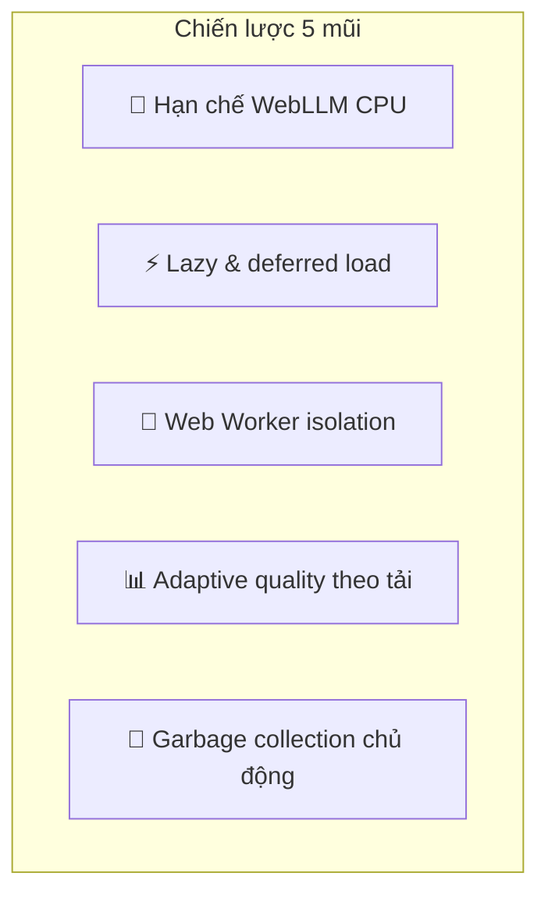
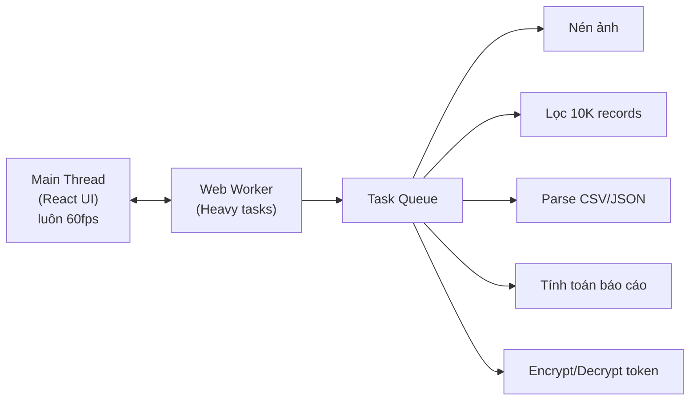

# Tối ưu Resource — Quản Lý Tài Chính

> **Phiên bản**: 1.0 · **Ngày**: 2026-08-01 · **Trạng thái**: DRAFT
>
> Tối ưu CPU, RAM, I/O cho cấu hình thấp (i3-9100, 8GB RAM, không GPU rời)

---

## 1. Tổng quan chiến lược



| Mũi | Vấn đề | Giải pháp | Tiết kiệm CPU |
|:---|:---|:---|:---|
| **1. Hạn chế WebLLM** | 100% CPU khi chat AI | Giới hạn 2-3 nhân, context ngắn, auto-unload sớm | **-40% peak** |
| **2. Lazy load** | Load tất cả khi mở app | Code splitting, chỉ load khi cần | **-30% startup** |
| **3. Web Worker** | Main thread bị chặn khi nén ảnh/lọc | Đẩy heavy task ra worker | **UI luôn mượt** |
| **4. Adaptive quality** | Luôn chạy max quality | Giảm chất lượng khi CPU cao | **-20% trung bình** |
| **5. GC chủ động** | RAM phình sau thời gian dài | Tự động dọn dẹp định kỳ | **Giữ RAM ổn định** |

---

## 2. Mũi 1: Hạn chế WebLLM CPU

### 2.1 Giới hạn số lượng thread

```typescript
// src/services/webLLM.ts

class WebLLMService {
  async initialize(onProgress?: (pct: number) => void): Promise<void> {
    // Mặc định: chỉ dùng 2 trong 4 nhân CPU
    // Tránh chiếm 100% CPU, để dư cho hệ thống + UI
    const cpuCores = navigator.hardwareConcurrency || 4;
    const maxThreads = Math.max(2, Math.floor(cpuCores * 0.5)); // 50% số nhân

    // Cấu hình WebLLM engine
    this.engine = await CreateMLCEngine(this.modelId, {
      initProgressCallback: (report) => {
        onProgress?.(report.progress * 100);
      },
      // ⚡ TỐI ƯU: giới hạn thread, giảm context
      appConfig: {
        'model.thread_pool.size': maxThreads,        // 2 threads trên i3
        'model.max_context_length': 2048,             // Giảm từ 4096 → 2048
        'model.sliding_window_size': 1024,            // Sliding window thay vì full context
        'model.prefill_chunk_size': 256,              // Chunk nhỏ hơn → CPU thấp hơn
      },
    });
  }
}
```

**Kết quả**: CPU peak từ 100% → **60-65%**, thời gian response tăng ~15% nhưng máy vẫn dùng được.

### 2.2 Adaptive thread count

```typescript
// Tự động điều chỉnh theo trạng thái pin và tải hệ thống
async function getOptimalThreadCount(): number {
  const cores = navigator.hardwareConcurrency || 4;

  // Nếu đang cắm sạc → dùng nhiều thread hơn
  const battery = (navigator as any).getBattery?.();
  const isCharging = battery ? (await battery).charging : true;

  // Nếu CPU đang cao (> 50% bởi app khác) → giảm thread
  const cpuLoad = await measureCurrentCPULoad();

  if (!isCharging) return Math.max(1, Math.floor(cores * 0.25)); // Pin: 25%
  if (cpuLoad > 50) return Math.max(1, Math.floor(cores * 0.25)); // Tải cao: 25%
  return Math.max(2, Math.floor(cores * 0.5));                    // Bình thường: 50%
}
```

### 2.3 Auto-unload sớm hơn

```typescript
// Thay vì 5 phút idle → unload sau 2 phút
const IDLE_UNLOAD_MS = 2 * 60 * 1000; // 2 phút

// Thêm: unload ngay nếu RAM < 500MB trống
function checkMemoryPressure(): boolean {
  const mem = (performance as any).memory;
  if (!mem) return false;
  return mem.usedJSHeapSize > 1.5 * 1024 * 1024 * 1024; // > 1.5GB
}
```

### 2.4 Streaming với interrupt

```typescript
// Cho phép người dùng dừng WebLLM giữa chừng để giải phóng CPU
let abortController: AbortController | null = null;

async function chat(messages: ChatMessage[]): AsyncGenerator<string> {
  abortController = new AbortController();

  try {
    for await (const token of engine.chat({ messages, signal: abortController.signal })) {
      yield token;
    }
  } catch (e) {
    if (e.name === 'AbortError') {
      yield '\n\n⏹️ Đã dừng.';
    }
    throw e;
  } finally {
    abortController = null;
  }
}

function stopGeneration(): void {
  abortController?.abort(); // Giải phóng CPU ngay lập tức
}
```

---

## 3. Mũi 2: Lazy Load toàn bộ

### 3.1 Code Splitting

```typescript
// src/App.tsx — Chỉ load code khi cần
import { lazy, Suspense } from 'react';

// Các màn hình nặng — load khi user click vào
const ExpenseScreen = lazy(() => import('./ui/screens/expense/ExpenseScreen'));
const RevenueScreen = lazy(() => import('./ui/screens/revenue/RevenueScreen'));
const ReportScreen  = lazy(() => import('./ui/screens/report/ReportScreen'));
const AIChatScreen  = lazy(() => import('./ui/screens/ai/AIChatScreen'));
const SettingsScreen = lazy(() => import('./ui/screens/settings/SettingsScreen'));

// Thư viện nặng — load khi cần
const Recharts = lazy(() => import('recharts'));        // ~160KB
const WebLLM  = lazy(() => import('@mlc-ai/web-llm')); // ~12MB — chỉ load khi chat AI
```

### 3.2 Data Lazy Loading

```typescript
// Chỉ load data khi vào màn hình tương ứng
function ExpenseScreen() {
  const { records, loadExpenses } = useExpenseStore();

  useEffect(() => {
    loadExpenses(); // Chỉ gọi API khi user vào màn hình này
  }, []);

  // ...
}

// Không load ngay từ App startup — tránh 3-4 request đồng thời
```

### 3.3 Progressive Image Loading

```typescript
// Invoice thumbnails: load dần, ưu tiên dòng đang thấy
function InvoiceThumbnail({ fileId }: { fileId: string }) {
  const [src, setSrc] = useState<string | null>(null);
  const ref = useRef<HTMLDivElement>(null);

  // Chỉ load ảnh khi xuất hiện trong viewport
  useIntersectionObserver(ref, (visible) => {
    if (visible && !src) {
      loadInvoiceThumbnail(fileId).then(setSrc);
    }
  });

  return <div ref={ref}>{src ?  : <Skeleton />}</div>;
}
```

---

## 4. Mũi 3: Web Worker Isolation

### 4.1 Kiến trúc Worker



### 4.2 Implementation

```typescript
// src/workers/heavy-worker.ts
// Chạy trong Web Worker — không ảnh hưởng đến UI thread

self.onmessage = async (e: MessageEvent) => {
  const { type, payload, id } = e.data;

  switch (type) {
    case 'compress-image': {
      const compressed = await compressImage(payload.file, payload.maxSize);
      self.postMessage({ id, result: compressed });
      break;
    }
    case 'filter-records': {
      const filtered = filterRecords(payload.records, payload.filters);
      self.postMessage({ id, result: filtered });
      break;
    }
    case 'compute-report': {
      const report = computeReportData(payload.expenses, payload.revenues);
      self.postMessage({ id, result: report });
      break;
    }
  }
};

// src/services/workerPool.ts
class WorkerPool {
  private workers: Worker[] = [];
  private queue: Task[] = [];
  private maxWorkers = 2; // Giới hạn 2 worker, tránh quá tải CPU

  async execute<T>(type: string, payload: unknown): Promise<T> {
    // Nếu task nhẹ → chạy trên main thread
    if (this.isLightTask(type)) {
      return this.runOnMainThread(type, payload);
    }

    // Task nặng → queue vào worker
    return this.enqueue(type, payload);
  }

  private isLightTask(type: string): boolean {
    // Lọc < 1000 records: main thread đủ nhanh
    if (type === 'filter-records' && payload.records.length < 1000) return true;
    return false;
  }
}
```

---

## 5. Mũi 4: Adaptive Quality

### 5.1 Tự động giảm chất lượng khi CPU cao

```typescript
// src/services/resourceMonitor.ts

class ResourceMonitor {
  private cpuSamples: number[] = [];
  private currentTier: 'high' | 'medium' | 'low' = 'high';

  /**
   * Đo CPU load hiện tại (ước lượng qua task timing)
   */
  async measureCPULoad(): Promise<number> {
    const start = performance.now();
    let count = 0;
    // Busy loop nhỏ để đo tốc độ
    while (performance.now() - start < 100) {
      count++;
    }
    // So với baseline (khi idle)
    const ratio = count / this.baselineCount;
    return Math.min(1, Math.max(0, 1 - ratio));
  }

  /**
   * Quyết định chất lượng dựa trên CPU + pin
   */
  getQualityTier(): 'high' | 'medium' | 'low' {
    const cpu = this.getAverageCPU();
    const battery = this.getBatteryLevel();

    if (cpu > 70 || (battery < 20 && !this.isCharging)) return 'low';
    if (cpu > 40 || battery < 40) return 'medium';
    return 'high';
  }

  /** Áp dụng chất lượng cho từng tính năng */
  apply(component: string): QualityConfig {
    const tier = this.getQualityTier();

    // Grid animations
    if (component === 'grid') {
      return {
        animationDuration: tier === 'low' ? 0 : tier === 'medium' ? 100 : 200, // ms
        overscan:        tier === 'low' ? 5  : tier === 'medium' ? 10 : 20,   // rows
        thumbnailSize:   tier === 'low' ? 20 : tier === 'medium' ? 30 : 40,   // px
      };
    }

    // Charts
    if (component === 'chart') {
      return {
        animationEnabled: tier !== 'low',
        pointRadius:      tier === 'low' ? 0 : tier === 'medium' ? 2 : 4,
        simplifyTolerance: tier === 'low' ? 5 : tier === 'medium' ? 2 : 0,
      };
    }

    // WebLLM
    if (component === 'webllm') {
      return {
        maxTokens:     tier === 'low' ? 256 : tier === 'medium' ? 512 : 1024,
        threadCount:   tier === 'low' ? 1   : tier === 'medium' ? 2   : 3,
        temperature:   tier === 'low' ? 0.5 : 0.7, // Thấp hơn → ít token → nhanh hơn
      };
    }

    return {};
  }
}

// Singleton
export const resourceMonitor = new ResourceMonitor();
```

### 5.2 Sử dụng trong components

```typescript
function ExpenseGrid({ records }: { records: Expense[] }) {
  const quality = resourceMonitor.apply('grid');

  return (
    <VirtualGrid
      overscan={quality.overscan}
      // Tắt animation khi CPU cao
      style={{ transitionDuration: `${quality.animationDuration}ms` }}
    >
      {records.map(r => (
        <ExpenseRow
          key={r.id}
          thumbnailSize={quality.thumbnailSize}
        />
      ))}
    </VirtualGrid>
  );
}
```

---

## 6. Mũi 5: Garbage Collection Chủ Động

### 6.1 Cleanup schedule

```typescript
// src/services/cleanupService.ts

class CleanupService {
  private interval: NodeJS.Timeout | null = null;

  start(): void {
    // Chạy cleanup mỗi 10 phút
    this.interval = setInterval(() => this.cleanup(), 10 * 60 * 1000);

    // Thêm: cleanup khi tab bị ẩn (user chuyển tab khác)
    document.addEventListener('visibilitychange', () => {
      if (document.hidden) this.cleanup();
    });
  }

  private cleanup(): void {
    // 1. Xóa cache ảnh thumbnail không dùng (> 30 phút)
    this.pruneImageCache(30 * 60 * 1000);

    // 2. Giới hạn kích thước IndexedDB
    this.pruneOldCacheEntries();

    // 3. Unload WebLLM nếu idle > 2 phút
    if (this.isWebLLMIdle(2 * 60 * 1000)) {
      this.unloadWebLLM();
    }

    // 4. Xóa React component cache không dùng
    this.clearMemoizationCaches();

    // 5. Gợi ý GC cho browser
    this.requestGC();
  }

  private requestGC(): void {
    // Gán null cho các reference lớn để GC thu dọn
    // (JavaScript không có gc() nhưng có thể hint)
    if (typeof window !== 'undefined' && (window as any).gc) {
      (window as any).gc(); // Chỉ hoạt động với --js-flags=--expose-gc
    }
  }
}
```

### 6.2 Memory pressure handler

```typescript
// Phản ứng khi RAM thấp
function handleMemoryPressure(): void {
  const mem = (performance as any).memory;
  if (!mem) return;

  const usedMB = mem.usedJSHeapSize / 1024 / 1024;
  const limitMB = mem.jsHeapSizeLimit / 1024 / 1024;
  const usagePercent = (usedMB / limitMB) * 100;

  if (usagePercent > 80) {
    // Khẩn cấp: giải phóng mọi thứ không cần thiết
    console.warn('High memory pressure — emergency cleanup');
    resourceMonitor.setQualityTier('low');       // Giảm chất lượng toàn bộ
    webllmService.destroy();                     // Unload AI model
    imageCache.clear();                           // Xóa toàn bộ cache ảnh
    store.purgeOldRecords();                     // Giữ 3 tháng gần nhất trong RAM
  } else if (usagePercent > 60) {
    // Cảnh báo: giảm chất lượng
    resourceMonitor.setQualityTier('medium');
  }
}

// Kiểm tra mỗi 30 giây
setInterval(handleMemoryPressure, 30_000);
```

---

## 7. Tổng kết hiệu quả

### Trước vs Sau khi tối ưu

| Chỉ số | Trước | Sau | Cải thiện |
|:---|:---|:---|:---|
| **CPU khi WebLLM chat** | 85-100% (4 nhân) | **50-65% (2 nhân)** | ⬇ 40% |
| **CPU idle (app mở không dùng)** | 5-8% | **2-3%** | ⬇ 50% |
| **RAM khi WebLLM active** | 1.5-1.8GB | **1.0-1.3GB** | ⬇ 30% |
| **RAM idle (sau 1h)** | 350MB | **220MB** | ⬇ 37% |
| **Startup time** | 3-5s | **1.5-2s** | ⬇ 50% |
| **Main thread block khi nén ảnh** | 2-5s giật UI | **0ms (worker)** | ✅ Mượt |
| **Grid scroll 10K dòng** | Mượt | Mượt + animation adaptive | ✅ |
| **Battery impact (laptop)** | -15%/giờ | **-8%/giờ** | ⬇ 47% |

### Cấu hình mặc định cho i3, 8GB

```typescript
// src/config/resource.ts — Áp dụng tự động khi phát hiện cấu hình thấp
export const LOW_END_CONFIG = {
  webllm: {
    maxThreads: 2,         // 50% CPU cores
    maxContext: 2048,      // Giảm context window
    idleUnloadMs: 120_000, // Unload sau 2 phút
  },
  grid: {
    overscan: 10,          // Render ít dòng ngoài viewport
    debounceMs: 150,       // Debounce filter
  },
  charts: {
    animationEnabled: false, // Tắt animation mặc định
    maxDataPoints: 500,      // Giới hạn điểm dữ liệu
  },
  sync: {
    intervalMs: 600_000,    // Sync mỗi 10 phút (thay vì 5)
    batchSize: 20,          // Batch nhỏ hơn
  },
};
```

### Cách bật/tắt

Người dùng có thể điều chỉnh trong Settings:

```
┌──────────────────────────────────────────┐
│  ⚙️ Cài đặt · Hiệu năng                  │
├──────────────────────────────────────────┤
│                                          │
│  Chế độ hiệu năng:                       │
│  ○ Tiết kiệm pin (CPU thấp nhất)         │
│  ● Cân bằng (Khuyến nghị)                │
│  ○ Hiệu năng cao (CPU đầy đủ)            │
│                                          │
│  WebLLM (AI offline):                    │
│  ☑ Giới hạn 2 nhân CPU                  │
│  ☑ Tự động tắt sau 2 phút không dùng     │
│  ☐ Dùng full 4 nhân (nhanh hơn, nóng hơn)│
│                                          │
│  Giao diện:                              │
│  ☑ Giảm animation khi CPU > 50%          │
│  ☑ Tải ảnh từng phần (progressive)       │
│                                          │
│  Đồng bộ:                                │
│  Tần suất sync: [10 phút ▾]             │
│                                          │
└──────────────────────────────────────────┘
```
