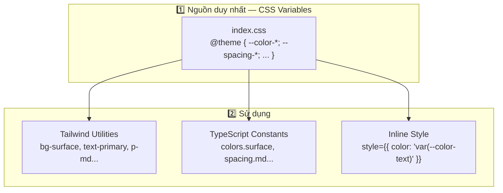

# Theme Tokens & CSS Framework — Quản Lý Tài Chính

> **Phiên bản**: 1.0 · **Ngày**: 2026-08-01 · **Trạng thái**: DRAFT
>
> Port toàn bộ Design Tokens từ fe-simulator (Kotlin/Compose) → Web (CSS + React)

---

## 1. CSS Framework Decision

### Tại sao Tailwind CSS 4?

| Tiêu chí | Tailwind CSS 4 | Vanilla CSS | CSS Modules | styled-components | Panda CSS |
|:---|:---|:---|:---|:---|:---|
| **Design Token mapping** | `@theme` → CSS vars | Thủ công | Thủ công | Theme provider | `tokens.ts` → codegen |
| **Zero runtime** | ✅ | ✅ | ✅ | ❌ (12KB) | ✅ |
| **Tree-shaking** | ✅ Tự động | Thủ công | ✅ | ❌ | ✅ |
| **Component pattern** | className | className | `.module.css` | `<StyledDiv>` | `css({...})` |
| **Gần fe-simulator nhất** | Token → class | Token → var | Token → var | Token → theme | Token → fn |
| **DX (Dev Experience)** | Rất tốt | Trung bình | Tốt | Tốt | Tốt |
| **Bundle size** | ~3KB | 0 | 0 | ~12KB | 0 |
| **Learning curve** | Thấp | Thấp | Thấp | Thấp | Trung bình |

**Quyết định: Tailwind CSS 4** — vì:

1. **`@theme` directive** ánh xạ token → utility class tự động, không cần `tailwind.config.js`
2. CSS-first configuration: token là CSS custom properties, Tailwind đọc từ đó
3. Giống pattern fe-simulator nhất: centralized tokens → applied everywhere
4. Vite plugin chính thức, HMR nhanh
5. Tree-shaking mặc định, bundle chỉ chứa class đã dùng

### Kiến trúc 3 lớp Token



---

## 2. Complete Theme Tokens

### 2.1 CSS Variables — Source of Truth

```css
/* src/ui/theme/tokens.css */
@import 'tailwindcss';

/* ═══════════════════════════════════════════
   THEME TOKENS — Port từ FeColors + FeSpacing + FeDimens
   ═══════════════════════════════════════════ */

@theme {
  /* ─── Spacing Scale ─── */
  --spacing-xs: 4px;
  --spacing-sm: 6px;
  --spacing-md: 8px;
  --spacing-lg: 12px;
  --spacing-xl: 16px;
  --spacing-2xl: 24px;
  --spacing-3xl: 32px;

  /* ─── Border Radius ─── */
  --radius-field: 4px;
  --radius-panel: 6px;
  --radius-dialog: 8px;
  --radius-badge: 12px;
  --radius-full: 9999px;

  /* ─── Typography ─── */
  --font-sans: 'Inter', -apple-system, BlinkMacSystemFont, 'Segoe UI', sans-serif;
  --font-mono: 'JetBrains Mono', 'Fira Code', monospace;

  --text-xs: 11px;
  --text-xs--line-height: 16px;
  --text-sm: 12px;
  --text-sm--line-height: 18px;
  --text-base: 13px;
  --text-base--line-height: 20px;
  --text-lg: 14px;
  --text-lg--line-height: 22px;
  --text-xl: 16px;
  --text-xl--line-height: 24px;
  --text-2xl: 20px;
  --text-2xl--line-height: 28px;

  --font-weight-normal: 400;
  --font-weight-medium: 500;
  --font-weight-semibold: 600;
  --font-weight-bold: 700;

  /* ─── Shadows ─── */
  --shadow-dialog: 0 8px 30px rgba(0, 0, 0, 0.12);
  --shadow-dropdown: 0 4px 12px rgba(0, 0, 0, 0.1);
  --shadow-tooltip: 0 2px 8px rgba(0, 0, 0, 0.15);

  /* ─── Transitions ─── */
  --ease-out: cubic-bezier(0.16, 1, 0.3, 1);
  --duration-fast: 150ms;
  --duration-normal: 200ms;
  --duration-slow: 300ms;
}

/* ═══════════════════════════════════════════
   COLOR TOKENS
   ═══════════════════════════════════════════ */

:root {
  /* ─── Surface Colors ─── */
  --color-background: #EFF2F7;
  --color-surface: #FAFBFC;
  --color-surface-hover: #F1F5F9;
  --color-surface-active: #E2E8F0;
  --color-border: #CBD5E1;
  --color-border-subtle: #E0E3E8;
  --color-border-focus: #1565C0;

  /* ─── Text Colors ─── */
  --color-text-primary: #333333;
  --color-text-secondary: #475569;
  --color-text-muted: #64748B;
  --color-text-disabled: #94A3B8;
  --color-text-inverse: #FFFFFF;

  /* ─── Accent (Primary) ─── */
  --color-accent-bg: #E3F2FD;
  --color-accent-bg-hover: #BBDEFB;
  --color-accent-fg: #1565C0;
  --color-accent-fg-hover: #0D47A1;

  /* ─── Secondary ─── */
  --color-secondary-bg: #E0F2F1;
  --color-secondary-fg: #0F766E;

  /* ─── Neutral ─── */
  --color-neutral-bg: #ECEFF1;
  --color-neutral-bg-hover: #CFD8DC;
  --color-neutral-fg: #37474F;

  /* ─── Success ─── */
  --color-success-bg: #ECFDF5;
  --color-success-bg-badge: #D1FAE5;
  --color-success-fg: #065F46;
  --color-success-fg-hover: #064E3B;

  /* ─── Warning ─── */
  --color-warning-bg: #FEF3C7;
  --color-warning-fg: #92400E;
  --color-warning-fg-hover: #78350F;

  /* ─── Danger ─── */
  --color-danger-bg: #FFEBEE;
  --color-danger-fg: #C62828;
  --color-danger-fg-hover: #B71C1C;

  /* ─── Info ─── */
  --color-info-bg: #E0F2FE;
  --color-info-banner: #EFF6FF;
  --color-info-fg: #1E3A8A;

  /* ─── Tooltip ─── */
  --color-tooltip-bg: #1E293B;
  --color-tooltip-fg: #F8FAFC;
  --color-tooltip-border: #334155;

  /* ─── Button Specific ─── */
  --color-run-bg: #1565C0;
  --color-run-bg-hover: #0D47A1;
  --color-run-fg: #FFFFFF;
  --color-cancel-bg: #F57C00;
  --color-cancel-fg: #FFFFFF;
  --color-disconnect-bg: #C62828;
  --color-disconnect-fg: #FFFFFF;

  /* ─── Grid Colors ─── */
  --color-grid-header-bg: #F1F5F9;
  --color-grid-header-fg: #334155;
  --color-grid-row-even: #FFFFFF;
  --color-grid-row-odd: #FAFBFC;
  --color-grid-row-hover: #F1F5F9;
  --color-grid-row-selected: #E3F2FD;
  --color-grid-divider: #E2E8F0;

  /* ─── Chart Colors ─── */
  --color-chart-1: #2563EB;
  --color-chart-2: #7C3AED;
  --color-chart-3: #16A34A;
  --color-chart-4: #D97706;
  --color-chart-5: #EC4899;
  --color-chart-6: #14B8A6;
  --color-chart-grid: #CBD5E1;

  /* ─── Status Badge Colors ─── */
  --color-badge-online-bg: #D1FAE5;
  --color-badge-online-fg: #065F46;
  --color-badge-offline-bg: #E2E8F0;
  --color-badge-offline-fg: #64748B;
  --color-badge-warning-bg: #FEF3C7;
  --color-badge-warning-fg: #92400E;
  --color-badge-error-bg: #FEE2E2;
  --color-badge-error-fg: #B91C1C;

  /* ─── Form Elements ─── */
  --color-input-bg: #FFFFFF;
  --color-input-border: #CBD5E1;
  --color-input-focus-ring: #1565C0;
  --color-input-placeholder: #94A3B8;
  --color-input-disabled-bg: #F1F5F9;

  /* ─── Sidebar ─── */
  --color-sidebar-bg: #1E293B;
  --color-sidebar-fg: #CBD5E1;
  --color-sidebar-active-bg: #334155;
  --color-sidebar-active-fg: #FFFFFF;
  --color-sidebar-hover-bg: #1E293B;
  
  /* ─── Scrollbar ─── */
  --color-scrollbar-thumb: #CBD5E1;
  --color-scrollbar-track: transparent;
}
```

### 2.2 Tailwind v4 Utility Mapping

```css
/* src/ui/theme/utilities.css */
/* Tailwind v4 tự động sinh utilities từ @theme variables.
   Các class dưới đây là custom utilities bổ sung. */

@utility scrollbar-thin {
  scrollbar-width: thin;
  scrollbar-color: var(--color-scrollbar-thumb) var(--color-scrollbar-track);

  &::-webkit-scrollbar { width: 6px; height: 6px; }
  &::-webkit-scrollbar-thumb {
    background: var(--color-scrollbar-thumb);
    border-radius: 3px;
  }
  &::-webkit-scrollbar-track { background: transparent; }
}

@utility text-ellipsis {
  overflow: hidden;
  text-overflow: ellipsis;
  white-space: nowrap;
}

@utility drag-none {
  -webkit-user-drag: none;
  user-select: none;
}
```

### 2.3 TypeScript Constants

```typescript
// src/ui/theme/tokens.ts
// Port từ FeColors + FeSpacing + FeDimens của fe-simulator
// Dùng khi cần giá trị trong JS (chart config, inline styles, canvas...)

export const colors = {
  // Surface
  background:       '#EFF2F7',
  surface:          '#FAFBFC',
  surfaceHover:     '#F1F5F9',
  surfaceActive:    '#E2E8F0',
  border:           '#CBD5E1',
  borderSubtle:     '#E0E3E8',
  borderFocus:      '#1565C0',

  // Text
  textPrimary:      '#333333',
  textSecondary:    '#475569',
  textMuted:        '#64748B',
  textDisabled:     '#94A3B8',
  textInverse:      '#FFFFFF',

  // Accent
  accentBg:         '#E3F2FD',
  accentBgHover:    '#BBDEFB',
  accentFg:         '#1565C0',
  accentFgHover:    '#0D47A1',

  // Secondary
  secondaryBg:      '#E0F2F1',
  secondaryFg:      '#0F766E',

  // Neutral
  neutralBg:        '#ECEFF1',
  neutralBgHover:   '#CFD8DC',
  neutralFg:        '#37474F',

  // Semantic
  success:  { bg: '#ECFDF5', fg: '#065F46', badge: '#D1FAE5' },
  warning:  { bg: '#FEF3C7', fg: '#92400E' },
  danger:   { bg: '#FFEBEE', fg: '#C62828' },
  info:     { bg: '#E0F2FE', fg: '#1E3A8A', banner: '#EFF6FF' },

  // Button variants
  run:        { bg: '#1565C0', fg: '#FFFFFF', hover: '#0D47A1' },
  cancel:     { bg: '#F57C00', fg: '#FFFFFF' },
  disconnect: { bg: '#C62828', fg: '#FFFFFF' },
  danger:     { bg: '#FFEBEE', fg: '#C62828', hover: '#B71C1C' },
  neutral:    { bg: '#ECEFF1', fg: '#37474F', hover: '#CFD8DC' },
  accent:     { bg: '#E3F2FD', fg: '#1565C0' },

  // Grid
  grid: {
    headerBg:    '#F1F5F9',
    headerFg:    '#334155',
    rowEven:     '#FFFFFF',
    rowOdd:      '#FAFBFC',
    rowHover:    '#F1F5F9',
    rowSelected: '#E3F2FD',
    divider:     '#E2E8F0',
    statusOk:    '#15803D',
    statusFail:  '#B91C1C',
    statusNeutral: '#64748B',
  },

  // Charts
  chart: [
    '#2563EB', '#7C3AED', '#16A34A', '#D97706',
    '#EC4899', '#14B8A6', '#F97316', '#8B5CF6',
  ],
  chartGrid: '#CBD5E1',

  // Sidebar
  sidebar: {
    bg: '#1E293B',
    fg: '#CBD5E1',
    activeBg: '#334155',
    activeFg: '#FFFFFF',
  },

  // Badges
  badge: {
    online:  { bg: '#D1FAE5', fg: '#065F46' },
    offline: { bg: '#E2E8F0', fg: '#64748B' },
    warning: { bg: '#FEF3C7', fg: '#92400E' },
    error:   { bg: '#FEE2E2', fg: '#B91C1C' },
  },

  // Expense categories (mapped to FR-EXP-006)
  category: {
    office:         '#3B82F6',
    rent:           '#8B5CF6',
    utilities:      '#F59E0B',
    salary:         '#10B981',
    marketing:      '#EC4899',
    supplies:       '#6366F1',
    transportation: '#14B8A6',
    maintenance:    '#F97316',
    tax:            '#EF4444',
    other:          '#6B7280',
  },
} as const;

export const spacing = {
  xs:  4,
  sm:  6,
  md:  8,
  lg:  12,
  xl:  16,
  '2xl': 24,
  '3xl': 32,
} as const;

export const radius = {
  field:  4,
  panel:  6,
  dialog: 8,
  badge:  12,
  full:   9999,
} as const;

export const typography = {
  fontFamily: {
    sans: "'Inter', -apple-system, BlinkMacSystemFont, 'Segoe UI', sans-serif",
    mono: "'JetBrains Mono', 'Fira Code', monospace",
  },
  fontSize: {
    xs:   11,
    sm:   12,
    base: 13,
    lg:   14,
    xl:   16,
    '2xl': 20,
  },
  fontWeight: {
    normal:   400,
    medium:   500,
    semibold: 600,
    bold:     700,
  },
  lineHeight: {
    xs:   '16px',
    sm:   '18px',
    base: '20px',
    lg:   '22px',
    xl:   '24px',
    '2xl': '28px',
  },
} as const;

export const dimens = {
  formControlHeight: 28,
  fieldLabelLineHeight: 14,
  fieldLabelGap: 2,
  iconSize: 16,
  buttonIconSize: 15,
  checkboxSize: 18,
  badgeRadius: 12,
  dialogWidth: 500,
  dialogElevation: 12,
  pickListMaxHeight: 280,
  chartDefaultHeight: 180,
  sidebarWidth: 220,
  sidebarCollapsedWidth: 56,
  headerHeight: 48,
  statusBarHeight: 32,
  gridRowHeight: 48,
  toolbarHeight: 40,
} as const;

export const shadows = {
  dialog:   '0 8px 30px rgba(0, 0, 0, 0.12)',
  dropdown: '0 4px 12px rgba(0, 0, 0, 0.1)',
  tooltip:  '0 2px 8px rgba(0, 0, 0, 0.15)',
} as const;

export const transitions = {
  fast:   '150ms',
  normal: '200ms',
  slow:   '300ms',
  ease:   'cubic-bezier(0.16, 1, 0.3, 1)',
} as const;
```

### 2.4 Component Style Presets

```typescript
// src/ui/theme/presets.ts
// Style presets dùng với Tailwind class — tương tự FeControlTokens

export const buttonPresets = {
  run: {
    className: 'bg-[var(--color-run-bg)] hover:bg-[var(--color-run-bg-hover)] text-[var(--color-run-fg)]',
  },
  danger: {
    className: 'bg-[var(--color-danger-fg)] hover:bg-[var(--color-danger-fg-hover)] text-white',
  },
  neutral: {
    className: 'bg-[var(--color-neutral-bg)] hover:bg-[var(--color-neutral-bg-hover)] text-[var(--color-neutral-fg)]',
  },
  accent: {
    className: 'bg-[var(--color-accent-bg)] hover:bg-[var(--color-accent-bg-hover)] text-[var(--color-accent-fg)]',
  },
} as const;

export const panelPresets = {
  solid: {
    className: 'bg-[var(--color-surface)] border border-[var(--color-border)] rounded-[var(--radius-panel)]',
  },
  translucent: {
    className: 'bg-[var(--color-surface)]/80 backdrop-blur-sm border border-[var(--color-border-subtle)] rounded-[var(--radius-panel)]',
  },
} as const;

export const badgePresets = {
  success:  'bg-[var(--color-badge-online-bg)] text-[var(--color-badge-online-fg)]',
  warning:  'bg-[var(--color-badge-warning-bg)] text-[var(--color-badge-warning-fg)]',
  error:    'bg-[var(--color-badge-error-bg)] text-[var(--color-badge-error-fg)]',
  neutral:  'bg-[var(--color-badge-offline-bg)] text-[var(--color-badge-offline-fg)]',
  accent:   'bg-[var(--color-accent-bg)] text-[var(--color-accent-fg)]',
} as const;

export const statusPresets = {
  paid:      badgePresets.success,
  pending:   badgePresets.warning,
  cancelled: badgePresets.error,
  completed: badgePresets.success,
  processing: badgePresets.accent,
  new:       badgePresets.neutral,
} as const;
```

---

## 3. Component Pattern (Port từ fe-simulator)

### 3.1 Panel Component

```tsx
// src/ui/components/Panel.tsx
import { type ReactNode } from 'react';
import type { LucideIcon } from 'lucide-react';

interface PanelProps {
  title?: string;
  icon?: LucideIcon;
  titleTrailing?: ReactNode;
  style?: 'solid' | 'translucent';
  className?: string;
  children: ReactNode;
}

export function Panel({
  title, icon: Icon, titleTrailing, style = 'solid', className, children,
}: PanelProps) {
  const preset = style === 'translucent' ? panelPresets.translucent : panelPresets.solid;

  return (
    <div className={`${preset.className} p-[var(--spacing-md)] ${className ?? ''}`}>
      {(title || titleTrailing) && (
        <div className="flex items-center justify-between mb-[var(--spacing-sm)]">
          <div className="flex items-center gap-[var(--spacing-xs)]">
            {Icon && <Icon size={14} className="text-[var(--color-accent-fg)]" />}
            {title && (
              <h3 className="text-sm font-semibold text-[var(--color-text-secondary)]">
                {title}
              </h3>
            )}
          </div>
          {titleTrailing}
        </div>
      )}
      {children}
    </div>
  );
}
```

### 3.2 Button Component

```tsx
// src/ui/components/Button.tsx
import { type ReactNode } from 'react';
import type { LucideIcon } from 'lucide-react';

type ButtonVariant = 'run' | 'danger' | 'neutral' | 'accent';

interface ButtonProps {
  children: ReactNode;
  variant?: ButtonVariant;
  icon?: LucideIcon;
  disabled?: boolean;
  busy?: boolean;
  onClick?: () => void;
  className?: string;
}

export function Button({
  children, variant = 'neutral', icon: Icon, disabled, busy, onClick, className,
}: ButtonProps) {
  return (
    <button
      onClick={onClick}
      disabled={disabled || busy}
      className={`
        inline-flex items-center gap-[var(--spacing-xs)] px-[var(--spacing-md)] py-[var(--spacing-xs)]
        text-xs font-medium rounded-[var(--radius-field)]
        transition-all duration-[var(--duration-fast)] ease-[var(--ease-out)]
        disabled:opacity-50 disabled:cursor-not-allowed
        ${buttonPresets[variant].className}
        ${className ?? ''}
      `}
    >
      {busy ? (
        <span className="animate-spin size-3 border-2 border-current border-t-transparent rounded-full" />
      ) : Icon && (
        <Icon size={15} />
      )}
      {children}
    </button>
  );
}
```

### 3.3 Badge Component

```tsx
// src/ui/components/Badge.tsx
type BadgeVariant = 'success' | 'warning' | 'error' | 'neutral' | 'accent';
type BadgeSize = 'sm' | 'md';

interface BadgeProps {
  children: string;
  variant?: BadgeVariant;
  size?: BadgeSize;
  dot?: boolean;
  className?: string;
}

export function Badge({ children, variant = 'neutral', size = 'sm', dot, className }: BadgeProps) {
  return (
    <span className={`
      inline-flex items-center gap-1 px-[var(--spacing-sm)] py-px
      text-xs font-medium rounded-[var(--radius-badge)]
      ${badgePresets[variant]}
      ${className ?? ''}
    `}>
      {dot && <span className="size-1.5 rounded-full bg-current" />}
      {children}
    </span>
  );
}
```

### 3.4 StatusBar Component

```tsx
// src/ui/components/StatusBar.tsx
interface StatusBarProps {
  syncStatus: 'synced' | 'syncing' | 'error' | 'offline';
  lastSync?: string;
}

export function StatusBar({ syncStatus, lastSync }: StatusBarProps) {
  const statusConfig = {
    synced:  { dot: 'bg-[var(--color-badge-online-fg)]',    text: 'Đã đồng bộ' },
    syncing: { dot: 'bg-[var(--color-badge-warning-fg)] animate-pulse', text: 'Đang đồng bộ...' },
    error:   { dot: 'bg-[var(--color-badge-error-fg)]',    text: 'Lỗi đồng bộ' },
    offline: { dot: 'bg-[var(--color-badge-offline-fg)]',   text: 'Ngoại tuyến' },
  };

  const config = statusConfig[syncStatus];

  return (
    <div className="flex items-center gap-[var(--spacing-sm)] h-[var(--dimens-statusBarHeight)] px-[var(--spacing-md)]
                    bg-[var(--color-surface)] border-t border-[var(--color-border)] text-xs text-[var(--color-text-muted)]">
      <span className={`size-2 rounded-full ${config.dot}`} />
      <span>{config.text}</span>
      {lastSync && <span>· {lastSync}</span>}
    </div>
  );
}
```

---

## 4. CSS Framework File Structure

```
src/ui/theme/
├── tokens.css           # CSS Variables + @theme (source of truth)
├── utilities.css        # Custom Tailwind utilities
├── tokens.ts            # TypeScript constants (colors, spacing, typography, dimens)
├── presets.ts           # Component style presets (button, badge, panel...)
└── index.ts             # Barrel export
```

Tất cả component dùng chung 1 trong 3 cách:

```tsx
// Cách 1: Tailwind utility classes (phổ biến nhất)
<div className="bg-[var(--color-surface)] text-[var(--color-text-primary)] p-[var(--spacing-md)]">

// Cách 2: Preset classes
<button className={buttonPresets.run.className}>

// Cách 3: Inline style (khi cần giá trị động, chart config...)
<div style={{ color: colors.accentFg, padding: spacing.md }}>
```
