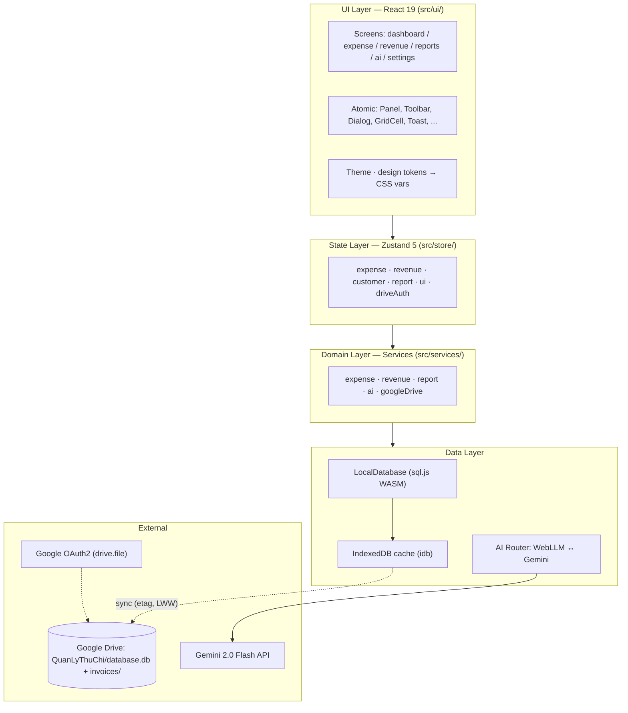
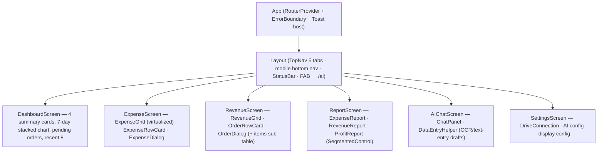
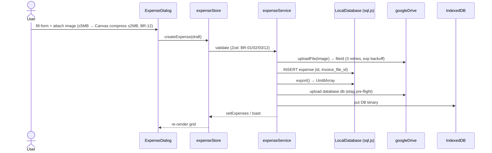

# Lean Architecture — M-001 "Quản Lý Tài Chính" (Personal Finance Manager)

> Source of truth: [`docs/01-architecture.md`](../../01-architecture.md) (validated), [`docs/05-technical-decisions.md`](../../05-technical-decisions.md) (resolved decisions), [`docs/02-data-models.md`](../../02-data-models.md) (entities/schema), [`ba/00-lean-spec.md`](../ba/00-lean-spec.md) (requirements), [`domain-analyst/00-lean-domain.md`](../domain-analyst/00-lean-domain.md) (bounded contexts). This artifact validates and reconciles `01-architecture.md`; where it diverges, the resolved decision (cited) wins.

## Summary

A single-user, offline-first finance manager as a React 19 SPA (PWA + Electron portable) that persists its system of record as a **SQLite database (sql.js WASM) on the user's own Google Drive** (`QuanLyThuChi/`, scope `drive.file`), with IndexedDB as the offline cache and a **hybrid AI router** (local WebLLM Qwen 2.5 0.5B ↔ Gemini 2.0 Flash) for chat/OCR. The key trade-off: Google Drive-as-datastore buys zero-cost, user-owned, multi-device sync but caps the model at whole-file sync with last-write-wins conflict semantics — acceptable at ≤50K records/type (NFR-SCALE-001/002) with client-side filtering over an indexed local DB.

## 1. Architecture Overview & Principles

Layered, unidirectional architecture: **UI → State (Zustand) → Domain (Services) → Data (sql.js + IndexedDB + Drive) → External** (`01-architecture.md` §2). Bounded contexts from the domain model (Finance Core · Reporting · AI Assistant · Platform/Sync · UI/App Shell) map to these layers; all contexts run in one client process — the context map constrains layering, not deployment.

| Principle | Rule | Source |
|---|---|---|
| Strict layering | UI → State → Service → External; no layer skips (no direct API calls from UI) | `01-architecture.md` §1–2 |
| Uni-directional state | View → Action → Store → View; stores have **no side effects** (network/storage live in services) | `01-architecture.md` §1; `05-technical-decisions.md` §2 |
| User-owned data | Google Drive is the system of record; the app runs **no server** and stores nothing it does not need | BA NFR-SEC-003; `05-technical-decisions.md` §3 |
| Offline-first | Full read/write from IndexedDB cache; background sync on reconnect | BA NFR-AVAIL-001; CON-004 |
| Design tokens in one place | Theme (colors/spacing/typography) → CSS variables → Tailwind 4 `@theme` | `01-architecture.md` §1; `05-technical-decisions.md` §9 |

### Validation of `docs/01-architecture.md` — drifts resolved

| # | Area | As written | Resolved (adopt) | Source |
|---|---|---|---|---|
| V1 | Local AI model | §2 diagram: "WebLLM Local · **Gemma 2B**" | **Qwen 2.5 0.5B Instruct** (~280MB), TinyLlama 1.1B fallback; Gemma rejected (3–6 t/s on i3) | `05-technical-decisions.md` §4; BA AMB-002 |
| V2 | Storage | §1/§5: per-entity **JSON files** on Drive; §6: **SQLite `database.db`** | **SQLite via sql.js** (single binary file, indexes, migrations); §5 flows are stale JSON-era drafts | `05-technical-decisions.md` §5; BA AMB-001 |
| V3 | "AuthStore" | Store listed as app auth | **Drive-OAuth connection store** (no app login; OAuth is Drive-only, `drive.file`) | BA AMB-003; FR-CFG-001 |
| V4 | Stack gaps | §3 omits validation/virtualization/PWA tooling | Add Zod 3, `date-fns`, `@tanstack/react-virtual`, `vite-plugin-pwa`, Canvas compression | `05-technical-decisions.md` §6–9; BA FR-EXP-001/007 |
| V5 | AI routing | §5.3/5.4 assume Gemini for all analysis | **3-tier router** (SIMPLE→local always; MEDIUM→Gemini w/ local fallback; COMPLEX→Gemini else graceful error) + 1,500 req/day quota counter | `05-technical-decisions.md` §4 "Fallback Strategy"; BA FR-AI-000, AC-AI-02 |
| V6 | Deployment | Not specified | PWA → Vercel; Electron portable w/ GitHub Releases auto-update | `05-technical-decisions.md` §10; BA FR-POR-001/002 |

## 2. Layer Diagram & Responsibilities



| Layer | Responsibility | Forbidden |
|---|---|---|
| **UI** | Render, event capture, dialogs, toasts, navigation | No direct API/storage calls; no business rules |
| **State** | Derived selectors, transient UI state, orchestration entry | No side effects (fetch/storage) — delegates to services |
| **Domain (Services)** | Business rules (BR-01…15), validation (Zod), state machines, orchestration, Drive/AI clients | No DOM, no UI state |
| **Data** | SQLite persistence, IndexedDB cache, retry/backoff, token refresh, AI provider calls | No business logic |

*(Responsibilities per `01-architecture.md` §2; rule IDs per BA §8.)*

## 3. Technology Stack

| Layer | Technology | Rationale (source) |
|---|---|---|
| Framework | React 19 + TypeScript (`strict: true`) | Largest ecosystem; official Google SDKs; Zustand ≈ StateFlow parity (`05-technical-decisions.md` §2; BA NFR-MAINT-003) |
| Build | Vite 6 + `vite-plugin-pwa` | Fast HMR; SW/offline manifest generation (`05-technical-decisions.md` §8) |
| Styling | Tailwind CSS 4 + CSS variables | Utility-first; ports fe-simulator tokens; no runtime cost (`05-technical-decisions.md` §9) |
| State | Zustand 5 | Minimal boilerplate; unidirectional, immutable (`05-technical-decisions.md` §2) |
| Routing | React Router 7 | Layout routes + lazy loading for 6 screens |
| Validation | Zod 3 | TS-first schemas → types; 12KB gz (`05-technical-decisions.md` §7) |
| Grid | `@tanstack/react-virtual` | 10K+ rows, ~20 rendered (`05-technical-decisions.md` §6; BA FR-EXP-001) |
| Charts | Recharts 2 | Familiar API; dashboard + report charts (BA FR-DASH-002, FR-RPT) |
| Dates/currency | `date-fns` (vi locale) + VND utils | Light, tree-shakeable, DD/MM/YYYY + VND formatting (`05-technical-decisions.md` §9) |
| Storage | `sql.js` (SQLite WASM) + `idb` | 6MB @50K records, indexed queries; 2KB cache lib (`05-technical-decisions.md` §5) |
| Drive | `@googleapis/drive` + Google Identity Services | OAuth2 + Drive API v3, `drive.file` scope |
| AI | `@google/genai` (Gemini 2.0 Flash) + WebLLM (Qwen 2.5 0.5B) | Vision OCR + generation; local fallback chat (`05-technical-decisions.md` §4) |
| Test/Lint | Vitest + RTL · ESLint 9 + Prettier | Vite-native; ≥60% coverage, clean lint (BA NFR-MAINT-001/002) |

**Deliberately excluded** (`05-technical-decisions.md` §10): Next.js (SPA is enough), Redux, React Query/TanStack Query (no server API), shadcn/ui (own design system), tRPC/Prisma/Docker (no backend).

## 4. Component Tree (top-level)



*(Component inventory from `01-architecture.md` §4; screen behavior per BA §5 modules.)* All dialogs/grid cells are atomic components (`Panel`, `Toolbar`, `ActionBar`, `Dialog`, `GridCell`, `Badge`, `Toast`, `DatePicker`, `ImagePreview` — `01-architecture.md` §4).

## 5. Data Flow Diagrams

All flows: View → store action → **service** (validation + side effects) → data layer → store update → re-render.

### 5.1 Expense create (with invoice photo)



### 5.2 Order create

```mermaid
sequenceDiagram
    actor User
    participant UI as OrderDialog
    participant Store as revenueStore
    participant Svc as revenueService
    participant DB as LocalDatabase
    participant Drive as googleDrive

    User->>UI: pick customer + ≥1 item lines
    UI->>Store: createOrder(orderDraft)
    Store->>Svc: validate (BR-06/07); compute totals; gen orderCode DH-YYYYMMDD-NNN (BR-05)
    Svc->>DB: INSERT revenues + order_items (txn); export()
    Svc->>Drive: upload database.db (etag pre-flight)
    Svc-->>Store: setRevenues / toast
    Store-->>UI: re-render grid
```

### 5.3 AI chat (3-tier router)

```mermaid
sequenceDiagram
    actor User
    participant UI as ChatPanel
    participant Svc as aiService
    participant Router as AI Router
    participant Local as WebLLM (Qwen 0.5B)
    participant Gemini as Gemini 2.0 Flash
    participant Store as stores

    User->>UI: "Phân tích chi phí tháng 7" / OCR image
    UI->>Svc: ask(question, ctx) | ocrInvoice(image)
    Svc->>Router: classify(request)  # SIMPLE → local; MEDIUM → cloud→local; COMPLEX → cloud→error
    alt SIMPLE (chat, totals)
        Router->>Local: generate (stream)
        Local-->>UI: streaming markdown
    else MEDIUM/COMPLEX (analysis, OCR) + online + key
        Svc->>Store: getExpenses({month})  # grounded context
        Router->>Gemini: generateContent(prompt+data | image)
        Gemini-->>UI: analysis text + chartSuggestions | extractedData → pre-fill dialog
    else offline / no key / quota exhausted
        Router-->>UI: clear "requires internet/key" message (AC-AI-02); basic fallback for SIMPLE/MEDIUM
    end
```

### 5.4 Sync (startup + background)

```mermaid
sequenceDiagram
    participant App
    participant Cache as IndexedDB
    participant DB as LocalDatabase
    participant Drive as Google Drive

    App->>Cache: DB binary cached?
    alt cached
        App->>DB: open from cache (instant, offline-ready)
        App->>Drive: HEAD database.db → etag
        alt remote newer
            App->>Drive: GET binary → open → refresh cache/UI
        else same etag
            App-->>StatusBar: 🟢 synced
        end
    else first run
        App->>Drive: GET database.db? (folder QuanLyThuChi/)
        alt exists → open + cache; else → create empty DB + schema v1
        end
    end
    Note over App,Drive: writes: DB txn → export() → queue → etag pre-flight → upload; conflict → LWW + DriveSyncConflictDetected toast
```

*(Flows adapted from `01-architecture.md` §5 with the SQLite resolution V2; retry/timeout per BA NFR-AVAIL-002; events per domain model §3.)*

## 6. Route Design

React Router 7 **layout route** (`Layout` = nav shell) with `React.lazy` + `Suspense` per screen; guard with an `ErrorBoundary` at root.

| Route | Screen | Nav (top 5 tabs per `03-ui-design.md`:228) | Lazy chunk |
|---|---|---|---|
| `/` | Dashboard (Tổng quan) | ✅ | `Dashboard` |
| `/expense` | Expense (Chi phí) | ✅ | `Expense` |
| `/revenue` | Revenue (Doanh thu) | ✅ | `Revenue` |
| `/reports` | Reports (Báo cáo) | ✅ | `Reports` |
| `/settings` | Settings (Cài đặt) | ✅ | `Settings` |
| `/ai` | AI Chat (FAB-launched, not a tab) | ➖ (FAB → `/ai`) | `AIChat` |

Mobile (<768px): top nav becomes bottom nav with safe-area padding (`03-ui-design.md` §5.3). Sitemap intel (`sitemap.json`) does not exist yet — these 6 routes are the proposed canonical set for the orchestrator's `/intel-refresh` (see verdict).

## 7. State Management Design (Zustand)

| Store | State | Actions (delegate to services — no side effects) |
|---|---|---|
| `expenseStore` | `expenses[]`, `filters`, `pagination`, `sort`, `selection` | `load()`, `create()`, `update()`, `removeMany()`, `changeStatus()` (BR-04), `applyFilters()` (debounced 300ms) |
| `revenueStore` | `revenues[]`, `orders`, `customers`, `filters` | `createOrder()` (BR-05…09), `changeOrderStatus()`, `changeDeliveryStatus()`, customer CRUD (BR-10/11) |
| `customerStore` | `customers[]`, search index | `create()`, `update()`, `deleteGuarded()` (BR-11) |
| `reportStore` | projections (expense/revenue/P&L) + date range | `generate(kind, range)` (BR-13) — read-only projections, never written by user |
| `uiStore` | theme, dialogs, toasts, nav state, status bar, mobile nav | toast rules per `05-technical-decisions.md` §5 |
| `driveAuthStore` | OAuth token, connection status, sync state, Gemini key state | `connect()`, `disconnect()`, `syncNow()` (FR-CFG-001) — renamed from architecture "AuthStore" per V3 |

Derived selectors compute dashboard/report numbers (e.g. `profit = revenue − expense`, margin %) — no duplicated raw math in components.

## 8. Storage & Sync Strategy

**System of record:** Google Drive folder `QuanLyThuChi/` — `database.db` (SQLite via sql.js WASM; tables `expenses`, `revenues`, `order_items`, `customers`, `schema_version` per `02-data-models.md` §6) + `invoices/` (image files named `inv_YYYYMMDD_HHmmss.ext`). Money stored as **INTEGER VND** to avoid float errors (`02-data-models.md` §6).

| Concern | Design | Source |
|---|---|---|
| First load | Download `database.db` → open via sql.js → cache binary in IndexedDB | `01-architecture.md` §6 |
| Subsequent loads | Open from cache (instant) → `HEAD` etag check → download only if newer | `01-architecture.md` §6 |
| Writes | Local SQL txn → `export()` binary → etag pre-flight → upload; IndexedDB cache updated immediately (optimistic UI) | `01-architecture.md` §6; `05-technical-decisions.md` §5 |
| Conflict | Last-write-wins; etag HEAD before upload; on mismatch → toast `DriveSyncConflictDetected` | `01-architecture.md` §6; domain model §3 |
| Offline | Read/write from cache; write queue flushed on reconnect; 3 retries exponential backoff; AI timeout 30s | BA NFR-AVAIL-001/002 |
| Migration | `schema_version` table + versioned SQL migration scripts | `05-technical-decisions.md` §5 |
| Scale | ~6MB @50K records; auto-split/archive beyond <50MB cap | `05-technical-decisions.md` §5; BA NFR-SCALE-003 |
| Retention | Drive version history = 30-day recovery for permanent deletes (BR-15); IndexedDB cache cleared after 30 days unused | BA BR-15; SRS §7.3 |

## 9. Security Considerations

| Concern | Control | Source |
|---|---|---|
| Authentication | Google OAuth2 only (no user/pass); token in **IndexedDB** with auto-refresh; Electron uses same browser flow | BA NFR-SEC-001/005 |
| Authorization | `drive.file` scope — app touches only its own `QuanLyThuChi/` folder | BA NFR-SEC-001; `01-architecture.md` §7 |
| Secrets | Gemini API key user-provided, **AES-encrypted (WebCrypto) in IndexedDB**, never hardcoded, decrypt only in memory | BA NFR-SEC-002; `01-architecture.md` §7 |
| Transport | HTTPS everywhere (PWA + Drive/Gemini TLS 1.3); CSP header on the SPA | BA NFR-SEC-004 |
| Trust boundary | **No app server** (user-owned data, NFR-SEC-003) — the external trust boundaries are Google (OAuth/Drive/Gemini) only | BA §9; domain model §6 |
| XSS (new) | AI markdown rendered via sanitizer (DOMPurify) before `dangerouslySetInnerHTML`; never trust model output | BA FR-AI-006 (streaming markdown) |
| PII | Customer phone/name stored in user's own Drive DB; no server copies; deletion is permanent + confirm dialog (BR-15) | BA §9; domain model §6 |

## 10. Cross-cutting Concerns

- **Error handling:** services throw typed errors → store maps to user-facing messages; toast rules (success 3s, errors 5s) per `05-technical-decisions.md` §5; every screen has an empty state (NFR-AVAIL-004); AI failures degrade per tier (AC-AI-02) — never crash.
- **Logging/observability:** lightweight structured logger (console, no PII); sync status + AI provider indicator in StatusBar; no server telemetry (privacy-first). `DriveSyncCompleted` / `AiProviderSwitched` events drive status UI (domain model §3).
- **Theming:** tokens in `src/ui/theme/` (`colors.ts` FeColors, `spacing.ts`, `typography.ts`) → CSS variables → Tailwind 4 `@theme`; light/dark from Settings (FR-CFG-003); vi locale + DD/MM/YYYY + VND currency utils centralized (`utils/currency.ts`, `utils/date.ts`).
- **Performance:** virtualized grid (`react-virtual`), debounced search (300ms), lazy route chunks, bundle ≤500KB gz (CON-008), WASM sql.js lazy-loaded.

## 11. Architecture Decision Records (key)

| ADR | Decision | Chosen | Rejected | Rationale |
|---|---|---|---|---|
| ADR-001 | Layering | UI → State → Domain → Data | Feature-slices; DDD-heavy | StateFlow parity with fe-simulator; testable, no layer skips (`01-architecture.md` §2) |
| ADR-002 | State lib | Zustand 5 | Redux, Pinia | Minimal boilerplate, immutable, unidirectional (`05-technical-decisions.md` §2) |
| ADR-003 | Datastore | SQLite (sql.js) on Drive | Per-entity JSON files | 100K-records: 12MB/15ms vs 50MB/4–5s parse; indexes + migrations (`05-technical-decisions.md` §5; BA AMB-001) |
| ADR-004 | AI | Hybrid: WebLLM Qwen 0.5B + Gemini 2.0 Flash | Cloud-only; Local-only; Gemma 2B | Chat works offline without key; OCR needs cloud; Gemma too slow on i3 (`05-technical-decisions.md` §4; BA AMB-002) |
| ADR-005 | Data ownership | Google Drive (user's account) | Firebase, Supabase, Sheets | Zero cost, user-owned, auto-backup; trade-off: client-side query only (`05-technical-decisions.md` §3) |
| ADR-006 | Side-effect boundary | Stores pure; services own side effects | Effects in stores | Deterministic state, mockable services, matches AC-EXP/AI tests (BA §10) |
| ADR-007 | Delivery | PWA (Vercel) + Electron portable | Native apps | 1 codebase, desktop-like UX, ≤200MB portable, GitHub Releases auto-update (BA FR-POR-001/002) |
| ADR-008 | Forms & grid | Zod schemas + `@tanstack/react-virtual` | Hand-rolled validation; full DOM grid | TS-first validation; 10K-row grid at ~20 DOM nodes (`05-technical-decisions.md` §6/7) |

## Open Questions (handoff)

| ID | Question | Owner | Status |
|---|---|---|---|
| OQ-1 (AMB-005) | FX rate source for BR-14 (fixed table vs live API) | tech-lead | Open — recommend rate table refreshed via Gemini when online |
| OQ-2 | `revenues` SQL has denormalized `customer_name/phone` alongside `customer_id` (TS model uses FK only) | tech-lead | Reconcile during implementation (`02-data-models.md` §3/§6) |
| OQ-3 | Sitemap/data-model intel files absent — persist 6 routes + 4 entities via `/intel-refresh` | orchestrator | Open — flagged `intel-drift` |

## Handoff Notes

- **engineering-technical-lead:** plan by layer (theme → utils/models → data → services → stores → UI), wave-1 scope = Dashboard + Expense CRUD + SQLite/IndexedDB core; resolve OQ-1/2 before backend tasks; `implementations.yaml` services[] may be populated with the app root as the sole implementation.
- **engineering-backend-developer:** implement `LocalDatabase` (sql.js wrapper) + `googleDrive` client first (every feature depends on them); strict layering — no store-side effects; Zod schemas mirror `02-data-models.md` §2–4 exactly.
- **engineering-qa-engineer:** scenario coverage in BA §10 (TS-01…11); note `skills/_shared/qa-common-tests.md` is absent from this workspace.
- **engineering-code-reviewer:** check layering violations (UI→Data), INTEGER money, etag pre-flight, DOMPurify on AI output, AES key storage.
