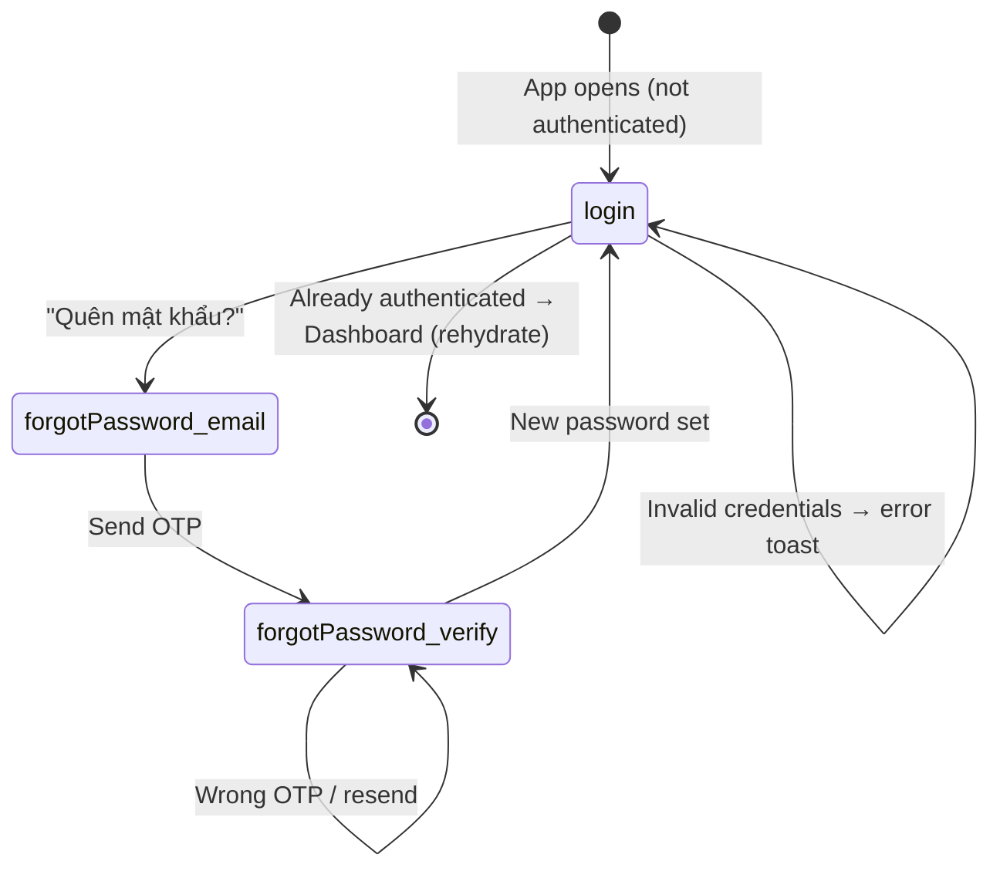
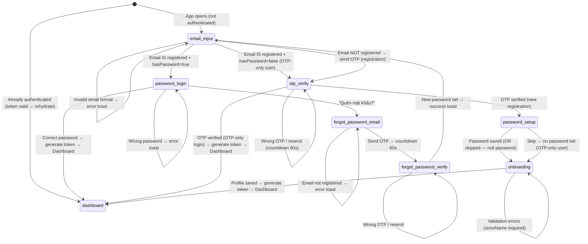

# Lean BA Spec — Email-First Login/Register Flow Redesign

> **Source:** TRI-1785654613365-fb2c (C3 scope_expansion).
> This spec REPLACES the archived `ba/00-lean-spec.md` (2026-08-02T07-26-54Z) for the auth redesign only;
> the archived spec covered the entire M-001 module. This spec scopes to the email-first auth flow,
> multi-user storage migration, OTP-based registration, and post-registration onboarding.

## 1. Summary

Redesign the login/register flow from the current single-user email+password form to an **email-first**
flow where the user enters their email FIRST, and the UI branches based on whether that email is
registered and whether it has a password set:

- **Registered + password** → password login
- **Registered + no password (OTP-only user)** → OTP verification → login
- **Not registered** → OTP registration → optional password setup → onboarding → app

The underlying storage migrates from a single `StoredCredentials` object in `localStorage` key
`ql-tc-local-auth` to a **multi-user map** (`Record<string, StoredCredentials>`) under the same key,
enabling multiple distinct user profiles on the same device.

Existing primitives (`verifyPassword`, `hashPassword`, `generateOTP`, `sendOTPEmail`, HMAC-SHA256
session tokens, `tokenService.ts`) are **preserved unchanged**. The forgot-password flow is adapted
to multi-user storage but retains the same 2-step UX (email → OTP → new password).

## 2. Scope

### In scope

| Area | Description |
|---|---|
| AuthScreen state machine | Expand from 2 states (`login`, `forgotPassword`) to 5 states (`email-input`, `password-login`, `otp-verify`, `password-setup`, `forgot-password`) |
| Multi-user storage | Migrate `storeUserCredentials`/`getUserCredentials`/`userExists`/`initAdminAccount` from single-object to `Record<string, StoredCredentials>` map |
| `registerUser()` | New function: create a user with optional password + profile, persist to multi-user store |
| OTP registration flow | Send OTP to unregistered email → verify 6-digit code → optional password setup → enter app |
| OTP login flow (OTP-only user) | Send OTP to registered email without password → verify 6-digit code → log in |
| `StoredCredentials.hasPassword` | New boolean field: `true` when `passwordHash` is non-empty |
| OnboardingScreen | Post-registration screen: `storeName` (required), `address` (optional), `phone` (optional) → save profile → dashboard |
| AuthGuard integration | New `onboarding` route gate: user is authenticated but has incomplete profile → show OnboardingScreen |
| Existing forgot-password flow | Adapt `resetPassword()` to multi-user storage; UX unchanged |
| `authStore.login()` adaptation | Work with multi-user `getUserByEmail()` instead of single `getUserCredentials()` |
| Session rehydration | `onRehydrateStorage` adapted to multi-user store |

### Out of scope

| Area | Why out of scope |
|---|---|
| Password hashing or OTP generation changes | `verifyPassword`, `hashPassword`, `generateOTP` are preserved unchanged per triage requirements |
| `sendOTPEmail` (emailService.ts) changes | Preserved unchanged |
| Token generation/verification (tokenService.ts) changes | HMAC-SHA256 session tokens unchanged |
| Google Drive or Gemini API | Unrelated to auth flow |
| Expense/revenue/report domain | Unrelated to auth flow |
| SettingsScreen structural changes | Auth-only settings (Change Password, Profile) remain; no structural refactor |
| Multi-device sync of auth data | Auth data stays in localStorage per device; Google Drive sync is separate |
| OAuth / social login | Not in requirements |
| Session duration or refresh logic changes | 24h TTL, auto-refresh unchanged |

## 3. AS-IS → TO-BE

### 3.1 AS-IS State Machine (current: `src/ui/screens/auth/AuthScreen.tsx:116`)

> Seam anchor: `const [authState, setAuthState] = useState<'login' | 'forgotPassword'>('login');`
> — TRI-1785654613365-fb2c seam_claims[0], source_hash: `fc54d15d0fd1635b9f685c8ab525932dafe6eb57f6e24931f13f07d50eea87be`



### 3.2 TO-BE State Machine (email-first)



### 3.3 Branch Decision Matrix

| Email state | hasPassword | Action | Next state |
|---|---|---|---|
| Registered | `true` | Show password field + "Login" + "Forgot Password?" | `password-login` |
| Registered | `false` | Send OTP, show 6-digit input | `otp-verify` (login path) |
| Not registered | N/A | Send OTP, show 6-digit input | `otp-verify` (registration path) |

### 3.4 Multi-User Storage Migration

#### AS-IS (`src/services/authService.ts:152`)

> Seam anchor: `export function getUserCredentials(): StoredCredentials | null {` … `localStorage.getItem(AUTH_STORAGE_KEY)` returns a single `StoredCredentials` JSON object.
> — TRI-1785654613365-fb2c seam_claims[1]

```typescript
// Current: single object
interface StoredCredentials {
  email: string;
  passwordHash: string; // "salt:hex" or "" (empty = no password)
  profile: UserProfile;
  isAdmin?: boolean;
}
// localStorage: { email, passwordHash, profile, isAdmin? }
```

#### TO-BE

```typescript
// New: multi-user map + hasPassword field
interface StoredCredentials {
  email: string;
  passwordHash: string;   // "salt:hex" or "" (empty = no password / OTP-only)
  profile: UserProfile;
  isAdmin?: boolean;
  hasPassword: boolean;   // NEW — derived: passwordHash !== ""
}

// localStorage key: 'ql-tc-local-auth' (unchanged)
// Value: Record<string, StoredCredentials>  (email-lowercased → credentials)
// Example: { "admin@quanlythuchi.app": { ... }, "user2@example.com": { ... } }
```

#### New / Changed Function Signatures

| Function | AS-IS | TO-BE | Notes |
|---|---|---|---|
| `getUserCredentials()` | Returns `StoredCredentials \| null` | **Renamed/removed** — replaced by `getUserByEmail(email)` | Single-user accessor no longer valid |
| `getUserByEmail(email)` | Does not exist | `(email: string) => StoredCredentials \| null` | **NEW** — lookup in multi-user map |
| `getAllUsers()` | Does not exist | `() => StoredCredentials[]` | **NEW** — list all stored users (for debugging/admin) |
| `storeUserCredentials(creds)` | Stores single object | `(creds: StoredCredentials) => void` — upserts into map by `creds.email` | Existing callers (changePassword, resetPassword, updateProfile, initAdminAccount) adapt transparently |
| `storeUserByEmail(email, creds)` | Does not exist | `(email: string, creds: StoredCredentials) => void` | **NEW** — explicit keyed store |
| `userExists(email)` | Checks single object | Checks `getUserByEmail(email) !== null` | Same signature, multi-user semantics |
| `registerUser(email, password?, profile)` | Does not exist | `(email: string, password?: string, profile: UserProfile) => Promise<void>` | **NEW** — hash password if provided, store with `hasPassword` |
| `initAdminAccount()` | Creates single admin | Adds admin to multi-user map if `!userExists(DEFAULT_ADMIN_EMAIL)` | Same semantics, multi-user storage |
| `resetPassword(email, newPassword)` | Overwrites single object | Upserts into multi-user map by email | Same signature, multi-user semantics |
| `updateProfile(profile)` | Updates single object's profile | **Must be adapted**: needs email to find the right entry. Signature becomes `updateProfile(email, profile)` OR caller passes email from store | Breaking change — caller adaptation required |
| `changePassword(old, new)` | Operates on single object | Operates on the currently-logged-in user's entry (identified by store's `userProfile.email`) | Adapter pass-through |
| `clearAuth()` | Removes single entry | Removes ALL entries from the multi-user map | Semantics change: "clear all auth data" |

## 4. User Stories (MoSCoW)

| ID | Story (role: `user`) | Priority |
|---|---|---|
| US-AUTH-01 | As a `user`, I can enter my email on the first screen so the app can determine whether I need to log in or register | Must |
| US-AUTH-02 | As a registered `user` with a password, I can enter my password and log in after entering my email | Must |
| US-AUTH-03 | As an unregistered `user`, I receive a 6-digit OTP via email after entering my email, and upon verifying it I can optionally set a password before entering the app | Must |
| US-AUTH-04 | As a registered `user` without a password (OTP-only), I receive a 6-digit OTP via email and upon verifying it I am logged in directly | Must |
| US-AUTH-05 | As a new `user`, after registration I am guided through a store-info onboarding screen where I must enter my store name and optionally my address and phone number | Must |
| US-AUTH-06 | As a registered `user` with a password, I can reset my password by entering my email, receiving an OTP, and setting a new password | Must (preserved) |
| US-AUTH-07 | As an already-authenticated user, opening the app takes me directly to the dashboard without any auth flow — existing behavior: `AuthGuard.tsx:50` (`if (!isAuthenticated)` gate routes to `<Outlet />` when session is valid) | Must (preserved) |
| US-AUTH-08 | As a `user`, I can have multiple accounts on the same device — each with their own email and credentials | Should |

## 5. Acceptance Criteria (BDD: Given / When / Then)

### AC-AUTH-01 — Email Input Screen

| | |
|---|---|
| **AC-ID** | AC-AUTH-01 |
| **Given** | The app is opened and the user is not authenticated (no valid session token) |
| **When** | The AuthScreen renders |
| **Then** | Only an email input field and a "Continue" button are visible. No password field, no "Forgot Password?" link, no OTP inputs. |

### AC-AUTH-02 — Email Validation

| | |
|---|---|
| **AC-ID** | AC-AUTH-02 |
| **Given** | The user is on the email-input screen |
| **When** | The user submits an empty, malformed (missing `@`), or non-email string |
| **Then** | An inline or toast error is shown ("Vui lòng nhập địa chỉ email hợp lệ"). No network call is made. The user remains on the email-input screen. |

### AC-AUTH-03 — Email Check: Registered + Has Password

| | |
|---|---|
| **AC-ID** | AC-AUTH-03 |
| **Given** | A user with email `existing@example.com` is stored in the multi-user map with `hasPassword: true` and `passwordHash: "abc:def"` |
| **When** | The user enters `existing@example.com` and clicks "Continue" |
| **Then** | The UI transitions to the `password-login` state. A password field, a "Login" button, and a "Forgot Password?" link are shown. The email field is pre-filled and read-only (or editable with a "back" action). |

### AC-AUTH-04 — Password Login: Success

| | |
|---|---|
| **AC-ID** | AC-AUTH-04 |
| **Given** | The user is on the `password-login` screen with email `existing@example.com` pre-filled |
| **When** | The user enters the correct password and clicks "Login" |
| **Then** | `verifyPassword` succeeds. `authStore.login()` is called. A session token is generated and stored. The UI navigates to the Dashboard. A success toast is shown ("Đăng nhập thành công!"). |

### AC-AUTH-05 — Password Login: Wrong Password

| | |
|---|---|
| **AC-ID** | AC-AUTH-05 |
| **Given** | The user is on the `password-login` screen |
| **When** | The user enters an incorrect password and clicks "Login" |
| **Then** | An error toast is shown ("Mật khẩu không đúng"). The user remains on the `password-login` screen. No session token is created. |

### AC-AUTH-06 — Email Check: Registered + No Password (OTP-Only)

| | |
|---|---|
| **AC-ID** | AC-AUTH-06 |
| **Given** | A user with email `otpuser@example.com` is stored with `hasPassword: false` and `passwordHash: ""` |
| **When** | The user enters `otpuser@example.com` and clicks "Continue" |
| **Then** | An OTP is generated, sent via `sendOTPEmail()`, and the UI transitions to the `otp-verify` state. A 6-digit OTP input (OtpInput component, reused from forgot-password flow) is shown. A 60-second resend countdown starts. The email is displayed above the OTP input. |

### AC-AUTH-07 — Email Check: Not Registered → OTP Registration

| | |
|---|---|
| **AC-ID** | AC-AUTH-07 |
| **Given** | No user with email `newuser@example.com` exists in the multi-user store |
| **When** | The user enters `newuser@example.com` and clicks "Continue" |
| **Then** | An OTP is generated, sent via `sendOTPEmail()`, and the UI transitions to `otp-verify` state. The UX is identical to AC-AUTH-06 but internally this is a registration path. |

### AC-AUTH-08 — OTP: Correct Code (Registration Path)

| | |
|---|---|
| **AC-ID** | AC-AUTH-08 |
| **Given** | The user is on the `otp-verify` screen after entering a new/unregistered email. The correct OTP was generated and stored in component state. |
| **When** | The user enters all 6 correct digits (automatic on 6th digit or via Continue button) |
| **Then** | `registerUser(email, undefined, { storeName: '', email })` is called (no password yet). The UI transitions to the `password-setup` screen. |

### AC-AUTH-09 — OTP: Correct Code (OTP-Only Login Path)

| | |
|---|---|
| **AC-ID** | AC-AUTH-09 |
| **Given** | The user is on the `otp-verify` screen after entering a registered OTP-only user email |
| **When** | The user enters all 6 correct digits |
| **Then** | `authStore.login()` is called (adapted for OTP-only users — no passwordHash-based token, use a derived key). The UI navigates to the Dashboard. |

### AC-AUTH-10 — OTP: Wrong Code

| | |
|---|---|
| **AC-ID** | AC-AUTH-10 |
| **Given** | The user is on the `otp-verify` screen |
| **When** | The user enters incorrect digits |
| **Then** | An error toast is shown ("Mã xác thực không đúng"). The OTP input is cleared. The user remains on the `otp-verify` screen. |

### AC-AUTH-11 — OTP: Resend

| | |
|---|---|
| **AC-ID** | AC-AUTH-11 |
| **Given** | The user is on the `otp-verify` screen and the 60-second countdown has elapsed |
| **When** | The user clicks "Gửi lại mã" |
| **Then** | A new OTP is generated, sent via email, the countdown resets to 60s, the old OTP in component state is replaced. |

### AC-AUTH-12 — OTP: Resend During Countdown (Disabled)

| | |
|---|---|
| **AC-ID** | AC-AUTH-12 |
| **Given** | The user is on the `otp-verify` screen and the countdown is at 30s |
| **When** | The user attempts to click "Gửi lại mã" |
| **Then** | The button is disabled with text "Gửi lại mã (30s)". No email is sent. |

### AC-AUTH-13 — Password Setup: Set Password

| | |
|---|---|
| **AC-ID** | AC-AUTH-13 |
| **Given** | The user is on the `password-setup` screen after successful OTP verification (registration path) |
| **When** | The user enters a password (≥6 chars), confirms it, and clicks "Tiếp tục" |
| **Then** | The password is hashed via `hashPassword()`. The user's `StoredCredentials` entry is updated with the passwordHash and `hasPassword: true`. The UI transitions to the `onboarding` screen. |

### AC-AUTH-14 — Password Setup: Skip

| | |
|---|---|
| **AC-ID** | AC-AUTH-14 |
| **Given** | The user is on the `password-setup` screen |
| **When** | The user clicks "Bỏ qua" (skip) |
| **Then** | The user remains OTP-only (`hasPassword: false`, `passwordHash: ""`). The UI transitions to the `onboarding` screen. No password is stored. |

### AC-AUTH-15 — Password Setup: Validation

| | |
|---|---|
| **AC-ID** | AC-AUTH-15 |
| **Given** | The user is on the `password-setup` screen |
| **When** | The user enters a password < 6 chars, or mismatched confirmation |
| **Then** | A validation error is shown inline or via toast. The user remains on `password-setup`. Nothing is persisted. |

### AC-AUTH-16 — Onboarding: Required Fields

| | |
|---|---|
| **AC-ID** | AC-AUTH-16 |
| **Given** | The user is on the `onboarding` screen after registration |
| **When** | The user submits an empty `storeName` |
| **Then** | A validation error is shown ("Vui lòng nhập tên cửa hàng"). The user remains on the onboarding screen. |

### AC-AUTH-17 — Onboarding: Success

| | |
|---|---|
| **AC-ID** | AC-AUTH-17 |
| **Given** | The user is on the `onboarding` screen |
| **When** | The user enters a valid `storeName` (and optionally address/phone), and clicks "Vào ứng dụng" |
| **Then** | The profile is saved via `updateProfile()`. `authStore.login()` is called. The UI navigates to the Dashboard. |

### AC-AUTH-18 — Onboarding: Back Navigation Blocked

| | |
|---|---|
| **AC-ID** | AC-AUTH-18 |
| **Given** | The user is on the `onboarding` screen (authenticated but incomplete profile) |
| **When** | The user refreshes the page or navigates back |
| **Then** | They land on the `onboarding` screen again (not the dashboard), because `isAuthenticated: true` but `userProfile.storeName` is empty. The AuthGuard routes them to OnboardingScreen. |

### AC-AUTH-19 — EmailJS Not Configured (OTP Send Failure)

| | |
|---|---|
| **AC-ID** | AC-AUTH-19 |
| **Given** | EmailJS is NOT configured (no serviceId/templateId/publicKey in authStore) |
| **When** | The user enters any email (registered or not) and clicks "Continue" |
| **Then** | An error toast is shown: "EmailJS chưa được cấu hình. Vui lòng liên hệ quản trị viên." No email is sent. The user remains on the email-input screen. |

### AC-AUTH-20 — Forgot Password: Email Check (Adapted)

| | |
|---|---|
| **AC-ID** | AC-AUTH-20 |
| **Given** | The user is on the `forgot-password` email step (navigated from `password-login`) |
| **When** | The user enters an email that is NOT in the multi-user store |
| **Then** | Error toast: "Email này chưa được đăng ký." No OTP is sent. |

### AC-AUTH-21 — Forgot Password: Reset Success (Adapted)

| | |
|---|---|
| **AC-ID** | AC-AUTH-21 |
| **Given** | The user is on the `forgot-password` verify step with a valid OTP |
| **When** | The user enters a new password (≥6 chars) and clicks "Đặt lại mật khẩu" |
| **Then** | `resetPassword()` upserts the user in the multi-user map with the new `passwordHash` and `hasPassword: true`. A success toast is shown. The UI resets to `email-input` state. |

### AC-AUTH-22 — Back Navigation from Password-Login

| | |
|---|---|
| **AC-ID** | AC-AUTH-22 |
| **Given** | The user is on the `password-login` screen |
| **When** | The user clicks a "← Quay lại" (back) button |
| **Then** | The UI returns to `email-input` state. The email is pre-filled but editable. |

### AC-AUTH-23 — Back Navigation from OTP-Verify

| | |
|---|---|
| **AC-ID** | AC-AUTH-23 |
| **Given** | The user is on the `otp-verify` screen |
| **When** | The user clicks a "← Quay lại" button |
| **Then** | The UI returns to `email-input` state. The email is pre-filled but editable. Any generated OTP in component state is discarded. |

### AC-AUTH-24 — Multi-User: Two Accounts on Same Device

| | |
|---|---|
| **AC-ID** | AC-AUTH-24 |
| **Given** | Two users are registered: `alice@example.com` (hasPassword) and `bob@example.com` (OTP-only) in the multi-user map |
| **When** | Alice logs in with her password → uses the app → logs out. Then Bob enters his email → receives OTP → verifies → logs in. |
| **Then** | Both sessions are independent. Alice's data is isolated under her `userId`. Bob's data is isolated under his `userId`. Logging in as one does not overwrite the other's credentials. |

### AC-AUTH-25 — XSS / Security: Email Input

| | |
|---|---|
| **AC-ID** | AC-AUTH-25 |
| **Given** | The user enters `<script>alert(1)</script>@test.com` into the email input |
| **When** | The "Continue" button is clicked |
| **Then** | The input is rejected by email validation (`isValidEmail` returns false). No script executes. The UI does not render the input as HTML. |

### AC-AUTH-26 — OTP Brute-Force: Incorrect Codes

| | |
|---|---|
| **AC-ID** | AC-AUTH-26 |
| **Given** | The user is on the `otp-verify` screen |
| **When** | The user enters an incorrect OTP 5+ times consecutively |
| **Then** | The OTP input is NOT rate-limited at this layer (frontend-only — serverless), but each incorrect attempt clears the input and shows an error toast. The OTP is still valid until expiry or regeneration. |

### AC-AUTH-27 — Empty State: Eventual Consistency After ClearAuth

| | |
|---|---|
| **AC-ID** | AC-AUTH-27 |
| **Given** | All auth data has been cleared (empty multi-user map) |
| **When** | Any email is entered |
| **Then** | The email is treated as NOT registered → OTP registration flow. No error or crash. |

## 6. Business Rules

| ID | Rule | Source | Applies-to | Exception |
|---|---|---|---|---|
| BR-AUTH-01 | Email must match `^[^\s@]+@[^\s@]+\.[^\s@]+$` before any network call | Triage brief, existing `isValidEmail` | `email-input` screen | — |
| BR-AUTH-02 | Email comparisons are case-insensitive (`email.toLowerCase()`) | Existing `userExists` at `authService.ts:172` | All email lookups in multi-user map | — |
| BR-AUTH-03 | `userExists(email)` returns `true` when `getUserByEmail(email.toLowerCase()) !== null` | Multi-user migration spec | Branch decision in `email-input` | — |
| BR-AUTH-04 | OTP is 6 random digits (`000000`–`999999`), generated via `crypto.getRandomValues` | Existing `generateOTP` at `authService.ts:60` | Registration + login + forgot-password | — |
| BR-AUTH-05 | OTP resend cooldown: exactly 60 seconds from last send | Existing `forgotCountdown` in `AuthScreen.tsx:134` | `otp-verify` + `forgot-password` verify | Cooldown resets if user navigates back and re-enters email |
| BR-AUTH-06 | `hasPassword` is `true` when `passwordHash` is non-empty; `false` when `passwordHash === ""` | Derivation rule; triage brief | `StoredCredentials` | Computed, not user-set |
| BR-AUTH-07 | Password (when set) must be ≥ 6 characters | Existing `handleResetPassword` at `AuthScreen.tsx:241` | `password-setup` + forgot-password reset | — |
| BR-AUTH-08 | `registerUser()` stores `hasPassword: false` when no password provided; `hasPassword: true` when password is provided and hashed | Triage brief | Registration flow | — |
| BR-AUTH-09 | `storeName` is required (non-empty, trimmed) on onboarding | Triage brief — "show store-info setup screen" | OnboardingScreen | address/phone are optional |
| BR-AUTH-10 | After onboarding, `userProfile.storeName` must not be empty before the user reaches the Dashboard | AuthGuard route gate | Post-registration flow | — |
| BR-AUTH-11 | Session token generation for OTP-only users uses a derived key (e.g., `SHA-256(email + userId)`) instead of `passwordHash` | Derivation from existing `generateToken(userId, passwordHash)` contract at `authStore.ts:176` where `creds?.passwordHash` is checked | OTP-only login | Password-based users continue using `passwordHash` |
| BR-AUTH-12 | Multi-user map key is `email.toLowerCase()` | Derivation from BR-AUTH-02 | `storeUserByEmail`, `getUserByEmail`, `registerUser`, `resetPassword` | — |
| BR-AUTH-13 | `initAdminAccount()` only creates admin if no user with `DEFAULT_ADMIN_EMAIL` exists in the map | Existing behavior preserved — `DEFAULT_ADMIN_EMAIL` defined at `authService.ts:244` | Bootstrap | — |
| BR-AUTH-14 | `clearAuth()` removes the entire multi-user map (all users) | Semantics change from single-user; triage brief | Logout / administration | Individual user removal is out of scope |

## 7. Non-Functional Requirements

| Area | ID | Requirement | Target |
|---|---|---|---|
| Performance | NFR-AUTH-P01 | Email check (userExists) is synchronous (localStorage read) — no network call | < 5ms |
| Performance | NFR-AUTH-P02 | OTP send via EmailJS completes within acceptable user wait time | < 10s with loading indicator |
| Security | NFR-AUTH-S01 | OTP is never persisted to localStorage or sessionStorage — held only in React component state | Verified at code review |
| Security | NFR-AUTH-S02 | Password hashing uses existing PBKDF2 SHA-256 with 100 000 iterations (`authService.ts:93`) — unchanged | Existing implementation preserved |
| Security | NFR-AUTH-S03 | Session tokens use existing HMAC-SHA256 signing (`tokenService.ts`) — unchanged | Existing implementation preserved |
| Security | NFR-AUTH-S04 | Password fields use `type="password"` with show/hide toggle (existing Eye/EyeOff pattern) | Existing pattern preserved |
| Reliability | NFR-AUTH-R01 | If EmailJS API returns 4xx/5xx, a user-visible error is shown; the app does not crash | Toast message with status code |
| Reliability | NFR-AUTH-R02 | If localStorage is unavailable (private browsing, quota exceeded), auth operations fail gracefully with a clear error message | Toast: "Không thể lưu dữ liệu đăng nhập. Vui lòng kiểm tra bộ nhớ trình duyệt." |
| UX | NFR-AUTH-U01 | Loading state (spinner) is shown during: OTP send, password verification, OTP verification, onboarding save | Loader2 icon on buttons |
| UX | NFR-AUTH-U02 | All error states use `toast.error()` with Vietnamese messages | Consistent with existing pattern |
| UX | NFR-AUTH-U03 | Back navigation is available from every substate (`password-login`, `otp-verify`, `password-setup`) to `email-input` | ArrowLeft icon button |
| Maintainability | NFR-AUTH-M01 | New `registerUser` function is unit-tested (≥ 5 test cases) | Follows existing `authService.test.ts` patterns |
| Maintainability | NFR-AUTH-M02 | Multi-user storage functions are unit-tested (≥ 8 test cases covering insert, lookup, update, delete, case-insensitivity) | Follows existing test patterns |

## 8. Test Scenarios

| ID | Scenario | Source AC | Negative path? |
|---|---|---|---|
| TS-AUTH-01 | Valid email → registered+hasPassword → shows password field | AC-AUTH-03 | — |
| TS-AUTH-02 | Valid email → registered+noPassword → OTP sent | AC-AUTH-06 | — |
| TS-AUTH-03 | Valid email → not registered → OTP sent | AC-AUTH-07 | — |
| TS-AUTH-04 | Invalid email (empty, no @, script injection) → rejected | AC-AUTH-02, AC-AUTH-25 | Yes |
| TS-AUTH-05 | Correct password → login → dashboard | AC-AUTH-04 | — |
| TS-AUTH-06 | Wrong password → error toast, stay on screen | AC-AUTH-05 | Yes |
| TS-AUTH-07 | Correct OTP (registration) → password-setup screen | AC-AUTH-08 | — |
| TS-AUTH-08 | Correct OTP (login) → dashboard | AC-AUTH-09 | — |
| TS-AUTH-09 | Wrong OTP → error, clear input, stay | AC-AUTH-10 | Yes |
| TS-AUTH-10 | OTP resend after cooldown → new code, new countdown | AC-AUTH-11 | — |
| TS-AUTH-11 | OTP resend during cooldown → button disabled | AC-AUTH-12 | Yes |
| TS-AUTH-12 | Password setup: set + confirm → save + onboarding | AC-AUTH-13 | — |
| TS-AUTH-13 | Password setup: skip → onboarding (OTP-only) | AC-AUTH-14 | — |
| TS-AUTH-14 | Password setup: short/mismatch → error | AC-AUTH-15 | Yes |
| TS-AUTH-15 | Onboarding: empty storeName → error | AC-AUTH-16 | Yes |
| TS-AUTH-16 | Onboarding: valid storeName → dashboard | AC-AUTH-17 | — |
| TS-AUTH-17 | Onboarding: refresh page → still onboarding (incomplete profile gate) | AC-AUTH-18 | Yes |
| TS-AUTH-18 | EmailJS not configured → error on any flow | AC-AUTH-19 | Yes |
| TS-AUTH-19 | Forgot password: unregistered email → error | AC-AUTH-20 | Yes |
| TS-AUTH-20 | Forgot password: reset success → back to email-input | AC-AUTH-21 | — |
| TS-AUTH-21 | Back from password-login → email-input (pre-filled) | AC-AUTH-22 | — |
| TS-AUTH-22 | Back from otp-verify → email-input (OTP discarded) | AC-AUTH-23 | — |
| TS-AUTH-23 | Multi-user: Alice login → logout → Bob OTP login → isolated data | AC-AUTH-24 | — |
| TS-AUTH-24 | Rehydrate: valid token → straight to dashboard (skip auth) | AC-AUTH-01 (Given: already authenticated) | — |
| TS-AUTH-25 | Registrations OTP → password-setup → back (before saving) → email re-entered → treated as registered (OTP-only) | AC-AUTH-08 + AC-AUTH-06 | Yes (edge: partial registration) |

## 9. Pipeline Triage

| Question | Answer | Rationale |
|---|---|---|
| Q1: creates new domain elements? | **Yes** | New functions (`registerUser`, `getUserByEmail`, `getAllUsers`, `storeUserByEmail`), new `hasPassword` field on `StoredCredentials`, new `OnboardingScreen` component, new `onboarding` auth-guard route state → Phase 2 domain modeling IS needed for auth context |
| Q2: affects system architecture? | **Yes** | Multi-user storage restructures the auth data layer; AuthGuard routing is extended with an onboarding gate; session token generation is extended for OTP-only users → flag "full design depth" |
| Q3: approach clear from existing architecture? | **Yes** | The architecture pattern (Zustand + persist, localStorage keyed by email, React state machine in AuthScreen) is well-understood from existing code; the changes are incremental within the same architectural style |
| **Verdict** | **Route → `engineering-system-architect`** (full design depth) | New domain elements (auth context redesign) + architectural impact (multi-user storage, onboarding gate). Architect must design: `StoredCredentials` schema migration strategy, OTP-only token derivation, OnboardingScreen integration with AuthGuard, and data isolation across multiple users. |

## 10. Ambiguities

| ID | Ambiguity | Impact | Options | Recommendation |
|---|---|---|---|---|
| AMB-AUTH-01 | OTP-only user session token derivation: how to generate a token without a passwordHash? Current `generateToken(userId, passwordHash)` requires passwordHash to derive HMAC key | OTP-only login cannot create sessions | (A) Derive a static app-level HMAC key stored in code; (B) Use `SHA-256(email + userId)` as the HMAC key; (C) Generate a random per-user `tokenSecret` on first registration | **Recommend (C)**: Generate a random secret via `crypto.getRandomValues` on first registration, store in `StoredCredentials.tokenSecret`, use it for all subsequent token generation |
| AMB-AUTH-02 | Backward compatibility: existing single-object localStorage must be migrated to multi-user map format on first load | Users with existing credentials could lose access | (A) `getUserCredentials()` detects single-object format and migrates to map on read; (B) Breaking change — user must re-register | **Recommend (A)**: Migration function on bootstrap: read existing key, if single object → wrap in `Record<string, StoredCredentials>`, add `hasPassword`, write back |
| AMB-AUTH-03 | `updateProfile()` at `authService.ts:179` currently takes only `(profile: Partial<UserProfile>)` — no `email` parameter. It reads `getUserCredentials()` to find the current user. Multi-user requires identifying WHICH user to update | `updateProfile` callers (SettingsScreen profile edit, onboarding save) need adaptation | (A) Change signature to `updateProfile(email, profile)`, caller passes from store; (B) Keep single-arg, read email from store inside function | **Recommend (A)**: Explicit `email` parameter — clearer contract, testable |
| AMB-AUTH-04 | Onboarding re-entry: if user finishes registration but crashes/closes before onboarding save, what state are they in? They exist in multi-user map with `storeName: ""`. Re-opening the app → email check would find them as "registered". | Ghost user with empty profile | (A) After registration (before onboarding), store user with `storeName: ""`; AuthGuard detects incomplete profile → show onboarding; (B) Don't persist user until onboarding complete → if crash, re-register | **Recommend (A)**: Store after OTP verification (before onboarding). AuthGuard checks `isAuthenticated && !userProfile.storeName` → OnboardingScreen. User can resume where they left off. |

## 11. Assumptions

1. EmailJS is the only email provider for OTP delivery (existing `sendOTPEmail` in `emailService.ts` — unchanged).
2. OTP is held in React component state only (never persisted). A page refresh during OTP flow resets to `email-input`.
3. The existing `AUTH_STORAGE_KEY` (`'ql-tc-local-auth'`) is reused — only the value shape changes from single object to `Record<string, StoredCredentials>`.
4. `hasPassword` is a derived field computed at write time, not stored independently — but for clarity in the migration, it is included in `StoredCredentials` and set on every write.
5. Multi-user map migration (AMB-AUTH-02) runs once on bootstrap if the old single-object format is detected.
6. Session rehydration (`authStore.onRehydrateStorage`) uses `getUserByEmail(state.userProfile.email)` to fetch the correct credentials for the current user.
7. `initAdminAccount()` creates the admin user with `hasPassword: true` and persists to the multi-user map.
8. No server-side OTP storage or verification — the OTP is generated client-side and verified against component state.
9. Rate-limiting beyond the 60-second resend cooldown is out of scope (frontend-only, no backend).
10. The app remains single-process, single-tab; concurrent multi-user sessions in separate tabs are not a design goal.

## 12. Constraints

| ID | Constraint | Source |
|---|---|---|
| CON-AUTH-01 | `verifyPassword`, `hashPassword`, `generateOTP` signatures and implementations MUST NOT change | Triage brief |
| CON-AUTH-02 | `sendOTPEmail` (emailService.ts) MUST NOT change | Triage brief |
| CON-AUTH-03 | Session token generation and verification (tokenService.ts) MUST NOT change | Triage brief |
| CON-AUTH-04 | Forgot-password UX flow (email → OTP → new password) MUST be preserved, not removed | Triage brief |
| CON-AUTH-05 | `authStore.login()` MUST be adapted, not rewritten from scratch | Triage brief |
| CON-AUTH-06 | No server/database migration — everything is client-side localStorage | Architecture |
| CON-AUTH-07 | All UI text remains in Vietnamese (existing pattern in AuthScreen) | Existing codebase convention |
