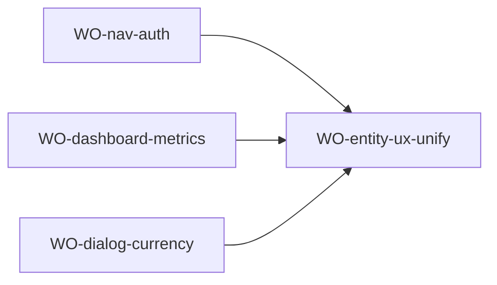

# Design Plan — M-001 Display Content Standardization

> Source: TRI-1786256042159-849c · Change class: C3 · Change type: implementation

## Summary

**Approach:** Batch cosmetic display-string changes across 12 frontend files — no business logic, no architecture, no data model. All changes are mechanical string replacements or single-line formatting fixes.

**Key trade-off:** None. This is a cosmetic standardization pass on existing screens. Zero risk to data, auth, or business logic.

---

## System Boundaries

| Entity | Details |
|---|---|
| **Module** | M-001 Quản Lý Tài Chính |
| **Implementation** | `src/` (React 19 + Vite SPA, `src/ui/screens/**` + `src/ui/Layout.tsx`) |
| **Services** | None touched |
| **Store** | None touched |
| **Models** | None touched |
| **Scope** | 12 UI files only; display strings and CSS animation fix |

---

## Change Groups

### CG-1: Nav label consistency
**File:** `src/ui/Layout.tsx:35`
**AS-IS:** Nav item label `'Khách'` but page title `'Khách hàng'` (line 44)
**TO-BE:** Nav label → `'Khách hàng'`

### CG-2: AuthScreen background animation fix
**File:** `src/ui/screens/auth/AuthScreen.tsx:207-208`
**AS-IS:** `@keyframes auth-bg-drift` uses `scale(1.02)` / `scale(1.08)` causing blur on the background image
**TO-BE:** Remove `scale()` from keyframes; add `image-rendering: auto` on the background div; add a solid `background-color` fallback behind the gradient overlay

### CG-3: Dashboard metrics labels + rounding
**File:** `src/ui/screens/dashboard/DashboardScreen.tsx:41-42,157,165`
**AS-IS:**
- `money()` at :41-42 wraps `formatCurrency(Math.round(amount))` — causes data loss for amounts with decimal significance
- Card titles: `'Tổng thu'` (line 157), `'Tổng chi'` (line 165)
**TO-BE:**
- Remove `Math.round()` → `formatCurrency(amount)` directly
- `'Tổng thu'` → `'Doanh thu'`, `'Tổng chi'` → `'Chi phí'`

### CG-4: Empty states unify to "Chưa có X nào" pattern
**Files:** 6 files across entity screens
**Current state → Target:**

| File | Current | Target |
|---|---|---|
| `CustomerScreen.tsx:147` | `Chưa có khách hàng — thêm mới hoặc tạo qua AI/đơn hàng` | `Chưa có khách hàng nào` |
| `ProductScreen.tsx:182` | `Chưa có sản phẩm — thêm mới hoặc để AI tự tạo khi bán` | `Chưa có sản phẩm nào` |
| `PlatformScreen.tsx:128` | `Không có kênh` | `Chưa có kênh nào` |
| `ExpenseScreen.tsx:220-224` | `Không có chi phí nào` + subtext | `Chưa có chi phí nào` (keep subtext) |
| `RevenueGrid.tsx:138` | `Chưa có đơn hàng` | `Chưa có đơn hàng nào` |
| `DashboardScreen.tsx:241,293,351` | `Chưa có dữ liệu` / `Không có đơn chờ xử lý` / `Chưa có giao dịch` | Unify: `Chưa có dữ liệu nào` / `Chưa có đơn hàng chờ xử lý nào` / `Chưa có giao dịch nào` |

### CG-5: Button labels use "Thêm" prefix
**Files:** 3 files
**Current → Target:**

| File | Current | Target |
|---|---|---|
| `CustomerScreen.tsx:133` | `Thêm khách` | `Thêm khách hàng` |
| `ProductScreen.tsx:166` | `Thêm SP` | `Thêm sản phẩm` |
| `RevenueScreen.tsx:250` | `Tạo đơn hàng` | `Thêm đơn hàng` |

### CG-6: Confirm dialogs unify to "Xóa X?" format
**Files:** 5 files with AlertDialog titles
**Current → Target:**

| File | Current title | Target title |
|---|---|---|
| `ExpenseGrid.tsx` | `Xác nhận xóa` | `Xóa chi phí?` |
| `ExpenseGrid.tsx` (bulk) | `Xác nhận xóa nhiều` | `Xóa nhiều chi phí?` |
| `RevenueGrid.tsx` | `Xác nhận xóa` | `Xóa đơn hàng?` |
| `RevenueGrid.tsx` (bulk) | `Xác nhận xóa nhiều` | `Xóa nhiều đơn hàng?` |
| `CustomerScreen.tsx` | `Xóa khách hàng?` | No change (already correct) |
| `ProductScreen.tsx` | `Xóa sản phẩm?` | No change (already correct) |
| `PlatformScreen.tsx` | `Xóa kênh?` | No change (already correct) |

### CG-7: Currency inputs — VND suffix
**Files:** ExpenseDialog.tsx, OrderDialog.tsx, ProductDialog.tsx
**Design:** Wrap each currency `<Input>` in a `
` with an absolutely-positioned `₫` after the input.

| File | Input(s) affected |
|---|---|
| `ExpenseDialog.tsx` | Amount input (~line 255) |
| `OrderDialog.tsx` | Item unitPrice inputs; discount input; shipping fee input; deposit input; paid amount input |
| `ProductDialog.tsx` | `defaultUnitPrice` input (~line 129) |

### CG-8: Input placeholders — Vietnamese
**Files:** AuthScreen.tsx (email + password inputs)
**AS-IS:**
- Email: `placeholder="email@example.com"` (English) — `AuthScreen.tsx:145`
- Password: no placeholder — `AuthScreen.tsx:~155`

**TO-BE:**
- Email: `placeholder="Nhập địa chỉ email"`
- Password: `placeholder="Nhập mật khẩu"`

All other target files already have Vietnamese placeholders; no changes needed.

### CG-9: RevenueGrid date formatting
**File:** `src/ui/screens/revenue/RevenueGrid.tsx`
**AS-IS:** Desktop table renders raw `{row.date}` string (~line 262). Mobile card also renders `{row.date}` (~line 167). `formatDate` is NOT imported.
**TO-BE:**
- Add `import { formatDate } from '@/utils/date';`
- Replace `{row.date}` → `{formatDate(row.date)}` in both desktop table and mobile card views

---

## Wave Plan

### Wave 1 (3 workers, all parallel — zero file overlap)

| Task | Files | Owner |
|---|---|---|
| WO-nav-auth | `Layout.tsx`, `AuthScreen.tsx` | engineering-frontend-developer |
| WO-dashboard-metrics | `DashboardScreen.tsx`, `RevenueGrid.tsx` | engineering-frontend-developer |
| WO-dialog-currency | `ExpenseDialog.tsx`, `OrderDialog.tsx`, `ProductDialog.tsx` | engineering-frontend-developer |

### Wave 2 (1 worker — depends on Wave 1 completing patterns for consistency check)

| Task | Files | Owner |
|---|---|---|
| WO-entity-ux-unify | `CustomerScreen.tsx`, `ProductScreen.tsx`, `PlatformScreen.tsx`, `ExpenseScreen.tsx`, `RevenueScreen.tsx`, `ExpenseGrid.tsx` | engineering-frontend-developer |

---

## Work Orders

### WO-nav-auth

- **goal:** Layout nav label matches page title; AuthScreen animation fixed and placeholders localized.
- **assignee-role:** engineering-frontend-developer
- **complexity:** mechanical
- **files:**
  - `src/ui/Layout.tsx:35` — change `'Khách'` → `'Khách hàng'`
  - `src/ui/screens/auth/AuthScreen.tsx:145` — change `placeholder="email@example.com"` → `placeholder="Nhập địa chỉ email"`
  - `src/ui/screens/auth/AuthScreen.tsx:154` — add `placeholder="Nhập mật khẩu"` to the password `<Input>` (between `type={showPassword...}` and `autoComplete=...`)
  - `src/ui/screens/auth/AuthScreen.tsx:204` — remove `scale(1.02)` from `0% { transform: ... }`
  - `src/ui/screens/auth/AuthScreen.tsx:205` — remove `scale(1.08)` from `100% { transform: ... }`
  - `src/ui/screens/auth/AuthScreen.tsx:93` — add `image-rendering: auto` to the background div className; add a solid `background-color` via style (e.g. `backgroundColor: '#0a1628'`)
- **contracts:** design/00-design-plan.md#cg-1-nav-label-consistency, design/00-design-plan.md#cg-2-authscreen-background-animation-fix, design/00-design-plan.md#cg-8-input-placeholders
- **acceptance:**
  - Nav sidebar shows "Khách hàng" matching page title "Khách hàng"
  - AuthScreen background image drifts without scale blur
  - AuthScreen email input: placeholder "Nhập địa chỉ email"
  - AuthScreen password input: placeholder "Nhập mật khẩu"
- **verify:** `npx tsc --noEmit`
- **done-when:** verify exits 0 AND visual inspection passes for all four changes

### WO-dashboard-metrics

- **goal:** Dashboard money formatting preserves decimal precision; metric card titles consistent with app terminology; RevenueGrid dates formatted consistently.
- **assignee-role:** engineering-frontend-developer
- **complexity:** mechanical
- **files:**
  - `src/ui/screens/dashboard/DashboardScreen.tsx:41` — remove `Math.round()` from `money()`: change line 42 to `return formatCurrency(amount);`
  - `src/ui/screens/dashboard/DashboardScreen.tsx:157` — `'Tổng thu'` → `'Doanh thu'`
  - `src/ui/screens/dashboard/DashboardScreen.tsx:165` — `'Tổng chi'` → `'Chi phí'`
  - `src/ui/screens/dashboard/DashboardScreen.tsx:241` — empty state `'Chưa có dữ liệu'` → `'Chưa có dữ liệu nào'`
  - `src/ui/screens/dashboard/DashboardScreen.tsx:293` — `'Không có đơn chờ xử lý'` → `'Chưa có đơn hàng chờ xử lý nào'`
  - `src/ui/screens/dashboard/DashboardScreen.tsx:351` — `'Chưa có giao dịch'` → `'Chưa có giao dịch nào'`
  - `src/ui/screens/revenue/RevenueGrid.tsx` — add `import { formatDate } from '@/utils/date';`
  - `src/ui/screens/revenue/RevenueGrid.tsx:167` — mobile card: `{row.date}` → `{formatDate(row.date)}`
  - `src/ui/screens/revenue/RevenueGrid.tsx:262` — desktop table: `{row.date}` → `{formatDate(row.date)}`
  - `src/ui/screens/revenue/RevenueGrid.tsx:138` — empty state `'Chưa có đơn hàng'` → `'Chưa có đơn hàng nào'`
  - `src/ui/screens/revenue/RevenueGrid.tsx` — confirm dialog title `'Xác nhận xóa'` → `'Xóa đơn hàng?'`
  - `src/ui/screens/revenue/RevenueGrid.tsx` — bulk confirm title `'Xác nhận xóa nhiều'` → `'Xóa nhiều đơn hàng?'`
- **contracts:** design/00-design-plan.md#cg-3-dashboard-metrics-labels--rounding, design/00-design-plan.md#cg-4-empty-states, design/00-design-plan.md#cg-6-confirm-dialogs, design/00-design-plan.md#cg-9-revenuegrid-date-formatting
- **acceptance:**
  - Dashboard metric cards show "Doanh thu", "Chi phí", "Lợi nhuận", "Chưa thanh toán"
  - Dashboard values preserve cents (no rounding to integer)
  - RevenueGrid dates display in Vietnamese format (dd/MM/yyyy)
  - RevenueGrid empty state: "Chưa có đơn hàng nào"
  - RevenueGrid confirm dialog: "Xóa đơn hàng?"
  - Dashboard empty states: "Chưa có dữ liệu nào", "Chưa có đơn hàng chờ xử lý nào", "Chưa có giao dịch nào"
- **verify:** `npx tsc --noEmit`
- **done-when:** verify exits 0

### WO-dialog-currency

- **goal:** All currency input fields show ₫ suffix; input placeholders are Vietnamese.
- **assignee-role:** engineering-frontend-developer
- **complexity:** mechanical
- **files:**
  - `src/ui/screens/expense/ExpenseDialog.tsx` — wrap amount Input in relative div + ₫ suffix span
  - `src/ui/screens/revenue/OrderDialog.tsx` — wrap all currency Input fields (item unitPrice, discount, shipping, deposit, paid amount) in relative div + ₫ suffix span
  - `src/ui/screens/product/ProductDialog.tsx` — wrap defaultUnitPrice Input in relative div + ₫ suffix span
- **contracts:** design/00-design-plan.md#cg-7-currency-inputs--vnd-suffix
- **conventions:** suffix span pattern: `
<Input className="pr-8" .../>₫
`
- **acceptance:**
  - ExpenseDialog amount input has ₫ suffix visible at right edge
  - OrderDialog unit price, discount, shipping, deposit, paid amount inputs all have ₫ suffix
  - ProductDialog defaultUnitPrice input has ₫ suffix
  - Suffix is non-interactive (pointer-events-none) and styled consistently
- **verify:** `npx tsc --noEmit`
- **done-when:** verify exits 0 AND visual inspection confirms ₫ suffix on all currency inputs

### WO-entity-ux-unify

- **goal:** Empty states, button labels, and confirm dialogs unified across remaining entity screens.
- **assignee-role:** engineering-frontend-developer
- **complexity:** mechanical
- **files:**
  - `src/ui/screens/customer/CustomerScreen.tsx:133` — `'Thêm khách'` → `'Thêm khách hàng'`
  - `src/ui/screens/customer/CustomerScreen.tsx:147` — empty state → `'Chưa có khách hàng nào'`
  - `src/ui/screens/product/ProductScreen.tsx:166` — `'Thêm SP'` → `'Thêm sản phẩm'`
  - `src/ui/screens/product/ProductScreen.tsx:182` — empty state → `'Chưa có sản phẩm nào'`
  - `src/ui/screens/platform/PlatformScreen.tsx:128` — `'Không có kênh'` → `'Chưa có kênh nào'`
  - `src/ui/screens/expense/ExpenseScreen.tsx:220` — `'Không có chi phí nào'` → `'Chưa có chi phí nào'`
  - `src/ui/screens/revenue/RevenueScreen.tsx:250` — `'Tạo đơn hàng'` → `'Thêm đơn hàng'`
  - `src/ui/screens/expense/ExpenseGrid.tsx` — confirm dialog title `'Xác nhận xóa'` → `'Xóa chi phí?'`
  - `src/ui/screens/expense/ExpenseGrid.tsx` — bulk confirm title `'Xác nhận xóa nhiều'` → `'Xóa nhiều chi phí?'`
- **contracts:** design/00-design-plan.md#cg-4-empty-states, design/00-design-plan.md#cg-5-button-labels, design/00-design-plan.md#cg-6-confirm-dialogs
- **acceptance:**
  - CustomerScreen: button "Thêm khách hàng", empty "Chưa có khách hàng nào"
  - ProductScreen: button "Thêm sản phẩm", empty "Chưa có sản phẩm nào"
  - PlatformScreen: empty "Chưa có kênh nào"
  - ExpenseScreen: empty "Chưa có chi phí nào" (subtext preserved)
  - ExpenseGrid confirm dialog: "Xóa chi phí?"
  - RevenueScreen button: "Thêm đơn hàng"
- **verify:** `npx tsc --noEmit`
- **done-when:** verify exits 0

---

## Execution Sequence

Wave 1 runs three parallel workers. Wave 2 runs one worker after Wave 1 completes.

---

## Implementation Risks

| Risk | Likelihood | Impact | Mitigation |
|---|---|---|---|
| Truncated display strings in narrow sidebar | Low | Low | "Khách hàng" is 10 chars — already tested by "Quản Lý Tài Chính" (19 chars) in the same sidebar |
| ₫ suffix overlaps long formatted amounts | Low | Low | `pr-8` padding on Input gives 2rem right clearance for suffix |

---

## Developer Guidance

- All changes are pure display-string / CSS — no imports change except RevenueGrid gaining `formatDate`
- `@/utils/date` → `formatDate` is already used by ExpenseGrid.tsx and CustomerScreen.tsx — follow the same pattern
- For ₫ suffix: use `pointer-events-none` so clicking the suffix focuses the input behind it
- The `@keyframes auth-bg-drift` is defined in a `<style>` JSX block inside AuthScreen.tsx — edit it inline

---

## Open Execution Questions

None — all changes are single-line string replacements with unambiguous anchors.

---

## Execution Readiness Verdict

**Pass** — all 9 change groups are mechanical display-string or CSS changes. No design decisions needed. Work orders are self-contained with file:line anchors verified against the live codebase.
