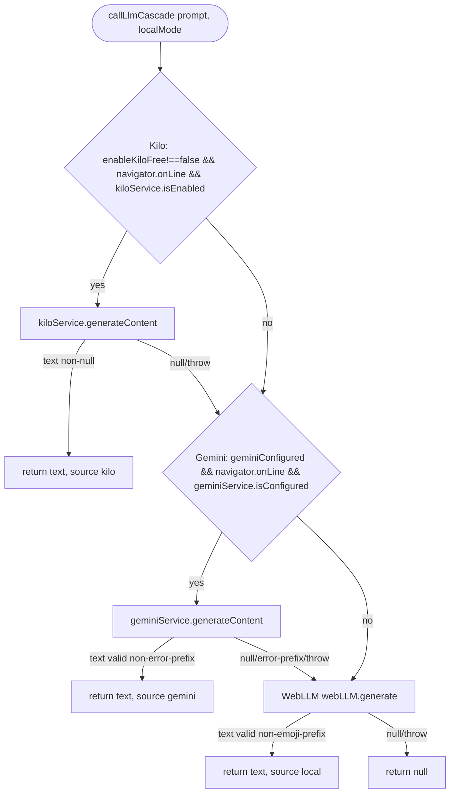
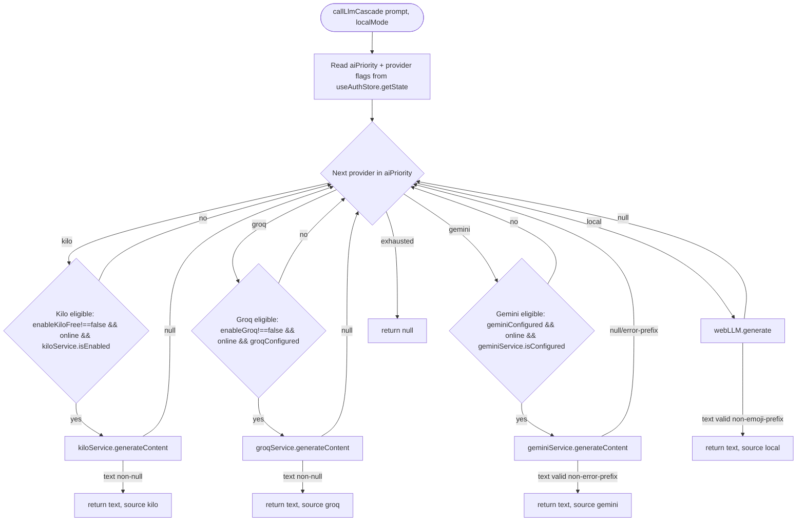

# Lean BA Spec — M-001 "Quản Lý Tài Chính" (Scope Expansion: Groq AI Provider + Configurable AI Priority)

> **Source:** TRI-1785915049449-58fd (C3 scope_expansion, full_pipeline). This spec UPDATES the archived
> `ba/00-lean-spec.md` (2026-08-05T07-34-02Z, auth-redesign scope) with new acceptance criteria for the
> Groq provider and user-configurable AI priority ordering. All existing ACs (AC-AUTH-01…27), business
> rules (BR-AUTH-01…14), NFRs (NFR-AUTH-*), test scenarios (TS-AUTH-*), and constraints (CON-AUTH-*)
> from the archived spec are **preserved unchanged** and reproduced below; new criteria are added as
> AC-GROQ-*, AC-PRI-*, AC-STORE-*, AC-UI-*, AC-SEC-AI-*, AC-RES-AI-*.

## 1. Summary

M-001 already ships a 3-tier AI cascade **Kilo Free → Gemini → WebLLM** implemented as a hardcoded
if-else chain in `src/services/llmCall.ts:94` (`const { geminiConfigured, groqConfigured, enableKiloFree, enableGroq } =
useAuthStore.getState();` — `canUseCloudLlm()`), with per-provider toggles/keys in the Zustand store
(`src/store/authStore.ts`) and AI config sections in `src/ui/screens/settings/SettingsScreen.tsx`.

This scope expansion adds:

1. **Groq provider** — a new `groqService.ts` following the `kiloService.ts` OpenAI-compatible pattern
   (base `https://api.groq.com/openai/v1`, model `llama-3.3-70b-versatile`, API key from
   `VITE_GROQ_API_KEY`, returns `null` on failure for cascade fall-through).
2. **User-configurable AI priority ordering** — `LlmSource` extended with `'groq'`;
   `callLlmCascade()` reads `aiPriority: LlmSource[]` from the store instead of the hardcoded if-else;
   default order `['kilo', 'groq', 'gemini', 'local']`; user reorders in Settings via move-up/down.
3. **Store** — `groqApiKey`, `groqConfigured`, `enableGroq`, `aiPriority` fields with persistence.
4. **Settings UI** — Groq section card (API key input, test, toggle) + AI Priority section
   (move-up/move-down reorder list).

The change is **additive and backward-compatible**: `callLlmCascade`'s signature is unchanged, so its
three callers (`llmIntentExtractor.ts:177`, `llmBulkDraftExtractor.ts:52`, `aiRouter.ts:919`) and the
label consumers (`AIChatScreen.tsx:247`, `ChatPanel.tsx:412`) keep working unmodified.

Complexity: **Medium** — additive change on an implemented module; 1 actor; ~11 new business rules;
no schema migration, no new bounded context.

## 2. Scope

### In scope

| Area | Description | Source |
|---|---|---|
| `groqService.ts` (NEW) | OpenAI-compatible service following `kiloService.ts` pattern: base `https://api.groq.com/openai/v1`, model `llama-3.3-70b-versatile`, `generateContent()` returning `null` on any failure, `testConnection()`, `configure()`, `setEnabled()` | TRI-1785915049449-58fd requirement 1 |
| `.env` / `.env.example` | `VITE_GROQ_API_KEY` env var documented and read by the service | TRI-1785915049449-58fd requirement 1; evidence.edit_target_files |
| `LlmSource` extension | Add `'groq'` to `LlmSource` union (`src/services/llmCall.ts:11`) | requirement 2 |
| `callLlmCascade()` priority-driven | Replace hardcoded if-else with iteration over `aiPriority: LlmSource[]` read from store at call time; default `['kilo','groq','gemini','local']` | requirement 2 |
| Store fields + actions | `groqApiKey`, `groqConfigured`, `enableGroq`, `aiPriority` (+ setters) in `src/store/authStore.ts`, persisted via existing `persist('ql-tc-auth')` partialize, service sync on set/rehydrate (mirroring `syncKiloService` at `authStore.ts:79`) | requirement 3 |
| Settings UI | Groq section card (key input, save/test/delete, enable toggle) + AI Priority section (ordered list with move-up/move-down) in `SettingsScreen.tsx` | requirement 4 |
| `src/services/index.ts` | Barrel export of `groqService` (triage edit target) | TRI evidence.edit_target_files |
| Label + cloud-eligibility helpers | `llmSourceLabel()` gains a `'groq'` case (`llmCall.ts:72`); `canUseCloudLlm()` includes Groq eligibility (`llmCall.ts:65`) | derived — consumers pass `source` strings through unmodified, so helpers must know `'groq'` |

### Out of scope

| Area | Why out of scope |
|---|---|
| `aiRouter.ts` modifications | Explicitly prohibited by requirement 5; cascade change is backward-compatible so none needed |
| `chatTools.ts`, `chatIntent.ts`, `llmIntentExtractor.ts`, `llmBulkDraftExtractor.ts`, `geminiService.ts`, `kiloService.ts`, `webLLM.ts` modifications | Explicitly prohibited by requirement 5; all remain byte-identical |
| Groq model selection UI / model switching | Not in requirements — single model `llama-3.3-70b-versatile` |
| Groq rate-limit/quota dashboards, billing, streaming | Not in requirements |
| Chat-history / per-conversation provider pinning | Not in requirements — priority is global |
| AI action parsing, intent extraction, OCR behavior | Unchanged by this feature |
| Encrypted key storage upgrade (e.g. IndexedDB AES for Groq) | Existing Gemini/Kilo keys are persisted via `persist('ql-tc-auth')` localStorage; Groq follows the SAME existing pattern (consistency with AS-IS; key-storage hardening is a separate concern) |
| Multi-user / permissions | Module is single-`user` |
| Server-side proxying of Groq traffic | Not in requirements; direct fetch from client, CORS permitting (same posture as `kiloService.ts` dev-proxy note) |

## 3. AS-IS → TO-BE

### 3.1 AS-IS cascade (current: `src/services/llmCall.ts:13-61`)

> Seam anchor (triage seam_claims[0], byte-verified at intake): `src/services/llmCall.ts:94` —
> `const { geminiConfigured, groqConfigured, enableKiloFree, enableGroq } = useAuthStore.getState();` (in `canUseCloudLlm()`)
> Verified this session: `LlmSource` union at `llmCall.ts:11`; `callLlmCascade` at `:13`;
> `canUseCloudLlm` at `:65`; `llmSourceLabel` at `:72`.

Order is **hardcoded** (Kilo → Gemini → WebLLM) and reads exactly two store flags
(`geminiConfigured`, `enableKiloFree`) from `llmCall.ts:94` (`canUseCloudLlm()`).

### 3.2 TO-BE cascade (priority-driven)

`callLlmCascade()` reads `aiPriority: LlmSource[]` (plus `enableGroq`, `groqConfigured`,
`enableKiloFree`, `geminiConfigured`) from `useAuthStore.getState()` at call time and iterates the
array in order. Each cloud provider is attempted only when eligible (enabled + configured + online);
the first non-null, non-error text wins. `'local'` is the guaranteed terminal attempt. If the list is
exhausted, returns `null` (existing contract).

Eligibility semantics per provider are **preserved from AS-IS** (Kilo/Gemini guards unchanged; Groq
mirrors Kilo's guard); only the *ordering mechanism* changes (array instead of hardcoded chain).
Offline (`navigator.onLine === false`): all cloud providers skip; only `'local'` is attempted.

## 4. User Stories (MoSCoW)

### 4.1 Preserved (auth scope)

| ID | Story (role: `user`) | Priority |
|---|---|---|
| US-AUTH-01 | As a `user`, I can enter my email on the first screen so the app can determine whether I need to log in or register | Must |
| US-AUTH-02 | As a registered `user` with a password, I can enter my password and log in after entering my email | Must |
| US-AUTH-03 | As an unregistered `user`, I receive a 6-digit OTP via email after entering my email, and upon verifying it I can optionally set a password before entering the app | Must |
| US-AUTH-04 | As a registered `user` without a password (OTP-only), I receive a 6-digit OTP via email and upon verifying it I am logged in directly | Must |
| US-AUTH-05 | As a new `user`, after registration I am guided through a store-info onboarding screen where I must enter my store name and optionally my address and phone number | Must |
| US-AUTH-06 | As a registered `user` with a password, I can reset my password by entering my email, receiving an OTP, and setting a new password | Must (preserved) |
| US-AUTH-07 | As an already-authenticated user, opening the app takes me directly to the dashboard without any auth flow | Must (preserved) |
| US-AUTH-08 | As a `user`, I can have multiple accounts on the same device — each with their own email and credentials | Should |

### 4.2 New (Groq + AI priority scope)

| ID | Story (role: `user`) | Priority |
|---|---|---|
| US-AI-GROQ-01 | As a `user`, I can configure a Groq API key in Settings and test the connection, so Groq becomes an available AI provider in the cascade | Must |
| US-AI-GROQ-02 | As a `user`, I can enable/disable Groq without removing its key | Must |
| US-AI-PRI-01 | As a `user`, I can reorder AI providers (move up/down) in Settings, so my preferred provider is tried first | Must |
| US-AI-PRI-02 | As a `user`, my priority order persists across app reloads and takes effect on the very next AI request | Must |

## 5. Acceptance Criteria (BDD: Given / When / Then)

> AC canonical home: this lean spec is the canonical home of AC text for M-001 (no feature-brief
> exists for the module; the archived spec carried AC text inline). Source column: TRI-1785915049449-58fd
> requirement numbers refer to the "What to deliver" items in the task brief; `derived` rows are added
> beyond the source per platform QA conventions (qa-common-tests) and are marked with rationale.

### 5.1 Preserved — AC-AUTH-01 … AC-AUTH-27 (auth scope, unchanged)

### AC-AUTH-01 — Email Input Screen

| | |
|---|---|
| **AC-ID** | AC-AUTH-01 |
| **Given** | The app is opened and the user is not authenticated (no valid session token) |
| **When** | The AuthScreen renders |
| **Then** | Only an email input field and a "Continue" button are visible. No password field, no "Forgot Password?" link, no OTP inputs. |

### AC-AUTH-02 — Email Validation

| | |
|---|---|
| **AC-ID** | AC-AUTH-02 |
| **Given** | The user is on the email-input screen |
| **When** | The user submits an empty, malformed (missing `@`), or non-email string |
| **Then** | An inline or toast error is shown ("Vui lòng nhập địa chỉ email hợp lệ"). No network call is made. The user remains on the email-input screen. |

### AC-AUTH-03 — Email Check: Registered + Has Password

| | |
|---|---|
| **AC-ID** | AC-AUTH-03 |
| **Given** | A user with email `existing@example.com` is stored in the multi-user map with `hasPassword: true` and `passwordHash: "abc:def"` |
| **When** | The user enters `existing@example.com` and clicks "Continue" |
| **Then** | The UI transitions to the `password-login` state. A password field, a "Login" button, and a "Forgot Password?" link are shown. The email field is pre-filled and read-only (or editable with a "back" action). |

### AC-AUTH-04 — Password Login: Success

| | |
|---|---|
| **AC-ID** | AC-AUTH-04 |
| **Given** | The user is on the `password-login` screen with email `existing@example.com` pre-filled |
| **When** | The user enters the correct password and clicks "Login" |
| **Then** | `verifyPassword` succeeds. `authStore.login()` is called. A session token is generated and stored. The UI navigates to the Dashboard. A success toast is shown ("Đăng nhập thành công!"). |

### AC-AUTH-05 — Password Login: Wrong Password

| | |
|---|---|
| **AC-ID** | AC-AUTH-05 |
| **Given** | The user is on the `password-login` screen |
| **When** | The user enters an incorrect password and clicks "Login" |
| **Then** | An error toast is shown ("Mật khẩu không đúng"). The user remains on the `password-login` screen. No session token is created. |

### AC-AUTH-06 — Email Check: Registered + No Password (OTP-Only)

| | |
|---|---|
| **AC-ID** | AC-AUTH-06 |
| **Given** | A user with email `otpuser@example.com` is stored with `hasPassword: false` and `passwordHash: ""` |
| **When** | The user enters `otpuser@example.com` and clicks "Continue" |
| **Then** | An OTP is generated, sent via `sendOTPEmail()`, and the UI transitions to the `otp-verify` state. A 6-digit OTP input (OtpInput component, reused from forgot-password flow) is shown. A 60-second resend countdown starts. The email is displayed above the OTP input. |

### AC-AUTH-07 — Email Check: Not Registered → OTP Registration

| | |
|---|---|
| **AC-ID** | AC-AUTH-07 |
| **Given** | No user with email `newuser@example.com` exists in the multi-user store |
| **When** | The user enters `newuser@example.com` and clicks "Continue" |
| **Then** | An OTP is generated, sent via `sendOTPEmail()`, and the UI transitions to `otp-verify` state. The UX is identical to AC-AUTH-06 but internally this is a registration path. |

### AC-AUTH-08 — OTP: Correct Code (Registration Path)

| | |
|---|---|
| **AC-ID** | AC-AUTH-08 |
| **Given** | The user is on the `otp-verify` screen after entering a new/unregistered email. The correct OTP was generated and stored in component state. |
| **When** | The user enters all 6 correct digits (automatic on 6th digit or via Continue button) |
| **Then** | `registerUser(email, undefined, { storeName: '', email })` is called (no password yet). The UI transitions to the `password-setup` screen. |

### AC-AUTH-09 — OTP: Correct Code (OTP-Only Login Path)

| | |
|---|---|
| **AC-ID** | AC-AUTH-09 |
| **Given** | The user is on the `otp-verify` screen after entering a registered OTP-only user email |
| **When** | The user enters all 6 correct digits |
| **Then** | `authStore.login()` is called (adapted for OTP-only users — no passwordHash-based token, use a derived key). The UI navigates to the Dashboard. |

### AC-AUTH-10 — OTP: Wrong Code

| | |
|---|---|
| **AC-ID** | AC-AUTH-10 |
| **Given** | The user is on the `otp-verify` screen |
| **When** | The user enters incorrect digits |
| **Then** | An error toast is shown ("Mã xác thực không đúng"). The OTP input is cleared. The user remains on the `otp-verify` screen. |

### AC-AUTH-11 — OTP: Resend

| | |
|---|---|
| **AC-ID** | AC-AUTH-11 |
| **Given** | The user is on the `otp-verify` screen and the 60-second countdown has elapsed |
| **When** | The user clicks "Gửi lại mã" |
| **Then** | A new OTP is generated, sent via email, the countdown resets to 60s, the old OTP in component state is replaced. |

### AC-AUTH-12 — OTP: Resend During Countdown (Disabled)

| | |
|---|---|
| **AC-ID** | AC-AUTH-12 |
| **Given** | The user is on the `otp-verify` screen and the countdown is at 30s |
| **When** | The user attempts to click "Gửi lại mã" |
| **Then** | The button is disabled with text "Gửi lại mã (30s)". No email is sent. |

### AC-AUTH-13 — Password Setup: Set Password

| | |
|---|---|
| **AC-ID** | AC-AUTH-13 |
| **Given** | The user is on the `password-setup` screen after successful OTP verification (registration path) |
| **When** | The user enters a password (≥6 chars), confirms it, and clicks "Tiếp tục" |
| **Then** | The password is hashed via `hashPassword()`. The user's `StoredCredentials` entry is updated with the passwordHash and `hasPassword: true`. The UI transitions to the `onboarding` screen. |

### AC-AUTH-14 — Password Setup: Skip

| | |
|---|---|
| **AC-ID** | AC-AUTH-14 |
| **Given** | The user is on the `password-setup` screen |
| **When** | The user clicks "Bỏ qua" (skip) |
| **Then** | The user remains OTP-only (`hasPassword: false`, `passwordHash: ""`). The UI transitions to the `onboarding` screen. No password is stored. |

### AC-AUTH-15 — Password Setup: Validation

| | |
|---|---|
| **AC-ID** | AC-AUTH-15 |
| **Given** | The user is on the `password-setup` screen |
| **When** | The user enters a password < 6 chars, or mismatched confirmation |
| **Then** | A validation error is shown inline or via toast. The user remains on `password-setup`. Nothing is persisted. |

### AC-AUTH-16 — Onboarding: Required Fields

| | |
|---|---|
| **AC-ID** | AC-AUTH-16 |
| **Given** | The user is on the `onboarding` screen after registration |
| **When** | The user submits an empty `storeName` |
| **Then** | A validation error is shown ("Vui lòng nhập tên cửa hàng"). The user remains on the onboarding screen. |

### AC-AUTH-17 — Onboarding: Success

| | |
|---|---|
| **AC-ID** | AC-AUTH-17 |
| **Given** | The user is on the `onboarding` screen |
| **When** | The user enters a valid `storeName` (and optionally address/phone), and clicks "Vào ứng dụng" |
| **Then** | The profile is saved via `updateProfile()`. `authStore.login()` is called. The UI navigates to the Dashboard. |

### AC-AUTH-18 — Onboarding: Back Navigation Blocked

| | |
|---|---|
| **AC-ID** | AC-AUTH-18 |
| **Given** | The user is on the `onboarding` screen (authenticated but incomplete profile) |
| **When** | The user refreshes the page or navigates back |
| **Then** | They land on the `onboarding` screen again (not the dashboard), because `isAuthenticated: true` but `userProfile.storeName` is empty. The AuthGuard routes them to OnboardingScreen. |

### AC-AUTH-19 — EmailJS Not Configured (OTP Send Failure)

| | |
|---|---|
| **AC-ID** | AC-AUTH-19 |
| **Given** | EmailJS is NOT configured (no serviceId/templateId/publicKey in authStore) |
| **When** | The user enters any email (registered or not) and clicks "Continue" |
| **Then** | An error toast is shown: "EmailJS chưa được cấu hình. Vui lòng liên hệ quản trị viên." No email is sent. The user remains on the email-input screen. |

### AC-AUTH-20 — Forgot Password: Email Check (Adapted)

| | |
|---|---|
| **AC-ID** | AC-AUTH-20 |
| **Given** | The user is on the `forgot-password` email step (navigated from `password-login`) |
| **When** | The user enters an email that is NOT in the multi-user store |
| **Then** | Error toast: "Email này chưa được đăng ký." No OTP is sent. |

### AC-AUTH-21 — Forgot Password: Reset Success (Adapted)

| | |
|---|---|
| **AC-ID** | AC-AUTH-21 |
| **Given** | The user is on the `forgot-password` verify step with a valid OTP |
| **When** | The user enters a new password (≥6 chars) and clicks "Đặt lại mật khẩu" |
| **Then** | `resetPassword()` upserts the user in the multi-user map with the new `passwordHash` and `hasPassword: true`. A success toast is shown. The UI resets to `email-input` state. |

### AC-AUTH-22 — Back Navigation from Password-Login

| | |
|---|---|
| **AC-ID** | AC-AUTH-22 |
| **Given** | The user is on the `password-login` screen |
| **When** | The user clicks a "← Quay lại" (back) button |
| **Then** | The UI returns to `email-input` state. The email is pre-filled but editable. |

### AC-AUTH-23 — Back Navigation from OTP-Verify

| | |
|---|---|
| **AC-ID** | AC-AUTH-23 |
| **Given** | The user is on the `otp-verify` screen |
| **When** | The user clicks a "← Quay lại" button |
| **Then** | The UI returns to `email-input` state. The email is pre-filled but editable. Any generated OTP in component state is discarded. |

### AC-AUTH-24 — Multi-User: Two Accounts on Same Device

| | |
|---|---|
| **AC-ID** | AC-AUTH-24 |
| **Given** | Two users are registered: `alice@example.com` (hasPassword) and `bob@example.com` (OTP-only) in the multi-user map |
| **When** | Alice logs in with her password → uses the app → logs out. Then Bob enters his email → receives OTP → verifies → logs in. |
| **Then** | Both sessions are independent. Alice's data is isolated under her `userId`. Bob's data is isolated under his `userId`. Logging in as one does not overwrite the other's credentials. |

### AC-AUTH-25 — XSS / Security: Email Input

| | |
|---|---|
| **AC-ID** | AC-AUTH-25 |
| **Given** | The user enters `@test.com` into the email input |
| **When** | The "Continue" button is clicked |
| **Then** | The input is rejected by email validation (`isValidEmail` returns false). No script executes. The UI does not render the input as HTML. |

### AC-AUTH-26 — OTP Brute-Force: Incorrect Codes

| | |
|---|---|
| **AC-ID** | AC-AUTH-26 |
| **Given** | The user is on the `otp-verify` screen |
| **When** | The user enters an incorrect OTP 5+ times consecutively |
| **Then** | The OTP input is NOT rate-limited at this layer (frontend-only — serverless), but each incorrect attempt clears the input and shows an error toast. The OTP is still valid until expiry or regeneration. |

### AC-AUTH-27 — Empty State: Eventual Consistency After ClearAuth

| | |
|---|---|
| **AC-ID** | AC-AUTH-27 |
| **Given** | All auth data has been cleared (empty multi-user map) |
| **When** | Any email is entered |
| **Then** | The email is treated as NOT registered → OTP registration flow. No error or crash. |

### 5.2 New — Groq Provider

### AC-GROQ-01 — Groq Service Follows Kilo Pattern

| | |
|---|---|
| **AC-ID** | AC-GROQ-01 |
| **Source** | TRI requirement 1 |
| **Given** | A new `src/services/groqService.ts` has been added |
| **When** | The service is inspected |
| **Then** | It exposes `generateContent(prompt): Promise<string | null>`, `testConnection(): Promise<{ ok: boolean; detail: string }>`, `configure(key: string | null): void`, `setEnabled(v: boolean): void`, and `isEnabled`/`isConfigured` getters, mirroring the `kiloService` contract at `src/services/kiloService.ts:66-133`. It POSTs to `${base}/chat/completions` where base defaults to `https://api.groq.com/openai/v1`, with body `{ model: 'llama-3.3-70b-versatile', messages: [{ role: 'user', content: prompt }], temperature, max_tokens }` and an `Authorization: Bearer <key>` header when a key is set. |

### AC-GROQ-02 — Groq Returns Null on Failure (Never Throws)

| | |
|---|---|
| **AC-ID** | AC-GROQ-02 |
| **Source** | TRI requirement 1 + requirement 5 ("Groq must return null on failure") |
| **Given** | Groq is the active provider and the request fails (HTTP ≥ 400, network error, timeout, non-JSON body, `error.message` in response, or empty content) |
| **When** | `groqService.generateContent(prompt)` is awaited |
| **Then** | It returns `null` (never throws, never returns a `'Lỗi Groq:'`-prefixed string). The cascade proceeds to the next provider. A `console.warn` with status/body-snippet is emitted (mirrors `kiloService.ts:108-116`). |

### AC-GROQ-03 — Groq Timeout

| | |
|---|---|
| **AC-ID** | AC-GROQ-03 |
| **Source** | derived (qa-common-tests: network resilience; mirrors kilo 45s timeout at `kiloService.ts:9`) |
| **Given** | A Groq request is in flight and the server does not respond |
| **When** | 45 seconds elapse |
| **Then** | The request aborts via AbortController, `generateContent` returns `null`, and the cascade falls through to the next provider (no hang, no spinner left running in Settings' test flow). |

### AC-GROQ-04 — Groq Key from Env + Store

| | |
|---|---|
| **AC-ID** | AC-GROQ-04 |
| **Source** | TRI requirement 1 ("API key from VITE_GROQ_API_KEY env var") + requirement 3 (`groqApiKey` store field) |
| **Given** | The build exposes `VITE_GROQ_API_KEY` and/or the user has saved a Groq key in Settings |
| **When** | `groqConfigured` is evaluated |
| **Then** | `groqConfigured` is `true` if a non-empty key is available from either source; precedence is: user-entered store key `groqApiKey` > `VITE_GROQ_API_KEY` (see AMB-AI-01). With no key from either source, `groqConfigured` is `false` and Groq is skipped by the cascade. |

### AC-GROQ-05 — Groq Enabled Only When Configured and Online

| | |
|---|---|
| **AC-ID** | AC-GROQ-05 |
| **Source** | derived (BR-AI-05 eligibility rule; mirrors Kilo guard at `llmCall.ts:19`) |
| **Given** | `enableGroq` is `true`, `groqConfigured` is `true`, and the browser is online |
| **When** | `callLlmCascade` reaches the `'groq'` position in `aiPriority` |
| **Then** | `groqService.generateContent` is attempted. If `enableGroq` is `false`, `groqConfigured` is `false`, or `navigator.onLine` is `false`, the provider is skipped without a network call. |

### AC-GROQ-06 — Groq Settings Card: Configure + Test + Toggle

| | |
|---|---|
| **AC-ID** | AC-GROQ-06 |
| **Source** | TRI requirement 4 ("Groq section card (API key input, test, toggle)") |
| **Given** | The user opens Settings → Groq section |
| **When** | The user enters a Groq API key and clicks "Kiểm tra" (Test) and the call succeeds |
| **Then** | A success toast is shown with the model detail (`llama-3.3-70b-versatile`), the key is saved to the store (`groqApiKey`) and persisted, and the section badge changes to "Đã cấu hình". The toggle ("Bật Groq") is `aria-checked=true`. An explicit "Xóa API key" action removes the key and clears the badge (mirrors Gemini section at `SettingsScreen.tsx:520-592`). |

### AC-GROQ-07 — Groq Test Failure

| | |
|---|---|
| **AC-ID** | AC-GROQ-07 |
| **Source** | derived (qa-common-tests: API 500/network errors; mirrors `handleTestGemini` at `SettingsScreen.tsx:249-282`) |
| **Given** | The user clicks "Kiểm tra" with a Groq key entered and the call fails (invalid key, 4xx/5xx, offline, timeout) |
| **Then** | An error toast is shown ("Kiểm tra thất bại: <detail>"), the button spinner stops, the app does not crash, and the entered key is NOT persisted unless the user explicitly saves it. |

### AC-GROQ-08 — Groq Cascade Fall-Through

| | |
|---|---|
| **AC-ID** | AC-GROQ-08 |
| **Source** | TRI requirement 5 ("Groq must return null on failure" → cascade fall-through) |
| **Given** | `aiPriority = ['groq', 'kilo', 'local']`, `groqConfigured = true`, and Groq's API call fails (returns `null`) |
| **When** | `callLlmCascade('...')` is invoked |
| **Then** | The cascade continues to Kilo, then local, and returns the first non-null text with the correct `source` — never a hard failure and never a 'groq' source label for a failed call. |

### 5.3 New — AI Priority Ordering

### AC-PRI-01 — LlmSource Includes 'groq'

| | |
|---|---|
| **AC-ID** | AC-PRI-01 |
| **Source** | TRI requirement 2 |
| **Given** | The `LlmSource` type at `src/services/llmCall.ts:11` |
| **When** | The type is inspected |
| **Then** | It is `'kilo' | 'groq' | 'gemini' | 'local'`. All existing consumers that pass `source` as a string (`AIChatScreen.tsx:247`, `ChatPanel.tsx:412`) remain type-compatible without modification. |

### AC-PRI-02 — Default aiPriority Order

| | |
|---|---|
| **AC-ID** | AC-PRI-02 |
| **Source** | TRI requirement 2 ("Default order: ['kilo', 'groq', 'gemini', 'local']") |
| **Given** | A fresh install / fresh store (no persisted `aiPriority`) |
| **When** | The store initializes |
| **Then** | `aiPriority` equals `['kilo', 'groq', 'gemini', 'local']`, `enableGroq` defaults to `true`, and `groqConfigured` defaults to `false` (Groq skipped until a key is present — cascade behavior unaffected for existing users). |

### AC-PRI-03 — Cascade Iterates aiPriority

| | |
|---|---|
| **AC-ID** | AC-PRI-03 |
| **Source** | TRI requirement 2 ("callLlmCascade() reads aiPriority from store instead of hardcoded if-else") |
| **Given** | `aiPriority = ['gemini', 'kilo', 'local']` and a valid Gemini key |
| **When** | `callLlmCascade('...')` is invoked |
| **Then** | Gemini is attempted first; on success the response `source` is `'gemini'` — even though Kilo is enabled — proving the order comes from `aiPriority`, not the old hardcoded chain. |

### AC-PRI-04 — Disabled/Unconfigured Providers Are Skipped

| | |
|---|---|
| **AC-ID** | AC-PRI-04 |
| **Source** | derived (BR-AI-05; preserves AS-IS skip behavior at `llmCall.ts:19-27`) |
| **Given** | `aiPriority = ['groq', 'gemini', 'local']`, `enableGroq = false`, `geminiConfigured = false` |
| **When** | `callLlmCascade('...')` is invoked |
| **Then** | Both cloud positions are skipped without network calls and the local provider answers; no error is surfaced to the caller. |

### AC-PRI-05 — Reorder via Move-Up/Move-Down

| | |
|---|---|
| **AC-ID** | AC-PRI-05 |
| **Source** | TRI requirement 4 ("User can reorder in settings via move-up/move-down") |
| **Given** | The Settings AI Priority list shows `[Kilo Free, Groq, Gemini, AI Cục bộ]` |
| **When** | The user clicks the move-up arrow on "Gemini" (and/or move-down on "Kilo Free") |
| **Then** | The list reorders immediately to `[Gemini, Kilo Free, Groq, AI Cục bộ]`, the first row's move-up and the last row's move-down buttons are disabled, and the store's `aiPriority` is updated to `['gemini', 'kilo', 'groq', 'local']`. |

### AC-PRI-06 — Priority Persists Across Reload

| | |
|---|---|
| **AC-ID** | AC-PRI-06 |
| **Source** | TRI requirement 3 ("fields with persistence") |
| **Given** | The user reordered `aiPriority` to `['groq', 'gemini', 'kilo', 'local']` and reloaded the app |
| **When** | The store rehydrates |
| **Then** | `aiPriority` is restored to `['groq', 'gemini', 'kilo', 'local']` (persisted under the existing `ql-tc-auth` key via `partialize` at `authStore.ts:243`) and the Settings list renders in that order. |

### AC-PRI-07 — Priority Changes Take Effect Real-Time

| | |
|---|---|
| **AC-ID** | AC-PRI-07 |
| **Source** | TRI requirement 5 ("Priority changes reflect in real-time") |
| **Given** | The user reorders `aiPriority` to put Groq first (no reload, no re-login) |
| **When** | The next AI message is sent |
| **Then** | The cascade uses the new order immediately (the store is read at call time via `useAuthStore.getState()`, same mechanism as `llmCall.ts:17`). |

### AC-PRI-08 — Legacy Persisted State Migration

| | |
|---|---|
| **AC-ID** | AC-PRI-08 |
| **Source** | derived (backward compatibility — existing users have persisted state WITHOUT `aiPriority`/`groq*` fields under `ql-tc-auth`) |
| **Given** | An existing user's persisted store has no `aiPriority` (or an incomplete set such as `['kilo', 'gemini', 'local']`) and no `groq` fields |
| **When** | The store rehydrates |
| **Then** | `aiPriority` is normalized to the full 4-member set (missing providers appended at their default relative position; unknown/invalid entries dropped), `enableGroq` defaults to `true`, `groqApiKey` defaults to `null`. No existing behavior changes for that user. |

### 5.4 New — Store

### AC-STORE-01 — Store Fields Added

| | |
|---|---|
| **AC-ID** | AC-STORE-01 |
| **Source** | TRI requirement 3 |
| **Given** | `AuthState` in `src/store/authStore.ts` |
| **When** | The interface is inspected |
| **Then** | It declares `groqApiKey: string | null`, `groqConfigured: boolean`, `enableGroq: boolean`, `aiPriority: LlmSource[]` (imported from `./llmCall`), plus actions `setGroqApiKey(key: string | null)`, `setEnableGroq(v: boolean)`, `setAiPriority(order: LlmSource[])` (or equivalent per-item move actions), mirroring the existing `geminiApiKey`/`enableKiloFree` pattern at `authStore.ts:32,52-53`. |

### AC-STORE-02 — Store Actions Sync the Groq Service

| | |
|---|---|
| **AC-ID** | AC-STORE-02 |
| **Source** | derived (mirrors `setEnableKiloFree`/`setKiloApiKey` service sync at `authStore.ts:113-127` and `syncKiloService` at `authStore.ts:79`) |
| **Given** | The user saves a Groq key or toggles Groq in Settings |
| **When** | `setGroqApiKey(key)` / `setEnableGroq(v)` run |
| **Then** | The store field updates AND `groqService.configure(key)` / `groqService.setEnabled(v)` are called in the same action (single source of truth; the service never reads localStorage itself). Rehydration (`onRehydrateStorage`, mirroring `authStore.ts:289-291`) re-syncs the service from persisted state. |

### AC-STORE-03 — Persistence Scope

| | |
|---|---|
| **AC-ID** | AC-STORE-03 |
| **Source** | TRI requirement 3 |
| **Given** | The `partialize` selector at `authStore.ts:243` |
| **When** | The store persists |
| **Then** | `groqApiKey`, `enableGroq`, and `aiPriority` are included in the persisted slice (same key `ql-tc-auth`; `groqConfigured` is derived from `groqApiKey` and not stored independently — matches the existing `geminiConfigured` derivation at `authStore.ts:269`). |

### 5.5 New — Settings UI

### AC-UI-01 — Groq Section Card on Settings Screen

| | |
|---|---|
| **AC-ID** | AC-UI-01 |
| **Source** | TRI requirement 4 |
| **Given** | The user opens Settings (existing navigation — no new route; the section is inserted adjacent to the "Kilo Free AI settings" section at `SettingsScreen.tsx:438`) |
| **When** | The Settings screen renders |
| **Then** | A Groq section card is visible with: a status badge ("Đã cấu hình" / "Chưa cấu hình"), a password-type API key input (`aria-label="Groq API key"`), "Lưu API key" / "Kiểm tra" / "Xóa API key" buttons, and a "Bật Groq" switch (`role="switch"`, `aria-checked`), reusing the Gemini section's structure at `SettingsScreen.tsx:520-592`. |

### AC-UI-02 — AI Priority Reorder List

| | |
|---|---|
| **AC-ID** | AC-UI-02 |
| **Source** | TRI requirement 4 |
| **Given** | The user opens Settings → "AI Priority" section |
| **When** | The section renders |
| **Then** | All four providers appear as ordered rows with Vietnamese labels (Kilo Free, Groq, Gemini, AI Cục bộ), each row showing move-up/move-down arrow buttons; the top row's up-arrow and the bottom row's down-arrow are disabled (AC-PRI-05). Rows update live when the order changes. |

### AC-UI-03 — Priority List Integrity (No Duplicates / No Removal of Local)

| | |
|---|---|
| **AC-ID** | AC-UI-03 |
| **Source** | derived (BR-AI-06 — 'local' is the guaranteed terminal fallback; duplicates would corrupt the cascade) |
| **Given** | The AI Priority list is rendered |
| **When** | The user interacts with it |
| **Then** | No action can produce duplicate providers or an empty list: 'local' cannot be removed (only moved), and every swap keeps exactly 4 unique entries. A reorder action that would violate this is ignored. |

### 5.6 New — Security & Resilience (qa-common-tests baseline)

### AC-SEC-AI-01 — Key Never Leaked

| | |
|---|---|
| **AC-ID** | AC-SEC-AI-01 |
| **Source** | derived (qa-common-tests §3 security; mirrors existing key handling) |
| **Given** | A Groq API key is configured |
| **When** | The app runs (cascade, Settings, errors) |
| **Then** | The key is never rendered outside the password-type input, never `console.log`-ed, never included in error toasts or `console.warn` bodies, and never sent in the `Authorization` header to any host other than the Groq base URL. Storage handling is identical to existing keys (persisted via `ql-tc-auth`, per AMB-AI-01 posture). |

### AC-SEC-AI-02 — XSS Neutralization in Settings Inputs

| | |
|---|---|
| **AC-ID** | AC-SEC-AI-02 |
| **Source** | derived (qa-common-tests §3: XSS) |
| **Given** | The user pastes `` or `` into the Groq API key input |
| **When** | The input is rendered and the key is saved |
| **Then** | The value is treated as plain text (React JSX escaping; no `dangerouslySetInnerHTML` anywhere in the section), no script executes, and the cascade treats it as a non-empty key string (test will fail with a normal error toast, not an execution). |

### AC-SEC-AI-03 — Empty / Whitespace / Oversized Key Handling

| | |
|---|---|
| **AC-ID** | AC-SEC-AI-03 |
| **Source** | derived (qa-common-tests §1 functional boundaries) |
| **Given** | The Groq key input contains an empty string, whitespace only, or a string > 1024 chars |
| **When** | "Lưu API key" / "Kiểm tra" is clicked |
| **Then** | Empty/whitespace keys are rejected with "Vui lòng nhập API key" and do NOT set `groqConfigured`; oversized input is trimmed to a sane bound and does not crash the app or the persistence layer. |

### AC-RES-AI-01 — API 500 / Service Down

| | |
|---|---|
| **AC-ID** | AC-RES-AI-01 |
| **Source** | derived (qa-common-tests §4 resilience) |
| **Given** | The Groq API returns 500/502 or is unreachable during a cascade call |
| **When** | `groqService.generateContent` runs |
| **Then** | It returns `null`, a `console.warn` is emitted, and the cascade silently continues to the next provider (no raw stack trace or error body surfaces in the UI; the Settings test path shows a friendly toast instead). |

### AC-RES-AI-02 — Offline Behavior

| | |
|---|---|
| **AC-ID** | AC-RES-AI-02 |
| **Source** | derived (qa-common-tests §4 network; preserves AS-IS offline behavior at `llmCall.ts:19,23`) |
| **Given** | `navigator.onLine === false` and `aiPriority = ['kilo', 'groq', 'gemini', 'local']` |
| **When** | `callLlmCascade('...')` is invoked |
| **Then** | All three cloud providers are skipped without fetch attempts and only the local provider is attempted; if local is unavailable, the cascade returns `null` (no hang, no unhandled rejection). |

## 6. Business Rules

### 6.1 Preserved — BR-AUTH-01 … BR-AUTH-14 (auth scope, unchanged)

| ID | Rule | Source | Applies-to | Exception |
|---|---|---|---|---|
| BR-AUTH-01 | Email must match `^[^\s@]+@[^\s@]+\.[^\s@]+$` before any network call | Triage brief, existing `EMAIL_RE` regex at `src/ui/screens/auth/AuthScreen.tsx:17` | `email-input` screen | — |
| BR-AUTH-02 | Email comparisons are case-insensitive (`email.toLowerCase()`) | Existing `userExists` at `authService.ts:276` | All email lookups in multi-user map | — |
| BR-AUTH-03 | `userExists(email)` returns `true` when `getUserByEmail(email.toLowerCase()) !== null` | Multi-user migration spec | Branch decision in `email-input` | — |
| BR-AUTH-04 | OTP is 6 random digits (`000000`–`999999`), generated via `crypto.getRandomValues` | Existing `generateOTP` at `authService.ts:155` | Registration + login + forgot-password | — |
| BR-AUTH-05 | OTP resend cooldown: exactly 60 seconds from last send | [cần cập nhật: OTP/resend removed in Supabase auth migration — AuthScreen.tsx no longer has forgotCountdown] | `otp-verify` + `forgot-password` verify | Cooldown resets if user navigates back and re-enters email |
| BR-AUTH-06 | `hasPassword` is `true` when `passwordHash` is non-empty; `false` when `passwordHash === ""` | Derivation rule; triage brief | `StoredCredentials` | Computed, not user-set |
| BR-AUTH-07 | Password (when set) must be ≥ 6 characters | [cần cập nhật: password-reset flow removed in Supabase auth migration — AuthScreen.tsx no longer has handleResetPassword] | `password-setup` + forgot-password reset | — |
| BR-AUTH-08 | `registerUser()` stores `hasPassword: false` when no password provided; `hasPassword: true` when password is provided and hashed | Triage brief | Registration flow | — |
| BR-AUTH-09 | `storeName` is required (non-empty, trimmed) on onboarding | Triage brief — "show store-info setup screen" | OnboardingScreen | address/phone are optional |
| BR-AUTH-10 | After onboarding, `userProfile.storeName` must not be empty before the user reaches the Dashboard | AuthGuard route gate | Post-registration flow | — |
| BR-AUTH-11 | Session token generation for OTP-only users uses a derived key (e.g., `SHA-256(email + userId)`) instead of `passwordHash` | [cần cập nhật: generateToken/passwordHash removed in Supabase auth migration — authStore no longer manages credentials locally] | OTP-only login | Password-based users continue using `passwordHash` |
| BR-AUTH-12 | Multi-user map key is `email.toLowerCase()` | Derivation from BR-AUTH-02 | `storeUserByEmail`, `getUserByEmail`, `registerUser`, `resetPassword` | — |
| BR-AUTH-13 | `initAdminAccount()` only creates admin if no user with `DEFAULT_ADMIN_EMAIL` exists in the map | Existing behavior preserved — `DEFAULT_ADMIN_EMAIL` defined at `authService.ts:436` | Bootstrap | — |
| BR-AUTH-14 | `clearAuth()` removes the entire multi-user map (all users) | Semantics change from single-user; triage brief | Logout / administration | Individual user removal is out of scope |

### 6.2 New — BR-AI-01 … BR-AI-11 (Groq + priority scope)

| ID | Rule | Source | Applies-to | Exception |
|---|---|---|---|---|
| BR-AI-01 | `LlmSource` union = `'kilo' \| 'groq' \| 'gemini' \| 'local'` | TRI requirement 2 | `llmCall.ts:11` + all `source` consumers | — |
| BR-AI-02 | Default `aiPriority = ['kilo', 'groq', 'gemini', 'local']` | TRI requirement 2 | Store initialization + migration (AC-PRI-08) | Persisted user order overrides on rehydrate |
| BR-AI-03 | Groq endpoint = `POST https://api.groq.com/openai/v1/chat/completions`, model `llama-3.3-70b-versatile`, Bearer auth | TRI requirement 1 | `groqService.ts` | Env override of base URL only if an explicit dev-proxy var exists (not required) |
| BR-AI-04 | `groqService.generateContent` returns `null` on ANY failure (HTTP !ok, network, timeout, parse, `error.message`, empty content) — never throws | TRI requirement 5 | Groq cascade path + Settings test | — |
| BR-AI-05 | Cascade iteration order = `aiPriority`; a cloud provider is eligible iff enabled (`enableKiloFree`/`enableGroq`/`geminiConfigured`) AND `navigator.onLine` AND service configured; first non-null/valid text wins | TRI requirement 2 | `callLlmCascade` | `'local'` has no online/configured gate (AS-IS) |
| BR-AI-06 | `'local'` cannot be removed from `aiPriority` and duplicates are impossible; the cascade always ends with the local attempt then `null` | derived (terminal fallback safety) | Store actions + Settings reorder UI | — |
| BR-AI-07 | `enableGroq` defaults `true`; `groqConfigured` = non-empty key available (store key > env key), never stored independently | TRI requirements 2-3 | Store init/rehydrate | — |
| BR-AI-08 | Key precedence: `groqApiKey` (Settings, persisted) overrides `VITE_GROQ_API_KEY` (build-time default); removing the store key falls back to the env key if present | derived from TRI requirements 1+3; see AMB-AI-01 | `groqConfigured` evaluation + `groqService.configure` | — |
| BR-AI-09 | Offline: all cloud providers skipped regardless of priority position; only `'local'` attempted | derived (preserves `llmCall.ts:19,23,26` AS-IS) | `callLlmCascade`, `canUseCloudLlm` | — |
| BR-AI-10 | Rehydrate migration: `aiPriority` normalized to the full 4-member set; unknown entries dropped; missing members appended at default positions; order of present members preserved | derived (AC-PRI-08) | `onRehydrateStorage` at `authStore.ts:284+` | — |
| BR-AI-11 | Settings writes apply immediately: store is the single source of truth read at call time (`useAuthStore.getState()`), no module-level cache of the order | TRI requirement 5 | `callLlmCascade` | — |

## 7. Non-Functional Requirements

### 7.1 Preserved — NFR-AUTH-* (auth scope, unchanged)

| Area | ID | Requirement | Target |
|---|---|---|---|
| Performance | NFR-AUTH-P01 | Email check (userExists) is synchronous (localStorage read) — no network call | < 5ms |
| Performance | NFR-AUTH-P02 | OTP send via EmailJS completes within acceptable user wait time | < 10s with loading indicator |
| Security | NFR-AUTH-S01 | OTP is never persisted to localStorage or sessionStorage — held only in React component state | Verified at code review |
| Security | NFR-AUTH-S02 | Password hashing uses existing PBKDF2 SHA-256 with 100 000 iterations (`hashPassword` at `authService.ts:170`) — unchanged | Existing implementation preserved |
| Security | NFR-AUTH-S03 | Session tokens use existing HMAC-SHA256 signing (`tokenService.ts`) — unchanged | Existing implementation preserved |
| Security | NFR-AUTH-S04 | Password fields use `type="password"` with show/hide toggle (existing Eye/EyeOff pattern) | Existing pattern preserved |
| Reliability | NFR-AUTH-R01 | If EmailJS API returns 4xx/5xx, a user-visible error is shown; the app does not crash | Toast message with status code |
| Reliability | NFR-AUTH-R02 | If localStorage is unavailable (private browsing, quota exceeded), auth operations fail gracefully with a clear error message | Toast: "Không thể lưu dữ liệu đăng nhập. Vui lòng kiểm tra bộ nhớ trình duyệt." |
| UX | NFR-AUTH-U01 | Loading state (spinner) is shown during: OTP send, password verification, OTP verification, onboarding save | Loader2 icon on buttons |
| UX | NFR-AUTH-U02 | All error states use `toast.error()` with Vietnamese messages | Consistent with existing pattern |
| UX | NFR-AUTH-U03 | Back navigation is available from every substate (`password-login`, `otp-verify`, `password-setup`) to `email-input` | ArrowLeft icon button |
| Maintainability | NFR-AUTH-M01 | New `registerUser` function is unit-tested (≥ 5 test cases) | Follows existing `authService.test.ts` patterns |
| Maintainability | NFR-AUTH-M02 | Multi-user storage functions are unit-tested (≥ 8 test cases covering insert, lookup, update, delete, case-insensitivity) | Follows existing test patterns |

### 7.2 New — NFR-AI-* (Groq + priority scope, all 5 areas + UX)

| Area | ID | Requirement | Target |
|---|---|---|---|
| Performance | NFR-AI-P01 | Priority-driven cascade adds negligible overhead vs the old if-else (single array read + loop) | < 5ms before first network call |
| Performance | NFR-AI-P02 | Groq request timeout via AbortController | 45s (same as Kilo, `kiloService.ts:9`), abort → `null` → next provider |
| Security | NFR-AI-S01 | Groq key stored/persisted exactly like existing keys (same localStorage `ql-tc-auth` slice, same `type="password"` input pattern) | No new attack surface vs AS-IS |
| Security | NFR-AI-S02 | Key never logged, never rendered outside the input, never in error messages | Verified at code review |
| Reliability | NFR-AI-R01 | Any Groq failure (network/HTTP/timeout/parse) degrades to the next provider; cascade never throws | Verified by unit test with stubbed fetch |
| Reliability | NFR-AI-R02 | Invalid persisted `aiPriority` (empty, duplicates, unknown members) self-heals on rehydrate | Normalized to full 4-member set (AC-PRI-08) |
| Audit/Logging | NFR-AI-L01 | Groq failures emit `console.warn` with HTTP status + truncated body (mirrors `kiloService.ts:108-116`) | No raw stack traces in UI |
| UX | NFR-AI-U01 | Groq test button shows spinner while testing; success/failure via Vietnamese toasts | Loader2 pattern at `SettingsScreen.tsx:509` |
| UX | NFR-AI-U02 | Priority list labels are Vietnamese and match existing provider naming (Kilo Free, Gemini, AI Cục bộ; new: Groq) | Consistent with `SettingsScreen.tsx:438-518` |
| Maintainability | NFR-AI-M01 | `groqService` unit-tested ≥ 6 cases (ok, HTTP 4xx, HTTP 5xx, network throw, timeout abort, empty content) following `kiloService.test.ts` patterns | `bun test src/services/groqService.test.ts` exits 0 |
| Maintainability | NFR-AI-M02 | Store changes unit-tested (default `aiPriority`, reorder, persistence round-trip, legacy rehydrate migration) | Follows existing authStore test patterns |
| Maintainability | NFR-AI-M03 | Existing test suite stays green after the change | Full `bun test --run` exits 0 (CON-AI-05) |

## 8. Test Scenarios

### 8.1 Preserved — TS-AUTH-01 … TS-AUTH-25 (auth scope, unchanged)

| ID | Scenario | Source AC | Negative path? |
|---|---|---|---|
| TS-AUTH-01 | Valid email → registered+hasPassword → shows password field | AC-AUTH-03 | — |
| TS-AUTH-02 | Valid email → registered+noPassword → OTP sent | AC-AUTH-06 | — |
| TS-AUTH-03 | Valid email → not registered → OTP sent | AC-AUTH-07 | — |
| TS-AUTH-04 | Invalid email (empty, no @, script injection) → rejected | AC-AUTH-02, AC-AUTH-25 | Yes |
| TS-AUTH-05 | Correct password → login → dashboard | AC-AUTH-04 | — |
| TS-AUTH-06 | Wrong password → error toast, stay on screen | AC-AUTH-05 | Yes |
| TS-AUTH-07 | Correct OTP (registration) → password-setup screen | AC-AUTH-08 | — |
| TS-AUTH-08 | Correct OTP (login) → dashboard | AC-AUTH-09 | — |
| TS-AUTH-09 | Wrong OTP → error, clear input, stay | AC-AUTH-10 | Yes |
| TS-AUTH-10 | OTP resend after cooldown → new code, new countdown | AC-AUTH-11 | — |
| TS-AUTH-11 | OTP resend during cooldown → button disabled | AC-AUTH-12 | Yes |
| TS-AUTH-12 | Password setup: set + confirm → save + onboarding | AC-AUTH-13 | — |
| TS-AUTH-13 | Password setup: skip → onboarding (OTP-only) | AC-AUTH-14 | — |
| TS-AUTH-14 | Password setup: short/mismatch → error | AC-AUTH-15 | Yes |
| TS-AUTH-15 | Onboarding: empty storeName → error | AC-AUTH-16 | Yes |
| TS-AUTH-16 | Onboarding: valid storeName → dashboard | AC-AUTH-17 | — |
| TS-AUTH-17 | Onboarding: refresh page → still onboarding (incomplete profile gate) | AC-AUTH-18 | Yes |
| TS-AUTH-18 | EmailJS not configured → error on any flow | AC-AUTH-19 | Yes |
| TS-AUTH-19 | Forgot password: unregistered email → error | AC-AUTH-20 | Yes |
| TS-AUTH-20 | Forgot password: reset success → back to email-input | AC-AUTH-21 | — |
| TS-AUTH-21 | Back from password-login → email-input (pre-filled) | AC-AUTH-22 | — |
| TS-AUTH-22 | Back from otp-verify → email-input (OTP discarded) | AC-AUTH-23 | — |
| TS-AUTH-23 | Multi-user: Alice login → logout → Bob OTP login → isolated data | AC-AUTH-24 | — |
| TS-AUTH-24 | Rehydrate: valid token → straight to dashboard (skip auth) | AC-AUTH-01 (Given: already authenticated) | — |
| TS-AUTH-25 | Registrations OTP → password-setup → back (before saving) → email re-entered → treated as registered (OTP-only) | AC-AUTH-08 + AC-AUTH-06 | Yes (edge: partial registration) |

### 8.2 New — TS-AI-* (Groq + priority scope)

| ID | Scenario | Source AC | Negative path? |
|---|---|---|---|
| TS-AI-01 | Groq `generateContent` happy path: stubbed fetch 200 + content → text returned | AC-GROQ-01 | — |
| TS-AI-02 | Groq HTTP 401/429/500 → `null`, no throw | AC-GROQ-02, AC-RES-AI-01 | Yes |
| TS-AI-03 | Groq network throw / AbortError after 45s → `null` | AC-GROQ-03 | Yes |
| TS-AI-04 | Groq empty content or `error.message` body → `null` | AC-GROQ-02 | Yes |
| TS-AI-05 | Cascade: `aiPriority=['groq','kilo','local']`, Groq fails → falls through to kilo/local with correct `source` | AC-GROQ-08 | Yes |
| TS-AI-06 | Cascade: `aiPriority=['gemini','kilo','local']` + Gemini key → `source='gemini'` despite Kilo enabled | AC-PRI-03 | — |
| TS-AI-07 | Cascade: all cloud disabled/unconfigured → local answers; nothing configured → `null` | AC-PRI-04, AC-RES-AI-02 | Yes |
| TS-AI-08 | Store default: fresh init → `aiPriority` default order, `enableGroq=true`, `groqConfigured=false` | AC-PRI-02, AC-STORE-01 | — |
| TS-AI-09 | Reorder: move-up/move-down updates store order + UI, boundary buttons disabled | AC-PRI-05, AC-UI-02 | Yes (boundaries) |
| TS-AI-10 | Persistence round-trip: reorder → reload → order restored | AC-PRI-06, AC-STORE-03 | — |
| TS-AI-11 | Real-time: reorder then immediate request uses new order (no reload) | AC-PRI-07 | — |
| TS-AI-12 | Legacy rehydrate: persisted slice without `aiPriority`/`groq` fields → normalized full set | AC-PRI-08 | Yes (legacy data) |
| TS-AI-13 | Duplicate removal attempt / removal of 'local' → action ignored, list stays 4 unique | AC-UI-03 | Yes |
| TS-AI-14 | Groq Settings: empty/whitespace/oversized key → rejected/trimmed, `groqConfigured` false | AC-SEC-AI-03 | Yes |
| TS-AI-15 | XSS payload in key input → rendered as text, no execution | AC-SEC-AI-02 | Yes |
| TS-AI-16 | Offline cascade → no fetch for cloud providers, local attempt only | AC-RES-AI-02 | Yes |
| TS-AI-17 | `llmSourceLabel('groq')` → Vietnamese Groq label; `canUseCloudLlm()` true when Groq configured+online | AC-PRI-01 (derived helper coverage) | — |

## 9. Pipeline Triage

| Question | Answer | Rationale |
|---|---|---|
| Q1: creates new domain elements? | **Yes (minor)** | New `'groq'` member on the `LlmSource` domain enumeration (`src/services/llmCall.ts:11`) and a new `aiPriority` configuration value in the AI Assistant bounded context (already modeled in `domain-analyst/00-lean-domain.md` §1 — "AI Assistant" context, `AiProviderSwitched` event). No new aggregates/entities/events; the AI bounded context already exists |
| Q2: affects system architecture? | **No** | Additive client-only change: one new service following the established `kiloService` pattern, one store slice, two Settings sections. No new storage, no new integration boundary beyond an OpenAI-compatible HTTPS API (same shape as the existing Kilo Gateway integration) |
| Q3: approach clear from existing architecture? | **Yes** | The exact pattern to replicate exists at `kiloService.ts` (OpenAI-compatible service), `authStore.ts:86,179-192` (store ↔ service sync), and `SettingsScreen.tsx:438-592` (AI section card + toggle + test). The priority loop replaces the hardcoded chain in `llmCall.ts:17-61` — a mechanical refactor |
| **Verdict** | **Route → `engineering-system-architect` (plan-first, light design)** | Q3=Yes ⇒ no novel design work; Q1 minor ⇒ no full Phase-2 domain re-run needed (domain model already covers the AI context — extend the `LlmSource` (`src/services/llmCall.ts:11`)/provider-status rows only). Architect confirms: key-precedence rule (AMB-AI-01), rehydrate migration shape (BR-AI-10), and that the allowed-file list (CON-AI-01) is respected |

## 10. Ambiguities

| ID | Ambiguity | Impact | Options | Recommendation |
|---|---|---|---|---|
| AMB-AI-01 | Key precedence: TRI requirement 1 says "API key from VITE_GROQ_API_KEY env var" but requirement 3/4 also have a Settings-entered `groqApiKey` + input card. How do the two interact? | Duplicate sources of truth; unclear what "Xóa API key" clears | (A) Store key overrides env; env is a build-time default (dev convenience); (B) env is the ONLY source, Settings input is read-only display; (C) Settings key is the ONLY runtime source, env used only in dev | **Recommend (A)** — mirrors Gemini's "optional env seed + Settings canonical" posture; `groqConfigured = !!(groqApiKey || envKey)`; "Xóa API key" clears the store key, falling back to env if present (BR-AI-08). Architect confirms during design |
| AMB-AI-02 | Can `'local'` be removed from the priority list, or reordered to the top? | Cascade terminal-fallback semantics | (A) Full reorder allowed incl. local, but local cannot be removed; (B) local pinned last and immutable | **Recommend (A)** — users may legitimately prefer local-first (privacy); terminal guarantee preserved via BR-AI-06 |
| AMB-AI-03 | Legacy persisted store (existing users) has no `aiPriority`/`groq*` fields under `ql-tc-auth` | Existing users' cascade must not change on upgrade | (A) Normalize on rehydrate (fill defaults); (B) read-time fallback with default constant only | **Recommend (A)** — single normalization point, testable (AC-PRI-08, TS-AI-12) |
| AMB-AI-04 | CORS posture of `https://api.groq.com/openai/v1` from the browser (Kilo needed a Vite dev proxy per `kiloService.ts:10-15`) | Groq may be CORS-blocked in dev/prod static hosts | (A) Direct fetch, accept CORS risk with null-fallback; (B) reuse the same same-origin proxy pattern as Kilo when a proxy base is provided | **Recommend (A) for MVP with fallback note** — Groq's OpenAI-compatible endpoint is browser-CORS-friendly per provider docs; if a deployment is blocked, add an optional `VITE_GROQ_GATEWAY_BASE` proxy var mirroring `getKiloGatewayBase()` (`kiloService.ts:20-26`). Architect verifies at design time |

## 11. Assumptions

1. The triage `done_oracle` (Groq section renders, key test succeeds, cascade calls Groq in priority order, UI ordering works) is the acceptance gate for this scope expansion.
2. `VITE_GROQ_API_KEY` is a public-build env var (client-side, same posture as `VITE_GOOGLE_CLIENT_ID` / `VITE_GOOGLE_API_KEY` in `.env`) — never a secret; the key may also be user-entered in Settings (AMB-AI-01).
3. `groqService` performs plain `fetch` (no new dependency) — mirrors `kiloService.ts` which uses `fetch` + `AbortController` with no SDK.
4. The Groq chat-completions response shape matches the OpenAI schema already parsed at `kiloService.ts:92-105` (`choices[0].message.content`).
5. The existing cascade eligibility semantics (per-provider guards) are preserved exactly; only ordering changes (BR-AI-05).
6. Existing persisted users upgrade transparently via rehydrate normalization (AMB-AI-03); no migration banner, no data reset.
7. `aiPriority` is a global (device-level) setting, not per-user or per-conversation — the app is single-`user` (module-brief actor-slugs).
8. No new npm dependency, no new build step, no backend — this remains a pure client-side PWA/portable app.
9. `src/services/index.ts` may export `groqService` (triage edit target) but no caller is required to import it from the barrel — direct import (kilo pattern) is equally valid.

## 12. Constraints

### 12.1 Preserved — CON-AUTH-01 … CON-AUTH-07 (auth scope, unchanged)

| ID | Constraint | Source |
|---|---|---|
| CON-AUTH-01 | `verifyPassword`, `hashPassword`, `generateOTP` signatures and implementations MUST NOT change | Triage brief |
| CON-AUTH-02 | `sendOTPEmail` (emailService.ts) MUST NOT change | Triage brief |
| CON-AUTH-03 | Session token generation and verification (tokenService.ts) MUST NOT change | Triage brief |
| CON-AUTH-04 | Forgot-password UX flow (email → OTP → new password) MUST be preserved, not removed | Triage brief |
| CON-AUTH-05 | `authStore.login()` MUST be adapted, not rewritten from scratch | Triage brief |
| CON-AUTH-06 | No server/database migration — everything is client-side localStorage | Architecture |
| CON-AUTH-07 | All UI text remains in Vietnamese (existing pattern in AuthScreen) | Existing codebase convention |

### 12.2 New — CON-AI-01 … CON-AI-07 (Groq + priority scope)

| ID | Constraint | Source |
|---|---|---|
| CON-AI-01 | ONLY these files may change: `.env`, `src/services/groqService.ts` (NEW), `src/services/index.ts`, `src/services/llmCall.ts`, `src/store/authStore.ts`, `src/ui/screens/settings/SettingsScreen.tsx` | TRI evidence.edit_target_files |
| CON-AI-02 | `aiRouter.ts`, `chatTools.ts`, `chatIntent.ts`, `llmIntentExtractor.ts`, `llmBulkDraftExtractor.ts`, `geminiService.ts`, `kiloService.ts`, `webLLM.ts`, and every other existing service/screen MUST NOT be modified | TRI requirement 5 |
| CON-AI-03 | `callLlmCascade` signature `(prompt, localMode?) => Promise<{ text, source } \| null>` MUST NOT change — three callers (`llmIntentExtractor.ts:177`, `llmBulkDraftExtractor.ts:52`, `aiRouter.ts:919`) depend on it | TRI requirement 5 + verified usage |
| CON-AI-04 | `groqService.generateContent` MUST return `null` on failure — never throw, never return an error-prefixed string | TRI requirement 5 |
| CON-AI-05 | Existing test suite MUST remain green (`bun test --run` exits 0) — `kiloService.test.ts`, `authService.test.ts`, etc. are regression oracles | TRI requirement 5 ("Existing tests must pass") |
| CON-AI-06 | Priority changes MUST take effect real-time (next request), no reload/restart required | TRI requirement 5 |
| CON-AI-07 | No schema migration and no new storage key — extend the existing `persist('ql-tc-auth')` slice only | TRI requirement 3 + existing pattern at `authStore.ts:266` |

## 13. Coherence Self-Check

- No Must-level AC or BR depends on a capability listed as out of scope: the priority loop (AC-PRI-03) needs only the store array + existing per-provider guards — no `aiRouter`/`chatTools` change; Groq fall-through (AC-GROQ-08) needs only the `null` contract; offline behavior (AC-RES-AI-02) reuses existing `navigator.onLine` guards at `llmCall.ts:19,23`.
- Grouping/filter keys: none — `aiPriority` is an ordered array (scalar-enum list), not a JSON-object field with grouping semantics; storage shape = `LlmSource[]` under the persisted `ql-tc-auth` slice.
- All existing-behavior claims above carry `file:line` anchors verified this session (`llmCall.ts:11,17,65,72`, `authStore.ts:32,52-53,86,179-192,266-291`, `SettingsScreen.tsx:236,284,438,520,710`, `kiloService.ts:9-26,66-133`).
