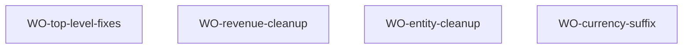

# Design Plan — M-001 Display Content Standardization

> Source: TRI-1786256042159-849c · Change class: C3 · Change type: implementation

## Summary

**Approach:** Batch cosmetic display-string changes across 12 frontend files. Three change groups already completed (AuthScreen animation/background/password-placeholders, Dashboard labels/rounding). Nine remaining groups are single-line string replacements or CSS tweaks — zero business logic, zero architecture, zero data model.

**Key trade-off:** None. This is a cosmetic standardization pass.

---

## Current State Assessment

| # | Change Group | Status | Evidence |
|---|---|---|---|
| CG-1 | Layout nav "Khách" → "Khách hàng" | ❌ TODO | `Layout.tsx:35` still `'Khách'` |
| CG-2a | AuthScreen: remove scale(), image-rendering, background fallback | ✅ DONE | `AuthScreen.tsx:209,215,418-421` — keyframes translate-only, `imageRendering:'auto'`, `background:'#0a1628'` |
| CG-2b | AuthScreen: password + confirm-password placeholders | ✅ DONE | `AuthScreen.tsx:320` `"Mật khẩu"`, `:360` `"Xác nhận mật khẩu"` |
| CG-2c | AuthScreen: email placeholder Vietnamese | ❌ TODO | `AuthScreen.tsx:288` still `"email@example.com"` |
| CG-3a | Dashboard: remove Math.round() from money() | ✅ DONE | `DashboardScreen.tsx:42` → `return formatCurrency(amount);` |
| CG-3b | Dashboard: "Tổng thu" → "Doanh thu", "Tổng chi" → "Chi phí" | ✅ DONE | `DashboardScreen.tsx:157,164` |
| CG-4 | Empty states unify to "Chưa có X nào" | ❌ TODO | 6 files still inconsistent |
| CG-5 | Button labels use "Thêm" prefix | ❌ TODO | CustomerScreen, ProductScreen, RevenueScreen |
| CG-6 | Confirm dialogs "Xoá X?" format | ❌ TODO | ExpenseGrid, RevenueGrid still "Xác nhận xóa" |
| CG-7 | Currency inputs ₫ suffix | ❌ TODO | ExpenseDialog, OrderDialog, ProductDialog |
| CG-8 | Input placeholders Vietnamese | ❌ TODO | AuthScreen email only |
| CG-9 | RevenueGrid formatDate(row.date) | ❌ TODO | `RevenueGrid.tsx` renders raw `{row.date}` |

---

## Remaining Changes (by file)

| File | Changes |
|---|---|
| `Layout.tsx:35` | `'Khách'` → `'Khách hàng'` |
| `AuthScreen.tsx:288` | `placeholder="email@example.com"` → `placeholder="Nhập địa chỉ email"` |
| `DashboardScreen.tsx:238` | `'Chưa có dữ liệu'` → `'Chưa có dữ liệu nào'` |
| `DashboardScreen.tsx:290` | `'Không có đơn chờ xử lý'` → `'Chưa có đơn hàng chờ xử lý nào'` |
| `DashboardScreen.tsx:348` | `'Chưa có giao dịch'` → `'Chưa có giao dịch nào'` |
| `CustomerScreen.tsx:134` | `'Thêm khách'` → `'Thêm khách hàng'` |
| `CustomerScreen.tsx:147` | empty state → `'Chưa có khách hàng nào'` |
| `ProductScreen.tsx:167` | `'Thêm SP'` → `'Thêm sản phẩm'` |
| `ProductScreen.tsx:182` | empty state → `'Chưa có sản phẩm nào'` |
| `PlatformScreen.tsx:128` | `'Không có kênh'` → `'Chưa có kênh nào'` |
| `ExpenseScreen.tsx:220` | `'Không có chi phí nào'` → `'Chưa có chi phí nào'` |
| `RevenueScreen.tsx:248` | `'Tạo đơn hàng'` → `'Thêm đơn hàng'` |
| `RevenueGrid.tsx:138` | `'Chưa có đơn hàng'` → `'Chưa có đơn hàng nào'` |
| `RevenueGrid.tsx:167,262` | `{row.date}` → `{formatDate(row.date)}` + add import |
| `RevenueGrid.tsx:432` | `'Xác nhận xóa'` → `'Xóa đơn hàng?'` |
| `RevenueGrid.tsx:447` | `'Xác nhận xóa nhiều'` → `'Xóa nhiều đơn hàng?'` |
| `ExpenseGrid.tsx:337` | `'Xác nhận xóa'` → `'Xóa chi phí?'` |
| `ExpenseGrid.tsx:350` | `'Xác nhận xóa nhiều'` → `'Xóa nhiều chi phí?'` |
| `ExpenseDialog.tsx` | Wrap amount Input in relative div + ₫ suffix span |
| `OrderDialog.tsx` | Wrap all currency Inputs (unitPrice, discount, shipping, deposit, paidAmount) + ₫ suffix |
| `ProductDialog.tsx` | Wrap unitPrice Input + ₫ suffix |

---

## Design Decisions

**Decision:** Four parallel work orders, single wave — all 12 files have zero overlap. No serial dependencies since every change is a local string/attribute modification.

**Chosen:** One wave only (no Wave 2 dependency). Prior Wave 2 was designed when entity-ux-unify depended on Wave 1 establishing the patterns — but the patterns are already established by the AuthScreen + Dashboard work already done. All remaining changes are independent mechanical edits.

---

## Work Orders

### WO-top-level-fixes

- **goal:** Layout nav label matches page titles; AuthScreen email placeholder Vietnamese; Dashboard empty states unified.
- **assignee-role:** engineering-frontend-developer
- **complexity:** mechanical
- **files:**
  - `src/ui/Layout.tsx:35` — `'Khách'` → `'Khách hàng'`
  - `src/ui/screens/auth/AuthScreen.tsx:288` — `placeholder="email@example.com"` → `placeholder="Nhập địa chỉ email"`
  - `src/ui/screens/dashboard/DashboardScreen.tsx:238` — `'Chưa có dữ liệu'` → `'Chưa có dữ liệu nào'`
  - `src/ui/screens/dashboard/DashboardScreen.tsx:290` — `'Không có đơn chờ xử lý'` → `'Chưa có đơn hàng chờ xử lý nào'`
  - `src/ui/screens/dashboard/DashboardScreen.tsx:348` — `'Chưa có giao dịch'` → `'Chưa có giao dịch nào'`
- **contracts:** design/00-design-plan.md#remaining-changes-by-file
- **acceptance:**
  - Sidebar nav shows "Khách hàng" matching page title
  - AuthScreen email input placeholder "Nhập địa chỉ email"
  - Dashboard empty states: "Chưa có dữ liệu nào", "Chưa có đơn hàng chờ xử lý nào", "Chưa có giao dịch nào"
- **verify:** `npx tsc --noEmit`
- **done-when:** verify exits 0 AND visual inspection confirms all changes

### WO-revenue-cleanup

- **goal:** RevenueScreen button uses "Thêm" prefix; RevenueGrid dates formatted, empty state and confirm dialogs unified.
- **assignee-role:** engineering-frontend-developer
- **complexity:** mechanical
- **files:**
  - `src/ui/screens/revenue/RevenueScreen.tsx:248` — `'Tạo đơn hàng'` → `'Thêm đơn hàng'`
  - `src/ui/screens/revenue/RevenueGrid.tsx` — add `import { formatDate } from '@/utils/date';`
  - `src/ui/screens/revenue/RevenueGrid.tsx:138` — empty `'Chưa có đơn hàng'` → `'Chưa có đơn hàng nào'`
  - `src/ui/screens/revenue/RevenueGrid.tsx:167` — mobile: `{row.date}` → `{formatDate(row.date)}`
  - `src/ui/screens/revenue/RevenueGrid.tsx:262` — desktop: `{row.date}` → `{formatDate(row.date)}`
  - `src/ui/screens/revenue/RevenueGrid.tsx:432` — `'Xác nhận xóa'` → `'Xóa đơn hàng?'`
  - `src/ui/screens/revenue/RevenueGrid.tsx:447` — `'Xác nhận xóa nhiều'` → `'Xóa nhiều đơn hàng?'`
- **contracts:** design/00-design-plan.md#remaining-changes-by-file
- **acceptance:**
  - RevenueScreen create button: "Thêm đơn hàng"
  - RevenueGrid dates in Vietnamese dd/MM/yyyy format
  - RevenueGrid empty: "Chưa có đơn hàng nào"
  - RevenueGrid confirm dialog: "Xóa đơn hàng?" / "Xóa nhiều đơn hàng?"
- **verify:** `npx tsc --noEmit`
- **done-when:** verify exits 0

### WO-entity-cleanup

- **goal:** Empty states, button labels, and confirm dialogs unified across Customer, Product, Platform, Expense screens.
- **assignee-role:** engineering-frontend-developer
- **complexity:** mechanical
- **files:**
  - `src/ui/screens/customer/CustomerScreen.tsx:134` — `'Thêm khách'` → `'Thêm khách hàng'`
  - `src/ui/screens/customer/CustomerScreen.tsx:147` — empty → `'Chưa có khách hàng nào'`
  - `src/ui/screens/product/ProductScreen.tsx:167` — `'Thêm SP'` → `'Thêm sản phẩm'`
  - `src/ui/screens/product/ProductScreen.tsx:182` — empty → `'Chưa có sản phẩm nào'`
  - `src/ui/screens/platform/PlatformScreen.tsx:128` — `'Không có kênh'` → `'Chưa có kênh nào'`
  - `src/ui/screens/expense/ExpenseScreen.tsx:220` — `'Không có chi phí nào'` → `'Chưa có chi phí nào'`
  - `src/ui/screens/expense/ExpenseGrid.tsx:337` — `'Xác nhận xóa'` → `'Xóa chi phí?'`
  - `src/ui/screens/expense/ExpenseGrid.tsx:350` — `'Xác nhận xóa nhiều'` → `'Xóa nhiều chi phí?'`
- **contracts:** design/00-design-plan.md#remaining-changes-by-file
- **acceptance:**
  - CustomerScreen: button "Thêm khách hàng", empty "Chưa có khách hàng nào"
  - ProductScreen: button "Thêm sản phẩm", empty "Chưa có sản phẩm nào"
  - PlatformScreen: empty "Chưa có kênh nào"
  - ExpenseScreen: empty "Chưa có chi phí nào"
  - ExpenseGrid confirm: "Xóa chi phí?" / "Xóa nhiều chi phí?"
- **verify:** `npx tsc --noEmit`
- **done-when:** verify exits 0

### WO-currency-suffix

- **goal:** All currency input fields in dialogs show ₫ suffix at right edge.
- **assignee-role:** engineering-frontend-developer
- **complexity:** mechanical
- **files:**
  - `src/ui/screens/expense/ExpenseDialog.tsx` — wrap amount Input in relative div + ₫ suffix span
  - `src/ui/screens/revenue/OrderDialog.tsx` — wrap item unitPrice, discount, shipping, deposit, paidAmount Inputs
  - `src/ui/screens/product/ProductDialog.tsx` — wrap defaultUnitPrice Input
- **contracts:** design/00-design-plan.md#remaining-changes-by-file
- **conventions:** `
<Input className="pr-8" .../>₫
`
- **acceptance:**
  - ExpenseDialog amount input has ₫ suffix
  - OrderDialog all currency inputs have ₫ suffix
  - ProductDialog unitPrice input has ₫ suffix
  - Suffix is non-interactive (pointer-events-none)
- **verify:** `npx tsc --noEmit`
- **done-when:** verify exits 0 AND visual inspection confirms ₫ on all currency inputs

---

## Execution Sequence

All four work orders are independent (zero file overlap) — run in parallel as a single wave.

---

## Developer Guidance

- `formatDate` from `@/utils/date` is already used by `ExpenseGrid.tsx` and `CustomerScreen.tsx` — follow the same import pattern in `RevenueGrid.tsx`
- ₫ suffix: use `pointer-events-none` so clicking the suffix focuses the input behind it; add `pr-8` to the Input className for right clearance
- AuthScreen email placeholder change is line 288 in the rewritten 421-line file
- Dashboard empty states at lines 238, 290, 348 in the current 434-line file
