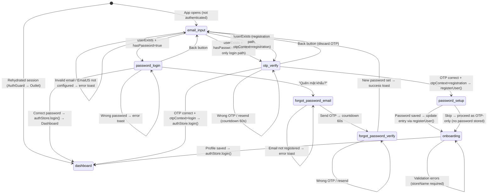

# Design Plan — Email-First Auth Flow Redesign

> **Source:** BA spec `ba/00-lean-spec.md` (2026-08-02). Architected against live code at `src/services/authService.ts:267`, `src/store/authStore.ts:280`, `src/ui/screens/auth/AuthScreen.tsx:430`.

## Summary

**Approach:** Migrate auth storage from a single `StoredCredentials` object to a `Record<email, StoredCredentials>` multi-user map under the SAME localStorage key `ql-tc-local-auth`, with a lazy migration function that detects and wraps legacy single-object data on first read. Add a `tokenSecret` field to `StoredCredentials` so OTP-only users (no password) can still derive HMAC-SHA256 session tokens through the existing `tokenService.ts` (unchanged). Expand `AuthScreen` from 2 states to a 5-state email-first state machine; add `OnboardingScreen` for post-registration profile capture; extend `AuthGuard` with an onboarding gate.

**Key trade-off:** Single localStorage key, same format (`Record<string, StoredCredentials>`), lazy migration — no schema version field, no new key. Simpler than a migration-version approach but means the format change is irreversible for any browser that runs the migration (acceptable for a local-first PWA with no server sync).

---

## 1. Key Decisions (ADR-Level)

### ADR-001 — Multi-User Storage Migration (Lazy, In-Place)

**Decision:** On first `getAllUsersMap()` call, read raw `ql-tc-local-auth` from localStorage. If the parsed value has an `email` field at the top level (single-object format), wrap it into `Record<string, StoredCredentials>` keyed by `email.toLowerCase()` and write back. All subsequent reads use the multi-user map directly.

**Chosen:** Lazy migration on first read. No migration-version field, no new storage key.
**Rejected:** Eager migration at app startup (adds boot-time complexity with no benefit), new storage key `ql-tc-local-auth-v2` (fragments storage, doubles migration burden on logout/clearAuth), schema-version field (over-engineering for a local-first PWA).
**Rationale:** `src/services/authService.ts:8` — single `AUTH_STORAGE_KEY = 'ql-tc-local-auth'` is the only key. The single-object format `{ email, passwordHash, profile, isAdmin? }` is trivially detectable (a top-level `email` field + no nested map). Migration runs exactly once per browser; `storeUserCredentials()` always writes the map format afterward.

```
Migration pseudocode (runs inside getAllUsersMap()):
  const raw = localStorage.getItem('ql-tc-local-auth')
  const parsed = JSON.parse(raw)
  if (parsed && typeof parsed.email === 'string' && typeof parsed.passwordHash === 'string') {
    // single-object legacy format
    const normalized = normalizeCreds(parsed)  // adds hasPassword + tokenSecret
    const map = { [normalized.email.toLowerCase()]: normalized }
    localStorage.setItem('ql-tc-local-auth', JSON.stringify(map))
    return map
  }
  // already a map or empty
  return (parsed && typeof parsed === 'object' && !Array.isArray(parsed)) ? parsed : {}
```

### ADR-002 — OTP-Only Session Token Strategy (tokenSecret)

**Decision:** Add `tokenSecret: string` (32 random hex bytes via `crypto.getRandomValues`) to `StoredCredentials`. Generated once at user registration, never regenerated, stored alongside the user in localStorage. When `hasPassword: true`, token HMAC key = `passwordHash` (existing behavior). When `hasPassword: false`, token HMAC key = `tokenSecret`.

**Chosen:** `tokenSecret` per user, stored in `StoredCredentials`, used as HMAC key material for `generateToken()` / `verifyToken()` when no password hash exists.
**Rejected:** OTP-only users get no session token (no — must have token for AuthGuard/AuthProvider), hardcoded fallback key (no — shared across users), derive key from email alone (no — no entropy), change `tokenService` signature (no — BA out-of-scope: "Token generation/verification unchanged").
**Rationale:** `tokenService.ts:77` — `generateToken(userId, passwordHash)` expects a string key material. `tokenSecret` is the same shape (hex string) so `deriveHmacKey()` (which encodes the key material via `new TextEncoder().encode(keyMaterial)`) works identically whether passed `passwordHash` or `tokenSecret`. The caller (authStore.login) decides which to pass based on `creds.hasPassword`. The `tokenService` module is untouched.

**`StoredCredentials` extension:**
```typescript
// ADD to existing interface at authService.ts:19
interface StoredCredentials {
  email: string;
  passwordHash: string;
  profile: UserProfile;
  isAdmin?: boolean;
  hasPassword: boolean;     // NEW — derived: passwordHash !== ""
  tokenSecret: string;       // NEW — random 32-byte hex for OTP-only token derivation
}
```

**`tokenSecret` generation helper (in authService.ts):**
```typescript
function generateTokenSecret(): string {
  const bytes = new Uint8Array(32);
  crypto.getRandomValues(bytes);
  return toHex(bytes);
}
```

### ADR-003 — Onboarding Gate (AuthGuard Extension)

**Decision:** `AuthGuard` at `src/ui/components/AuthGuard.tsx:31` already gates on `isAuthenticated`. Extend it with a second condition: when `isAuthenticated && userProfile && !userProfile.storeName` (i.e., authenticated but incomplete profile), render `<OnboardingScreen />` instead of `<Outlet />`. The `OnboardingScreen` is a standalone route-less screen (like `AuthScreen`), not a nested route — it renders outside `<Layout />` just as `AuthScreen` does.

**Chosen:** AuthGuard condition extension + standalone OnboardingScreen.
**Rejected:** Separate `/onboarding` route (adds route complexity with no navigation benefit), modal/dialog (user could dismiss it), inline in AuthScreen (breaks state machine — onboarding is NOT an auth state; user IS authenticated).
**Rationale:** `App.tsx:64` — `AuthGuard` wraps all authenticated routes as `<Route element={<AuthGuard />}>`. The onboarding gate is a subset of the authenticated state, making it a natural AuthGuard extension. The existing pattern at `AuthGuard.tsx:48-50` (`if (!isAuthenticated) { return <AuthScreen />; }`) of rendering a standalone screen outside the layout when gated is the precedent.

---

## 2. System Boundaries

| Service/Module | Responsibility | Owns | Calls | Exposes |
|---|---|---|---|---|
| `authService.ts` | Multi-user credential storage, password hashing, OTP generation, user CRUD | `StoredCredentials`, `UserProfile`, localStorage `ql-tc-local-auth` | Web Crypto API, localStorage | `getUserByEmail()`, `getAllUsers()`, `storeUserCredentials()`, `storeUserByEmail()`, `userExists()`, `registerUser()`, `resetPassword()`, `updateProfile()`, `changePassword()`, `clearAuth()`, `initAdminAccount()`, `hashPassword()`, `verifyPassword()`, `generateOTP()` |
| `tokenService.ts` | HMAC-SHA256 session token lifecycle | `SessionToken`, `SignedToken`, sessionStorage `ql-tc-session-token` | Web Crypto API | `generateToken()`, `verifyToken()`, `parseToken()`, `isTokenExpired()`, `getRemainingTime()`, `refreshToken()`, `storeToken()`, `getStoredToken()`, `clearToken()` — **unchanged** |
| `authStore.ts` (Zustand) | Auth state, session lifecycle, profile, rehydration | `isAuthenticated`, `userProfile`, `userId`, `sessionToken`, EmailJS config, Gemini key | `authService`, `tokenService`, `database`, `cacheManager` | `login()`, `logout()`, `updateUserProfile()`, `setSession()`, `clearSession()` |
| `AuthScreen.tsx` | 5-state email-first auth UI | Email input, password login, OTP verify, password setup, forgot password | `authService`, `authStore`, `emailService` | — (standalone screen) |
| `OnboardingScreen.tsx` (NEW) | Post-registration store-info capture | storeName (required), address, phone | `authStore`, `authService.updateProfile()` | — (standalone screen) |
| `AuthGuard.tsx` | Route gate: unauthenticated → AuthScreen; incomplete profile → OnboardingScreen; OK → Outlet | Routing decision | `authStore.isAuthenticated`, `authStore.userProfile` | — |
| `AuthProvider.tsx` | Token auto-refresh, visibility-aware session management | Refresh timers | `tokenService`, `authService`, `authStore` | — |

---

## 3. Data Architecture

### 3.1 Storage Schema

```
localStorage key: 'ql-tc-local-auth' (UNCHANGED)
Value shape: Record<string, StoredCredentials>

Type: Record<string, StoredCredentials>
Key: email.toLowerCase()
Value: {
  email: string;
  passwordHash: string;      // "salt:hex" or "" (empty = OTP-only)
  profile: UserProfile;      // { storeName, email, address?, phone? }
  isAdmin?: boolean;
  hasPassword: boolean;      // COMPUTED on read: passwordHash !== ""
  tokenSecret: string;       // 32 random hex bytes, generated once at registration
}
```

### 3.2 Entity — StoredCredentials

| Entity | Owner | Storage | Consistency | Migration Needed |
|---|---|---|---|---|
| `StoredCredentials` | `authService.ts` | `localStorage` key `ql-tc-local-auth` | Single-writer (one browser tab at a time), eventual (localStorage is sync) | Yes — lazy migration from single-object to `Record<string, StoredCredentials>` on first read. Migration also adds `hasPassword` and `tokenSecret` to legacy entries. |

### 3.3 Migration Path Detail

1. `getAllUsersMap()` is the single read entry-point for all multi-user operations.
2. On first call, it detects the legacy single-object format and migrates:
   - Legacy entry's `hasPassword` = `passwordHash !== ""`
   - Legacy entry's `tokenSecret` = `generateTokenSecret()` (new random secret — existing users with passwords never need it since they use `passwordHash`, but generating it ensures forward-compatibility if they ever clear their password)
3. Writes back as `Record<string, StoredCredentials>`.
4. All subsequent `getAllUsersMap()` calls read the map directly.
5. `storeUserCredentials()` ALWAYS writes the map format — after migration there is no path back to single-object.

### 3.4 Function Interface Design

| Function | New Signature | Behavior |
|---|---|---|
| `getAllUsersMap()` (NEW, internal) | `() => Record<string, StoredCredentials>` | Reads raw JSON, migrates if legacy format, returns map. ALL other functions call this instead of `localStorage.getItem` directly. |
| `getUserByEmail(email)` (NEW) | `(email: string) => StoredCredentials \| null` | `const map = getAllUsersMap(); return map[email.toLowerCase()] ?? null` |
| `getAllUsers()` (NEW) | `() => StoredCredentials[]` | `Object.values(getAllUsersMap())` |
| `storeUserCredentials(creds)` (MODIFIED) | `(creds: StoredCredentials) => void` | Read map; `map[creds.email.toLowerCase()] = creds`; write back |
| `storeUserByEmail(email, creds)` (NEW) | `(email: string, creds: StoredCredentials) => void` | Same as storeUserCredentials — convenience alias |
| `userExists(email)` (MODIFIED) | `(email: string) => boolean` | `getUserByEmail(email) !== null` — same signature, multi-user semantics |
| `registerUser(email, password?, profile)` (NEW) | `(email: string, password?: string, profile: UserProfile) => Promise<StoredCredentials>` | Hash password if provided; `storeUserCredentials({ email, passwordHash, hasPassword, tokenSecret: generateTokenSecret(), profile, isAdmin: false })`; returns the stored creds |
| `updateProfile(email, profile)` (MODIFIED) | `(email: string, profile: Partial<UserProfile>) => void` | Read existing entry by email, merge profile, write back. BREAKING: caller must pass email (from `authStore.userProfile.email`). |
| `changePassword(email, oldPassword, newPassword)` (MODIFIED) | `(email: string, oldPassword: string, newPassword: string) => Promise<boolean>` | Read entry by email, verify oldPassword, hash newPassword, update entry. BREAKING: caller must pass email. |
| `resetPassword(email, newPassword)` (MODIFIED) | `(email: string, newPassword: string) => Promise<void>` | Upsert into multi-user map by email. Preserves existing profile if found; creates placeholder if not. Sets `hasPassword: true`. |
| `clearAuth()` (MODIFIED) | `() => void` | Sets `localStorage.setItem('ql-tc-local-auth', '{}')` — empties the map. Same semantics as "clear all auth data". |
| `initAdminAccount()` (MODIFIED) | `() => Promise<boolean>` | If `!userExists(DEFAULT_ADMIN_EMAIL)`, create admin entry with password + tokenSecret in the multi-user map. |
| `hashPassword()` | UNCHANGED | PBKDF2, 100k iterations, SHA-256 |
| `verifyPassword()` | UNCHANGED | Constant-time comparison |
| `generateOTP()` | UNCHANGED | 6-digit from `crypto.getRandomValues` |

### 3.5 Removed Functions

| Function | Why removed |
|---|---|
| `getUserCredentials()` (no args) | Incompatible with multi-user — replaced by `getUserByEmail(email)`. All 14 references across 4 files (`authStore.ts`, `AuthProvider.tsx`, `AuthScreen.tsx`, `authService.ts` internal) must be migrated. |

---

## 4. AuthScreen State Machine & Data Flows

### 4.1 State Machine (5 states)

The existing `authState` at `src/ui/screens/auth/AuthScreen.tsx:112`:
```typescript
// AS-IS: const [authState, setAuthState] = useState<'login' | 'forgotPassword'>('login');
// TO-BE:
type AuthState = 'email-input' | 'password-login' | 'otp-verify' | 'password-setup' | 'forgot-password';
```

The existing `forgotStep` sub-state (`'email' | 'verify'`) is retained — `forgot-password` is a compound state. The `otp-verify` state tracks its own `otpContext: 'login' | 'registration'` to know which path to take on successful verification.



### 4.2 Branch Decision Matrix

| `userExists(email)` | `hasPassword` | Action | Next State | `otpContext` |
|---|---|---|---|---|
| `true` | `true` | Show password field + Login + Forgot Password link | `password-login` | — |
| `true` | `false` | Send OTP via `sendOTPEmail()`, show 6-digit input | `otp-verify` | `login` |
| `false` | N/A | Send OTP via `sendOTPEmail()`, show 6-digit input | `otp-verify` | `registration` |

### 4.3 Data Flow — Email Input → Branch

```
User enters email → handleEmailSubmit()
  ├─ validate: isValidEmail(email) → no? error toast, stay on email-input
  ├─ check: userExists(email)
  │   ├─ true → getUserByEmail(email)
  │   │   ├─ creds.hasPassword === true → setAuthState('password-login')
  │   │   └─ creds.hasPassword === false → sendOTP() → setAuthState('otp-verify'), otpContext='login'
  │   └─ false → sendOTP() → setAuthState('otp-verify'), otpContext='registration'
```

### 4.4 Data Flow — Password Login Success

```
User enters password → handlePasswordLogin()
  ├─ creds = getUserByEmail(email)
  ├─ valid = await verifyPassword(password, creds.passwordHash)
  ├─ authStore.login(email, creds.profile)
  │   ├─ userId = deriveUserId(email)
  │   ├─ token = await generateToken(userId, creds.passwordHash)
  │   ├─ storeToken(token)
  │   ├─ initDatabase(userId, deriveEncryptionKey(creds.passwordHash))
  │   └─ set: isAuthenticated=true, userProfile=creds.profile, userId, token, isAdmin
  └─ toast.success → Dashboard (AuthGuard now returns <Outlet />)
```

### 4.5 Data Flow — OTP-Only Login Success (new)

```
User enters OTP → handleOtpVerify()
  ├─ code correct, otpContext='login'
  ├─ creds = getUserByEmail(email)
  ├─ authStore.login(email, creds.profile)
  │   ├─ userId = deriveUserId(email)
  │   ├─ keyMaterial = creds.hasPassword ? creds.passwordHash : creds.tokenSecret
  │   ├─ token = await generateToken(userId, keyMaterial)
  │   ├─ storeToken(token)
  │   ├─ initDatabase(userId, deriveEncryptionKey(keyMaterial))
  │   └─ set: isAuthenticated=true, userProfile=creds.profile, userId, token, isAdmin
  └─ toast.success → Dashboard
```

### 4.6 Data Flow — Registration → Onboarding

```
User enters OTP → handleOtpVerify()
  ├─ code correct, otpContext='registration'
  ├─ creds = await registerUser(email, undefined, { storeName: '', email })
  │   ├─ hasPassword: false, tokenSecret: generateTokenSecret()
  │   └─ storeUserCredentials(creds)  // upserts into multi-user map
  └─ setAuthState('password-setup')

User sets password (or skips) → handlePasswordSetup()
  ├─ if password provided:
  │   ├─ passwordHash = await hashPassword(password)
  │   └─ storeUserCredentials({ ...creds, passwordHash, hasPassword: true })
  └─ setAuthState('onboarding')  // same path whether password set or skipped

OnboardingScreen renders → handleOnboardingSubmit()
  ├─ validate: storeName.trim() !== '' → no? error toast, stay
  ├─ updateProfile(email, { storeName, address?, phone? })
  ├─ authStore.updateUserProfile({ storeName, address?, phone? })
  ├─ creds = getUserByEmail(email)
  ├─ authStore.login(email, creds.profile)  // generate token, init DB
  └─ Dashboard
```

---

## 5. Security Architecture

| Concern | Solution | Reference |
|---|---|---|
| Auth/authz | All auth is client-side localStorage + Web Crypto. No server — trust boundary is the device. Existing PBKDF2 password hashing preserved. | `authService.ts:83` — `hashPassword()` |
| OTP-only token secret | **NEW** — `tokenSecret` is 32 random bytes (proposed in ADR-002), to be stored in localStorage alongside credentials, used as HMAC key material for session tokens. Never exposed in UI. If an attacker has localStorage access they already own the device — defense-in-depth is at the OS/device level. | ADR-002 |
| PII/secrets | `passwordHash`, `tokenSecret`, `email` stored in `localStorage`. `localStorage` is origin-scoped. No cross-origin exposure. No PII exfiltration risk — no server calls (EmailJS is the only outbound and sends only the OTP). | BA spec §6 |
| Trust boundary | Device-local. No backend. No multi-device sync of auth data (out of scope). | BA spec §2 |
| XSS | Email input validated via `isValidEmail()` regex before any processing (`AuthScreen.tsx:25` — `EMAIL_RE` regex). React's JSX auto-escapes — the auth flow uses only standard JSX with no `dangerouslySetInnerHTML`. | BA AC-AUTH-25 |
| OTP brute-force | Frontend-only — no rate limiting at this layer. Each incorrect attempt clears the OTP input and shows an error toast. OTP is valid until expiry (no timeout in component state beyond user navigation). | BA AC-AUTH-26 |
| Session token | HMAC-SHA256, 24h TTL, token auto-refresh when < 1h remaining. Token stored in `sessionStorage` via `storeToken()` at `tokenService.ts:135`. Periodic token refresh at `AuthProvider.tsx:63-80` preserves the existing mechanism — adapted to multi-user via `getUserByEmail(email)` instead of `getUserCredentials()`. | `tokenService.ts`, `AuthProvider.tsx` |

---

## 6. Deployment

| Concern | Detail |
|---|---|
| Env vars | No new env vars. `VITE_RESEND_API_KEY` / EmailJS config unchanged. |
| Migration | Lazy migration of localStorage `ql-tc-local-auth` from single-object to multi-user map on first read. No downtime — migration is a JS operation on a single key. |
| Rollback | To roll back: delete localStorage key `ql-tc-local-auth` (user loses all stored accounts — acceptable for a local PWA). No automated rollback path since the format change is in-place and irreversible. **Risk:** if a bug in migration corrupts data, the user must manually clear localStorage. Mitigated by migration validation — if the parsed value is neither single-object nor a valid map, return empty map. |
| Feature flag | None needed — the redesign replaces the existing auth flow entirely. No parallel old/new paths. |

---

## 7. NFR Architecture

| NFR-ref | Solution | Target | Trade-off |
|---|---|---|---|
| Performance | Multi-user map is keyed by email — O(1) lookup. Migration runs once at O(1) for the single legacy entry. | < 1ms for any authService read | — |
| Security | PBKDF2 (100k iterations, SHA-256) for password hashing preserved. `tokenSecret` = CSPRNG 32 bytes. HMAC-SHA256 tokens unchanged. | OWASP-compliant for client-side auth | `tokenSecret` stored in localStorage is accessible to any script on the origin — unavoidable for a client-only app |
| Reliability | Migration validates data shape before writing. If localStorage is corrupted, `getAllUsersMap()` returns `{}` (empty map — AC-AUTH-27). AuthGuard/AuthProvider catch errors and log out gracefully. | No crash on corrupted storage | — |
| Audit | No audit trail for auth events (out of scope — local app, no server). Console logging of migration for debugging. | — | — |

---

## 8. Integration Model

| Integration | Type | Contract | Timeout | Retry | Idempotent |
|---|---|---|---|---|---|
| `emailService.sendOTPEmail()` | Outbound (EmailJS) | Unchanged — `sendOTPEmail(to, otp, userName, config)` | EmailJS default (~30s) | No — user clicks "Resend" | No — each send is a new OTP |
| `tokenService.generateToken()` | Internal | Unchanged — `generateToken(userId, keyMaterial)` where `keyMaterial` is `passwordHash` or `tokenSecret` | N/A (sync + Web Crypto) | N/A | Yes (same inputs = same token) |
| `database.initDatabase()` | Internal | Unchanged — `initDatabase(userId, dbKey)` where `dbKey` is derived from HMAC key material | N/A | Catch in authStore.login, non-critical | Yes |

---

## 9. Plan — Requirement-to-Execution Mapping

| US / AC | Covers | Mapped to Work Order |
|---|---|---|
| US-AUTH-01 (AC-01, AC-02, AC-19) | Email input screen + validation + EmailJS not configured | WO-auth-screen-refactor |
| US-AUTH-02 (AC-03, AC-04, AC-05, AC-22) | Password login + back navigation | WO-auth-screen-refactor |
| US-AUTH-03 (AC-07, AC-08, AC-13, AC-14, AC-15) | OTP registration → password setup | WO-auth-screen-refactor |
| US-AUTH-04 (AC-06, AC-09) | OTP-only login | WO-auth-screen-refactor |
| US-AUTH-05 (AC-16, AC-17, AC-18) | Onboarding screen + AuthGuard gate | WO-onboarding-screen, WO-auth-guard-extension |
| US-AUTH-06 (AC-20, AC-21) | Forgot password (adapted) | WO-auth-screen-refactor |
| US-AUTH-07 | Session rehydration (preserved) | WO-auth-store-adaptation |
| US-AUTH-08 (AC-24) | Multi-user storage | WO-auth-service-migration |
| AC-10, AC-11, AC-12 | OTP wrong code / resend / cooldown | WO-auth-screen-refactor |
| AC-23 | Back navigation from OTP-verify | WO-auth-screen-refactor |
| AC-25 | XSS / email validation | WO-auth-screen-refactor |
| AC-26 | OTP brute-force (no rate limit) | WO-auth-screen-refactor |
| AC-27 | Empty state after clearAuth | WO-auth-service-migration |

---

## 10. Task Breakdown & Execution Sequence

| Wave | Task | Description | Dependency | Owner type | Parallelizable |
|---|---|---|---|---|---|
| 1 | WO-auth-service-migration | Multi-user storage migration: all authService function changes, `getAllUsersMap`, `tokenSecret`, migration logic, `registerUser`. ZERO UI changes. | — | backend | Yes (with WO-auth-screen-refactor — different files) |
| 1 | WO-auth-screen-refactor | AuthScreen 5-state refactor: email-input, password-login, otp-verify, password-setup, forgot-password. Extract shared `OtpInput` + `CountdownButton`. | — (imports authService types only — no runtime dependency on migration being done first since `userExists`/`getUserByEmail` are import-time contracts) | frontend | Yes (with WO-auth-service-migration) |
| 2 | WO-auth-store-adaptation | authStore login/rehydrate/logout adapted to multi-user APIs. Callers of `getUserCredentials()` migrated to `getUserByEmail()`. Token derivation adapted for OTP-only (tokenSecret fallback). | WO-auth-service-migration (runtime: authStore calls authService functions) | backend | No — depends on WO-auth-service-migration |
| 2 | WO-onboarding-screen | New `OnboardingScreen.tsx` — standalone screen with storeName (required), address, phone. Pattern from `ProfileDialog.tsx`. | — | frontend | Yes (with WO-auth-store-adaptation, WO-auth-guard-extension) |
| 2 | WO-auth-guard-extension | AuthGuard onboarding gate + AuthProvider multi-user adaptation + ChangePasswordDialog/ProfileDialog signature updates. | WO-auth-store-adaptation, WO-onboarding-screen | frontend | No — needs both authStore changes and OnboardingScreen to exist |
| 2 | WO-tests | Update `authService.test.ts` for multi-user migration, registerUser, OTP-only flows, tokenSecret. New tests for migration edge cases. | WO-auth-service-migration | backend | Yes (after WO-auth-service-migration) |

---

## 11. Work Orders

### WO-auth-service-migration

- **goal:** All authService functions adapted for multi-user `Record<string, StoredCredentials>` map. Lazy migration from legacy single-object format. `tokenSecret` generation. `registerUser()` implemented. `getUserCredentials()` replaced by `getUserByEmail()`. All internal callers updated.
- **assignee-role:** engineering-backend-developer
- **complexity:** novel
- **files:**
  - `src/services/authService.ts:1-267` — full rewrite of storage layer (same file, all functions)
- **contracts:** `design/00-design-plan.md#33-migration-path-detail`, `design/00-design-plan.md#34-function-interface-design`, `design/00-design-plan.md#35-removed-functions`, `ba/00-lean-spec.md#34-multi-user-storage-migration`
- **conventions:** `getAllUsersMap()` is the single read entry-point — all other functions call it instead of `localStorage.getItem` directly. `hasPassword` is COMPUTED on every read/write, never stored as an independent field (derive: `passwordHash !== ""`). `tokenSecret` is generated once per user via `generateTokenSecret()`.
- **acceptance:**
  - AC-AUTH-24 (Multi-user: two accounts on same device)
  - AC-AUTH-27 (Empty state after clearAuth)
  - Migration of existing single-user data to multi-user map
  - All 14 references to `getUserCredentials()` across 4 files replaced with `getUserByEmail(email)` or appropriate new function
  - `registerUser()` creates entry with `hasPassword: false`, `tokenSecret` when no password
  - `storeUserCredentials()` always writes multi-user map format
- **verify:** `cd . && bun test src/services/authService.test.ts`
- **done-when:** `bun test src/services/authService.test.ts` exits 0. All existing tests pass with multi-user semantics. New tests cover: migration, registerUser, multi-user storeUserCredentials/getUserByEmail, tokenSecret generation, clearAuth empties map.

### WO-auth-screen-refactor

- **goal:** AuthScreen expanded from 2-state to 5-state email-first state machine. OTP input reuses the existing `OtpInput` sub-component (extracted to shared location). Password-setup screen with set/skip. Back navigation on password-login and otp-verify states. All 22 auth-specific ACs pass.
- **assignee-role:** engineering-frontend-developer
- **complexity:** novel
- **files:**
  - `src/ui/screens/auth/AuthScreen.tsx:1-430` — major refactor
- **contracts:** `design/00-design-plan.md#41-state-machine-5-states`, `design/00-design-plan.md#42-branch-decision-matrix`, `design/00-design-plan.md#43-46-data-flows`, `ba/00-lean-spec.md#32-to-be-state-machine-email-first`
- **conventions:** The `OtpInput` sub-component and `CountdownButton` (resend with cooldown) are extracted as local helper components within the same file (no new file — single-file component convention from existing `AuthScreen.tsx` at line 41 where `OtpInput` is already a local sub-component). The `otpContext` variable (`'login' | 'registration'`) determines post-OTP routing. Email is pre-filled but NOT read-only on back-navigation states (AC-AUTH-22, AC-AUTH-23). The `forgot-password` state retains its existing `forgotStep` sub-state (`'email' | 'verify'`).
- **acceptance:** AC-AUTH-01 through AC-AUTH-15, AC-AUTH-19 through AC-AUTH-23, AC-AUTH-25, AC-AUTH-26
- **verify:** `cd . && bun test --run` (existing test suite) + manual screen verification of all 5 states
- **done-when:** All 22 auth ACs demonstrably satisfied. AuthScreen renders email-input as initial state. All 5 states render correctly. Back navigation works. OTP resend cooldown works. Forgot-password flow preserved.

### WO-auth-store-adaptation

- **goal:** `authStore.login()` adapted to work with `getUserByEmail(email)` instead of `getUserCredentials()`. OTP-only token derivation using `tokenSecret`. `onRehydrateStorage` adapted to multi-user. `updateUserProfile` calls updated `updateProfile(email, profile)`.
- **assignee-role:** engineering-backend-developer
- **complexity:** novel
- **files:**
  - `src/store/authStore.ts:167` — `login()` function: change `getUserCredentials()` → `getUserByEmail(email)`, add `tokenSecret` fallback for OTP-only
  - `src/store/authStore.ts:266` — `onRehydrateStorage`: change `getUserCredentials()` → `getUserByEmail(state.userProfile?.email ?? '')`, use `tokenSecret` fallback for DB encryption key
- **contracts:** `design/00-design-plan.md#44-data-flow-password-login-success`, `design/00-design-plan.md#45-data-flow-otp-only-login-success`, `design/00-design-plan.md#adr-002-otp-only-session-token-strategy`
- **conventions:** Key material selection: `const keyMaterial = creds.hasPassword ? creds.passwordHash : creds.tokenSecret`. This is the ONLY place this decision is made. `deriveEncryptionKey(keyMaterial)` at `database.ts` works with any string key material.
- **acceptance:**
  - Password login still works after migration
  - OTP-only login generates a valid session token
  - Session rehydration works for both password and OTP-only users
  - DB encryption initialized correctly for both user types
- **verify:** `cd . && bun test src/services/authService.test.ts`
- **done-when:** Login works for both password users and OTP-only users. Rehydration restores session correctly. No `getUserCredentials()` calls remain in authStore.

### WO-onboarding-screen

- **goal:** New `OnboardingScreen.tsx` — standalone screen displayed after registration when user is authenticated but `storeName` is empty. Collects `storeName` (required), `address` (optional), `phone` (optional). On submit: saves profile via `updateProfile(email, profile)`, calls `authStore.updateUserProfile()`, calls `authStore.login()` to generate session token, then AuthGuard transitions to Dashboard.
- **assignee-role:** engineering-frontend-developer
- **complexity:** novel
- **files:**
  - `src/ui/screens/auth/OnboardingScreen.tsx` — NEW file
- **contracts:** `design/00-design-plan.md#46-data-flow-registration-onboarding`, `ba/00-lean-spec.md` AC-AUTH-16, AC-AUTH-17, AC-AUTH-18, BR-AUTH-09, BR-AUTH-10
- **conventions:** Pattern from `src/ui/screens/settings/ProfileDialog.tsx:1-170` — same Card/Dialog structure, same form fields (storeName, phone, address), same validation pattern. BUT OnboardingScreen is a FULL-SCREEN component (like `AuthScreen`), not a Dialog — renders `<div className="min-h-screen flex items-center justify-center bg-background p-4"><Card>...</Card></div>`. No "Cancel" button — user MUST complete onboarding (BR-AUTH-10). The submit button text is "Vào ứng dụng" (AC-AUTH-17).
- **acceptance:** AC-AUTH-16 (Empty storeName → error), AC-AUTH-17 (Valid storeName → Dashboard), AC-AUTH-18 (Refresh returns to OnboardingScreen)
- **verify:** Manual screen verification: new registration → OTP → skip password → OnboardingScreen renders → empty submit → error → valid submit → Dashboard. Refresh page while on Dashboard with empty storeName → OnboardingScreen.
- **done-when:** OnboardingScreen renders correctly. Required field validation works. Submit saves profile and transitions to Dashboard. AuthGuard routes to OnboardingScreen when `isAuthenticated && !storeName`.

### WO-auth-guard-extension

- **goal:** AuthGuard extended with onboarding gate. AuthProvider adapted to multi-user authService. ChangePasswordDialog and ProfileDialog callers adapted to new function signatures.
- **assignee-role:** engineering-frontend-developer
- **complexity:** novel
- **files:**
  - `src/ui/components/AuthGuard.tsx:31-52` — add onboarding gate condition before `return <Outlet />`
  - `src/ui/components/AuthProvider.tsx:21,46,119` — replace `getUserCredentials()` with `getUserByEmail(userProfile?.email ?? '')`
  - `src/ui/screens/settings/ProfileDialog.tsx:20,63` — `updateProfile(updates)` → `updateProfile(email, updates)` where email from `authStore.userProfile.email`
  - `src/ui/screens/settings/ChangePasswordDialog.tsx:19,71` — `changePassword(old, new)` → `changePassword(email, old, new)` where email from `authStore.userProfile.email`
- **contracts:** `design/00-design-plan.md#adr-003-onboarding-gate-authguard-extension`, `ba/00-lean-spec.md` BR-AUTH-10
- **conventions:** AuthGuard onboarding gate pattern:
  ```typescript
  const userProfile = useAuthStore((s) => s.userProfile);
  // After: if (!isAuthenticated) return <AuthScreen />
  // Add BEFORE <Outlet />:
  if (isAuthenticated && userProfile && !userProfile.storeName) {
    return <OnboardingScreen />;
  }
  ```
  AuthProvider: replace `const creds = getUserCredentials()` with `const creds = userProfile?.email ? getUserByEmail(userProfile.email) : null`.
- **acceptance:** AC-AUTH-18 (Onboarding gate on refresh), existing AC-AUTH-07 preserved (rehydrate → Dashboard)
- **verify:** `cd . && bun run build` — typecheck should pass (new function signatures must be consistent)
- **done-when:** AuthGuard renders OnboardingScreen when `storeName` is empty. AuthProvider token refresh works with multi-user storage. ProfileDialog and ChangePasswordDialog save correctly.

### WO-tests

- **goal:** Update existing `authService.test.ts` for multi-user semantics. Add test cases for migration, registerUser, OTP-only flows, tokenSecret, edge cases.
- **assignee-role:** engineering-backend-developer
- **complexity:** mechanical
- **files:**
  - `src/services/authService.test.ts:1-end` — add/update test cases
- **contracts:** `design/00-design-plan.md#33-migration-path-detail`, `ba/00-lean-spec.md` §5 (all ACs with authService implications)
- **conventions:** Test file pattern from existing `src/services/authService.test.ts`. Use `beforeEach` to reset localStorage. Test helpers: `createTestUser()`, `createMultiUserStore()`.
- **acceptance:** All existing tests pass with multi-user semantics. New tests cover: migration from single-object, registerUser with/without password, getUserByEmail for existing/missing user, clearAuth empties map, storeUserCredentials upserts in map, multi-user isolation (two users don't interfere), tokenSecret uniqueness.
- **verify:** `cd . && bun test src/services/authService.test.ts`
- **done-when:** `bun test src/services/authService.test.ts` exits 0 with ≥ 90 test cases total (currently 83).

---

## 12. Implementation Risks

| Risk | Likelihood | Impact | Mitigation | Contingency |
|---|---|---|---|---|
| Migration corrupts existing user data | Low | High | Migration validates both single-object and map formats before writing. Malformed data returns empty map. | User clears localStorage — single PWA with no server data, so loss is limited to local credentials. |
| OTP-only token derivation incompatible with tokenService | Low | Medium | `tokenSecret` is a 32-byte hex string, same shape as `passwordHash`. `deriveHmacKey()` at `tokenService.ts:51` uses `new TextEncoder().encode(keyMaterial)` which works on any string. Tested in WO-tests. | If tokenService ever changes HMAC key format, OTP-only users would need token regeneration. Unlikely since tokenService is frozen (out of scope). |
| `updateProfile(email, ...)` signature change breaks 2 callers | Medium | Low | Only 2 callers (`ProfileDialog.tsx:63`, possibly OnboardingScreen). Both have access to `authStore.userProfile.email`. | If email is missing from store (edge case: logout mid-edit), return early with error toast. |
| `changePassword(email, ...)` signature change breaks 1 caller | Medium | Low | 1 caller (`ChangePasswordDialog.tsx:71`). Email from `authStore.userProfile.email`. | Same as above. |
| AuthProvider refresh loop breaks for OTP-only users | Low | High | AuthProvider at `AuthProvider.tsx:68` calls `verifyToken(token, creds.passwordHash)`. For OTP-only users, `passwordHash` is `""` — `verifyToken` would fail. **Fix:** Pass `creds.tokenSecret` when `!creds.hasPassword`. | Already designed — AuthProvider adaptation in WO-auth-guard-extension uses `hasPassword` check. |
| Onboarding gate prevents admin from accessing settings | Low | Medium | Admin (`admin@quanlythuchi.app`) has `storeName: 'Cửa hàng của tôi'` (non-empty) from `initAdminAccount()` at `authService.ts:257`. Onboarding gate only triggers for empty `storeName`. | If admin somehow has empty storeName, they see OnboardingScreen instead of Dashboard — fill in storeName to proceed. |

---

## 13. Developer Guidance

### For WO-auth-service-migration (backend developer)
- Open `src/services/authService.ts:1-267` — study the existing `storeUserCredentials` / `getUserCredentials` / `userExists` pattern before touching anything.
- `getAllUsersMap()` is your single read entry-point — name it exactly this and make every other function call it. Resist the temptation to inline `localStorage.getItem` anywhere else.
- The migration detection heuristic: `typeof parsed.email === 'string' && typeof parsed.passwordHash === 'string'` (top-level fields = single-object). A valid multi-user map has email-like keys with nested `StoredCredentials` objects.
- `hasPassword` is NEVER stored as an independent field — compute it from `passwordHash !== ""` at every read and write boundary. This is BR-AUTH-06.
- Existing test file at `src/services/authService.test.ts` is your oracle — make it pass with multi-user semantics.

### For WO-auth-screen-refactor (frontend developer)
- Open `src/ui/screens/auth/AuthScreen.tsx:112` — the existing `authState` is a 2-state union. Replace with 5-state union. The existing `forgotStep` sub-state stays.
- Add `otpContext` state: `useState<'login' | 'registration' | null>(null)`. Set it when transitioning to `otp-verify`. Read it on OTP success to decide next state.
- The existing `OtpInput` sub-component at line 41 can stay in the same file — just add OTP-related state to the main component. A `CountdownButton` helper can be a local function.
- Back navigation: on `password-login` and `otp-verify` states, add a `← Quay lại` button that resets to `email-input` with email pre-filled. Discard OTP in component state.

### For WO-auth-guard-extension (frontend developer)
- `AuthGuard.tsx:50` — the existing pattern `if (!isAuthenticated) return <AuthScreen />` is your template. Add the onboarding gate AFTER the authenticated check but BEFORE `<Outlet />`.
- Import `OnboardingScreen` from `@/ui/screens/auth/OnboardingScreen` (static import — it is rendered by AuthGuard, not by React Router, so lazy loading via `React.lazy()` is unnecessary).
- `AuthProvider.tsx` — the `getUserCredentials()` call at `AuthProvider.tsx:46` (`const creds = getUserCredentials()`) and the call at `AuthProvider.tsx:119` need `userProfile.email` to call `getUserByEmail()`. The `userProfile` is already destructured at `AuthProvider.tsx:27` (`const userProfile = useAuthStore((s) => s.userProfile)`).

### For WO-onboarding-screen (frontend developer)
- Copy the form structure from `src/ui/screens/settings/ProfileDialog.tsx:44-165` — same fields, same validation.
- Wrap in the same full-screen pattern as `AuthScreen.tsx:278` (`<div className="min-h-screen flex items-center justify-center bg-background p-4"><Card>`).
- No "Cancel" or "Back" button — user MUST complete onboarding. The only path forward is "Vào ứng dụng".

---

## 14. Migration / Rollout / Rollback Notes

| Phase | Action |
|---|---|
| Migration | Automatic on first `getAllUsersMap()` call after code deployment. Transforms single-object legacy format to multi-user map. Adds `hasPassword: true`, `tokenSecret: <random>` to legacy entry. |
| Rollout | Deploy the code. On next page load, authService migration runs transparently. No user action required. |
| Rollback | Manually delete localStorage key `ql-tc-local-auth`. User must re-register. No automated rollback. **Note:** the old code (`getUserCredentials()` returning single object) is incompatible with the new map format — a code rollback without data cleanup would break auth. Flag to PM: coordinate code + data rollback if needed. |

---

## 15. Open Execution Questions

| # | Question | Owner |
|---|---|---|
| Q1 | Should `OtpInput` be extracted to `src/ui/components/OtpInput.tsx` (shared component) or remain inline in AuthScreen? | Inline per current convention — `OtpInput` is only used in `AuthScreen`. Extract to shared component only if a second consumer appears. |
| Q2 | Should `OnboardingScreen` be lazy-loaded like other screens in `App.tsx`? | Not needed — `OnboardingScreen` is rendered by `AuthGuard` (not a route), so React Router lazy loading doesn't apply. It can be a static import. |
| Q3 | Should `updateProfile` keep backward-compatible overload without email for gradual migration? | No — the 2 callers (`ProfileDialog.tsx`, `OnboardingScreen`) are updated in the same wave. No gradual migration needed. |

---

## 16. Execution Readiness Verdict

- **Design coherent:** Yes — ADRs cover migration, token strategy, onboarding gate. All 27 ACs mapped to work orders.
- **Plan sequenced:** Wave 1 (authService + AuthScreen) can run in parallel. Wave 2 serializes store + guard + onboarding + tests.
- **File ownership non-overlapping:** Wave 1 splits `authService.ts` (backend) from `AuthScreen.tsx` (frontend). Wave 2: `authStore.ts` (backend), `OnboardingScreen.tsx` + `AuthGuard.tsx` + `AuthProvider.tsx` + settings dialogs (frontend), `authService.test.ts` (backend).
- **services[] populated:** `implementations.yaml:17` already has `m001-app` service with `path: src`, `type: frontend`, `framework: react`.
- **No open blockers.** Ready for implementation.
