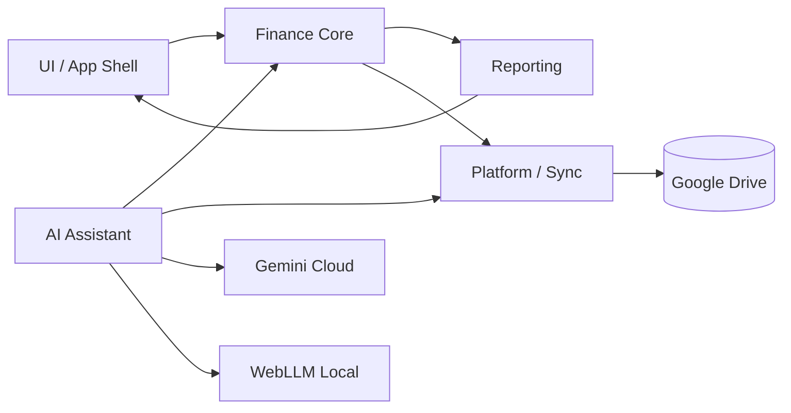

# Lean Domain Model — M-001 "Quản Lý Tài Chính"

> Grounded in `docs/02-data-models.md` (authoritative entity/type definitions) + SRS §3 + architecture §5–6. No `src/` code exists in the repo yet (docs-only stage), so this model is derived from the data-model document, not live code; LSP/impact analysis not applicable (no code to index).

## 1. Bounded Contexts

| Context | Responsibility | Owns | Notes |
|---|---|---|---|
| **Finance Core** | Expense + Revenue/Order lifecycle, validation, state machines | Expense, Revenue/Order, OrderItem, Customer | Single-user; no cross-user rules |
| **Reporting** | Read-only projections: expense/revenue/P&L/daily/monthly/category summaries | Report models (ExpenseReport, RevenueReport, ProfitReport) | Computed from Finance Core data |
| **AI Assistant** | Chat, analysis, OCR entry, conversational entry, FX conversion | AI session data, extracted-entry drafts | Hybrid router: local WebLLM ↔ Gemini cloud |
| **Platform / Sync** | Google OAuth, Drive persistence (`QuanLyThuChi/`), IndexedDB cache, conflict handling | settings, cache, sync state | Storage model TBD: SQLite vs JSON (AMB-001) |
| **UI/App Shell** | Screens, dialogs, theme tokens, PWA/portable shell | UI state only | No business rules (architecture §2 layering) |

## 2. Aggregates & Entities

| Aggregate root | Entities (children) | Invariants |
|---|---|---|
| **Expense** (entity, own aggregate) | — (invoice image = Drive file ref `invoiceImageId`) | amount>0; date ≤ today+30d; description 5–500 chars; status ∈ pending/paid/cancelled (cancelled terminal) |
| **Order** (aggregate root) | OrderItem[] (1..n, inline; FK revenueId), Customer (referenced, not owned) | ≥1 item; qty≥1; unitPrice>0; 0≤discount≤totalAmount; finalAmount=totalAmount−discount; orderCode unique auto `DH-YYYYMMDD-NNN`; order + delivery state machines (BR-08/09) |
| **Customer** (entity, standalone aggregate) | — | phone required `^(0|\+84)[0-9]{9,10}$`; delete blocked when orders exist |
| **Report** (read-only projection) | CategorySummary, MonthlySummary, MonthlyProfitSummary, ProductSummary, CustomerSummary, StatusSummary | Computed, never written by user |

## 3. Domain Events

| Event | Emitted by | Consumers |
|---|---|---|
| ExpenseCreated / ExpenseUpdated / ExpenseDeleted / ExpenseStatusChanged | Finance Core | Reporting, Platform/Sync, AI (context) |
| OrderCreated / OrderUpdated / OrderStatusChanged / DeliveryStatusChanged / OrderCancelled | Finance Core | Reporting, Platform/Sync |
| CustomerCreated / CustomerUpdated | Finance Core | Order creation (dropdown) |
| AiEntryDraftCreated (OCR/text/conversational pre-fill) | AI Assistant | Expense/Order dialogs |
| DriveSyncCompleted / DriveSyncConflictDetected | Platform/Sync | UI (toast/status) |
| AiProviderSwitched (online/key/local) | AI Assistant | Chat status indicator |

## 4. Commands

CreateExpense · UpdateExpense · DeleteExpense · ChangeExpenseStatus · UploadInvoiceImage · CreateOrder · UpdateOrder · ChangeOrderStatus · ChangeDeliveryStatus · CreateCustomer · UpdateCustomer · DeleteCustomer(guarded) · GenerateReport(kind, range) · ExportReport(PDF/CSV) · AskAi(question) · OcrInvoice(image) · ParseTextEntry(text) · ConnectDrive · DisconnectDrive · SyncNow

## 5. Context Map

- Reporting and AI read Finance Core data (upstream/downstream, no ownership transfer).
- Platform/Sync is a conformist persistence boundary — Core does not know the storage technology (SQLite vs JSON, AMB-001).
- All contexts are in one process (client-only); the context map matters for layering, not deployment.

## 6. Data Ownership

| Data | Owner | Location | Lifetime |
|---|---|---|---|
| Expenses, Orders, OrderItems, Customers, Settings | `user` (end user) | Google Drive `QuanLyThuChi/` (folder) + IndexedDB cache | Permanent on Drive; cache clears after 30 days unused (SRS §7.3) |
| Invoice images | `user` | Drive `QuanLyThuChi/invoices/` | Permanent; recovery via Drive version history (30 days) |
| Gemini API key | `user` | IndexedDB, encrypted | Until user removes |
| AI provider status | app (derived) | in-memory/local | Ephemeral |

The app owns **no** server-side data (NFR-SEC-003) — Google Drive is the system of record.

## 7. Ubiquitous Language

| Term | Definition (source: SRS §1.4) |
|---|---|
| Expense | A cost record — money spent out |
| Revenue | Income — money received (from orders) |
| Order | A sales transaction containing multiple products |
| Customer | A buyer of goods |
| OrderItem | A product line inside an order (name, qty, unitPrice, total) |
| P&L | Profit & Loss = Revenue − Expense |
| Dashboard | Overview screen: 7-day chart, pending orders, recent transactions |
| OCR | Extracting text/data from an invoice image |
| FAB | Floating Action Button — opens AI chat |
| Portable App | Unzip-and-run application, no installation |
| Hybrid AI | Local (WebLLM) + cloud (Gemini) routing by online/key state |
