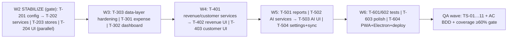

# Technical Spec & Execution Plan — M-001 "Quản Lý Tài Chính" (REVISION 2)

> Lean technical specification. Source of truth: `docs/01-architecture.md`, `docs/05-technical-decisions.md`, `docs/02-data-models.md`, `docs/09-implementation-plan-detailed.md`, `docs/13-theme-tokens.md`, `docs/14-development-standards.md`; module-level: `ba/00-lean-spec.md`, `sa/00-lean-architecture.md`, `domain-analyst/00-lean-domain.md`. Where docs diverge, the resolved decision in `sa/00-lean-architecture.md` (ADR table, §11) wins.
>
> **⚠️ REVISION-2 (verified 2026-08-01):** This revision supersedes the earlier draft. The workspace changed materially during planning: the Vite scaffold and Wave-2..5 source code landed (all files untracked in git; `git status` shows `package.json`, `tsconfig.json`, `vite.config.ts`, `eslint.config.js`, `index.html`, `node_modules/`, full `src/services/*`, full `src/ui/screens/*` as `??`). **All four verification gates FAIL on the current tree** (see §16 Evidence). The plan is re-sequenced around a stabilization wave before any feature work. `skills/_shared/qa-common-tests.md` remains absent (verified by glob). Deployment claims are grounded in primary sources (see §11 note on KB).

## 1. Change Overview

Single-user, offline-first personal/SME finance manager (React 19 SPA → PWA + Electron portable). No app server: system of record = **SQLite (sql.js WASM) on the user's own Google Drive** (`QuanLyThuChi/database.db`, scope `drive.file`), IndexedDB offline cache (SA drift resolution V2). Hybrid AI router (local WebLLM Qwen 2.5 0.5B ↔ Gemini 2.0 Flash). Six screens: Dashboard / Expense / Revenue / Reports / AI chat / Settings.

**Verified current state (REV-2, all via `read`/`glob`/command output):**

| Layer | Status | Evidence |
|---|---|---|
| Toolchain (scaffold) | ✅ **PRESENT** — `package.json` (scripts dev/build/preview/lint/format/typecheck/test/validate), `tsconfig.json` (`strict:true`, `@/*` aliases), `tsconfig.node.json`, `vite.config.ts` (aliases, react plugin), `eslint.config.js` (flat, tseslint+react+hooks), `index.html`, `node_modules/` installed | `read package.json`; `git status` |
| Models (4 entities + barrel) | ✅ Present, matches `02-data-models.md` §2–5 | dev/05-fe-dev-w1-data-models.md |
| Theme tokens (5 files) | ✅ Present per `13-theme-tokens.md` | dev/05-fe-dev-w1-theme-tokens-system.md |
| Shared components (17: Button/Panel/Dialog/Toolbar/ActionBar/GridCell/Badge/Toast/StatusBar/Dropdown/DatePicker/ImagePreview/EmptyState/Skeleton/SegmentedControl + barrel) | ✅ Present | dev/05-fe-dev-w1-ui-shared-components.md; glob `src/ui/components` |
| Stores (6: expense/revenue/customer/report/ui/auth) | ✅ Present | glob `src/store` |
| Services (14 files incl. expenseService, revenueService, storageService, aiRouter, geminiService, webLLM, googleDriveService, cacheManager, reportService, customerService) | ⚠️ Present but **do not typecheck** | `npm run typecheck` FAIL; `npm run build` FAIL |
| Screens (all 6 modules + subcomponents) | ⚠️ Present but **do not compile/lint** | build/lint FAIL |
| App shell (App.tsx, Layout.tsx, main.tsx, vite-env.d.ts, test-setup.ts) | ⚠️ Present; Layout references `uiStore` members that don't exist | build FAIL (Layout.tsx TS2339) |
| Tests | ❌ None; `npm run test` fails — `@vitest/coverage-v8` not installed | `npm run test` FAIL |
| Tailwind integration | ❌ `tailwindcss@^4` in devDeps but **no `@tailwindcss/vite` plugin** and vite.config has `plugins:[react()]` only → CSS pipeline not wired | read vite.config.ts + package.json |
| PWA/Electron | ❌ `vite-plugin-pwa` in devDeps but not wired into vite.config; no `electron/` dir, no manifest | read vite.config.ts |

### 1.1 Stack Summary (verified against installed `package.json`, cross-checked `sa/00-lean-architecture.md` §3)

| Technology | Version (installed) | Purpose |
|---|---|---|
| React + TypeScript | ^19.0.0 / ^5.7.0 (`strict:true`) | UI framework; unidirectional state via Zustand |
| Vite + `vite-plugin-pwa` | ^6.0.0 / ^1.0.0 (unwired) | Build; SW + offline manifest (pending wiring) |
| Tailwind CSS 4 | ^4.0.0 (**unwired** — no Vite plugin) | Styling via `@theme` CSS variables |
| Zustand | ^5.0.0 | State; stores pure, no side effects (ADR-006) |
| React Router | ^7.0.0 (react-router-dom) | Layout route + `React.lazy` |
| Zod | ^3.0.0 | Validation schemas → types |
| `@tanstack/react-virtual` | ^3.0.0 | Virtualized grid |
| Recharts | ^2.0.0 | Charts |
| `date-fns` | ^4.0.0 | vi locale dates |
| `sql.js` + `idb` | ^1.0.0 / ^8.0.0 | SQLite WASM + IndexedDB cache |
| `@googleapis/drive` (via googleDriveService) + `@google/genai` + `@mlc-ai/web-llm` | ^0.8.0 / ^0.2.0 | Drive API, Gemini, local AI |
| Lucide React | ^0.400.0 | Icons |
| Vitest + RTL | ^3.0.0 / ^16.0.0 | Tests (coverage provider missing) |
| ESLint 9 + Prettier | ^9.0.0 / ^3.0.0 | Lint/format (`--max-warnings 0`) |

**Deliberately excluded** (`05-technical-decisions.md` §10): Next.js, Redux, React Query, shadcn/ui, tRPC, Prisma/Drizzle, Docker.

## 2. Requirement-to-Execution Mapping

| BA requirement cluster (SRS refs) | Source tasks (`09-implementation-plan-detailed.md`) | Execution wave (this plan) | Priority (BA §6 MoSCoW) |
|---|---|---|---|
| **Stabilization — make existing tree compile/lint/test** | F-001…F-007 (rework), all E/R/B/A tasks (fix) | **Wave 2 (T-201…T-204)** | **P0 gate — blocks everything** |
| Dashboard (FR-DASH-001/002) | GĐ2 E-003…E-013 + dashboard | Wave 3 (T-303) | Must (US-01) |
| Expense CRUD + filters + invoice (FR-EXP-001…010) | GĐ2 E-001…E-017 | Wave 3 (T-301, T-302, T-304) | Must (US-02) |
| Revenue/order CRUD + customers + state machines (FR-REV-001…004) | GĐ3 R-001…R-015 | Wave 4 (T-401…T-404) | Must (US-03) |
| Reports + export (FR-RPT-001…008) | GĐ4 B-001…B-019 | Wave 5 (T-501) | Must (US-04); export Could (US-08) |
| AI chat/analysis/OCR (FR-AI-000…007) | GĐ5 A-001…A-017 | Wave 5 (T-502, T-503) | Must (US-05) |
| Settings: Drive/AI/display (FR-CFG-000…003) | GĐ6 + F-021 flows | Wave 5 (T-504) | Must (US-06) |
| PWA + Electron (FR-POR-001/002) | GĐ6 T-010…T-014 | Wave 6 (T-604) | Must |
| Tests (TS-01…11, coverage ≥60%) | GĐ6 T-001…T-005 | Wave 6 (T-601, T-602) + QA | Must (NFR-MAINT-001) |
| Search/filter UX (US-07), pin columns + paste-parse (US-09) | embedded grid tasks | Waves 3/5 polish (T-603) | Should / Could |
| Multi-user, POS, native apps (US-10) | — | **Not planned** | Won't |

## 3. Implementation Scope

**In scope (REV-2):** Stabilize the existing tree to green gates (typecheck/lint/build/test); then complete feature wiring (services→stores→screens), AI router, reports, PWA + Electron packaging, and tests.

**Out of scope (BA §2):** multi-user/permissions, full accounting, POS/payments, native iOS/Android, Excel/MISA import, multi-currency base (VND only; FX at entry per BR-14), automated AI financial decisions.

**Project structure (REV-2 — files present as of verification):**

```
quan-ly-thu-chi/
├── docs/                       # read-only source docs
├── index.html                  # ✅ scaffolded
├── package.json / tsconfig.json / tsconfig.node.json / vite.config.ts / eslint.config.js  # ✅ scaffolded
├── public/                     # ❌ missing (manifest.json, icons)     [wave 6]
├── src/
│   ├── models/                 # ✅ 4 entities + barrel
│   ├── utils/                  # ✅ currency/date/id/image/cn
│   ├── hooks/                  # ✅ useDebounce/useKeyboard/useMediaQuery
│   ├── services/               # ⚠️ 14 files present — FIX type/lint errors [wave 2]
│   ├── store/                  # ✅ 6 stores — align API with screens [wave 2]
│   ├── ui/
│   │   ├── theme/              # ✅ tokens.css/tokens.ts/presets/utilities (tokens.ts:47 dup prop — fix)
│   │   ├── components/         # ⚠️ 17 present — ImagePreview hooks violation, unused imports [wave 2]
│   │   └── screens/            # ⚠️ all 6 modules present — many TS errors [waves 2–5]
│   ├── App.tsx / Layout.tsx / main.tsx / vite-env.d.ts / test-setup.ts  # ⚠️ Layout vs uiStore contract [wave 2]
├── electron/                   # ❌ missing                          [wave 6]
├── .github/workflows/ci.yml    # ❌ missing                          [wave 2]
├── .prettierrc                 # ❌ missing (format script assumes it)
├── vitest.config.ts            # ❌ missing; @vitest/coverage-v8 not installed [wave 2]
```

## 4. Impacted Areas

| Area | Change | Risk level |
|---|---|---|
| **Toolchain** | Scaffold landed; must be fixed: tsconfig.node.json TS5096, Tailwind plugin missing, coverage provider missing, CI/prettierrc missing | High (blocks all gates) |
| **Data layer** | `storageService.ts` has `any`-heavy idb API misuse + type mismatches (TS2322/TS2740) | High |
| **State layer** | Store API drift vs screens (Layout→uiStore, ExpenseDialog→expenseStore, RevenueScreen→revenueStore, Settings→authStore): missing members (`filteredExpenses`, `removeExpenses`, `addRevenue`, `setDriveConnected`, `toggleAIPanel`…) | High (contract serialization) |
| **UI layer** | All screens present but ~60 type errors; ImagePreview conditional hook (rules-of-hooks) | High |
| **Delivery** | PWA/Electron not wired | Medium |

**DevOps trigger result: ⚠️ DEV-OPS REVIEW REQUIRED.** Google Cloud project (Drive API + OAuth client → `.env`), `vite-plugin-pwa` wiring, Electron `electron-builder.yml`, GitHub Actions CI, Vercel deploy. **No designer dependency** — design system tokenized (`13-theme-tokens.md`, implemented); screens follow `03-ui-design.md`.

## 5. Task Breakdown

Wave sizing: max 4 agents/wave; 1 task ≤ 1 day; non-overlapping file ownership; shared contracts serialized. Source task IDs from `09-implementation-plan-detailed.md`. Owner split: data/service = engineering-backend-developer; UI = engineering-frontend-developer; packaging/CI = engineering-devops-engineer.

| Task | Description | Depends on | Owner type | Wave | Parallelizable | Risk |
|---|---|---|---|---|---|---|
| T-201 | **Fix toolchain config:** `tsconfig.node.json` TS5096 (`allowImportingTsExtensions` needs `noEmit`/`emitDeclarationOnly` — set `noEmit:true` or drop flag); add `@tailwindcss/vite` + wire `plugins:[react(), tailwindcss()]`; add `@vitest/coverage-v8` + `vitest.config.ts` (jsdom, setup `src/test-setup.ts`); add `.prettierrc`; add `.github/workflows/ci.yml` (node 22: lint→typecheck→test) | — (gate) | engineering-backend-developer | W2 | No | High (config gates) |
| T-202 | **Fix services to typecheck:** resolve ~30 TS errors — `storageService.ts` idb typing (IDBDatabase vs IDBPDatabase, `any` ×10), `expenseService.ts`/`revenueService.ts` unused args + complexity>15 (split), `reportService.ts:118` `string\|undefined`, `aiRouter`/`aiService`/`geminiService`/`webLLM` unused params; export `expenseService`/`revenueService`/`customerService` from barrel `services/index.ts` | T-201 | engineering-backend-developer | W2 | Yes (`src/services/*`) | High |
| T-203 | **Align store contracts with consumers:** add missing members per build errors — `uiStore`: `syncStatus`, `lastSync`, `aiPanelOpen`, `toggleAIPanel`; `expenseStore`: `filteredExpenses`, `addExpense`, `updateExpense`, `removeExpenses`; `revenueStore`: `setRevenues`, `filteredRevenues`, `totalRevenue`, `addRevenue`, `updateRevenue`, `removeRevenues`; `authStore`: `driveConnected`, `setDriveConnected`, `disconnectGemini`; `reportStore`: export `ReportType`; fix implicit-any selectors (`TS7006`); `tokens.ts:47` duplicate property | T-202 | engineering-frontend-developer | W2 | Yes (`src/store/*`, `src/ui/theme/tokens.ts`) | High (contract glue) |
| T-204 | **Fix UI compile errors:** `DataEntryHelper.tsx:87` TS1109 syntax error; `ImagePreview.tsx:41` conditional `useCallback` (rules-of-hooks); `JSX` namespace errors (`React.JSX`); Layout NavLink `aria-current` typing; unused imports across components/screens; `Skeleton`/`DashboardScreen` prop mismatches; Badge children typing | T-203 | engineering-frontend-developer | W2 | Yes (`src/ui/*`) | High |
| T-301 | **Expense service/UI wiring:** complete expenseService CRUD against LocalDatabase + Drive sync; Zod schemas (BR-01/02/03/12); virtualized grid behaviors (search 300ms debounce, filters, sort, pagination, pinned columns); invoice image upload (Canvas ≤2MB, `inv_YYYYMMDD_HHmmss.ext`); delete confirm (BR-15) | T-202, T-204 | engineering-frontend-developer | W3 | Yes (`src/ui/screens/expense/*`) | Med |
| T-302 | **Dashboard screen:** 4 summary cards, 7-day stacked chart (Recharts), pending orders wait-time badges 🟢🟡🔴, recent 8, auto-refresh | T-301 | engineering-frontend-developer | W3 | Yes (`src/ui/screens/dashboard/*`) | Med |
| T-303 | **LocalDatabase + googleDrive service hardening:** sql.js wrapper + schema v1 + migrations; OAuth2 (Identity Services, auto-refresh), Drive API wrapper (etag HEAD pre-flight, retry/backoff 3×), CacheManager | T-201 | engineering-backend-developer | W3 | Yes (`src/services/database*.ts`, `googleDrive*.ts`, `cacheManager.ts`) | High (data integrity) |
| T-401 | **Revenue/customer services + state machines:** orderCode `DH-YYYYMMDD-NNN` (BR-05), totals math (BR-06/07), order/delivery machines (BR-08/09), customer phone regex + delete guard (BR-10/11); reconcile denormalized `customer_name/phone` (SA OQ-2) | T-303 | engineering-backend-developer | W4 | Yes (`src/services/revenueService.ts`, `customerService.ts`) | High |
| T-402 | **Revenue screens:** grid virtualized, OrderDialog (items sub-table, auto totals), status quick actions, filters, empty/error | T-401, T-204 | engineering-frontend-developer | W4 | Yes (`src/ui/screens/revenue/*`) | Med |
| T-403 | **Customer UI:** searchable CustomerDropdown + quick-add, CRUD dialog, delete-guard UX | T-401 | engineering-frontend-developer | W4 | Yes (`src/ui/components/Dropdown.tsx`) | Low |
| T-501 | **Reports:** reportService aggregations + P&L (BR-13), 3 report screens (Recharts), export PDF/CSV (B-001…B-019) | T-301, T-401 | engineering-frontend-developer | W5 | Yes (`src/services/reportService.ts`, `src/ui/screens/report/*`) | Med |
| T-502 | **AI router:** 3-tier SIMPLE/MEDIUM/COMPLEX (local always → cloud w/ fallback → cloud else graceful AC-AI-02), quota counter 1,500/day, FX table for BR-14 (OQ-1: fixed table refreshed via Gemini), DOMPurify on AI output | T-301, T-401 | engineering-backend-developer | W5 | Yes (`src/services/aiRouter.ts`, `geminiService.ts`, `webLLM.ts`, `prompts.ts`) | High (quota/offline/OCR ≥80%) |
| T-503 | **AI chat UI:** ChatPanel streaming markdown, DataEntryHelper OCR→pre-fill, quick actions, timeout 30s (fix existing DataEntryHelper syntax + hooks) | T-502 | engineering-frontend-developer | W5 | Yes (`src/ui/screens/ai/*`) | Med |
| T-504 | **Sync robustness + Settings screen:** Drive connect/disconnect, conflict toast, retry/backoff, AES key storage, display config | T-303, T-204 | engineering-frontend-developer | W5 | Yes (`src/ui/screens/settings/*`) | Med |
| T-601 | **Unit tests:** stores (actions→service, selectors), services (validation, machines, Drive mock), utils, aiRouter (tier/quota) — per `14-dev` §1.4.9 | all | engineering-frontend-developer (+backend for services) | W6 | Yes (`src/**/*.test.ts`) | Low |
| T-602 | **Component + integration tests:** shared components, dialogs validation, Drive sync flow, AI flow (mock Gemini) | T-601 | engineering-frontend-developer | W6 | Yes | Low |
| T-603 | **Polish:** edge cases, skeletons, keyboard shortcuts, responsive, bundle ≤500KB gz | all | engineering-frontend-developer | W6 | Yes | Low |
| T-604 | **PWA + Electron + deploy:** wire `vite-plugin-pwa` (manifest/SW), Electron main/preload/builder portable (Win/mac/Linux ≤200MB), GitHub Releases auto-update, Vercel deploy | T-201 | engineering-devops-engineer | W6 | Yes | Med |

## 6. Execution Sequence



**Wave-2 exit criterion (hard gate):** `npm run validate` (lint + typecheck + test) and `npm run build` pass with 0 errors. No feature wave starts before this is green. Contract serialization: T-203 (stores) must land before T-204 (UI consumers) in the same wave — different files, parallel dispatch with explicit store-API freeze.

## 7. Build & Dev Pipeline (source: `14-development-standards.md` §9, verified in package.json)

| Script | Command | Gate | Current status |
|---|---|---|---|
| dev | `vite` | — | ✅ script exists |
| build | `tsc -b && vite build` | fail on errors | ❌ FAILS (TS5096 + ~100 TS errors) |
| lint | `eslint src/ --ext .ts,.tsx --max-warnings 0` | fail on warnings | ❌ FAILS (61 problems) |
| typecheck | `tsc --noEmit` | fail on errors | ❌ FAILS (TS1109) |
| test | `vitest run --coverage` | coverage ≥60% | ❌ FAILS (missing @vitest/coverage-v8) |
| validate | lint + typecheck + test | pre-push | ❌ (children fail) |
| CI (GitHub Actions) | node 22, npm ci → lint → typecheck → test | push/PR | ❌ missing `.github/workflows/ci.yml` |

## 8. Coding Standards Enforcement

- **ESLint 9 flat config** (`14-dev` §9.1; present at `eslint.config.js` but missing `import/order`, `import/no-cycle`, `max-lines`): `no-unused-vars` error (ignore `^_`); `no-explicit-any` error; `react-hooks/rules-of-hooks` error; complexity warn 15; max-params 4. **Currently 56 errors — must be 0.**
- **Naming** (`14-dev` §6): PascalCase components, `useX` hooks, `xStore`/`xService` suffixes, `is/has` booleans, UPPER_SNAKE constants, `handleX` handlers. English identifiers only — no transliterated Vietnamese.
- **Imports** (`14-dev` §5): `@/*`, `@ui/*`, `@components/*`, `@screens/*`, `@store/*`, `@services/*`, `@models/*`, `@utils/*`, `@hooks/*` aliases (configured in tsconfig + vite); import-order groups; named exports only.
- **DRY/SRP** (`14-dev` §1, §3): 1 file = 1 component/store/service/model; barrel `index.ts` per folder; shared components mandatory; Zod = single validation source; utils pure.
- **Layering (ADR-001/006):** UI → State → Service → Data; stores no side effects; money INTEGER VND; DOMPurify on AI markdown; AES key storage.

## 9. Testing Strategy (source: `14-dev` §1.4.9; BA §10)

| Layer | Tool | Coverage target |
|---|---|---|
| Utils (currency/date/id/image) | Vitest unit | pure-fn behavior |
| Stores | Vitest unit | actions→service calls; selectors |
| Services | Vitest + mocks | validation, state machines, Drive mock, tier selection |
| Shared components | RTL component | variants, handlers, disabled, open/close |
| Integration | Vitest + mocks | Drive sync flow; AI OCR flow |
| Scenario (QA) | per BA §10 | TS-01…11 incl. negative paths; AC-* BDD |

Rules: 1 test = 1 behavior; AAA; mock external deps; coverage ≥60% gate (NFR-MAINT-001). `@vitest/coverage-v8` + `vitest.config.ts` must be added in T-201 first. `skills/_shared/qa-common-tests.md` absent — QA uses BA §10 + AC tables.

## 10. Implementation Risks — Top 5 (REV-2)

| # | Risk | Impact | Mitigation |
|---|---|---|---|
| 1 | **Tree landed non-compiling** — ~100 TS errors, 56 lint errors, no tests, coverage provider missing | Nothing builds; all downstream waves blocked | Wave-2 stabilization gate with `validate` + `build` green before feature work; CI added in T-201 |
| 2 | **Store-API drift between stores and screens** (missing `filteredExpenses`, `removeExpenses`, `addRevenue`, `setDriveConnected`, `toggleAIPanel`…) | Contract churn, rework | T-203 freezes store API surface from build-error list; screens consume only frozen API |
| 3 | **React hooks violation** (`ImagePreview.tsx:41` conditional `useCallback`) + syntax error (`DataEntryHelper.tsx:87`) | Runtime crash / parse failure in AI + image flows | T-204 fixes before any feature work; add rules-of-hooks CI check |
| 4 | **Drive whole-file sync conflict / LWW** (BR-15 permanent delete) | Data loss; recovery only via Drive version history 30d | etag pre-flight, conflict toast, write queue, 3× exp-backoff (T-303) |
| 5 | **Hybrid AI router** (offline, quota 1,500/day, OCR ≥80% Vietnamese) | AI unusable offline/quota-exhausted | 3-tier router + local fallback + graceful AC-AI-02 (T-502) |

## 11. Technical Dependencies

- **External:** Google account + Drive API project + OAuth client (CON-001/002); Gemini key optional (CON-003); WebLLM Qwen model (CON-004); browsers Chrome/Edge/Firefox 90+, Safari 15+ (CON-005); Electron 30+ (CON-006).
- **Library (installed, verified):** react19, zustand5, react-router7, zod3, recharts2, lucide, date-fns, idb, sql.js, @tanstack/react-virtual, @google/genai, @mlc-ai/web-llm. **Missing:** `@tailwindcss/vite`, `@vitest/coverage-v8`, `simple-git-hooks`, `@googleapis/drive` (googleDriveService exists but package not in package.json — verify at T-303), DOMPurify (needed T-502).
- **Internal contracts:** models (w1) → Zod schemas → services → stores (T-203) → screens (T-204). `LocalDatabase` + `googleDrive` are the foundation (SA handoff) — hardened in T-303.
- **Open handoff:** OQ-1 FX rate → resolved T-502 (fixed table refreshed via Gemini); OQ-2 `revenues` denormalized fields → reconcile T-401; OQ-3 sitemap/data-model intel absent → orchestrator `/intel-refresh`; OQ-4 `authStore.ts` vs SA `driveAuthStore` → keep `authStore.ts` (V3 semantics), reviewer note; OQ-5 `formatCurrency/parseCurrency` vs `14-dev` `formatVND/parseVND` → accept implemented names, update standards doc.
- **KB note (anti-fabrication):** `ai-mcp_kb-query` is **not granted** to this agent (not in available_tools); a KB query for `deployment` could not be executed. Deployment claims below are instead grounded in **primary workspace sources verified verbatim**: `05-technical-decisions.md:483` ("Không có backend, deploy thẳng lên Vercel"), `ba/00-lean-spec.md:81` (FR-POR-001: "Electron portable bundle ≤200MB … auto-update from GitHub Releases"), `sa/00-lean-architecture.md` V6 ("PWA → Vercel; Electron portable w/ GitHub Releases auto-update").

## 12. Migration / Rollout / Rollback Notes

- **Schema:** `schema_version` table + versioned migrations (`05-tech` §5); v1 in T-303; never edit v1 in place.
- **Rollout:** PWA → Vercel (git push); Electron portable → GitHub Releases auto-update (Win10+/macOS12+/Ubuntu22.04+, ≤200MB).
- **Rollback:** PWA — revert Vercel release; Electron — point auto-update to previous Release; **data** — Drive version history (30 days) is the only recovery path (BR-15); IndexedDB cache evicted after 30 days unused.
- **Secrets:** OAuth client id in `.env` (never committed); Gemini key AES-encrypted (WebCrypto) in IndexedDB.

## 13. Developer Guidance

1. **Stabilize first (Wave 2):** the tree is non-compiling. Fix config (T-201) → services (T-202) → store contracts (T-203) → UI (T-204). Run `npm run validate` + `npm run build` after each task; do not start feature work until green.
2. **Scaffold-first (stack = React/Vite):** the generator scaffold exists; fill generated files, don't hand-create. For missing wiring use official plugins (`@tailwindcss/vite`, `vite-plugin-pwa`) — confirm flags via `<cli> --help`.
3. **Layering (ADR-001/006):** UI never calls services/API directly; stores zero side effects.
4. **Correctness:** INTEGER VND; Zod mirrors `02-data-models.md` §2–4; state machines pure (BR-04/08/09); etag pre-flight; DOMPurify AI markdown; AES key.
5. **Contract discipline:** T-203 freezes store API from the build-error list; screens consume only the frozen surface (prevents drift recurrence).
6. **Verification:** `npm run validate` before finishing any task; write tests alongside code (T-601/602 define suites).

## 14. QA Guidance (high-level validation areas)

- Per-wave AC validation (BA §7): AC-EXP-01…05, AC-REV-01…04, AC-RPT-01, AC-AI-01…03, AC-CFG-01, AC-POR-01.
- Scenario suite BA §10 TS-01…11 incl. negative paths (validation, state-machine rejects, delete guard, offline OCR, token expiry, airplane-mode PWA).
- NFR gates: coverage ≥60%, lint/typecheck clean, bundle ≤500KB gz, grid 1000 rows <1s, AI stream <3s, RAM <100MB @10K rows.
- `skills/_shared/qa-common-tests.md` absent — build scenarios from BA §10/§7.
- **QA wave is gated on Wave-2 exit criterion** (`validate` + `build` green) — QA will not receive a non-compiling tree.

## 15. Open Execution Questions

| ID | Question | Owner | Status / Recommendation |
|---|---|---|---|
| OQ-1 (AMB-005) | FX rate source for BR-14 | tech-lead | Resolved: fixed table refreshed via Gemini (T-502) |
| OQ-2 | `revenues` denormalized `customer_name/phone` vs FK-only | tech-lead | Reconcile in T-401 per `02-data-models.md` §3/§6 |
| OQ-3 | Sitemap/data-model intel files absent | orchestrator | `/intel-refresh` (6 routes + 4 entities); flagged `intel-drift` |
| OQ-4 | Store naming `authStore.ts` vs SA `driveAuthStore` | tech-lead | Keep `authStore.ts`; reviewer note |
| OQ-5 | `utils/currency.ts` names vs `14-dev` §4.1 | tech-lead | Accept implemented names; update standards doc |
| OQ-6 | `@googleapis/drive` not in package.json though googleDriveService imports it | tech-lead | Verify at T-303; add dependency if needed |

## 16. Execution Readiness Verdict

**Changes-requested — NOT ready to dispatch feature waves.**

**Verification evidence (raw, REV-2):**
- `npm run typecheck` → FAIL (exit 2): `src/ui/screens/ai/DataEntryHelper.tsx(87,3): error TS1109: Expression expected.`
- `npm run lint` → FAIL (exit 1): **61 problems (56 errors, 5 warnings)** — incl. `react-hooks/rules-of-hooks` at `ImagePreview.tsx:41`, parsing error `DataEntryHelper.tsx:87`, 10× `no-explicit-any` in `storageService.ts`, ~50× `no-unused-vars`.
- `npm run build` → FAIL (exit 1): `tsconfig.node.json(8,35): error TS5096` + ~100 TS errors across services/stores/components/screens (Layout↔uiStore, ExpenseDialog↔expenseService, tokens.ts:47 duplicate prop, JSX namespace, etc.).
- `npm run test` → FAIL (exit 1): `MISSING DEPENDENCY Cannot find dependency '@vitest/coverage-v8'`.
- `ai-kit verify --scopes physical_implementations` → 0 findings (path drift clean); `feature-dependency-graph M-001` → empty (no circular deps).

**Blockers (with next actions):** plan written and `implementations.yaml` `services[]` populated (id `m001-app`, path `src`), but Wave-2 stabilization is mandatory before any feature dispatch: (1) fix toolchain config + missing deps (T-201); (2) fix services/store/UI compile errors (T-202–204); (3) then re-run `validate`+`build` to confirm green before Waves 3–6. QA wave must not start on a non-compiling tree.
