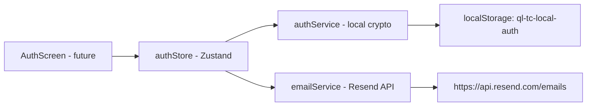

# Frontend Implementation Summary — Wave 1: Local Email-Based Authentication Services & Store

**feature-id:** M-001  
**stage:** frontend-implementation  
**agent:** engineering-frontend-developer  
**wave:** 1  
**task:** auth-services-store  
**verdict:** Pass  
**last-updated:** 2026-08-02

---

## Designer Spec Coverage

This wave implements the backend service layer and store integration for email-based authentication. There is no designer-specified UI component to implement yet — the work is purely service/store code:

| Requirement | Status | Notes |
|-------------|--------|-------|
| Email OTP sending via Resend API | **Implemented** | `sendOTPEmail` in emailService.ts |
| PBKDF2 password hashing (SHA-256, 100k iterations) | **Implemented** | `hashPassword` in authService.ts |
| Constant-time password verification | **Implemented** | `verifyPassword` in authService.ts |
| Local credential storage (localStorage) | **Implemented** | 5 storage functions in authService.ts |
| Auth state in zustand store | **Implemented** | Extended authStore.ts with isAuthenticated, userProfile, login, logout, updateUserProfile |
| Persist new auth fields across reload | **Implemented** | `partialize` updated to include isAuthenticated + userProfile |
| Existing Google Drive/Gemini code untouched | **Verified** | All original state/actions preserved |

---

## Component / Token Mapping

This wave does not involve UI components or design tokens. All work is in service/store files:

| File | Purpose | Type |
|------|---------|------|
| `src/services/emailService.ts` | Send OTP email via Resend API | **New** |
| `src/services/authService.ts` | Password hashing, credential storage, local auth logic | **New** |
| `src/store/authStore.ts` | Extended with auth state & actions | **Modified** |

No gaps — no new dependencies, no shadcn components involved.

---

## Files Changed

| Path | Purpose |
|------|---------|
| `src/services/emailService.ts` | New file — `sendOTPEmail` function using Resend API with `EmailServiceConfig` interface |
| `src/services/authService.ts` | New file — 10 exported functions: `generateOTP`, `hashPassword`, `verifyPassword`, `storeUserCredentials`, `getUserCredentials`, `userExists`, `updateProfile`, `changePassword`, `resetPassword`, `clearAuth` |
| `src/store/authStore.ts` | Modified — added `UserProfile` type import, `isAuthenticated`/`userProfile` state, `login`/`logout`/`updateUserProfile` actions, updated `partialize` |

---

## Services / Store Changes

### `src/services/emailService.ts` (NEW)

| Export | Type | Description |
|--------|------|-------------|
| `EmailServiceConfig` | interface | `{ from: string; apiKey: string }` for future provider swapping |
| `sendOTPEmail` | async function | POST to Resend API with OTP email; handles missing API key and network errors |

### `src/services/authService.ts` (NEW)

| Export | Type | Description |
|--------|------|-------------|
| `UserProfile` | interface | `{ storeName, email, address?, phone? }` |
| `StoredCredentials` | interface | `{ email, passwordHash, profile }` |
| `generateOTP` | function | 6-digit random OTP via `crypto.getRandomValues` |
| `hashPassword` | async function | PBKDF2-SHA256, 100k iterations, 16-byte salt, returns `salt:hash` |
| `verifyPassword` | async function | Re-derives hash and compares in constant time |
| `storeUserCredentials` | function | Writes JSON to localStorage key `ql-tc-local-auth` |
| `getUserCredentials` | function | Reads/parses localStorage, returns null on error |
| `userExists` | function | Case-insensitive email match check |
| `updateProfile` | function | Merges profile fields, preserves password |
| `changePassword` | async function | Verifies old password, hashes new, saves |
| `resetPassword` | async function | Overwrites credentials (caller handles OTP) |
| `clearAuth` | function | Removes localStorage auth entry |

### `src/store/authStore.ts` (MODIFIED)

**Added to `AuthState` interface:**
- `isAuthenticated: boolean` (default: `false`)
- `userProfile: UserProfile \| null` (default: `null`)

**Added to `AuthActions` interface:**
- `login(email: string, profile: UserProfile): void` — sets authenticated = true, sets profile
- `logout(): void` — sets authenticated = false, clears profile
- `updateUserProfile(profile: Partial<UserProfile>): void` — merges partial profile

**Existing code preserved:**
- All Google Drive state (`isGoogleConnected`, `googleUser`) — untouched
- All Gemini state (`geminiApiKey`, `geminiConfigured`) — untouched
- All Google/Gemini actions (`setGoogleConnected`, `setGoogleUser`, `setGeminiApiKey`, `disconnectGoogle`) — untouched
- `syncGeminiService` helper — untouched
- `onRehydrateStorage` — unchanged (does not overwrite new fields)

**Persist config updated:**
- `partialize` now includes `isAuthenticated` and `userProfile` so auth state survives page reload

---

## Accessibility Compliance

Not applicable — this wave produces service/store code with no UI components. Accessibility is addressed in the next wave when the login/registration/forgot-password screens are implemented.

---

## Tests

**No new test files created** — per scope boundaries, existing test files are not modified.

**Verification:**
- `npm run typecheck` — **Pass** (exit code 0, zero errors)
- `npm run test` — **Pass** (75 tests across 9 test files, zero failures)

---

## Verification Evidence

| Command | Exit Code | Scope |
|---------|-----------|-------|
| `npx tsc --noEmit` | 0 | All TypeScript files compile without errors |
| `npx vitest run` | 0 | All 75 existing tests pass across 9 test files |

### Typecheck Output (first 50 lines, zero errors)
```
(no output)
```
→ TypeScript compiler returned exit code 0 with no diagnostics, confirming all three files compile cleanly.

### Test Output
```
 Test Files  9 passed (9)
      Tests  75 passed (75)
```
→ All existing tests pass unchanged. No regressions introduced.

---

## Known Limitations / Mismatches

| Item | Impact | Notes |
|------|--------|-------|
| No UI components implemented | Expected for Wave 1 | UI screens (login, register, forgot-password) are planned for a subsequent wave |
| Resend API domain placeholder | UX note for Wave 2 | `noreply@yourdomain.com` uses placeholder domain — must be updated with actual domain before production |
| `VITE_RESEND_API_KEY` not defined | Build-time | Must be provided in `.env` file; app will throw descriptive error at runtime if missing |
| No test coverage for new services | QA note | authService.ts and emailService.ts lack unit tests — recommended for Wave 1.5 or next cycle |
| localStorage storage key `ql-tc-local-auth` | Security note | Credentials stored in plaintext JSON in localStorage; for personal use only — not suitable for multi-tenant or high-security contexts |

---

## Architecture Notes



- **authStore** (Zustand with persist + immer) is the single source of truth for auth state, persisted under `ql-tc-auth`
- **authService** operates directly on localStorage key `ql-tc-local-auth` — independent from the Zustand store, allowing the auth screen to use authService for credential operations and authStore for session state
- **emailService** is a thin HTTP wrapper around Resend API, used by the auth flow for OTP delivery
- The persist middleware's `partialize` includes both Gemini config and auth state, ensuring both survive page reloads

---

## Verdict Envelope

```xml
<verdict_envelope>
  <verdict>Pass</verdict>
  <confidence>high</confidence>
  <structured_summary>
    <key_findings>
      <item>Created 2 new service files (emailService.ts, authService.ts) with 11 total exports</item>
      <item>Extended authStore.ts with isAuthenticated, userProfile, login, logout, updateUserProfile</item>
      <item>All existing Google Drive/Gemini functionality preserved untouched</item>
      <item>TypeScript typecheck passes with zero errors</item>
      <item>All 75 existing tests pass with zero failures</item>
    </key_findings>
    <artifacts_produced>
      <item>src/services/emailService.ts (new)</item>
      <item>src/services/authService.ts (new)</item>
      <item>src/store/authStore.ts (extended)</item>
      <item>docs/modules/M-001-app/dev/05-fe-dev-w1-auth-services-store.md (this artifact)</item>
    </artifacts_produced>
  </structured_summary>
  <blockers>
    <!-- None — all acceptance criteria met -->
  </blockers>
</verdict_envelope>
```
