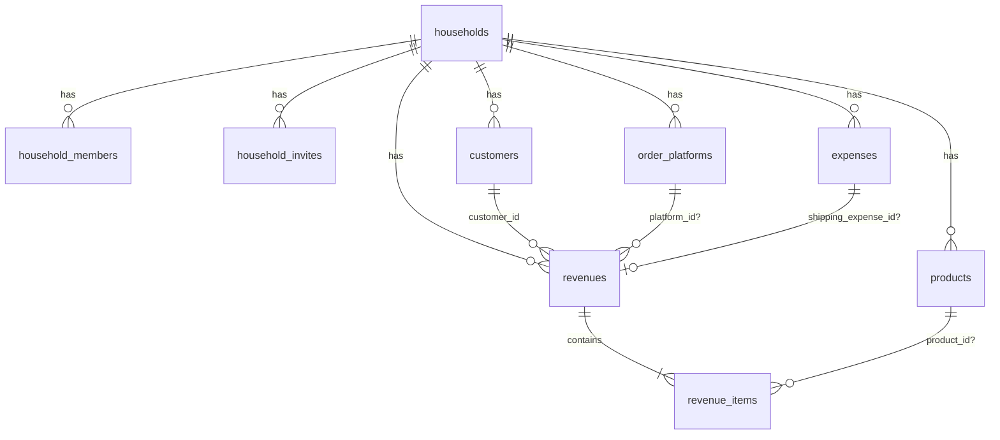

# Supabase Shared Household Ledger — Design

**Date:** 2026-08-08  
**Status:** Draft for user review  
**Replaces (primary cloud sync):** Google Drive `app-data.json` sync

## Goal

One shared ledger for a small group (e.g. household). Everyone in the group sees and edits the same expenses, revenues, customers, products, and order platforms — without Google Drive OAuth.

Frontend stays on GitHub Pages; backend is Supabase (Auth + Postgres + Realtime + RLS).

## Non-goals (phase 1)

- Multiple households per user
- Fine-grained roles beyond `owner` | `member`
- Offline-first write queue
- Google Drive as primary sync (optional JSON export may remain later)
- Putting the Postgres connection string or `service_role` key in the browser
- **Persisting invoice / OCR images** — OCR may still run in-session; do not store invoice photos in Drive or Supabase. Drop `invoiceImageId` from the cloud model (keep optional local-only if needed for UI drafts).

## Architecture

```text
GitHub Pages SPA (React + Vite)
        │  @supabase/supabase-js
        │  VITE_SUPABASE_URL + VITE_SUPABASE_ANON_KEY only
        ▼
Supabase
  • Auth (email + password)
  • Postgres (household-scoped rows)
  • Realtime (postgres_changes filtered by household_id)
  • RLS (members only)
```

Direct `postgresql://postgres:…@db.…supabase.co:5432/postgres` is **admin/migration only** (local `.env` / CI secret). Never shipped in the SPA or GitHub Pages build.

## Auth & membership

1. User signs up / signs in via Supabase Auth (email + password).
2. First-time user creates a `household` and becomes `owner`.
3. Owner creates an invite code (or link) with expiry.
4. Other users sign in, redeem invite → `household_members.role = member`.
5. Phase 1 constraint: **one active household per user**.

Local email/password auth in IndexedDB is superseded for cloud mode; migration path for existing local sessions is out of band (users re-register on Supabase or we add a one-time bridge in a later phase if needed).

## Data model

Schema mirrors `src/models/*` (camelCase in TS ↔ snake_case in Postgres). Money is `bigint` (VND integer). Business dates are `date`; audit times are `timestamptz`. All tenant rows carry `household_id`.

### ER (household-scoped)



### Conventions

| Rule | Choice |
|---|---|
| Primary keys | `uuid` (`gen_random_uuid()`), including seeded platforms (remap local string ids like `platform-direct` on migrate) |
| Tenant | every business row has `household_id uuid not null references households(id) on delete cascade` |
| Enums | Postgres `text` + `check` (or native enum) matching TS unions |
| Soft delete | none in phase 1 (hard delete) |
| `updated_at` | trigger `set_updated_at()` on tables that have it |

### 1. Tenancy / auth

**`households`**
| Column | Type | Notes |
|---|---|---|
| `id` | uuid pk | |
| `name` | text not null | e.g. “Gia đình” |
| `created_at` | timestamptz not null default now() | |

**`household_members`**
| Column | Type | Notes |
|---|---|---|
| `id` | uuid pk | |
| `household_id` | uuid not null fk | |
| `user_id` | uuid not null | `auth.users.id` |
| `role` | text not null | `owner` \| `member` |
| `created_at` | timestamptz not null default now() | |
| | unique `(household_id, user_id)` | one membership row |
| | unique `(user_id)` phase 1 | one household per user |

**`household_invites`**
| Column | Type | Notes |
|---|---|---|
| `id` | uuid pk | |
| `household_id` | uuid not null fk | |
| `code` | text not null unique | short redeem code |
| `expires_at` | timestamptz not null | |
| `created_by` | uuid not null | inviter `user_id` |
| `used_by` | uuid null | set on redeem |
| `used_at` | timestamptz null | |
| `created_at` | timestamptz not null default now() | |

### 2. Catalog

**`customers`** ← `Customer`
| Column | Type | TS field |
|---|---|---|
| `id` | uuid pk | `id` |
| `household_id` | uuid not null | — |
| `name` | text not null | `name` |
| `phone` | text not null default '' | `phone` |
| `email` | text null | `email` |
| `address` | text null | `address` |
| `created_at` | timestamptz not null | `createdAt` |

**`products`** ← `Product` + image
| Column | Type | TS field |
|---|---|---|
| `id` | uuid pk | `id` |
| `household_id` | uuid not null | — |
| `name` | text not null | `name` |
| `default_unit_price` | bigint not null default 0 | `defaultUnitPrice` |
| `unit` | text not null | `unit` |
| `sku` | text null | `sku` |
| `notes` | text null | `notes` |
| `image_path` | text null | `imagePath` (new) |
| `created_at` | timestamptz not null | `createdAt` |
| | unique `(household_id, sku)` where `sku is not null` | |

**`order_platforms`** ← `OrderPlatform`
| Column | Type | TS field |
|---|---|---|
| `id` | uuid pk | `id` |
| `household_id` | uuid not null | — |
| `name` | text not null | `name` |
| `code` | text null | `code` |
| `active` | boolean not null default true | `active` |
| `created_at` | timestamptz not null | `createdAt` |
| | unique `(household_id, code)` where `code is not null` | |

On household create: seed default platforms (Trực tiếp, Facebook, Zalo, Shopee, TikTok, Website, Khác) with new uuids.

### 3. Expenses

**`expenses`** ← `Expense` **without** `invoiceImageId`
| Column | Type | TS field |
|---|---|---|
| `id` | uuid pk | `id` |
| `household_id` | uuid not null | — |
| `date` | date not null | `date` |
| `category` | text not null | `category` |
| `amount` | bigint not null | `amount` (> 0) |
| `description` | text not null | `description` |
| `status` | text not null | `status` |
| `payment_method` | text not null | `paymentMethod` |
| `supplier` | text null | `supplier` |
| `notes` | text null | `notes` |
| `tags` | text[] not null default '{}' | `tags` |
| `created_at` | timestamptz not null | `createdAt` |
| `updated_at` | timestamptz not null | `updatedAt` |

Checks: `category` ∈ ExpenseCategory; `status` ∈ ExpenseStatus; `payment_method` ∈ PaymentMethod; `amount > 0`.

### 4. Revenues (orders) + line items

Normalize line items (matches ER in `docs/02-data-models.md`; better for product reports than jsonb).

**`revenues`** ← `Revenue` header (no embedded `items`)
| Column | Type | TS field |
|---|---|---|
| `id` | uuid pk | `id` |
| `household_id` | uuid not null | — |
| `date` | date not null | `date` |
| `order_code` | text not null | `orderCode` |
| `customer_id` | uuid not null fk → `customers` | `customerId` |
| `total_amount` | bigint not null | `totalAmount` |
| `discount` | bigint not null default 0 | `discount` |
| `final_amount` | bigint not null | `finalAmount` |
| `order_status` | text not null | `orderStatus` |
| `delivery_status` | text not null | `deliveryStatus` |
| `payment_method` | text not null | `paymentMethod` |
| `payment_status` | text not null | `paymentStatus` |
| `deposit_amount` | bigint null | `depositAmount` |
| `deposited_at` | date null | `depositedAt` |
| `paid_amount` | bigint null | `paidAmount` |
| `paid_at` | date null | `paidAt` |
| `shipping_fee` | bigint null | `shippingFee` |
| `shipping_payer` | text null | `shippingPayer` (`customer` \| `shop`) |
| `shipping_expense_id` | uuid null fk → `expenses` | `shippingExpenseId` |
| `platform_id` | uuid null fk → `order_platforms` | `platformId` |
| `notes` | text null | `notes` |
| `created_at` | timestamptz not null | `createdAt` |
| `updated_at` | timestamptz not null | `updatedAt` |
| | unique `(household_id, order_code)` | |

FK deletes: `customer_id` / `platform_id` → `restrict`; `shipping_expense_id` → `set null`.

**`revenue_items`** ← `OrderItem`
| Column | Type | TS field |
|---|---|---|
| `id` | uuid pk | `id` |
| `household_id` | uuid not null | (denormalized for RLS) |
| `revenue_id` | uuid not null fk → `revenues` on delete cascade | — |
| `product_id` | uuid null fk → `products` on delete set null | `productId` |
| `name` | text not null | `name` |
| `quantity` | integer not null check (> 0) | `quantity` |
| `unit_price` | bigint not null check (> 0) | `unitPrice` |
| `total` | bigint not null | `total` (= qty × unit_price) |
| `sort_index` | integer not null default 0 | UI order |

App loads a revenue as header + items; mapper rebuilds `Revenue.items[]`.

### Product images (Storage)

- Bucket `product-images`; object key `{household_id}/{product_id}/{filename}`.
- `products.image_path` stores that key; public/signed URL resolved in UI.
- Compress via existing `compressImage` before upload.
- No invoice image column or Storage path.

### Indexes (minimum)

- All business tables: `(household_id)`
- `expenses (household_id, date desc)`
- `revenues (household_id, date desc)`
- `revenues (household_id, customer_id)`
- `revenue_items (revenue_id)`
- `revenue_items (household_id, product_id)` where product_id not null

### RLS

Helper: `is_household_member(hid uuid) returns boolean` — `exists` in `household_members` for `auth.uid()`.

- All tenant tables: CRUD if `is_household_member(household_id)`.
- `household_members` / `households`: select if member; insert household + owner row via RPC `create_household(name)`; redeem via RPC `redeem_invite(code)`.
- Storage: members read/write only under their `household_id` prefix.

### Sync

- Online CRUD → Supabase; Realtime on tenant tables filtered by `household_id`.
- Conflicts: last-write-wins on `updated_at` (revenues/expenses).
- Phase 1 offline: “cần mạng”; no offline write queue.
- Revenue write: upsert header + replace items in one transaction (RPC or batched client calls).

### Local → cloud migration

Order: platforms → customers → products → expenses → revenues → revenue_items (remap ids; drop `invoiceImageId`).

On first empty household: prompt “Đẩy data local lên sổ chung?” — Yes bulk insert; No leave cloud empty.

## App integration (high level)

- New module: `src/services/supabaseClient.ts` + repository layer replacing Drive sync for cloud storage.
- Settings: replace “Kết nối Google Drive” primary path with household status, invite create/redeem, leave household (owner transfer rules deferred — owner cannot leave if sole owner without deleting/transfer).
- Stores keep existing UI models; adapters map snake_case DB ↔ camelCase TS.

## Env & secrets

| Variable | Where | Used by |
|---|---|---|
| `VITE_SUPABASE_URL` | `.env.local`, GitHub Actions | Browser |
| `VITE_SUPABASE_ANON_KEY` | `.env.local`, GitHub Actions | Browser |
| `SUPABASE_DB_URL` (Postgres URI) | Local / CI only, gitignored | Migrations |

Project ref (from provided host): `brapacxuhvbolzjbenfr`.

## Error handling

- Auth failures → toast + stay on auth screen.
- RLS / network errors on CRUD → toast, keep form data.
- Invalid/expired invite → clear message, no partial membership.
- Realtime disconnect → banner “mất kết nối realtime”; mutations still attempt REST.

## Testing

- Unit: mappers camelCase ↔ snake_case; invite validation helpers.
- Manual UAT: two browsers, two users, same household — create expense on A, appears on B; invite flow; RLS smoke (user outside household cannot read).

## Implementation phases (for later plan)

1. Schema SQL + RLS + invite RPC; env wiring; Auth UI bridge.
2. Repositories + wire expenses/revenues(+revenue_items)/customers/products/platforms.
3. Product image Storage bucket + upload UI; skip invoice image persistence.
4. Realtime + local migrate prompt; remove Drive as primary sync.
5. Deploy Pages with Supabase secrets; UAT with 2 accounts.
